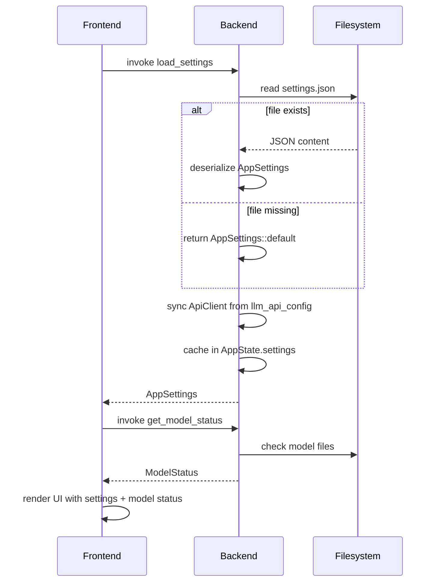
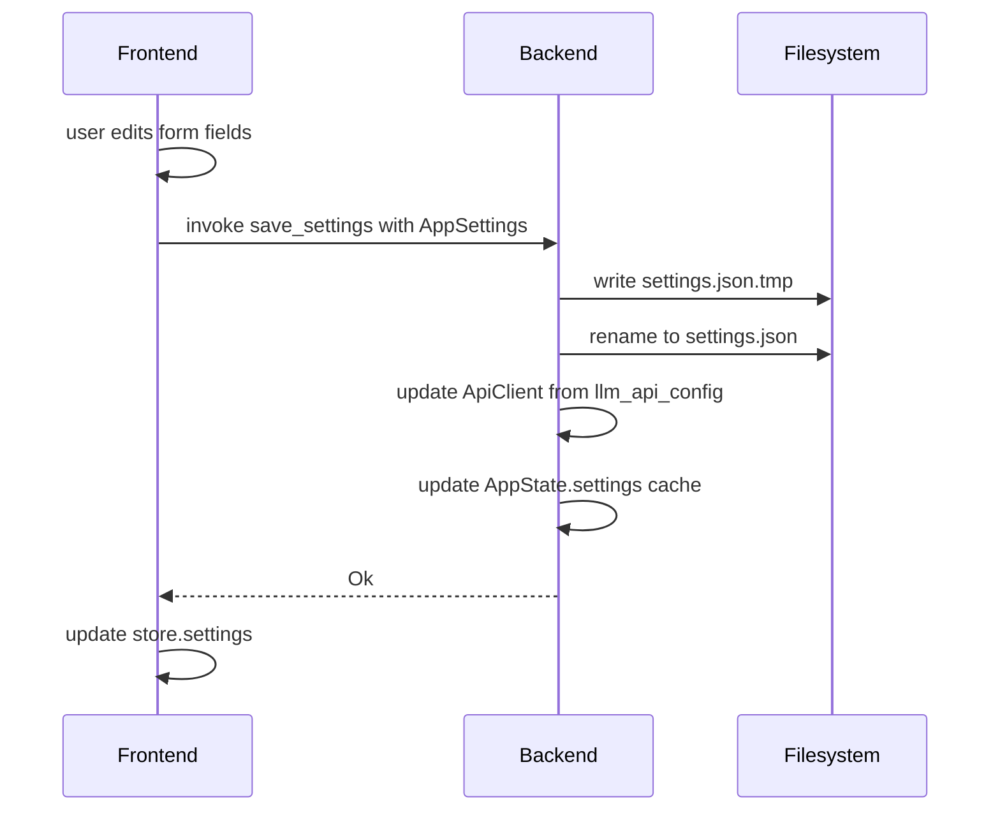
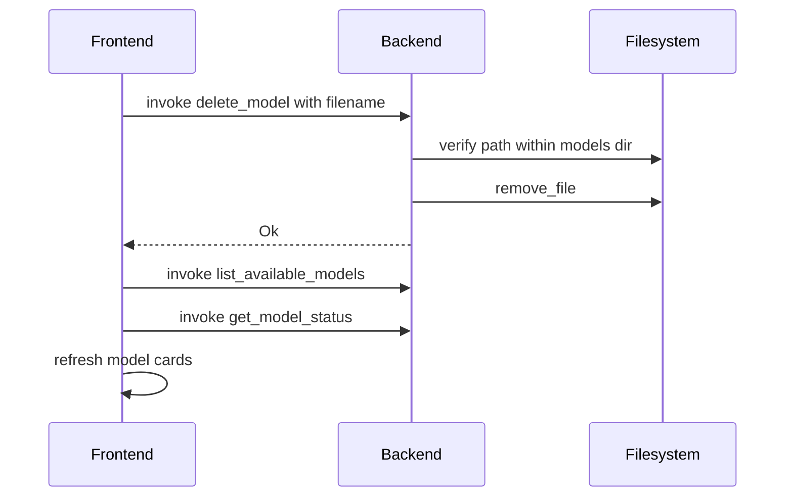

# Settings Page Architecture — Design Document

> **Status:** Design document — not yet implemented.
> **Scope:** New `settings/` module, changes to `commands.rs`, `state.rs`, `lib.rs`, frontend types/store/components.

---

## Table of Contents

1. [Overview](#1-overview)
2. [Config Schema](#2-config-schema)
3. [Rust Type Definitions](#3-rust-type-definitions)
4. [Settings Module](#4-settings-module)
5. [New Backend Commands](#5-new-backend-commands)
6. [TypeScript Type Definitions](#6-typescript-type-definitions)
7. [Store Changes](#7-store-changes)
8. [Settings Page UI Design](#8-settings-page-ui-design)
9. [Data Flow](#9-data-flow)
10. [File Changes Summary](#10-file-changes-summary)
11. [Implementation Order](#11-implementation-order)

---

## 1. Overview

The Settings page provides a unified UI for configuring:

- **Model management** — download, verify, and delete AI models (Whisper, LLM, VAD)
- **ASR provider selection** — local Whisper or remote OpenAI-compatible API
- **LLM API configuration** — endpoint, API key, and model for entity extraction + chat

Settings are persisted as a JSON file in the Tauri app data directory. The UI is a full-screen modal overlay triggered by a gear icon in the [`ControlBar`](../src/components/ControlBar.tsx), avoiding the need for `react-router`.

### Design Principles

- **JSON persistence** — `serde_json` is already a dependency; avoids adding `toml`/`dirs` crates
- **Thin command wrappers** — logic lives in `settings/mod.rs`, commands in `commands.rs`
- **Modal pattern** — no routing library needed; `settingsOpen` boolean in Zustand store
- **Existing CSS conventions** — BEM naming, CSS custom properties, dark theme

---

## 2. Config Schema

Settings are stored at `app_data_dir()/settings.json`. The file is created with defaults on first load.

### JSON Example

```json
{
  "asr_provider": {
    "type": "local_whisper"
  },
  "llm_api_config": {
    "endpoint": "https://openrouter.ai/api/v1",
    "api_key": "sk-or-...",
    "model": "qwen/qwen3-30b-a3b",
    "max_tokens": 512,
    "temperature": 0.1
  },
  "audio_settings": {
    "sample_rate": 48000,
    "channels": 2
  }
}
```

### ASR Provider Variants

**Local Whisper** (default — uses downloaded `ggml-small.en.bin`):
```json
{
  "asr_provider": {
    "type": "local_whisper"
  }
}
```

**API-based ASR** (OpenAI-compatible endpoint):
```json
{
  "asr_provider": {
    "type": "api",
    "endpoint": "https://api.openai.com/v1",
    "api_key": "sk-...",
    "model": "whisper-1"
  }
}
```

### File Location

| Platform | Path |
|---|---|
| **macOS** | `~/Library/Application Support/com.rsac.audio-graph/settings.json` |
| **Linux** | `~/.local/share/com.rsac.audio-graph/settings.json` |
| **Windows** | `%APPDATA%\com.rsac.audio-graph\settings.json` |

This is the same `app_data_dir()` used by [`get_models_dir()`](../src-tauri/src/models/mod.rs:107) for model storage.

---

## 3. Rust Type Definitions

### New file: `src-tauri/src/settings/mod.rs`

```rust
use serde::{Deserialize, Serialize};
use std::path::PathBuf;

use crate::llm::ApiConfig;

// ---------------------------------------------------------------------------
// ASR Provider
// ---------------------------------------------------------------------------

/// How speech recognition is performed.
#[derive(Debug, Clone, Serialize, Deserialize, PartialEq)]
#[serde(tag = "type", rename_all = "snake_case")]
pub enum AsrProvider {
    /// Use the local Whisper model (default).
    LocalWhisper,
    /// Use an OpenAI-compatible speech-to-text API.
    Api {
        endpoint: String,
        #[serde(default, skip_serializing_if = "Option::is_none")]
        api_key: Option<String>,
        model: String,
    },
}

impl Default for AsrProvider {
    fn default() -> Self {
        Self::LocalWhisper
    }
}

// ---------------------------------------------------------------------------
// Audio Settings
// ---------------------------------------------------------------------------

/// Audio capture parameters (for future use — pipeline currently hardcodes these).
#[derive(Debug, Clone, Serialize, Deserialize, PartialEq)]
pub struct AudioSettings {
    /// Sample rate in Hz. Default 48000.
    pub sample_rate: u32,
    /// Number of audio channels. Default 2.
    pub channels: u16,
}

impl Default for AudioSettings {
    fn default() -> Self {
        Self {
            sample_rate: 48000,
            channels: 2,
        }
    }
}

// ---------------------------------------------------------------------------
// AppSettings
// ---------------------------------------------------------------------------

/// Top-level application settings, persisted to `settings.json`.
#[derive(Debug, Clone, Serialize, Deserialize, PartialEq)]
pub struct AppSettings {
    /// ASR provider configuration.
    #[serde(default)]
    pub asr_provider: AsrProvider,

    /// LLM API configuration (for entity extraction and chat).
    /// `None` means no API endpoint configured — falls back to native LLM or rule-based.
    #[serde(default, skip_serializing_if = "Option::is_none")]
    pub llm_api_config: Option<ApiConfig>,

    /// Audio capture settings.
    #[serde(default)]
    pub audio_settings: AudioSettings,
}

impl Default for AppSettings {
    fn default() -> Self {
        Self {
            asr_provider: AsrProvider::default(),
            llm_api_config: None,
            audio_settings: AudioSettings::default(),
        }
    }
}
```

### Changes to existing types

The existing [`ApiConfig`](../src-tauri/src/llm/api_client.rs:17) already has `Serialize` and `Deserialize` derives, so it can be reused directly in `AppSettings`. No changes needed to [`ApiConfig`](../src-tauri/src/llm/api_client.rs:17).

---

## 4. Settings Module

### `src-tauri/src/settings/mod.rs` — persistence functions

```rust
use std::fs;
use std::path::PathBuf;
use tauri::{AppHandle, Manager};

// ... (types from section 3 above) ...

// ---------------------------------------------------------------------------
// Path resolution
// ---------------------------------------------------------------------------

/// Get the path to `settings.json` in the app data directory.
pub fn get_settings_path(app: &AppHandle) -> Result<PathBuf, String> {
    let base = app
        .path()
        .app_data_dir()
        .map_err(|e| format!("Failed to resolve app data dir: {}", e))?;

    if !base.exists() {
        fs::create_dir_all(&base)
            .map_err(|e| format!("Failed to create app data dir: {}", e))?;
    }

    Ok(base.join("settings.json"))
}

// ---------------------------------------------------------------------------
// Load / Save
// ---------------------------------------------------------------------------

/// Load settings from disk. Returns defaults if the file doesn't exist.
///
/// If the file exists but is malformed, logs a warning and returns defaults
/// rather than failing — this prevents a corrupt file from blocking app startup.
pub fn load_settings(app: &AppHandle) -> Result<AppSettings, String> {
    let path = get_settings_path(app)?;

    if !path.exists() {
        log::info!("No settings file found at {}, using defaults", path.display());
        return Ok(AppSettings::default());
    }

    let content = fs::read_to_string(&path)
        .map_err(|e| format!("Failed to read settings file: {}", e))?;

    match serde_json::from_str::<AppSettings>(&content) {
        Ok(settings) => {
            log::info!("Loaded settings from {}", path.display());
            Ok(settings)
        }
        Err(e) => {
            log::warn!(
                "Failed to parse settings from {}: {}. Using defaults.",
                path.display(),
                e
            );
            Ok(AppSettings::default())
        }
    }
}

/// Save settings to disk (atomic write via temp file + rename).
pub fn save_settings(app: &AppHandle, settings: &AppSettings) -> Result<(), String> {
    let path = get_settings_path(app)?;

    let json = serde_json::to_string_pretty(settings)
        .map_err(|e| format!("Failed to serialize settings: {}", e))?;

    // Write to temp file first, then rename for atomicity.
    let tmp_path = path.with_extension("json.tmp");
    fs::write(&tmp_path, &json)
        .map_err(|e| format!("Failed to write settings file: {}", e))?;
    fs::rename(&tmp_path, &path)
        .map_err(|e| format!("Failed to rename settings file: {}", e))?;

    log::info!("Saved settings to {}", path.display());
    Ok(())
}
```

### Key design decisions

1. **Graceful fallback on parse failure** — a corrupt `settings.json` returns defaults rather than an error, preventing the app from being bricked by a bad config file.
2. **Atomic writes** — write to `.json.tmp` then rename, preventing partial writes from corrupting the file on crash.
3. **`app_data_dir()`** — same base directory as model storage, consistent with Tauri conventions.

---

## 5. New Backend Commands

### 5.1 `load_settings` — Load settings from disk

```rust
/// Load persisted settings from `settings.json` (with defaults fallback).
#[tauri::command]
pub async fn load_settings(
    app: tauri::AppHandle,
    state: State<'_, AppState>,
) -> Result<crate::settings::AppSettings, String> {
    let settings = crate::settings::load_settings(&app)?;

    // Sync in-memory state with loaded settings
    if let Some(ref api_config) = settings.llm_api_config {
        let client = ApiClient::new(api_config.clone());
        *state.api_client.lock().map_err(|e| e.to_string())? = Some(client);
    }

    // Cache in AppState for quick access
    *state.settings.lock().map_err(|e| e.to_string())? = Some(settings.clone());

    Ok(settings)
}
```

### 5.2 `save_settings` — Persist settings to disk

```rust
/// Save settings to `settings.json` and update in-memory state.
#[tauri::command]
pub async fn save_settings(
    app: tauri::AppHandle,
    settings: crate::settings::AppSettings,
    state: State<'_, AppState>,
) -> Result<(), String> {
    // Persist to disk
    crate::settings::save_settings(&app, &settings)?;

    // Update in-memory API client if LLM config changed
    if let Some(ref api_config) = settings.llm_api_config {
        let client = ApiClient::new(api_config.clone());
        *state.api_client.lock().map_err(|e| e.to_string())? = Some(client);
    } else {
        *state.api_client.lock().map_err(|e| e.to_string())? = None;
    }

    // Cache updated settings
    *state.settings.lock().map_err(|e| e.to_string())? = Some(settings);

    Ok(())
}
```

### 5.3 `get_settings` — Get current in-memory settings

```rust
/// Get the current in-memory settings (fast, no disk I/O).
#[tauri::command]
pub async fn get_settings(
    state: State<'_, AppState>,
) -> Result<crate::settings::AppSettings, String> {
    let guard = state.settings.lock().map_err(|e| e.to_string())?;
    Ok(guard.clone().unwrap_or_default())
}
```

### 5.4 `delete_model` — Delete a model file

```rust
/// Delete a downloaded model file from the models directory.
#[tauri::command]
pub async fn delete_model(
    app: tauri::AppHandle,
    filename: String,
) -> Result<String, String> {
    let models_dir = crate::models::get_models_dir(&app);
    let path = models_dir.join(&filename);

    if !path.exists() {
        return Err(format!("Model file not found: {}", filename));
    }

    // Safety: ensure path is within models_dir (prevent path traversal)
    let canonical_models = models_dir.canonicalize()
        .map_err(|e| format!("Failed to resolve models dir: {}", e))?;
    let canonical_path = path.canonicalize()
        .map_err(|e| format!("Failed to resolve model path: {}", e))?;
    if !canonical_path.starts_with(&canonical_models) {
        return Err("Invalid model path: path traversal detected".to_string());
    }

    std::fs::remove_file(&path)
        .map_err(|e| format!("Failed to delete model file: {}", e))?;

    log::info!("Deleted model file: {}", filename);
    Ok(format!("Deleted {}", filename))
}
```

### 5.5 Command Registration

Add to [`lib.rs`](../src-tauri/src/lib.rs:35) `generate_handler![]`:

```rust
commands::load_settings,
commands::save_settings,
commands::get_settings,
commands::delete_model,
```

### Command Summary

| Command | Parameters | Returns | Description |
|---|---|---|---|
| `load_settings` | `app: AppHandle, state: State` | `Result<AppSettings>` | Load from disk (defaults if missing) + sync in-memory |
| `save_settings` | `app: AppHandle, settings: AppSettings, state: State` | `Result<()>` | Persist to disk + update in-memory |
| `get_settings` | `state: State` | `Result<AppSettings>` | Read current in-memory settings (no I/O) |
| `delete_model` | `app: AppHandle, filename: String` | `Result<String>` | Delete a model file from models dir |

---

## 6. TypeScript Type Definitions

### New types in `types/index.ts`

```typescript
// ---------------------------------------------------------------------------
// Model readiness types (mirrors Rust ModelReadiness enum)
// ---------------------------------------------------------------------------

export type ModelReadiness = "Ready" | "NotDownloaded" | "Invalid";

export interface ModelStatus {
    whisper: ModelReadiness;
    llm: ModelReadiness;
    vad: ModelReadiness;
}

// ---------------------------------------------------------------------------
// ASR Provider (mirrors Rust AsrProvider enum with serde tag)
// ---------------------------------------------------------------------------

export type AsrProvider =
    | { type: "local_whisper" }
    | { type: "api"; endpoint: string; api_key?: string; model: string };

// ---------------------------------------------------------------------------
// Audio Settings
// ---------------------------------------------------------------------------

export interface AudioSettings {
    sample_rate: number;
    channels: number;
}

// ---------------------------------------------------------------------------
// Application Settings (mirrors Rust AppSettings)
// ---------------------------------------------------------------------------

export interface AppSettings {
    asr_provider: AsrProvider;
    llm_api_config: LlmApiConfig | null;
    audio_settings: AudioSettings;
}

/** LLM API configuration (mirrors Rust ApiConfig). */
export interface LlmApiConfig {
    endpoint: string;
    api_key: string | null;
    model: string;
    max_tokens: number;
    temperature: number;
}
```

### Updated `ModelInfo` type

Add the missing `is_valid` and `description` fields to match the Rust struct:

```typescript
export interface ModelInfo {
    name: string;
    filename: string;
    url: string;
    size_bytes: number | null;
    is_downloaded: boolean;
    is_valid: boolean;          // ← NEW
    local_path: string | null;
    description: string;        // ← NEW
}
```

### Updated `AudioGraphStore` interface

Add new settings-related fields:

```typescript
export interface AudioGraphStore {
    // ... existing fields ...

    // ── Settings ──────────────────────────────────────────────────────────
    settings: AppSettings | null;
    modelStatus: ModelStatus | null;
    settingsOpen: boolean;
    settingsLoading: boolean;

    openSettings: () => void;
    closeSettings: () => void;
    fetchSettings: () => Promise<void>;
    saveSettings: (settings: AppSettings) => Promise<void>;
    fetchModelStatus: () => Promise<void>;
    deleteModel: (filename: string) => Promise<void>;
}
```

---

## 7. Store Changes

### New store fields and actions in `store/index.ts`

```typescript
// ── Settings ──────────────────────────────────────────────────────────
settings: null,
modelStatus: null,
settingsOpen: false,
settingsLoading: false,

openSettings: () => set({ settingsOpen: true }),
closeSettings: () => set({ settingsOpen: false }),

fetchSettings: async () => {
    set({ settingsLoading: true });
    try {
        const settings = await invoke<AppSettings>("load_settings");
        set({ settings, settingsLoading: false, error: null });
    } catch (e) {
        set({
            settingsLoading: false,
            error: e instanceof Error ? e.message : String(e),
        });
    }
},

saveSettings: async (settings: AppSettings) => {
    try {
        await invoke("save_settings", { settings });
        set({ settings, error: null });
    } catch (e) {
        set({ error: e instanceof Error ? e.message : String(e) });
    }
},

fetchModelStatus: async () => {
    try {
        const modelStatus = await invoke<ModelStatus>("get_model_status");
        set({ modelStatus, error: null });
    } catch (e) {
        set({ error: e instanceof Error ? e.message : String(e) });
    }
},

deleteModel: async (filename: string) => {
    try {
        await invoke("delete_model", { filename });
        // Refresh models list and status after deletion
        const models = await invoke<ModelInfo[]>("list_available_models");
        const modelStatus = await invoke<ModelStatus>("get_model_status");
        set({ models, modelStatus, error: null });
    } catch (e) {
        set({ error: e instanceof Error ? e.message : String(e) });
    }
},
```

### Startup initialization

In `App.tsx` or the `useTauriEvents` hook, call `fetchSettings()` on mount to load persisted settings and hydrate the API client on the backend:

```typescript
useEffect(() => {
    fetchSettings();
    fetchModelStatus();
    fetchModels();
}, []);
```

---

## 8. Settings Page UI Design

### 8.1 Entry Point — Gear Icon in ControlBar

Add a gear icon button to [`ControlBar`](../src/components/ControlBar.tsx:92) in the `control-bar__right` div:

```tsx
<div className="control-bar__right">
    {/* existing active-source display */}
    <button
        className="control-bar__settings-btn"
        onClick={openSettings}
        aria-label="Open settings"
        title="Settings"
    >
        ⚙️
    </button>
</div>
```

### 8.2 Modal Overlay

The settings page is a full-screen modal rendered in [`App.tsx`](../src/App.tsx) when `settingsOpen` is `true`:

```tsx
{settingsOpen && <SettingsPage />}
```

### 8.3 SettingsPage Component Structure

```
SettingsPage (modal overlay)
├── Settings Header (title + close button)
└── Settings Body (scrollable)
    ├── Section: Models
    │   ├── ModelCard (Whisper)
    │   ├── ModelCard (LLM)
    │   └── ModelCard (VAD — bundled, no download)
    ├── Section: ASR Provider
    │   ├── Radio: Local Whisper
    │   ├── Radio: API
    │   └── Conditional: API fields (endpoint, api_key, model)
    └── Section: LLM API
        ├── Input: Endpoint
        ├── Input: API Key (password field)
        ├── Input: Model
        ├── Input: Max Tokens
        └── Input: Temperature
```

### 8.4 ASCII UI Mockup

```
┌──────────────────────────────────────────────────────────────────┐
│  ⚙ Settings                                              ✕ Close│
├──────────────────────────────────────────────────────────────────┤
│                                                                  │
│  ── Models ──────────────────────────────────────────────────    │
│                                                                  │
│  ┌────────────────────────────────────────────────────────────┐  │
│  │  🎤 Whisper Small - English                      ✅ Ready  │  │
│  │  Speech recognition model for English transcription        │  │
│  │  Size: 465 MB    Path: .../models/ggml-small.en.bin       │  │
│  │                                          [🗑 Delete]       │  │
│  └────────────────────────────────────────────────────────────┘  │
│                                                                  │
│  ┌────────────────────────────────────────────────────────────┐  │
│  │  🧠 LFM2-350M Extract                    ⬇ Not Downloaded │  │
│  │  Small language model for entity extraction                │  │
│  │  Size: 218 MB                                              │  │
│  │                                          [⬇ Download]      │  │
│  └────────────────────────────────────────────────────────────┘  │
│                                                                  │
│  ┌────────────────────────────────────────────────────────────┐  │
│  │  🎙 VAD Model                                    ✅ Ready  │  │
│  │  Voice activity detection - bundled with application       │  │
│  └────────────────────────────────────────────────────────────┘  │
│                                                                  │
│  ── ASR Provider ────────────────────────────────────────────    │
│                                                                  │
│  (●) Local Whisper   Uses downloaded Whisper model               │
│  ( ) API             OpenAI-compatible speech-to-text API        │
│                                                                  │
│  ── LLM API Configuration ───────────────────────────────────    │
│                                                                  │
│  Endpoint    [https://openrouter.ai/api/v1              ]        │
│  API Key     [••••••••••••••••••••                       ]        │
│  Model       [qwen/qwen3-30b-a3b                        ]        │
│  Max Tokens  [512        ]    Temperature  [0.1       ]          │
│                                                                  │
│                                       [Save Settings]            │
│                                                                  │
└──────────────────────────────────────────────────────────────────┘
```

### 8.5 Model Card States

| State | Badge | Actions |
|---|---|---|
| `Ready` | `✅ Ready` (green) | `🗑 Delete` button |
| `NotDownloaded` | `⬇ Not Downloaded` (gray) | `⬇ Download` button |
| `Invalid` | `⚠ Invalid` (amber) | `🗑 Delete` + `⬇ Re-download` buttons |
| Downloading | `⏳ Downloading 42%` (blue, animated) | Progress bar, no actions |

### 8.6 ASR Provider Section Behavior

- When "Local Whisper" is selected: no additional fields shown.
- When "API" is selected: show three input fields:
  - **Endpoint** — text input, placeholder: `https://api.openai.com/v1`
  - **API Key** — password input, placeholder: `sk-...` (optional)
  - **Model** — text input, placeholder: `whisper-1`

### 8.7 CSS Classes (BEM convention)

```
.settings-modal                 — Fixed overlay, z-index: 2000
.settings-modal__backdrop       — Semi-transparent background
.settings-modal__container      — Centered panel (max-width: 680px)
.settings-modal__header         — Title + close button
.settings-modal__body           — Scrollable content
.settings-modal__close-btn      — Close button (top right)

.settings-section               — Section wrapper
.settings-section__title        — Section heading

.model-card                     — Individual model card
.model-card__header             — Name + status badge row
.model-card__name               — Model display name
.model-card__badge              — Status badge (Ready/NotDownloaded/Invalid)
.model-card__badge--ready       — Green badge
.model-card__badge--missing     — Gray badge
.model-card__badge--invalid     — Amber badge
.model-card__badge--downloading — Blue animated badge
.model-card__description        — Model description text
.model-card__meta               — Size + path info
.model-card__actions            — Button row
.model-card__progress           — Download progress bar

.settings-radio                 — Radio button group
.settings-radio__option         — Individual radio option
.settings-radio__option--selected — Selected state

.settings-form                  — Form section
.settings-form__field           — Label + input wrapper
.settings-form__label           — Field label
.settings-form__input           — Text/password input
.settings-form__row             — Horizontal field group

.settings-modal__save-btn       — Save button
```

---

## 9. Data Flow

### 9.1 Startup Flow



### 9.2 Save Settings Flow



### 9.3 Model Delete Flow



### 9.4 ASR Provider Impact

When the saved ASR provider changes, the speech processor thread needs to be aware. The current architecture spawns the speech processor thread in [`start_capture()`](../src-tauri/src/commands.rs:69) — so the ASR provider selection takes effect on the **next capture session**, not mid-stream.

```
Save settings → AsrProvider stored
  ↓
Next start_capture call
  ↓
Speech processor reads AppState.settings
  ↓
If LocalWhisper → load Whisper model (existing path)
If Api → use API client for ASR instead
```

> **Note:** Wiring the ASR API provider into the speech processor is a follow-up task. This design document covers the settings **persistence and UI** — the runtime ASR routing will be a separate implementation.

---

## 10. File Changes Summary

### New Files

| File | Description |
|---|---|
| `src-tauri/src/settings/mod.rs` | `AppSettings`, `AsrProvider`, `AudioSettings` types + `load_settings()`, `save_settings()`, `get_settings_path()` |
| `src/components/SettingsPage.tsx` | Settings modal overlay component |
| `src/components/SettingsPage.css` (or append to `App.css`) | Settings-specific styles |

### Modified Files — Backend

| File | Changes |
|---|---|
| [`src-tauri/src/lib.rs`](../src-tauri/src/lib.rs) | Add `pub mod settings;` + register 4 new commands in `generate_handler![]` |
| [`src-tauri/src/commands.rs`](../src-tauri/src/commands.rs) | Add `load_settings`, `save_settings`, `get_settings`, `delete_model` command functions |
| [`src-tauri/src/state.rs`](../src-tauri/src/state.rs) | Add `settings: Arc<Mutex<Option<AppSettings>>>` field to `AppState` |

### Modified Files — Frontend

| File | Changes |
|---|---|
| [`src/types/index.ts`](../src/types/index.ts) | Add `ModelReadiness`, `ModelStatus`, `AsrProvider`, `AudioSettings`, `AppSettings`, `LlmApiConfig`. Update `ModelInfo` with `is_valid` + `description`. Update `AudioGraphStore` with settings fields. |
| [`src/store/index.ts`](../src/store/index.ts) | Add `settings`, `modelStatus`, `settingsOpen`, `settingsLoading` state + `openSettings()`, `closeSettings()`, `fetchSettings()`, `saveSettings()`, `fetchModelStatus()`, `deleteModel()` actions |
| [`src/components/ControlBar.tsx`](../src/components/ControlBar.tsx) | Add gear icon button in `control-bar__right` |
| [`src/App.tsx`](../src/App.tsx) | Import and render `<SettingsPage />` when `settingsOpen` is true. Add `fetchSettings()` + `fetchModelStatus()` to mount effect. |
| [`src/App.css`](../src/App.css) | Add settings modal styles, model card styles, gear button styles |

### Cargo.toml — No changes needed

`serde_json` is already a dependency. No new crates required.

### `AppState` Changes

```rust
// state.rs — add to AppState struct
pub struct AppState {
    // ... existing fields ...

    /// Cached application settings.
    pub settings: Arc<Mutex<Option<crate::settings::AppSettings>>>,
}

// In AppState::new():
settings: Arc::new(Mutex::new(None)),
```

---

## 11. Implementation Order

Each step is independently shippable and testable:

1. **Create `settings/mod.rs`** — types + `load_settings()` / `save_settings()` / `get_settings_path()`. Unit-testable without UI.
2. **Wire backend commands** — Add 4 commands to `commands.rs`, register in `lib.rs`, add `settings` field to `AppState`.
3. **Frontend types** — Add new types to `types/index.ts`, update `ModelInfo` and `AudioGraphStore`.
4. **Store actions** — Implement `fetchSettings`, `saveSettings`, `fetchModelStatus`, `deleteModel`, `openSettings`, `closeSettings` in `store/index.ts`.
5. **SettingsPage component** — Build the modal overlay with model cards, ASR radio buttons, LLM API form.
6. **ControlBar gear icon** — Add the settings button trigger.
7. **App.tsx integration** — Render modal conditionally, add startup init.
8. **CSS styling** — Settings modal, model cards, form fields matching existing dark theme.

---

## Appendix A: Relationship to Existing `configure_api_endpoint`

The existing [`configure_api_endpoint`](../src-tauri/src/commands.rs:281) command will remain functional but becomes redundant once settings are fully wired. The migration path:

1. **Phase 1** (this design): Settings page calls `save_settings` which updates the `ApiClient` in memory.
2. **Phase 2** (future): The existing `configure_api_endpoint` command can be deprecated, with settings being the single source of truth for API configuration.
3. The `apiConfig` store field and `configureApiEndpoint` store action continue to work alongside the new settings flow for backward compatibility.

## Appendix B: Default Settings

On first launch (no `settings.json` file exists), the app uses:

```json
{
    "asr_provider": { "type": "local_whisper" },
    "llm_api_config": null,
    "audio_settings": { "sample_rate": 48000, "channels": 2 }
}
```

This matches the current hardcoded behavior: local Whisper ASR, no LLM API configured, 48kHz stereo audio.
