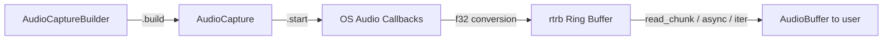
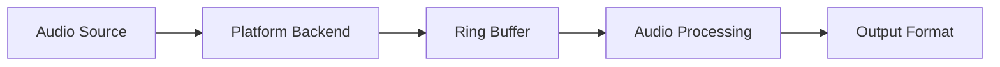

# Audio Capture Library Architecture

> ⚠️ **This document is the entry point to the architecture documentation.**
> Detailed architecture designs are in [`docs/architecture/`](architecture/).
> This file provides a high-level overview and links to the comprehensive design documents.

---

## Architecture Documentation Index

| Document | Description | Status |
|---|---|---|
| **[ARCHITECTURE_OVERVIEW.md](architecture/ARCHITECTURE_OVERVIEW.md)** | **Master overview** — system diagram, component summary, removal targets, new types, module graph, feature flags, phasing | Design Complete |
| [API_DESIGN.md](architecture/API_DESIGN.md) | Canonical public API surface — `AudioCaptureBuilder`, `AudioCapture`, `CapturingStream`, `AudioBuffer`, `CaptureTarget`, `AudioSink`, enumerators, all consumption modes | Design Complete |
| [ERROR_CAPABILITY_DESIGN.md](architecture/ERROR_CAPABILITY_DESIGN.md) | Error taxonomy — 21-variant `AudioError`, `ErrorKind`, `Recoverability`, `BackendContext`, `PlatformCapabilities`, capability querying, validation flow | Design Complete |
| [BACKEND_CONTRACT.md](architecture/BACKEND_CONTRACT.md) | Internal backend contract — `PlatformBackend` / `PlatformStream` traits, ring buffer bridge, `BridgeStream`, PipeWire thread solution, shutdown contract, all data flow diagrams | Design Complete |

**Start with [ARCHITECTURE_OVERVIEW.md](architecture/ARCHITECTURE_OVERVIEW.md)** for the full picture, then dive into the detailed documents for specific areas.

---

## Overview

This library (`rsac`) provides cross-platform audio capture for Windows (WASAPI), Linux (PipeWire), and macOS (CoreAudio Process Tap). The architecture follows a **streaming-first, pull-model** design where platform-specific OS callbacks push `f32` samples into a lock-free SPSC ring buffer, and the user consumes them through a unified `CapturingStream` trait.

### Key Design Principles

- **Builder → Session → Stream** lifecycle: configure, validate, then stream
- **Pull model**: user decides when to read audio via `read_chunk()`, async streams, or iterators
- **Ring buffer bridge**: all platforms use the same `rtrb` SPSC ring buffer pattern
- **`Send + Sync` everywhere**: all public types are thread-safe
- **Compile-time platform dispatch**: `#[cfg(target_os)]` selects the backend

### High-Level Pipeline



---

## Core Components (New Architecture)

> **For detailed type definitions, see [API_DESIGN.md](architecture/API_DESIGN.md).**

### Public API Surface

- **`AudioCaptureBuilder`** — builder pattern, all fields optional, defaults to `SystemDefault` capture
- **`AudioCapture`** — lifecycle manager with `start()`, `stop()`, `read_chunk()`, `async_stream()`, `set_callback()`, `pipe_to()`
- **`CapturingStream`** — core streaming trait (`Send + Sync`)
- **`AudioBuffer`** — owned `Vec<f32>` chunk with `frame_offset`, `sequence`, `timestamp`
- **`CaptureTarget`** — unified target enum: `SystemDefault`, `Device`, `Application`, `ApplicationByName`, `ProcessTree`
- **`AudioSink`** — downstream consumer trait with built-in sinks (`WavFileSink`, `ChannelSink`, `NullSink`)

### Error Handling

> **For the full error taxonomy, see [ERROR_CAPABILITY_DESIGN.md](architecture/ERROR_CAPABILITY_DESIGN.md).**

- **`AudioError`** — 21 well-defined variants (down from 28 + duplicates), categorized by `ErrorKind`
- **`Recoverability`** — three-state: `Recoverable`, `Fatal`, `UserError`
- **`BackendContext`** — structured OS error wrapper with operation name and error code
- **`PlatformCapabilities`** — static capability query before session creation

### Internal Architecture

> **For the full backend contract, see [BACKEND_CONTRACT.md](architecture/BACKEND_CONTRACT.md).**

- **`RingBufferBridge`** — lock-free `rtrb` SPSC connecting OS callbacks to user reads
- **`BridgeStream<S>`** — universal `CapturingStream` adapter for any platform
- **`PlatformBackend` / `PlatformStream`** — internal traits (`pub(crate)`) per platform
- **`PipeWireThread`** — dedicated thread solving PipeWire's `!Send` constraint

---

## Platform-Specific Details

### Windows (WASAPI)
- WASAPI event-driven capture on dedicated COM MTA thread
- Process Loopback Capture for application-specific audio (Windows 10 21H1+)
- `ComGuard` RAII wrapper for COM initialization

### macOS (CoreAudio)
- AudioUnit render callback on CoreAudio real-time thread
- Process Tap API via `CATapDescription` + aggregate device (macOS 14.2+)
- `NSRunningApplication` for application resolution

### Linux (PipeWire)
- Dedicated `PipeWireThread` owns all `Rc` types (MainLoop, Context, Core, Stream)
- Command/response channel pattern for cross-thread communication
- Monitor streams for sink and application node capture

---

## Legacy Content (Outdated)

> ⚠️ **The sections below describe the OLD architecture and are kept for historical reference.**
> The new architecture is documented in [`docs/architecture/`](architecture/).

<details>
<summary>Click to expand legacy architecture notes</summary>

### AudioCapture Trait (DEPRECATED — replaced by CapturingStream)
```rust
// OLD — do not use
pub trait AudioCapture: Send {
    fn start(&mut self) -> Result<(), AudioError>;
    fn stop(&mut self) -> Result<(), AudioError>;
    fn is_capturing(&self) -> bool;
    fn get_available_devices(&self) -> Result<Vec<AudioDevice>, AudioError>;
    fn set_device(&mut self, device: AudioDevice) -> Result<(), AudioError>;
}
```

### Legacy Data Flow (DEPRECATED)


### Legacy Configuration (DEPRECATED — replaced by AudioCaptureBuilder)
- Sample rate (now optional — uses device native)
- Channel count (now optional)
- Buffer size (now optional)
- Device selection (replaced by CaptureTarget)
- Application targeting (replaced by CaptureTarget::Application)

</details>

---

## Related Documentation

- [Application-Specific Capture Research](app_specific_capture_research.md) — platform research for app capture
- [API Reference](API.md) — public API documentation
- [Performance Notes](PERFORMANCE.md) — performance considerations
- [Testing Guide](TESTING.md) — testing strategy and guides
- [Troubleshooting](TROUBLESHOOTING.md) — common issues and solutions
