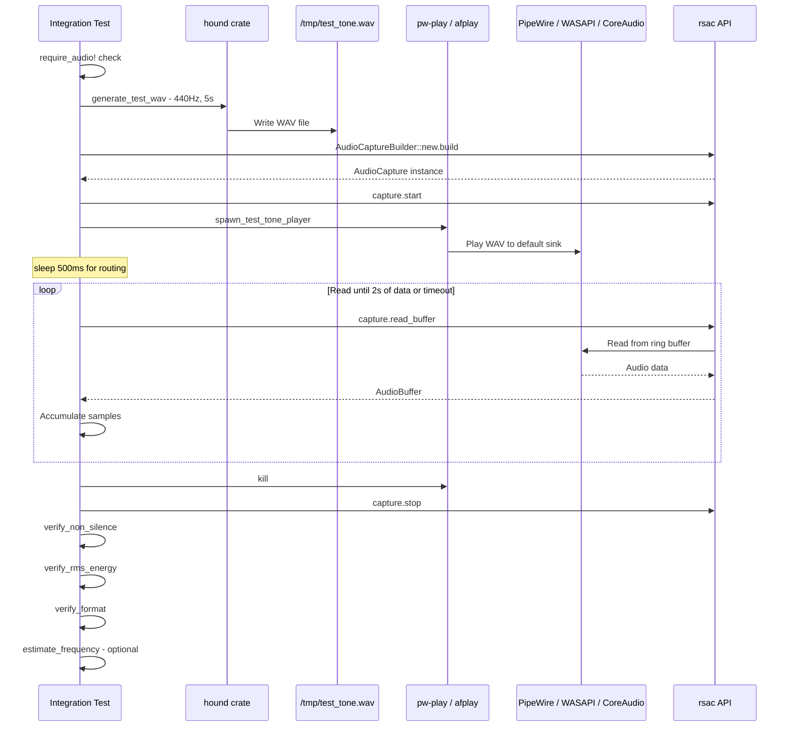
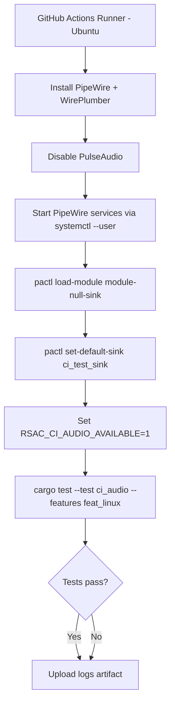
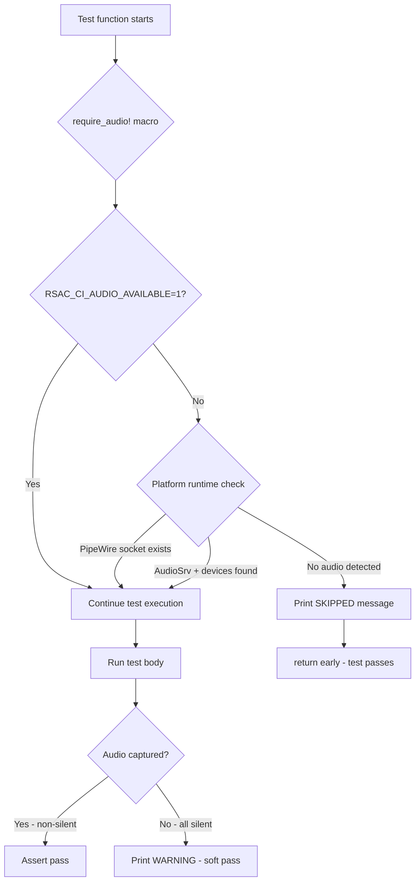

# CI Audio Integration Testing Architecture

> **Status:** Design document — implementation blueprint for CI audio integration tests.
>
> **Scope:** Rust integration tests in `tests/ci_audio/`, GitHub Actions workflow design,
> test helper utilities, and platform-specific audio infrastructure setup.

---

## Table of Contents

1. [Overview](#1-overview)
2. [Platform Feasibility Summary](#2-platform-feasibility-summary)
3. [Integration Test Module Structure](#3-integration-test-module-structure)
4. [Test Helper Module](#4-test-helper-module)
5. [Test Categories & Implementations](#5-test-categories--implementations)
6. [Test Tone Playback Strategy](#6-test-tone-playback-strategy)
7. [GitHub Actions Workflow Design](#7-github-actions-workflow-design)
8. [Test Configuration](#8-test-configuration)
9. [Design Principles & Rationale](#9-design-principles--rationale)
10. [Appendix: Mermaid Diagrams](#10-appendix-mermaid-diagrams)

---

## 1. Overview

The `rsac` library provides cross-platform audio capture through a streaming-first API:

```
AudioCaptureBuilder → AudioCapture → CapturingStream → AudioBuffer
```

CI audio integration tests validate this pipeline end-to-end by:

1. Setting up virtual audio infrastructure (null sinks, virtual drivers)
2. Playing a known test tone (440 Hz sine wave) into the virtual device
3. Capturing audio through the `rsac` public API
4. Verifying the captured `AudioBuffer` data contains the expected signal

All tests use **only the public API** exported from `src/lib.rs` — no internal types,
no `#[cfg(target_os)]` in the test files themselves (platform gating uses the helper
module's `audio_infrastructure_available()` check).

---

## 2. Platform Feasibility Summary

| Platform | Backend | CI Feasibility | Confidence | Primary Approach |
|----------|---------|---------------|------------|-----------------|
| **Linux** | PipeWire | ✅ High | High | PipeWire daemon + `pactl load-module module-null-sink` |
| **Windows** | WASAPI | ⚠️ Medium | Medium | VirtualDrivers/Virtual-Audio-Driver + `continue-on-error` |
| **macOS** | CoreAudio | ❌ Low | Low | Compilation-check only; skip if no device |

**Key constraints:**

- **Linux:** Ubuntu 24.04 on GH Actions supports PipeWire via `systemctl --user`.
  The existing `.github/workflows/linux.yml` already installs and starts PipeWire.
  We add a `module-null-sink` and set it as default for deterministic capture.

- **Windows:** `AudioSrv` exists on GH runners but no audio endpoints are installed.
  The existing `.github/workflows/windows.yml` installs VirtualDrivers/Virtual-Audio-Driver
  via `pnputil`. This is fragile — the entire Windows audio job uses `continue-on-error: true`.

- **macOS:** No reliable headless virtual audio driver. BlackHole requires a reboot
  (dealbreaker for CI). macOS CI is **compilation-check only** — audio integration
  tests are skipped with a clear diagnostic message.

---

## 3. Integration Test Module Structure

### 3.1 File Layout

```
tests/
└── ci_audio/
    ├── main.rs              # Test harness entry point (Cargo integration test)
    ├── helpers.rs            # Test infrastructure: WAV generation, audio verification
    ├── device_enumeration.rs # Device listing tests
    ├── system_capture.rs     # System audio capture tests
    ├── stream_lifecycle.rs   # Start/read/stop lifecycle tests
    └── platform_caps.rs      # Platform capabilities tests
```

### 3.2 Cargo Configuration

The integration test is registered in `Cargo.toml`:

```toml
[[test]]
name = "ci_audio"
path = "tests/ci_audio/main.rs"
harness = true
```

No new feature flags are required — the tests use the existing platform features
(`feat_linux`, `feat_windows`, `feat_macos`). The test binary is built with the
appropriate platform feature:

```bash
# Linux
cargo test --test ci_audio --no-default-features --features feat_linux

# Windows
cargo test --test ci_audio --no-default-features --features feat_windows

# macOS
cargo test --test ci_audio --no-default-features --features feat_macos
```

### 3.3 Entry Point: `tests/ci_audio/main.rs`

```rust
//! CI Audio Integration Tests
//!
//! End-to-end tests that validate audio capture through the rsac public API.
//! These tests require audio infrastructure (PipeWire on Linux, WASAPI + virtual
//! driver on Windows). Tests gracefully skip when infrastructure is unavailable.
//!
//! Run with:
//!   cargo test --test ci_audio --no-default-features --features feat_linux
//!   cargo test --test ci_audio --no-default-features --features feat_windows
//!   cargo test --test ci_audio --no-default-features --features feat_macos

mod helpers;
mod device_enumeration;
mod system_capture;
mod stream_lifecycle;
mod platform_caps;
```

---

## 4. Test Helper Module

### 4.1 File: `tests/ci_audio/helpers.rs`

This module provides all shared test infrastructure. Every function operates purely
on the `rsac` public API types (`AudioBuffer`, `AudioFormat`, `AudioCaptureBuilder`, etc.)
and standard library types.

#### 4.1.1 Audio Infrastructure Detection

```rust
use std::env;

/// Returns `true` if audio infrastructure is available for integration testing.
///
/// Checks (in order):
/// 1. `RSAC_CI_AUDIO_AVAILABLE=1` environment variable (set by CI workflow after setup)
/// 2. Platform-specific runtime detection (PipeWire socket, AudioSrv service, etc.)
///
/// If this returns `false`, all audio integration tests should skip with a
/// diagnostic message instead of failing.
pub fn audio_infrastructure_available() -> bool {
    // Fast path: CI explicitly set this after setting up audio
    if env::var("RSAC_CI_AUDIO_AVAILABLE").as_deref() == Ok("1") {
        return true;
    }

    // Runtime detection as fallback (for local development)
    platform_audio_available()
}

/// Platform-specific audio availability check.
fn platform_audio_available() -> bool {
    #[cfg(target_os = "linux")]
    {
        // Check if PipeWire is running by looking for its socket
        if let Ok(runtime_dir) = env::var("XDG_RUNTIME_DIR") {
            let socket_path = format!("{}/pipewire-0", runtime_dir);
            if std::path::Path::new(&socket_path).exists() {
                return true;
            }
        }
        // Fallback: try to run pw-cli
        std::process::Command::new("pw-cli")
            .arg("info")
            .arg("0")
            .stdout(std::process::Stdio::null())
            .stderr(std::process::Stdio::null())
            .status()
            .map(|s| s.success())
            .unwrap_or(false)
    }

    #[cfg(target_os = "windows")]
    {
        // Check if Windows Audio Service is running
        // AND if there's at least one audio endpoint
        let service_running = std::process::Command::new("sc")
            .args(["query", "AudioSrv"])
            .output()
            .map(|o| String::from_utf8_lossy(&o.stdout).contains("RUNNING"))
            .unwrap_or(false);

        if !service_running {
            return false;
        }

        // Try to enumerate devices via the library itself
        rsac::get_device_enumerator()
            .and_then(|e| e.enumerate_devices())
            .map(|devices| !devices.is_empty())
            .unwrap_or(false)
    }

    #[cfg(target_os = "macos")]
    {
        // macOS CI: always false unless explicitly enabled
        // Audio tests on macOS are unreliable in headless CI
        env::var("RSAC_CI_MACOS_AUDIO").as_deref() == Ok("1")
    }

    #[cfg(not(any(target_os = "linux", target_os = "windows", target_os = "macos")))]
    {
        false
    }
}

/// Macro to skip a test when audio infrastructure is not available.
///
/// Usage:
/// ```rust,ignore
/// #[test]
/// fn test_something() {
///     require_audio!();
///     // ... test body ...
/// }
/// ```
macro_rules! require_audio {
    () => {
        if !$crate::helpers::audio_infrastructure_available() {
            eprintln!(
                "⏭️  SKIPPED: {} — audio infrastructure not available \
                 (set RSAC_CI_AUDIO_AVAILABLE=1 after setting up audio)",
                module_path!()
            );
            return;
        }
    };
}
pub(crate) use require_audio;
```

#### 4.1.2 Test Tone WAV Generation

```rust
use hound::{SampleFormat as HoundSampleFormat, WavSpec, WavWriter};
use std::f32::consts::PI;
use std::path::Path;

/// Parameters for generating a test WAV file.
pub struct TestToneParams {
    pub frequency_hz: f32,
    pub duration_secs: f32,
    pub sample_rate: u32,
    pub channels: u16,
    pub amplitude: f32,
}

impl Default for TestToneParams {
    fn default() -> Self {
        Self {
            frequency_hz: 440.0,
            duration_secs: 3.0,
            sample_rate: 48000,
            channels: 2,
            amplitude: 0.8,
        }
    }
}

/// Generates a WAV file containing a sine wave at the given frequency.
///
/// The same tone is written to all channels (identical L/R for stereo).
/// Uses the `hound` crate, which is already a dependency of `rsac`.
///
/// # Arguments
/// * `path` — Output file path
/// * `params` — Tone generation parameters (frequency, duration, etc.)
///
/// # Returns
/// `Ok(())` on success, or an IO/hound error message.
pub fn generate_test_wav(path: &Path, params: &TestToneParams) -> Result<(), String> {
    let spec = WavSpec {
        channels: params.channels,
        sample_rate: params.sample_rate,
        bits_per_sample: 32,
        sample_format: HoundSampleFormat::Float,
    };

    let mut writer = WavWriter::create(path, spec)
        .map_err(|e| format!("Failed to create WAV file: {e}"))?;

    let total_samples = (params.sample_rate as f32 * params.duration_secs) as u32;
    let angular_freq = 2.0 * PI * params.frequency_hz / params.sample_rate as f32;

    for i in 0..total_samples {
        let sample = params.amplitude * (angular_freq * i as f32).sin();
        // Write same sample to all channels
        for _ in 0..params.channels {
            writer.write_sample(sample)
                .map_err(|e| format!("Failed to write sample: {e}"))?;
        }
    }

    writer.finalize()
        .map_err(|e| format!("Failed to finalize WAV: {e}"))?;

    Ok(())
}
```

#### 4.1.3 Audio Buffer Verification

```rust
use rsac::AudioBuffer;

/// Checks that the buffer contains non-silent audio.
///
/// Returns `true` if the maximum absolute amplitude exceeds the threshold.
/// Default threshold: 0.01 (well above digital silence of 0.0).
pub fn verify_non_silence(buffer: &AudioBuffer, threshold: f32) -> bool {
    let max_amplitude = buffer.data()
        .iter()
        .map(|s| s.abs())
        .fold(0.0f32, f32::max);

    eprintln!(
        "  [verify_non_silence] max_amplitude={:.6}, threshold={:.6}, pass={}",
        max_amplitude, threshold, max_amplitude > threshold
    );

    max_amplitude > threshold
}

/// Computes and checks the RMS energy of the audio buffer.
///
/// Returns `true` if the RMS energy exceeds `min_rms`.
/// For a 440 Hz sine at amplitude 0.8, RMS ≈ 0.566.
/// A reasonable CI threshold is 0.01 to catch silence.
pub fn verify_rms_energy(buffer: &AudioBuffer, min_rms: f32) -> bool {
    let data = buffer.data();
    if data.is_empty() {
        return false;
    }

    let sum_sq: f64 = data.iter().map(|&s| (s as f64) * (s as f64)).sum();
    let rms = (sum_sq / data.len() as f64).sqrt() as f32;

    eprintln!(
        "  [verify_rms_energy] rms={:.6}, min_rms={:.6}, pass={}",
        rms, min_rms, rms >= min_rms
    );

    rms >= min_rms
}

/// Verifies the buffer's format matches expectations.
///
/// Checks sample rate and channel count against expected values.
pub fn verify_format(
    buffer: &AudioBuffer,
    expected_rate: u32,
    expected_channels: u16,
) -> bool {
    let rate_ok = buffer.sample_rate() == expected_rate;
    let channels_ok = buffer.channels() == expected_channels;

    eprintln!(
        "  [verify_format] rate={}/{} channels={}/{} pass={}",
        buffer.sample_rate(), expected_rate,
        buffer.channels(), expected_channels,
        rate_ok && channels_ok,
    );

    rate_ok && channels_ok
}

/// Estimates the dominant frequency using zero-crossing analysis.
///
/// This is an optional, approximate check. For a clean sine wave, the
/// zero-crossing rate divided by 2 gives the frequency.
///
/// Returns `None` if there aren't enough crossings to estimate.
pub fn estimate_frequency_zero_crossing(buffer: &AudioBuffer) -> Option<f32> {
    // Use channel 0 (mono or left channel)
    let channel_data = buffer.channel_data(0)?;
    if channel_data.len() < 100 {
        return None;
    }

    let mut crossings = 0u32;
    for window in channel_data.windows(2) {
        if (window[0] >= 0.0 && window[1] < 0.0)
            || (window[0] < 0.0 && window[1] >= 0.0)
        {
            crossings += 1;
        }
    }

    // Zero crossings = 2× frequency × duration
    // frequency = crossings / (2 × duration)
    let duration_secs = channel_data.len() as f32 / buffer.sample_rate() as f32;
    if duration_secs <= 0.0 {
        return None;
    }

    let estimated = crossings as f32 / (2.0 * duration_secs);

    eprintln!(
        "  [estimate_frequency] crossings={}, duration={:.3}s, estimated={:.1} Hz",
        crossings, duration_secs, estimated
    );

    Some(estimated)
}
```

#### 4.1.4 Test Tone Playback

```rust
use std::process::{Child, Command, Stdio};

/// Spawns a background process that plays the given WAV file.
///
/// Uses platform-specific commands:
/// - Linux: `pw-play` (PipeWire) or `paplay` (PulseAudio compat)
/// - Windows: PowerShell `[System.Media.SoundPlayer]`
/// - macOS: `afplay`
///
/// The caller is responsible for killing the returned `Child` process.
pub fn spawn_test_tone_player(wav_path: &str) -> Result<Child, String> {
    #[cfg(target_os = "linux")]
    {
        // Prefer pw-play (native PipeWire), fall back to paplay (PulseAudio compat)
        let player = if Command::new("pw-play").arg("--version")
            .stdout(Stdio::null()).stderr(Stdio::null()).status().is_ok()
        {
            "pw-play"
        } else {
            "paplay"
        };

        eprintln!("  [spawn_player] Using {player} to play {wav_path}");

        Command::new(player)
            .arg(wav_path)
            .stdout(Stdio::null())
            .stderr(Stdio::null())
            .spawn()
            .map_err(|e| format!("Failed to spawn {player}: {e}"))
    }

    #[cfg(target_os = "windows")]
    {
        // Use PowerShell to play WAV file
        // SoundPlayer is synchronous, so we wrap it in a background job
        let ps_script = format!(
            r#"$p = New-Object System.Media.SoundPlayer '{}'; $p.PlayLooping()"#,
            wav_path.replace('\\', "\\\\").replace('\'', "''")
        );

        eprintln!("  [spawn_player] Using PowerShell SoundPlayer for {wav_path}");

        Command::new("powershell")
            .args(["-NoProfile", "-Command", &ps_script])
            .stdout(Stdio::null())
            .stderr(Stdio::null())
            .spawn()
            .map_err(|e| format!("Failed to spawn PowerShell player: {e}"))
    }

    #[cfg(target_os = "macos")]
    {
        eprintln!("  [spawn_player] Using afplay for {wav_path}");

        Command::new("afplay")
            .arg(wav_path)
            .stdout(Stdio::null())
            .stderr(Stdio::null())
            .spawn()
            .map_err(|e| format!("Failed to spawn afplay: {e}"))
    }

    #[cfg(not(any(target_os = "linux", target_os = "windows", target_os = "macos")))]
    {
        Err("No audio player available on this platform".to_string())
    }
}

/// Returns the capture timeout from the environment, or a default.
///
/// Reads `RSAC_TEST_CAPTURE_TIMEOUT_SECS` (default: 10).
pub fn capture_timeout() -> std::time::Duration {
    let secs: u64 = std::env::var("RSAC_TEST_CAPTURE_TIMEOUT_SECS")
        .ok()
        .and_then(|s| s.parse().ok())
        .unwrap_or(10);
    std::time::Duration::from_secs(secs)
}
```

---

## 5. Test Categories & Implementations

### 5.1 Device Enumeration Tests — `tests/ci_audio/device_enumeration.rs`

```rust
use crate::helpers::{require_audio, audio_infrastructure_available};

/// Test that device enumeration succeeds and returns at least one device
/// when audio infrastructure is available.
#[test]
fn test_device_enumeration_finds_devices() {
    require_audio!();

    let enumerator = rsac::get_device_enumerator()
        .expect("get_device_enumerator should succeed when audio is available");

    let devices = enumerator.enumerate_devices()
        .expect("enumerate_devices should succeed");

    eprintln!("  Found {} audio device(s):", devices.len());
    for device in &devices {
        eprintln!("    - {} (id: {})", device.name(), device.id());
    }

    assert!(
        !devices.is_empty(),
        "Expected at least one audio device when audio infrastructure is available"
    );
}

/// Test that a default device can be retrieved.
#[test]
fn test_default_device_exists() {
    require_audio!();

    let enumerator = rsac::get_device_enumerator()
        .expect("get_device_enumerator should succeed");

    let device = enumerator.get_default_device(rsac::DeviceKind::Output)
        .expect("get_default_device should succeed when audio is available");

    let name = device.name();
    let id = device.id();
    eprintln!("  Default device: {} (id: {})", name, id);

    assert!(!name.is_empty(), "Default device should have a name");
}

/// Test that device enumeration returns an error (not a panic) when
/// the audio backend is not available. This test runs WITHOUT the
/// require_audio guard to test error handling.
#[test]
fn test_device_enumeration_error_handling() {
    // This test deliberately does NOT use require_audio!()
    // It verifies graceful error handling regardless of audio availability.
    let result = rsac::get_device_enumerator();

    match result {
        Ok(enumerator) => {
            // Audio is available — just verify enumerate doesn't panic
            let _ = enumerator.enumerate_devices();
            eprintln!("  Audio available — enumeration succeeded");
        }
        Err(e) => {
            // Audio not available — verify it's the right error type
            eprintln!("  Audio not available — got error: {}", e);
            // Should be a platform/backend error, not a panic
        }
    }
}
```

### 5.2 System Capture Tests — `tests/ci_audio/system_capture.rs`

```rust
use crate::helpers::{
    require_audio, generate_test_wav, spawn_test_tone_player,
    verify_non_silence, verify_rms_energy, verify_format,
    estimate_frequency_zero_crossing, capture_timeout, TestToneParams,
};
use std::path::PathBuf;

/// The primary audio capture test: plays a known tone and verifies capture.
///
/// Test flow:
/// 1. Generate a 440 Hz test tone WAV file
/// 2. Start audio capture via AudioCaptureBuilder
/// 3. Play the test tone in the background
/// 4. Read audio buffers for a few seconds
/// 5. Verify: non-silence, RMS energy, format correctness
/// 6. Clean up (stop capture, kill player)
#[test]
fn test_system_capture_receives_audio() {
    require_audio!();

    // 1. Generate test tone WAV
    let tmp_dir = tempfile::tempdir().expect("Failed to create temp dir");
    let wav_path = tmp_dir.path().join("test_tone_440hz.wav");

    let params = TestToneParams {
        frequency_hz: 440.0,
        duration_secs: 5.0,
        sample_rate: 48000,
        channels: 2,
        amplitude: 0.8,
    };

    generate_test_wav(&wav_path, &params)
        .expect("Failed to generate test WAV");

    eprintln!("  Generated test tone: {:?}", wav_path);

    // 2. Build and start capture
    let mut capture = rsac::AudioCaptureBuilder::new()
        .with_target(rsac::CaptureTarget::SystemDefault)
        .sample_rate(48000)
        .channels(2)
        .sample_format(rsac::SampleFormat::F32)
        .build()
        .expect("AudioCaptureBuilder::build failed");

    capture.start().expect("AudioCapture::start failed");
    eprintln!("  Capture started");

    // 3. Play test tone in background
    let wav_path_str = wav_path.to_str().expect("invalid path");
    let mut player = spawn_test_tone_player(wav_path_str)
        .expect("Failed to spawn test tone player");

    // 4. Allow time for playback to begin, then read buffers
    std::thread::sleep(std::time::Duration::from_millis(500));

    let timeout = capture_timeout();
    let deadline = std::time::Instant::now() + timeout;
    let mut total_frames: usize = 0;
    let mut all_silent = true;
    let mut collected_data: Vec<f32> = Vec::new();
    let mut last_buffer_format: Option<(u32, u16)> = None;

    eprintln!("  Reading buffers for up to {:?}...", timeout);

    while std::time::Instant::now() < deadline {
        match capture.read_buffer() {
            Ok(Some(buffer)) => {
                let frames = buffer.num_frames();
                total_frames += frames;
                last_buffer_format = Some((buffer.sample_rate(), buffer.channels()));

                // Collect data for aggregate analysis
                collected_data.extend_from_slice(buffer.data());

                if verify_non_silence(&buffer, 0.001) {
                    all_silent = false;
                }

                if total_frames > 48000 * 2 {
                    // Got at least 2 seconds of audio — enough for analysis
                    break;
                }
            }
            Ok(None) => {
                // No data available yet — wait a bit
                std::thread::sleep(std::time::Duration::from_millis(10));
            }
            Err(e) if e.is_recoverable() => {
                eprintln!("  Recoverable error: {}", e);
                std::thread::sleep(std::time::Duration::from_millis(50));
            }
            Err(e) => {
                // Clean up before panicking
                let _ = player.kill();
                let _ = capture.stop();
                panic!("Fatal capture error: {}", e);
            }
        }
    }

    // 5. Clean up
    let _ = player.kill();
    let _ = player.wait();
    capture.stop().expect("AudioCapture::stop failed");

    eprintln!("  Captured {} total frames", total_frames);

    // 6. Verify results
    assert!(total_frames > 0, "Should have captured at least some frames");

    if !all_silent && !collected_data.is_empty() {
        let aggregate = rsac::AudioBuffer::new(collected_data, 2, 48000);

        assert!(
            verify_non_silence(&aggregate, 0.01),
            "Captured audio should contain non-silent data"
        );

        assert!(
            verify_rms_energy(&aggregate, 0.005),
            "Captured audio should have measurable RMS energy"
        );

        if let Some((rate, channels)) = last_buffer_format {
            assert!(
                verify_format(&aggregate, rate, channels),
                "Buffer format should match capture configuration"
            );
        }

        // Optional: frequency estimation (may be imprecise due to capture latency)
        if let Some(freq) = estimate_frequency_zero_crossing(&aggregate) {
            eprintln!("  Estimated frequency: {:.1} Hz", freq);
            // Allow wide tolerance — zero-crossing is approximate, and capture
            // artifacts (latency, resampling) may shift the estimate
            if (freq - 440.0).abs() < 100.0 {
                eprintln!("  ✅ Frequency within tolerance of 440 Hz");
            } else {
                eprintln!("  ⚠️  Frequency {:.1} Hz far from expected 440 Hz (non-fatal)", freq);
            }
        }
    } else {
        eprintln!(
            "  ⚠️  WARNING: Captured audio appears silent. This may indicate \
             the test tone did not route to the capture device. \
             Check that the virtual sink is set as default."
        );
        // Don't hard-fail on silence — CI audio routing can be flaky
    }
}

/// Test that captured audio format matches the builder configuration.
#[test]
fn test_capture_format_correct() {
    require_audio!();

    let mut capture = rsac::AudioCaptureBuilder::new()
        .with_target(rsac::CaptureTarget::SystemDefault)
        .sample_rate(48000)
        .channels(2)
        .sample_format(rsac::SampleFormat::F32)
        .build()
        .expect("build failed");

    capture.start().expect("start failed");

    // Read a single buffer (may need to wait)
    let deadline = std::time::Instant::now() + capture_timeout();
    let mut got_buffer = false;

    while std::time::Instant::now() < deadline {
        match capture.read_buffer() {
            Ok(Some(buffer)) => {
                // Note: backend may negotiate a different format, but sample_rate
                // and channels should match what we requested (or be reported honestly)
                eprintln!(
                    "  Buffer: rate={}, channels={}, frames={}",
                    buffer.sample_rate(), buffer.channels(), buffer.num_frames()
                );

                // The buffer should have a valid format
                assert!(buffer.sample_rate() > 0, "Sample rate should be > 0");
                assert!(buffer.channels() > 0, "Channel count should be > 0");
                got_buffer = true;
                break;
            }
            Ok(None) => {
                std::thread::sleep(std::time::Duration::from_millis(20));
            }
            Err(e) if e.is_recoverable() => {
                std::thread::sleep(std::time::Duration::from_millis(50));
            }
            Err(e) => {
                capture.stop().ok();
                panic!("Fatal error: {}", e);
            }
        }
    }

    capture.stop().expect("stop failed");

    assert!(got_buffer, "Should have received at least one buffer within the timeout");
}
```

### 5.3 Stream Lifecycle Tests — `tests/ci_audio/stream_lifecycle.rs`

```rust
use crate::helpers::{require_audio, capture_timeout};

/// Test the full lifecycle: build → start → read → stop.
/// Verifies clean state transitions without panics or leaks.
#[test]
fn test_stream_lifecycle_clean() {
    require_audio!();

    // Build
    let mut capture = rsac::AudioCaptureBuilder::new()
        .with_target(rsac::CaptureTarget::SystemDefault)
        .sample_rate(48000)
        .channels(2)
        .build()
        .expect("build failed");

    assert!(!capture.is_running(), "Should not be running before start");

    // Start
    capture.start().expect("start failed");
    assert!(capture.is_running(), "Should be running after start");

    // Read at least one buffer (or timeout)
    let deadline = std::time::Instant::now() + capture_timeout();
    while std::time::Instant::now() < deadline {
        match capture.read_buffer() {
            Ok(Some(_)) => break,
            Ok(None) => std::thread::sleep(std::time::Duration::from_millis(20)),
            Err(e) if e.is_recoverable() => {
                std::thread::sleep(std::time::Duration::from_millis(50));
            }
            Err(e) => panic!("Unexpected fatal error during read: {}", e),
        }
    }

    // Stop
    capture.stop().expect("stop failed");
    assert!(!capture.is_running(), "Should not be running after stop");

    // Double-stop should be a no-op (not an error)
    capture.stop().expect("double-stop should not error");
}

/// Test that reading from a stopped capture returns an error, not a panic.
#[test]
fn test_read_after_stop_returns_error() {
    require_audio!();

    let mut capture = rsac::AudioCaptureBuilder::new()
        .with_target(rsac::CaptureTarget::SystemDefault)
        .build()
        .expect("build failed");

    capture.start().expect("start failed");
    capture.stop().expect("stop failed");

    // Reading after stop should return an error
    let result = capture.read_buffer();
    assert!(result.is_err(), "read_buffer after stop should return Err");
}

/// Test that start is idempotent (calling start twice is not an error).
#[test]
fn test_start_idempotent() {
    require_audio!();

    let mut capture = rsac::AudioCaptureBuilder::new()
        .with_target(rsac::CaptureTarget::SystemDefault)
        .build()
        .expect("build failed");

    capture.start().expect("first start failed");
    assert!(capture.is_running());

    // Second start should be a no-op
    capture.start().expect("second start should not error");
    assert!(capture.is_running());

    capture.stop().expect("stop failed");
}

/// Test that drop cleans up properly (no panic on drop while running).
#[test]
fn test_drop_while_running() {
    require_audio!();

    let mut capture = rsac::AudioCaptureBuilder::new()
        .with_target(rsac::CaptureTarget::SystemDefault)
        .build()
        .expect("build failed");

    capture.start().expect("start failed");
    // Drop without explicit stop — should not panic
    drop(capture);
}
```

### 5.4 Platform Capabilities Tests — `tests/ci_audio/platform_caps.rs`

```rust
/// Test that PlatformCapabilities::query() returns reasonable values.
/// This test does NOT require audio infrastructure — it checks compile-time caps.
#[test]
fn test_platform_capabilities_reasonable() {
    let caps = rsac::PlatformCapabilities::query();

    eprintln!("  Backend: {}", caps.backend_name);
    eprintln!("  System capture: {}", caps.supports_system_capture);
    eprintln!("  App capture: {}", caps.supports_application_capture);
    eprintln!("  Process tree: {}", caps.supports_process_tree_capture);
    eprintln!("  Device selection: {}", caps.supports_device_selection);
    eprintln!("  Sample rates: {:?}", caps.sample_rate_range);
    eprintln!("  Max channels: {}", caps.max_channels);

    // Every supported platform should have system capture
    assert!(
        caps.supports_system_capture,
        "System capture should be supported on {}",
        caps.backend_name
    );

    // Backend name should not be empty
    assert!(
        !caps.backend_name.is_empty(),
        "Backend name should not be empty"
    );

    // Sample rate range should be reasonable
    assert!(caps.sample_rate_range.0 > 0, "Min sample rate should be > 0");
    assert!(
        caps.sample_rate_range.1 >= 44100,
        "Max sample rate should be at least 44100"
    );
    assert!(
        caps.sample_rate_range.0 < caps.sample_rate_range.1,
        "Min < Max sample rate"
    );

    // At least stereo should be supported
    assert!(caps.max_channels >= 2, "Should support at least stereo");

    // F32 format should be supported on all platforms
    assert!(
        caps.supports_format(rsac::SampleFormat::F32),
        "F32 should be supported on all platforms"
    );
}

/// Verify the platform name matches the compile target.
#[test]
fn test_platform_backend_name_matches_os() {
    let caps = rsac::PlatformCapabilities::query();

    #[cfg(target_os = "linux")]
    assert_eq!(caps.backend_name, "PipeWire");

    #[cfg(target_os = "windows")]
    assert_eq!(caps.backend_name, "WASAPI");

    #[cfg(target_os = "macos")]
    assert_eq!(caps.backend_name, "CoreAudio");
}
```

---

## 6. Test Tone Playback Strategy

### 6.1 Decision: Shell Commands over `cpal`

**Chosen approach:** Generate WAV files with `hound` (already a dependency) and play
them using platform-native shell commands.

**Rationale:**
- `cpal` would be a new dev-dependency (~1000+ lines of platform code)
- Shell commands (`pw-play`, PowerShell `SoundPlayer`, `afplay`) are already available
  on CI runners and tested in the existing workflows
- WAV generation via `hound` is already proven in the codebase (`WavFileSink` tests)
- A test tone binary adds complexity; simple `Command::new()` calls are simpler to debug

### 6.2 Platform Playback Commands

| Platform | Primary Command | Fallback | Notes |
|----------|----------------|----------|-------|
| Linux | `pw-play test.wav` | `paplay test.wav` | PipeWire native, PulseAudio compat |
| Windows | PowerShell `SoundPlayer` | None | Uses `PlayLooping()` for continuous tone |
| macOS | `afplay test.wav` | None | Built-in macOS command |

### 6.3 Alternative: `test_tone_player` Example Binary

If shell commands prove unreliable, a future enhancement could add a small example:

```
examples/test_tone_player.rs
```

This would use `rsac`'s own API (if output/playback is ever supported) or a lightweight
playback crate. This is **not in scope** for the initial implementation — shell commands
are sufficient.

---

## 7. GitHub Actions Workflow Design

### 7.1 New Workflow: `.github/workflows/ci-audio-tests.yml`

This creates a **new, dedicated workflow** for audio integration tests, separate from
the existing workflows that focus on compilation and VLC capture tests. The new workflow
can be triggered manually or as part of the main CI pipeline.

```yaml
name: Audio Integration Tests

on:
  push:
    branches: [main, master]
    paths:
      - 'src/**'
      - 'tests/**'
      - 'Cargo.toml'
      - 'Cargo.lock'
      - '.github/workflows/ci-audio-tests.yml'
  pull_request:
    branches: [main, master]
    paths:
      - 'src/**'
      - 'tests/**'
      - 'Cargo.toml'
      - 'Cargo.lock'
  workflow_dispatch:
    inputs:
      debug_enabled:
        description: 'Enable debug output'
        required: false
        type: boolean
        default: false

env:
  CARGO_TERM_COLOR: always
  RUST_BACKTRACE: 1
```

### 7.2 Linux Job

```yaml
  linux-audio-integration:
    name: Linux Audio Integration
    runs-on: ubuntu-latest
    steps:
      - uses: actions/checkout@v4
      - uses: dtolnay/rust-toolchain@stable
      - uses: Swatinem/rust-cache@v2

      - name: Install PipeWire and audio tools
        run: |
          sudo apt-get update
          sudo apt-get install -y \
            pipewire \
            pipewire-bin \
            pipewire-audio-client-libraries \
            pipewire-pulse \
            libpipewire-0.3-dev \
            libspa-0.2-dev \
            wireplumber \
            libasound2-dev \
            pkg-config \
            sox

      - name: Disable PulseAudio
        run: |
          systemctl --user --now disable pulseaudio.service pulseaudio.socket || true
          pulseaudio --kill || true

      - name: Start PipeWire services
        run: |
          systemctl --user daemon-reload
          systemctl --user --now enable pipewire.service
          sleep 2
          systemctl --user --now enable wireplumber.service
          sleep 2
          systemctl --user --now enable pipewire-pulse.service
          sleep 2

      - name: Create virtual audio sink
        run: |
          # Create a null sink for deterministic audio routing
          pactl load-module module-null-sink \
            sink_name=ci_test_sink \
            sink_properties=device.description="CI-Test-Sink" \
            rate=48000 \
            channels=2 \
            format=float32le

          # Set as default sink so test tone plays here
          pactl set-default-sink ci_test_sink

          # Create a monitor source (loopback capture) from the null sink
          # PipeWire automatically creates .monitor sources for sinks

          # Verify setup
          echo "=== Default Sink ==="
          pactl info | grep "Default Sink"

          echo "=== Sinks ==="
          pactl list short sinks

          echo "=== Sources ==="
          pactl list short sources

          echo "=== PipeWire Nodes ==="
          pw-cli list-objects Node || true

      - name: Run audio integration tests
        env:
          RSAC_CI_AUDIO_AVAILABLE: "1"
          RSAC_TEST_CAPTURE_TIMEOUT_SECS: "15"
          RUST_LOG: "rsac=debug"
        run: |
          cargo test --test ci_audio \
            --no-default-features --features feat_linux \
            -- --test-threads=1 --nocapture 2>&1 | tee ci_audio_test.log

      - name: Upload test logs
        uses: actions/upload-artifact@v4
        continue-on-error: true
        with:
          name: linux-audio-test-logs
          path: |
            ci_audio_test.log
          if-no-files-found: warn
        if: always()
```

### 7.3 Windows Job

```yaml
  windows-audio-integration:
    name: Windows Audio Integration
    runs-on: windows-latest
    continue-on-error: true  # Fragile — virtual audio driver installation is unreliable
    steps:
      - uses: actions/checkout@v4
      - uses: dtolnay/rust-toolchain@stable
      - uses: Swatinem/rust-cache@v2

      - name: Start Windows Audio Service
        shell: pwsh
        run: |
          try {
            Start-Service -Name "AudioEndpointBuilder" -ErrorAction Stop
            Start-Service -Name "AudioSrv" -ErrorAction Stop
            Write-Host "Audio services started"
          } catch {
            Write-Host "Warning: Could not start audio services: $_"
          }

      - name: Install Virtual Audio Driver
        shell: pwsh
        run: |
          Write-Host "Downloading Virtual Audio Driver..."

          $downloadUrl = "https://github.com/VirtualDrivers/Virtual-Audio-Driver/releases/download/25.7.14/Virtual.Audio.Driver.Signed.-.25.7.14.zip"
          Invoke-WebRequest -Uri $downloadUrl -OutFile "VirtualAudioDriver.zip"
          Expand-Archive -Path "VirtualAudioDriver.zip" -DestinationPath VirtualAudioDriver -Force

          # Pre-authorize certificate
          $catFiles = Get-ChildItem VirtualAudioDriver -Recurse -Include "*.cat"
          foreach ($catFile in $catFiles) {
            try {
              $sig = Get-AuthenticodeSignature -FilePath $catFile.FullName
              if ($sig.SignerCertificate) {
                $tempCert = "VirtualAudioDriverCert.cer"
                [System.IO.File]::WriteAllBytes(
                  $tempCert,
                  $sig.SignerCertificate.Export(
                    [System.Security.Cryptography.X509Certificates.X509ContentType]::Cert
                  )
                )
                Import-Certificate -FilePath $tempCert -CertStoreLocation Cert:\LocalMachine\Root
                Import-Certificate -FilePath $tempCert -CertStoreLocation Cert:\LocalMachine\TrustedPublisher
                Write-Host "Certificate installed for $($catFile.Name)"
              }
            } catch {
              Write-Host "Warning: Certificate extraction failed: $_"
            }
          }

          # Install driver
          $infFiles = Get-ChildItem VirtualAudioDriver -Recurse -Include "*.inf"
          foreach ($inf in $infFiles) {
            $result = & pnputil /add-driver $inf.FullName /install 2>&1
            Write-Host "pnputil result for $($inf.Name): $result"
          }

          Start-Sleep -Seconds 5
        timeout-minutes: 5

      - name: Verify audio devices
        shell: pwsh
        run: |
          Write-Host "=== Audio Services ==="
          Get-Service -Name "AudioSrv","AudioEndpointBuilder" | Format-Table Status,Name

          Write-Host "=== Audio Devices ==="
          Get-WmiObject Win32_SoundDevice | Format-Table Name,Status

          Write-Host "=== Checking if audio is available for tests ==="
          $soundDevices = Get-WmiObject Win32_SoundDevice
          if ($soundDevices) {
            Write-Host "AUDIO_AVAILABLE=true"
            "RSAC_CI_AUDIO_AVAILABLE=1" | Out-File -FilePath $env:GITHUB_ENV -Append
          } else {
            Write-Host "AUDIO_AVAILABLE=false — tests will skip gracefully"
          }

      - name: Run audio integration tests
        shell: pwsh
        env:
          RSAC_TEST_CAPTURE_TIMEOUT_SECS: "15"
        run: |
          cargo test --test ci_audio `
            --no-default-features --features feat_windows `
            -- --test-threads=1 --nocapture 2>&1 | Tee-Object -FilePath ci_audio_test.log

      - name: Upload test logs
        uses: actions/upload-artifact@v4
        continue-on-error: true
        with:
          name: windows-audio-test-logs
          path: ci_audio_test.log
          if-no-files-found: warn
        if: always()
```

### 7.4 macOS Job

```yaml
  macos-audio-integration:
    name: macOS Audio Integration
    runs-on: macos-latest
    continue-on-error: true  # Compilation-check only; audio tests skip
    steps:
      - uses: actions/checkout@v4
      - uses: dtolnay/rust-toolchain@stable
      - uses: Swatinem/rust-cache@v2

      - name: Check for audio devices
        run: |
          echo "=== Audio Hardware ==="
          system_profiler SPAudioDataType || true

          echo "=== CoreAudio devices ==="
          # macOS headless CI typically has no audio devices
          # RSAC_CI_AUDIO_AVAILABLE is intentionally NOT set

      - name: Build integration tests (compilation check)
        run: |
          cargo test --test ci_audio \
            --no-default-features --features feat_macos \
            --no-run

      - name: Run integration tests (expect skips)
        env:
          RSAC_TEST_CAPTURE_TIMEOUT_SECS: "10"
          # Note: RSAC_CI_AUDIO_AVAILABLE is NOT set — tests will skip
        run: |
          cargo test --test ci_audio \
            --no-default-features --features feat_macos \
            -- --test-threads=1 --nocapture 2>&1 | tee ci_audio_test.log || true

      - name: Upload test logs
        uses: actions/upload-artifact@v4
        continue-on-error: true
        with:
          name: macos-audio-test-logs
          path: ci_audio_test.log
          if-no-files-found: warn
        if: always()
```

---

## 8. Test Configuration

### 8.1 Environment Variables

| Variable | Default | Set By | Description |
|----------|---------|--------|-------------|
| `RSAC_CI_AUDIO_AVAILABLE` | *(unset)* | CI workflow | Set to `1` after audio infrastructure setup succeeds |
| `RSAC_TEST_CAPTURE_TIMEOUT_SECS` | `10` | CI workflow or user | Timeout for capture read loops |
| `RSAC_CI_MACOS_AUDIO` | *(unset)* | User | Set to `1` to force macOS audio tests (local only) |
| `RUST_LOG` | *(unset)* | CI workflow | Set to `rsac=debug` for verbose backend logging |

### 8.2 Cargo Features

No new features are required. The tests use the existing platform features:

| Feature | Used For |
|---------|----------|
| `feat_linux` | Linux/PipeWire backend compilation |
| `feat_windows` | Windows/WASAPI backend compilation |
| `feat_macos` | macOS/CoreAudio backend compilation |

### 8.3 Timeout Strategy

- **Capture read loop:** Configurable via `RSAC_TEST_CAPTURE_TIMEOUT_SECS` (default 10s).
  The loop reads buffers until either enough data is collected or the timeout elapses.
- **Test tone startup:** 500ms sleep after spawning the player process, before starting
  the read loop. This allows the audio subsystem to route the tone to the capture device.
- **Overall test timeout:** GitHub Actions step-level `timeout-minutes: 5` prevents
  hung tests from blocking the entire CI pipeline.

---

## 9. Design Principles & Rationale

### 9.1 Graceful Degradation

All audio tests use the `require_audio!()` macro. When audio infrastructure is not
available, tests print a diagnostic message and `return` early (pass, not fail).
This ensures CI never fails due to missing audio hardware — it only fails on actual
code bugs.

**Why not `#[ignore]`?** The `#[ignore]` attribute is static — tests are always ignored
or always run. The `require_audio!()` macro provides *dynamic* skipping based on the
environment, which is what CI needs.

### 9.2 Deterministic Test Signal

All tests use a 440 Hz sine wave at 0.8 amplitude. This is:
- **Standard frequency** — A4, used universally for audio testing
- **High amplitude** — Well above noise floor, easy to detect
- **Known RMS** — A sine wave at amplitude A has RMS = A/√2 ≈ 0.566
- **Reproducible** — Generated programmatically via `hound`, not from a file

### 9.3 No New Heavy Dependencies

The test infrastructure uses only:
- `hound` (already a `[dependencies]` of the crate) for WAV generation
- `tempfile` (already a `[dev-dependencies]`) for temporary directories
- Platform shell commands for audio playback

No new crates are added. The `cpal` crate was explicitly evaluated and rejected
to avoid adding ~1000 lines of platform audio code as a test dependency.

### 9.4 Public API Only

All test code uses types and functions from `rsac`'s public API:
- `AudioCaptureBuilder`, `AudioCapture`, `CaptureTarget`
- `AudioBuffer` (`.data()`, `.num_frames()`, `.sample_rate()`, `.channels()`, `.channel_data()`)
- `PlatformCapabilities::query()`
- `get_device_enumerator()`, `DeviceKind`
- `SampleFormat`, `AudioError`

No internal types (from `bridge/`, `audio/`, etc.) are accessed. This ensures
integration tests validate the same API surface that library consumers use.

### 9.5 Platform Isolation

Tests do not use `#[cfg(target_os = "...")]` directly. Instead, platform-specific
behavior is encapsulated in the helper module (`helpers.rs`). Tests are written
platform-agnostically and skip on platforms without audio infrastructure.

The only platform-specific code is in:
- `audio_infrastructure_available()` — runtime detection
- `spawn_test_tone_player()` — platform-specific playback commands
- `test_platform_backend_name_matches_os()` — one test with `#[cfg]` for validation

### 9.6 Fast Execution

Target: all audio tests complete in < 30 seconds per platform.

- Test tone is 5 seconds long, but capture reads for at most 2 seconds of data
- Timeout is 10–15 seconds (configurable)
- Tests run with `--test-threads=1` to avoid audio device contention
- No waiting for full buffer fill — any non-empty read is sufficient for some tests

---

## 10. Appendix: Mermaid Diagrams

### 10.1 Test Flow: System Capture



### 10.2 Audio Infrastructure: Linux CI



### 10.3 Graceful Skip Decision Tree


