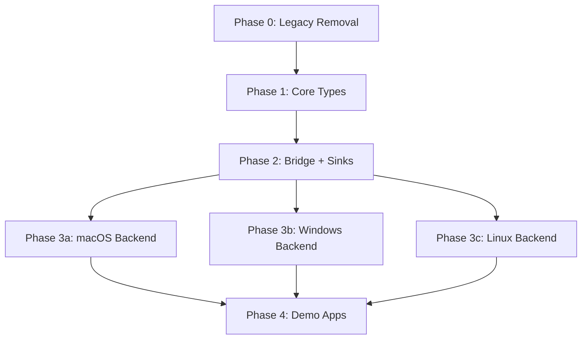

# Implementation Execution Plan — `rsac` Architecture Alignment

> **Status:** Execution Backlog
> **References:**
> - [ARCHITECTURE_OVERVIEW.md](architecture/ARCHITECTURE_OVERVIEW.md) — Master overview
> - [API_DESIGN.md](architecture/API_DESIGN.md) — Public API surface
> - [ERROR_CAPABILITY_DESIGN.md](architecture/ERROR_CAPABILITY_DESIGN.md) — Error taxonomy & capabilities
> - [BACKEND_CONTRACT.md](architecture/BACKEND_CONTRACT.md) — Internal backend traits & ring buffer bridge
> - [AGENTS.md](../AGENTS.md) — Project conventions and anti-patterns

---

## Table of Contents

- [Phase 0: Repo Alignment & Legacy Deprecation](#phase-0-repo-alignment--legacy-deprecation)
- [Phase 1: Core API Contract Freeze](#phase-1-core-api-contract-freeze)
- [Phase 2: Streaming/Data-Plane & Sink Adapters](#phase-2-streamingdata-plane--sink-adapters)
- [Phase 3a: macOS Backend Alignment](#phase-3a-macos-backend-alignment)
- [Phase 3b: Windows Backend Alignment](#phase-3b-windows-backend-alignment)
- [Phase 3c: Linux Backend Alignment](#phase-3c-linux-backend-alignment)
- [Phase 4: Rebuild Demo Apps](#phase-4-rebuild-demo-apps)

---

## Phase 0: Repo Alignment & Legacy Deprecation

**Goal:** Remove all dead code, old API types, and duplicate definitions so that `cargo check --features feat_linux` passes with only new-API types remaining. This clears the path for Phase 1 to implement canonical types without naming conflicts.

**Prerequisites:** None — this is the starting phase.

---

### P0.1 — Remove `ProcessError` from `src/core/error.rs`

| Attribute | Detail |
|---|---|
| **Files** | Modify: `src/core/error.rs` |
| **Description** | Delete the `ProcessError` enum (lines 183–198) and its associated `Result` type alias if separate. This type conflicts with `ProcessError` in `processing.rs` and is not part of the new API. |
| **What to change** | Remove the entire `pub enum ProcessError { ... }` block. |
| **Complexity** | Low |
| **Verification** | `cargo check --features feat_linux` — confirm no references to `core::error::ProcessError` remain. Fix any compilation errors found in the next step. |

---

### P0.2 — Delete `src/core/processing.rs` entirely

| Attribute | Detail |
|---|---|
| **Files** | Delete: `src/core/processing.rs`; Modify: `src/core/mod.rs` |
| **Description** | Remove the `AudioProcessor` trait and its companion `ProcessError` enum. The architecture replaces processing with `AudioSink` trait and user closures via `set_callback()`. |
| **What to change in `src/core/mod.rs`** | Remove line `pub mod processing;` and lines `pub use processing::AudioProcessor;` and `pub use error::ProcessError;`. |
| **Complexity** | Low |
| **Verification** | `cargo check --features feat_linux` — fix any code that imports `AudioProcessor` or `ProcessError` from `core`. |

---

### P0.3 — Remove old API re-exports from `src/lib.rs`

| Attribute | Detail |
|---|---|
| **Files** | Modify: `src/lib.rs` |
| **Description** | Remove all imports/re-exports of deprecated old-API types from the public surface. |
| **What to remove from `src/lib.rs`** | <ul><li>`pub use audio::{get_audio_backend, AudioApplication, AudioCaptureBackend, AudioCaptureStream};` (line 7–13)</li><li>`pub use crate::core::error::ProcessError` (line 19)</li><li>`pub use crate::core::processing::AudioProcessor;` (line 30)</li><li>`pub use crate::core::interface::{AudioStream, SampleType, StreamDataCallback};` (lines 23, 27, 28)</li><li>`pub use crate::core::config::{AudioFileFormat, DeviceSelector, LatencyMode};` (line 17 — keep `AudioFormat`, `SampleFormat`, `StreamConfig`)</li><li>Old platform backend re-exports: `CoreAudioBackend`, `PipeWireBackend`, `WasapiBackend` (lines 46–51)</li><li>`ProcessAudioCapture`, `AudioCaptureError` (lines 54–55)</li><li>`pub type Error = color_eyre::Report;` and `pub type Result<T>` (lines 64–66) — these shadow `std::result::Result`</li><li>`pub fn init()` (lines 68–71) — library shouldn't depend on `color_eyre`</li></ul> |
| **What to keep** | `pub use crate::core::buffer::AudioBuffer;`, `pub use crate::core::config::{AudioFormat, SampleFormat, StreamConfig};`, `pub use crate::core::error::{AudioError, Result as CoreAudioResult};`, `pub use crate::core::interface::{AudioDevice, CapturingStream, DeviceEnumerator, DeviceKind};`, `pub use crate::api::{AudioCapture, AudioCaptureBuilder, AudioCaptureConfig};`, platform-specific `DeviceEnumerator` re-exports. |
| **Complexity** | Medium — many downstream references will break and need fixing |
| **Verification** | `cargo check --features feat_linux` — iteratively fix compilation errors across all files. |

---

### P0.4 — Remove old traits from `src/core/interface.rs`

| Attribute | Detail |
|---|---|
| **Files** | Modify: `src/core/interface.rs` |
| **Description** | Remove dead-code traits that are superseded by the new architecture. |
| **What to remove** | <ul><li>`AudioStream` trait (lines 300–413) — replaced by `CapturingStream`</li><li>`SampleType` enum (lines 417–428) — replaced by `SampleFormat`</li><li>`StreamDataCallback` type alias (line 293) — replaced by `AudioCapture::set_callback()`</li></ul> |
| **What to keep** | `DeviceKind`, `AudioDevice` trait, `CapturingStream` trait, `DeviceEnumerator` trait. These will be refactored in Phase 1 but are still referenced by current code. |
| **Complexity** | Medium — must fix any code referencing removed types |
| **Verification** | `cargo check --features feat_linux` passes. |

---

### P0.5 — Remove old types from `src/audio/core.rs`

| Attribute | Detail |
|---|---|
| **Files** | Modify: `src/audio/core.rs` |
| **Description** | Remove the old backend API that the architecture marks as dead code. |
| **What to remove** | <ul><li>`AudioApplication` struct (lines 7–13)</li><li>`AudioCaptureBackend` trait (lines 23–33)</li><li>`AudioCaptureStream` trait (lines 35–40)</li></ul> |
| **What remains** | The file will be empty (just imports). Can be deleted entirely or kept as a placeholder. |
| **Complexity** | Medium — `AudioApplication` is used in `audio/mod.rs`, `audio/linux/mod.rs`, `audio/discovery.rs`, and several binaries |
| **Verification** | `cargo check --features feat_linux` — fix all references to `AudioApplication`, `AudioCaptureBackend`, `AudioCaptureStream`. |

---

### P0.6 — Remove `get_audio_backend()` and old backend dispatch from `src/audio/mod.rs`

| Attribute | Detail |
|---|---|
| **Files** | Modify: `src/audio/mod.rs` |
| **Description** | Remove the old `get_audio_backend()` factory function and its associated re-exports (`AudioApplication`, `AudioCaptureBackend`, `AudioCaptureStream`, `PipeWireBackend`, `WasapiBackend`, `CoreAudioBackend`, `ProcessAudioCapture`, `AudioCaptureError`). |
| **What to remove** | <ul><li>`pub use self::core::{AudioApplication, AudioCaptureBackend, AudioCaptureStream};` (line 29)</li><li>`pub use capture::{AudioCaptureError, ProcessAudioCapture};` (line 31)</li><li>Old backend re-exports: `PipeWireBackend`, `CoreAudioBackend`, `WasapiBackend` (lines 218–223)</li><li>The entire `get_audio_backend()` function (lines 228–272)</li><li>`mod capture;` (line 27) — if `ProcessAudioCapture` is fully removed</li></ul> |
| **What to keep** | `get_device_enumerator()`, platform-specific `DeviceEnumerator` re-exports, `CrossPlatformDeviceEnumerator`, `application_capture` module (for now — deprecated in Phase 0.8), `discovery` module. |
| **Complexity** | Medium |
| **Verification** | `cargo check --features feat_linux` passes. |

---

### P0.7 — Remove `PipeWireBackend` stub from `src/audio/linux/mod.rs`

| Attribute | Detail |
|---|---|
| **Files** | Modify: `src/audio/linux/mod.rs` |
| **Description** | Remove the `PipeWireBackend` struct (lines 425–456) which implements the old `AudioCaptureBackend` trait. Also remove the old `capture_application()` method from `LinuxDeviceEnumerator` that returns `Box<dyn AudioCaptureStream>`. |
| **What to remove** | <ul><li>`PipeWireBackend` struct and its `AudioCaptureBackend` impl (lines 425–456)</li><li>`LinuxDeviceEnumerator::capture_application()` (lines 29–38) and `LinuxDeviceEnumerator::list_applications()` (lines 25–27)</li><li>Imports of `AudioApplication`, `AudioCaptureStream` from old API</li></ul> |
| **Complexity** | Low |
| **Verification** | `cargo check --features feat_linux` passes. |

---

### P0.8 — Add deprecation markers on `ApplicationCapture` trait

| Attribute | Detail |
|---|---|
| **Files** | Modify: `src/audio/application_capture.rs` |
| **Description** | Add `#[deprecated]` attributes on `ApplicationCapture` trait, `ApplicationCaptureFactory`, and `CrossPlatformApplicationCapture`. These will be replaced by `CaptureTarget::Application` in the unified builder API. Do NOT delete yet — some code still references these. |
| **What to change** | Add `#[deprecated(note = "Use AudioCaptureBuilder with CaptureTarget::Application instead")]` on: `ApplicationCapture` trait, `ApplicationCaptureFactory` struct, `CrossPlatformApplicationCapture` struct, factory functions `capture_application_by_pid()`, `capture_application_by_name()`, `list_capturable_applications()`. |
| **Complexity** | Low |
| **Verification** | `cargo check --features feat_linux` — deprecation warnings appear but no errors. |

---

### P0.9 — Remove `DeviceSelector`, `LatencyMode`, `AudioFileFormat` from `src/core/config.rs`

| Attribute | Detail |
|---|---|
| **Files** | Modify: `src/core/config.rs` |
| **Description** | Remove types that are superseded by the new architecture: `DeviceSelector` (replaced by `CaptureTarget`), `LatencyMode` (removed — buffer size is sufficient), `AudioFileFormat` (internalized to `WavFileSink`). |
| **What to remove** | <ul><li>`DeviceSelector` enum (lines 138–157)</li><li>`LatencyMode` enum (lines 86–101)</li><li>`AudioFileFormat` enum (lines 158–167)</li><li>`LatencyMode` field from `StreamConfig` struct (line 116) — replace with just `format` and `buffer_size_frames`</li></ul> |
| **Complexity** | Medium — `DeviceSelector` is referenced in `api.rs` and several platform backends |
| **Verification** | `cargo check --features feat_linux` — fix all references. |

---

### P0.10 — Clean up `Cargo.toml` — remove non-library dependencies

| Attribute | Detail |
|---|---|
| **Files** | Modify: `Cargo.toml` |
| **Description** | The library crate currently depends on CLI/TUI/testing/application dependencies that should not be required for library consumers. Move them to `[dev-dependencies]` or behind features. |
| **What to move to `[dev-dependencies]`** | `clap`, `inquire`, `indicatif`, `crossterm`, `ratatui`, `tokio`, `env_logger`, `serde`, `serde_json`, `rand`, `rand_pcg`, `rodio`, `reqwest`, `atty` |
| **What to remove entirely** | `color-eyre` — the library should not provide an opinionated error framework. Replaced by `thiserror`-derived `AudioError`. |
| **What to keep as `[dependencies]`** | `futures-core`, `futures-util`, `futures-channel`, `thiserror`, `log`, `hound`, `sysinfo`, `libc`, `ctrlc` (consider if needed), platform-specific deps |
| **Complexity** | Medium — binary targets and examples will need their own dependency declarations |
| **Verification** | `cargo check --features feat_linux` for library. Binary targets may need `cargo check --bin <name>` separately. |

---

### P0.11 — Verify `cargo check` passes after all Phase 0 removals

| Attribute | Detail |
|---|---|
| **Files** | None (verification only) |
| **Description** | Run `cargo check --features feat_linux` and fix any remaining compilation errors. Also run `cargo check --features feat_windows` and `cargo check --features feat_macos` to validate cross-compilation checks pass. |
| **What to do** | Fix any broken imports, missing types, or trait references that survived the removals. Binary targets in `src/bin/` may need temporary `#[allow(dead_code)]` or conditional compilation to keep working. |
| **Complexity** | Medium |
| **Verification** | All three `cargo check --features feat_*` commands pass. |

---

### Phase 0 Completion Criteria

- [x] No code references `AudioCaptureBackend`, `AudioCaptureStream`, `get_audio_backend()`, `AudioApplication`, `AudioProcessor`, `ProcessError`, `AudioStream` trait, `SampleType`, `StreamDataCallback`, `DeviceSelector`, `LatencyMode`, `AudioFileFormat`
- [x] `src/core/processing.rs` is deleted
- [x] `src/audio/core.rs` is empty or deleted
- [x] `src/lib.rs` only exports new-API types
- [x] `ApplicationCapture` trait has `#[deprecated]` markers
- [x] `cargo check --features feat_linux` passes
- [x] Non-library dependencies moved to `[dev-dependencies]`

---

## Phase 1: Core API Contract Freeze

**Goal:** Implement all canonical core types, traits, and error taxonomy as defined in the architecture documents. After this phase, the `core/` module is frozen and provides the stable foundation for all subsequent work.

**Prerequisites:** Phase 0 complete — old types removed, no naming conflicts.

---

### P1.1 — Implement `CaptureTarget` enum in `src/core/config.rs`

| Attribute | Detail |
|---|---|
| **Files** | Modify: `src/core/config.rs` |
| **Description** | Add the `CaptureTarget` enum with 5 variants as defined in API_DESIGN.md §3. This is the unified target model replacing `DeviceSelector` + PID fields. |
| **What to add** | ```rust #[derive(Debug, Clone, PartialEq, Eq, Hash)] pub enum CaptureTarget { SystemDefault, Device { id: String }, Application { pid: u32 }, ApplicationByName { name: String }, ProcessTree { root_pid: u32 }, } impl Default for CaptureTarget { fn default() -> Self { CaptureTarget::SystemDefault } } ``` |
| **Complexity** | Low |
| **Verification** | `cargo check --features feat_linux` passes. Unit test: `CaptureTarget::default() == SystemDefault`. |

---

### P1.2 — Simplify `SampleFormat` to 4 variants

| Attribute | Detail |
|---|---|
| **Files** | Modify: `src/core/config.rs` |
| **Description** | Replace the current 18-variant `SampleFormat` enum with the canonical 4-variant version (I16, I24, I32, F32). Remove endianness — audio is always native-endian f32 internally. |
| **What to change** | Replace the entire `SampleFormat` enum with: `I16`, `I24`, `I32`, `F32`. Default = `F32`. |
| **Cascading changes** | Every file referencing `SampleFormat::S16LE`, `SampleFormat::F32LE`, etc. must be updated: `src/api.rs`, `src/audio/linux/mod.rs`, `src/audio/linux/pipewire.rs`, `src/audio/windows/wasapi.rs`, `src/audio/macos/coreaudio.rs`, examples, tests. |
| **Complexity** | Medium — widespread references |
| **Verification** | `cargo check --features feat_linux` passes. All `SampleFormat` references use new variants. |

---

### P1.3 — Redesign `AudioFormat` and `StreamConfig`

| Attribute | Detail |
|---|---|
| **Files** | Modify: `src/core/config.rs` |
| **Description** | Update `AudioFormat` to remove `bits_per_sample` (redundant with new `SampleFormat`). Update `StreamConfig` to use optional fields and add `ring_buffer_frames`. Add `ResolvedConfig` struct. |
| **AudioFormat changes** | Remove `bits_per_sample` field. Fields: `sample_rate: u32`, `channels: u16`, `sample_format: SampleFormat`. Default: 48000 Hz, 2 ch, F32. |
| **StreamConfig changes** | Fields: `format: Option<AudioFormat>` (None = device native), `buffer_size_frames: Option<u32>`, `ring_buffer_frames: Option<u32>`. |
| **Add ResolvedConfig** | `pub struct ResolvedConfig { pub target: CaptureTarget, pub format: AudioFormat, pub buffer_size_frames: u32, pub ring_buffer_frames: u32 }` |
| **Complexity** | Medium — `AudioFormat` and `StreamConfig` are used throughout |
| **Verification** | `cargo check --features feat_linux` passes. |

---

### P1.4 — Consolidate `AudioError` to 21 canonical variants

| Attribute | Detail |
|---|---|
| **Files** | Modify: `src/core/error.rs` |
| **Description** | Replace the current 28+ variant `AudioError` with the canonical 21 variants defined in ERROR_CAPABILITY_DESIGN.md §2. Add `thiserror` derive, `BackendContext` struct, `ErrorKind` enum, `Recoverability` enum. |
| **What to replace** | The entire `AudioError` enum, `Display` impl, and `Error` impl with `#[derive(Debug, Clone, thiserror::Error)]` version. |
| **What to add** | <ul><li>`BackendContext` struct with `operation`, `message`, `os_error_code` fields</li><li>`ErrorKind` enum: Config, Device, Application, Stream, Platform, Generic</li><li>`Recoverability` enum: Recoverable, Fatal, UserError</li><li>`impl AudioError { fn kind(), fn recoverability(), fn is_recoverable(), fn is_user_error() }`</li><li>`pub type AudioResult<T> = Result<T, AudioError>;` (rename from `Result<T>`)</li><li>`impl From<std::io::Error> for AudioError`</li></ul> |
| **Error variant mapping** | See ERROR_CAPABILITY_DESIGN.md §16 for the complete old→new mapping. Key changes: `DeviceNotFound` + `DeviceNotFoundError` → `DeviceNotFound(String)`, `BackendError(String)` → `Backend(BackendContext)`, `Timeout(String)` + `TimeoutError` → `Timeout`, add `InvalidBufferSize`, `DeviceDisconnected`, `NoAudioSession`, `CapabilityNotSupported`, `PlatformRequirementNotMet`. |
| **Cascading changes** | Every `match` on `AudioError` throughout the codebase must be updated. This is the most disruptive change in Phase 1. |
| **Complexity** | High |
| **Verification** | `cargo check --features feat_linux`. Unit tests for `kind()` and `recoverability()` on each variant. |

---

### P1.5 — Create `src/core/capabilities.rs` — `PlatformCapabilities`

| Attribute | Detail |
|---|---|
| **Files** | Create: `src/core/capabilities.rs`; Modify: `src/core/mod.rs` |
| **Description** | Implement the `PlatformCapabilities` struct and `PlatformRequirement` struct. Add per-platform capability constants and the `platform_capabilities()` / `check_platform_requirements()` public functions. |
| **What to create** | <ul><li>`PlatformCapabilities` struct (fields: `backend_name`, `system_capture`, `application_capture_by_pid`, `application_capture_by_name`, `process_tree_capture`, `supported_sample_formats`, `min_sample_rate`, `max_sample_rate`, `max_channels`, `loopback_capture`, `exclusive_mode`, `minimum_os_version`, `required_services`)</li><li>`impl PlatformCapabilities { fn supports_target(), fn supports_sample_rate(), fn supports_format(), fn supports_channels() }`</li><li>`PlatformRequirement` struct</li><li>Per-platform constants: `WASAPI_CAPABILITIES`, `PIPEWIRE_CAPABILITIES`, `COREAUDIO_CAPABILITIES`</li><li>`pub fn platform_capabilities() -> PlatformCapabilities` (compile-time #[cfg] dispatch)</li><li>`pub fn check_platform_requirements() -> std::result::Result<(), Vec<PlatformRequirement>>`</li></ul> |
| **Module registration** | Add `pub mod capabilities;` to `src/core/mod.rs`. |
| **Complexity** | Medium |
| **Verification** | `cargo check --features feat_linux`. Unit test: `platform_capabilities().backend_name == "PipeWire"` on Linux. |

---

### P1.6 — Improve `AudioBuffer` with metadata

| Attribute | Detail |
|---|---|
| **Files** | Modify: `src/core/buffer.rs` |
| **Description** | Upgrade `AudioBuffer` to the canonical version: private `samples` field (not `data`), single `format: AudioFormat` (instead of separate `channels`, `sample_rate`, `format`), add `frame_offset`, `sequence`, make `timestamp` optional. Add helper methods `channel()`, `is_silent()`, `duration()`, `into_samples()`, `samples_mut()`, `num_samples()`. Remove unnecessary `unsafe impl Send/Sync`. |
| **What to change** | <ul><li>Rename `data` → `samples` (private)</li><li>Remove `channels`, `sample_rate` separate fields — derive from `format`</li><li>Add `frame_offset: u64`, `sequence: u64`, `timestamp: Option<Duration>`</li><li>Update constructor to match new signature</li><li>Add accessor methods: `samples()`, `samples_mut()`, `into_samples()`, `format()`, `channels()`, `sample_rate()`, `num_frames()`, `num_samples()`, `duration()`, `frame_offset()`, `timestamp()`, `sequence()`, `channel()`, `is_silent()`</li><li>Remove `unsafe impl Send for AudioBuffer` and `unsafe impl Sync for AudioBuffer` — `Vec<f32>` is auto `Send + Sync`</li></ul> |
| **Cascading changes** | All code accessing `buffer.data` must change to `buffer.samples()` or `buffer.into_samples()`. All code constructing `AudioBuffer` must use the new constructor. |
| **Complexity** | Medium |
| **Verification** | `cargo check --features feat_linux`. Unit tests for `num_frames()`, `duration()`, `channel()`, `is_silent()`. |

---

### P1.7 — Freeze `CapturingStream` trait to final form

| Attribute | Detail |
|---|---|
| **Files** | Modify: `src/core/interface.rs` |
| **Description** | Update the `CapturingStream` trait to the canonical form from API_DESIGN.md §7. Change `&mut self` to `&self` on all methods. Add `try_read_chunk()`, `format()`, `latency_frames()`. Change `read_chunk` signature to use `Duration`. |
| **What to change** | <ul><li>`fn start(&mut self)` → `fn start(&self)`</li><li>`fn stop(&mut self)` → `fn stop(&self)`</li><li>`fn read_chunk(&mut self, timeout_ms: Option<u32>)` → `fn read_chunk(&self, timeout: std::time::Duration) -> AudioResult<Option<AudioBuffer>>`</li><li>Add `fn try_read_chunk(&self) -> AudioResult<Option<AudioBuffer>>` with default impl</li><li>`fn to_async_stream(&mut self)` → `fn to_async_stream(&self)` returning `+ Send + '_` instead of `+ Send + Sync + 'a`</li><li>Add `fn format(&self) -> &AudioFormat;`</li><li>Add `fn latency_frames(&self) -> Option<u64>;`</li></ul> |
| **Complexity** | High — every `CapturingStream` implementor must be updated |
| **Verification** | `cargo check --features feat_linux`. |

---

### P1.8 — Freeze `DeviceEnumerator` trait — convert to object-safe

| Attribute | Detail |
|---|---|
| **Files** | Modify: `src/core/interface.rs` |
| **Description** | Replace the current `DeviceEnumerator` trait (which has an associated `Device` type) with the new object-safe version that returns `DeviceInfo` structs. Add `DeviceInfo` struct (plain data, no trait methods). |
| **What to change** | <ul><li>Remove `type Device: AudioDevice;` associated type</li><li>Change return types from `Vec<Self::Device>` to `Vec<DeviceInfo>`</li><li>Add `fn default_input() -> AudioResult<Option<DeviceInfo>>`</li><li>Add `fn default_output() -> AudioResult<Option<DeviceInfo>>`</li><li>Add `fn device_by_id(&self, id: &str) -> AudioResult<Option<DeviceInfo>>`</li><li>Add `fn devices_by_name(&self, pattern: &str) -> AudioResult<Vec<DeviceInfo>>`</li><li>Remove `get_input_devices()`, `get_output_devices()`, `get_device_by_id()` methods</li></ul> |
| **What to add** | `DeviceInfo` struct: `id: String`, `name: String`, `kind: DeviceKind`, `is_default: bool`, `default_format: Option<AudioFormat>`, `supported_formats: Vec<AudioFormat>`, `is_active: bool`. Update `DeviceKind` to include `Loopback` variant. |
| **Complexity** | High — all `DeviceEnumerator` implementors must be rewritten |
| **Verification** | `cargo check --features feat_linux`. |

---

### P1.9 — Remove `AudioDevice` trait — replace with `DeviceInfo` struct

| Attribute | Detail |
|---|---|
| **Files** | Modify: `src/core/interface.rs`; Modify: platform backend files |
| **Description** | The `AudioDevice` trait (with its associated types and many complex methods) is replaced by the flat `DeviceInfo` struct. Device creation moves to the builder pattern — `AudioCaptureBuilder::build()` creates streams, not devices. |
| **What to remove** | The entire `AudioDevice` trait definition. |
| **Cascading changes** | <ul><li>`src/audio/linux/mod.rs` — `LinuxAudioDevice` struct and its `AudioDevice` impl → replace with functions that return `DeviceInfo`</li><li>`src/audio/windows/wasapi.rs` — `WindowsAudioDevice` struct and its `AudioDevice` impl</li><li>`src/audio/macos/coreaudio.rs` — `MacosAudioDevice` struct and its `AudioDevice` impl</li><li>`src/audio/mod.rs` — `CrossPlatformDeviceEnumerator` needs rewriting to return `DeviceInfo`</li></ul> |
| **Complexity** | High |
| **Verification** | `cargo check --features feat_linux`. |

---

### P1.10 — Add `ApplicationEnumerator` trait and types

| Attribute | Detail |
|---|---|
| **Files** | Add to: `src/core/interface.rs` or create `src/core/enumerator.rs` |
| **Description** | Add the `ApplicationEnumerator` trait, `CapturableApplication` struct, and `PlatformAppInfo` enum as defined in API_DESIGN.md §10. |
| **What to add** | <ul><li>`CapturableApplication` struct: `pid: u32`, `name: String`, `is_producing_audio: bool`, `platform: PlatformAppInfo`</li><li>`PlatformAppInfo` enum: `Generic`, `Windows { exe_path, session_id }`, `Linux { node_id, media_class, pipewire_app_name }`, `MacOS { bundle_id }`</li><li>`ApplicationEnumerator` trait: `list_capturable()`, `list_all()`, `find_by_pid()`, `find_by_name()`</li></ul> |
| **Complexity** | Low — new code, no removals |
| **Verification** | `cargo check --features feat_linux`. |

---

### P1.11 — Update `AudioCaptureBuilder` to use `CaptureTarget`

| Attribute | Detail |
|---|---|
| **Files** | Modify: `src/api.rs` |
| **Description** | Refactor `AudioCaptureBuilder` to use `CaptureTarget` instead of the old `DeviceSelector` + `target_application_pid` + `target_application_session_identifier` fields. Make all builder fields except `target` optional. Use the new `StreamConfig` and `ResolvedConfig`. |
| **What to change** | <ul><li>Replace `device_selector`, `target_application_pid`, `target_application_session_identifier` with `target: CaptureTarget`</li><li>Make `sample_rate`, `channels`, `sample_format` optional — device native format used when `None`</li><li>Remove `bits_per_sample` field (redundant with `SampleFormat`)</li><li>Add `ring_buffer_frames` optional field</li><li>Add `.target(CaptureTarget)` builder method</li><li>Update `.build()` to create `ResolvedConfig` and validate against `PlatformCapabilities`</li></ul> |
| **Complexity** | High — `api.rs` is 86KB with extensive implementation |
| **Verification** | `cargo check --features feat_linux`. |

---

### P1.12 — Update `AudioCapture` lifecycle methods

| Attribute | Detail |
|---|---|
| **Files** | Modify: `src/api.rs` |
| **Description** | Update `AudioCapture` to use `&self` methods (interior mutability), store `ResolvedConfig`, and support the full lifecycle: `start()`, `stop()`, `read_chunk(Duration)`, `try_read_chunk()`, `buffers_iter()`, `set_callback()`, `pipe_to()`. |
| **What to change** | <ul><li>Change `start(&mut self)` → `start(&self)` with interior `Mutex`/`AtomicState`</li><li>Change `stop(&mut self)` → `stop(&self)`</li><li>Add `read_chunk(&self, timeout: Duration)` and `try_read_chunk(&self)`</li><li>Store `ResolvedConfig` instead of `AudioCaptureConfig`</li><li>Remove `AudioCaptureConfig` if it becomes redundant with `ResolvedConfig`</li></ul> |
| **Complexity** | High |
| **Verification** | `cargo check --features feat_linux`. |

---

### P1.13 — Update `src/lib.rs` with final Phase 1 public exports

| Attribute | Detail |
|---|---|
| **Files** | Modify: `src/lib.rs` |
| **Description** | Update public exports to match the canonical exports from API_DESIGN.md §13. Add `prelude` module. |
| **What to export** | <ul><li>Builder/session: `AudioCaptureBuilder`, `AudioCapture`, `ResolvedConfig`</li><li>Types: `CaptureTarget`, `AudioFormat`, `SampleFormat`, `StreamConfig`, `AudioBuffer`</li><li>Error: `AudioError`, `AudioResult`, `ErrorKind`, `Recoverability`, `BackendContext`</li><li>Traits: `CapturingStream`, `DeviceEnumerator`, `ApplicationEnumerator`</li><li>Structs: `DeviceInfo`, `DeviceKind`, `CapturableApplication`, `PlatformAppInfo`</li><li>Capabilities: `PlatformCapabilities`, `platform_capabilities`, `check_platform_requirements`</li><li>`prelude` module with commonly-used imports</li></ul> |
| **Complexity** | Low |
| **Verification** | `cargo check --features feat_linux`. |

---

### P1.14 — Write unit tests for core type invariants

| Attribute | Detail |
|---|---|
| **Files** | Create: `tests/core_types_tests.rs` or add `#[cfg(test)]` modules in each `core/*.rs` file |
| **Description** | Write tests to validate core type behavior: error categorization, recoverability, buffer construction, config defaults, capability queries. |
| **What to test** | <ul><li>`AudioError::kind()` returns correct `ErrorKind` for every variant</li><li>`AudioError::recoverability()` returns correct classification for every variant</li><li>`AudioError::is_recoverable()` matches `Recoverability::Recoverable`</li><li>`AudioBuffer::num_frames()` with various channel counts</li><li>`AudioBuffer::duration()` calculation</li><li>`AudioBuffer::channel()` iterator correctness</li><li>`AudioBuffer::is_silent()` for zero and non-zero data</li><li>`CaptureTarget::default() == SystemDefault`</li><li>`AudioFormat::default()` values</li><li>`PlatformCapabilities::supports_target()` for each variant</li></ul> |
| **Complexity** | Medium |
| **Verification** | `cargo test` passes all new tests. |

---

### Phase 1 Completion Criteria

- [x] `CaptureTarget` enum exists with 5 variants
- [x] `SampleFormat` has exactly 4 variants: I16, I24, I32, F32
- [x] `AudioError` has exactly 21 variants with `kind()`, `recoverability()`, `BackendContext`
- [x] `PlatformCapabilities` exists with per-platform constants
- [x] `AudioBuffer` has `frame_offset`, `sequence`, optional `timestamp`, private `samples`
- [x] `CapturingStream` trait uses `&self` methods, `Duration` timeout, has `format()` and `latency_frames()`
- [x] `DeviceEnumerator` is object-safe, returns `DeviceInfo`
- [x] `AudioDevice` trait removed, replaced by `DeviceInfo`
- [x] `ApplicationEnumerator` trait and `CapturableApplication` struct exist
- [x] `AudioCaptureBuilder` uses `CaptureTarget`, all fields optional
- [x] `AudioCapture` uses `&self` methods with interior mutability
- [x] Core type unit tests pass
- [x] `cargo check --features feat_linux` passes

---

## Phase 2: Streaming/Data-Plane & Sink Adapters

**Goal:** Implement the ring buffer bridge infrastructure, `BridgeStream`, and sink adapters. After this phase, the streaming data path is complete and ready for platform backends to plug into.

**Prerequisites:** Phase 1 complete — all core types frozen.

---

### P2.1 — Add `rtrb` dependency to `Cargo.toml`

| Attribute | Detail |
|---|---|
| **Files** | Modify: `Cargo.toml` |
| **Description** | Add `rtrb = "0.3"` to `[dependencies]`. Also add `atomic-waker = "1"` as optional (behind `async` feature, or unconditional if lightweight enough). |
| **What to add** | ```toml rtrb = "0.3" atomic-waker = "1" ``` |
| **Complexity** | Low |
| **Verification** | `cargo check --features feat_linux` passes. |

---

### P2.2 — Create `src/bridge/mod.rs` module

| Attribute | Detail |
|---|---|
| **Files** | Create: `src/bridge/mod.rs`; Modify: `src/lib.rs` (add `mod bridge;`) |
| **Description** | Create the bridge module root that will contain ring buffer, bridge stream, and async bridge sub-modules. |
| **What to add** | `pub(crate) mod ring_buffer;`, `pub(crate) mod bridge_stream;` (async_bridge added later with feature gate). |
| **Complexity** | Low |
| **Verification** | `cargo check --features feat_linux` passes. |

---

### P2.3 — Implement `RingBufferBridge` in `src/bridge/ring_buffer.rs`

| Attribute | Detail |
|---|---|
| **Files** | Create: `src/bridge/ring_buffer.rs` |
| **Description** | Implement the core ring buffer bridge as defined in BACKEND_CONTRACT.md §3. This is the single shared pattern for all platforms. |
| **What to implement** | <ul><li>`BridgeShared` struct — atomics for frame counting, sequence, overrun detection, producer_finished signal, waker</li><li>`BridgeProducer` struct — wraps `rtrb::Producer<f32>` + `Arc<BridgeShared>`. Methods: `write(&mut self, samples: &[f32]) -> usize`, `finish(&self)`, `is_stop_requested(&self) -> bool`</li><li>`BridgeConsumer` struct — wraps `Mutex<rtrb::Consumer<f32>>` + `Arc<BridgeShared>`. Methods: `read_chunk(&self, timeout: Duration)`, `try_read_chunk(&self)`</li><li>`pub(crate) fn create_bridge(capacity_frames: u32, format: AudioFormat) -> (BridgeProducer, BridgeConsumer)`</li><li>`pub(crate) fn calculate_ring_buffer_capacity(requested: Option<u32>, callback_buffer: u32, format: &AudioFormat) -> u32`</li></ul> |
| **Thread safety** | `BridgeProducer: Send + !Sync`, `BridgeConsumer: Send + Sync` |
| **Complexity** | High — correctness-critical lock-free code |
| **Verification** | Unit tests: producer/consumer cycle, overrun detection (slow consumer), frame counting, sequence tracking, capacity calculation, `finish()` → `StreamClosed`. |

---

### P2.4 — Create `src/backend/` module with traits

| Attribute | Detail |
|---|---|
| **Files** | Create: `src/backend/mod.rs`, `src/backend/traits.rs`, `src/backend/state.rs`; Modify: `src/lib.rs` |
| **Description** | Create the internal backend module with `PlatformBackend` and `PlatformStream` traits, plus the `AtomicStreamState` state machine. These are `pub(crate)` — not exposed publicly. |
| **What to implement in `traits.rs`** | <ul><li>`pub(crate) trait PlatformBackend { type Stream: PlatformStream; fn create_stream(&self, config: &ResolvedConfig) -> AudioResult<Self::Stream>; fn capabilities(&self) -> &PlatformCapabilities; fn enumerate_devices(&self) -> AudioResult<Vec<DeviceInfo>>; fn enumerate_applications(&self) -> AudioResult<Vec<CapturableApplication>>; fn check_requirements(&self) -> std::result::Result<(), Vec<PlatformRequirement>>; }`</li><li>`pub(crate) trait PlatformStream: Send + Sync { fn start(&self) -> AudioResult<()>; fn stop(&self) -> AudioResult<()>; fn close(&mut self) -> AudioResult<()>; fn is_running(&self) -> bool; fn format(&self) -> &AudioFormat; fn latency_frames(&self) -> Option<u64>; }`</li></ul> |
| **What to implement in `state.rs`** | <ul><li>`StreamState` enum: `Created`, `Running`, `Stopped`, `Closed`</li><li>`AtomicStreamState` struct wrapping `AtomicU8` with `new()`, `get()`, `transition(expected, new) -> AudioResult<()>`</li></ul> |
| **Complexity** | Medium |
| **Verification** | `cargo check --features feat_linux`. Unit tests for `AtomicStreamState` transitions. |

---

### P2.5 — Implement `BridgeStream<S>` in `src/bridge/bridge_stream.rs`

| Attribute | Detail |
|---|---|
| **Files** | Create: `src/bridge/bridge_stream.rs` |
| **Description** | Implement the universal `CapturingStream` adapter as defined in BACKEND_CONTRACT.md §7.4. This is the ONLY production `CapturingStream` implementation — all platform backends produce `PlatformStream`s that get wrapped in `BridgeStream`. |
| **What to implement** | <ul><li>`pub(crate) struct BridgeStream<S: PlatformStream>` — contains `Mutex<S>`, `BridgeConsumer`, `AtomicStreamState`</li><li>`impl<S: PlatformStream> CapturingStream for BridgeStream<S>` — delegates `start/stop/close` to platform stream, `read_chunk/try_read_chunk` to consumer, state checks on every method</li><li>`to_async_stream()` — returns `AsyncBridgeStream` backed by the consumer (or `CapabilityNotSupported` if async feature disabled)</li></ul> |
| **Complexity** | High — correctness-critical, thread-safety-critical |
| **Verification** | `cargo check --features feat_linux`. Integration test with a mock `PlatformStream`. |

---

### P2.6 — Create `src/core/sink.rs` — AudioSink trait and implementations

| Attribute | Detail |
|---|---|
| **Files** | Create: `src/core/sink.rs`; Modify: `src/core/mod.rs` |
| **Description** | Implement the `AudioSink` trait and built-in sink implementations. |
| **What to implement** | <ul><li>`AudioSink` trait: `write(&mut self, buffer: &AudioBuffer) -> AudioResult<()>`, `flush(&mut self)`, `close(&mut self)`</li><li>`NullSink` — discards all data (always available)</li><li>`WavFileSink` — wraps `hound::WavWriter`, feature-gated behind `sink-wav` or always available since `hound` is already a dep</li><li>`ChannelSink` — wraps `std::sync::mpsc::Sender<AudioBuffer>`</li></ul> |
| **Complexity** | Medium |
| **Verification** | `cargo check --features feat_linux`. Unit test: write to `NullSink`, write to `WavFileSink` with temp file. |

---

### P2.7 — Implement async streaming support

| Attribute | Detail |
|---|---|
| **Files** | Create: `src/bridge/async_bridge.rs`; Modify: `src/bridge/mod.rs`, `Cargo.toml` |
| **Description** | Implement `AsyncBridgeStream` as a `futures_core::Stream<Item = AudioResult<AudioBuffer>>`. Uses `AtomicWaker` for efficient async notification from the ring buffer producer. |
| **What to implement** | <ul><li>`AsyncBridgeStream<'a>` struct — references `BridgeConsumer`, implements `futures_core::Stream`</li><li>`poll_next()` — registers waker via `AtomicWaker`, checks consumer for data, returns `Poll::Ready` or `Poll::Pending`</li></ul> |
| **Feature gating** | Consider whether to feature-gate behind `async` feature or keep always available (since `futures-core` is already a dependency). |
| **Complexity** | Medium |
| **Verification** | `cargo check --features feat_linux`. |

---

### P2.8 — Add Cargo feature flags for optional functionality

| Attribute | Detail |
|---|---|
| **Files** | Modify: `Cargo.toml` |
| **Description** | Set up optional Cargo features as defined in ARCHITECTURE_OVERVIEW.md §6. |
| **What to add** | ```toml [features] async = ["dep:futures-core", "dep:atomic-waker"] sink-wav = ["dep:hound"] sink-channel = [] sink-channel-tokio = ["sink-channel", "dep:tokio"] ``` Adjust existing `futures-core` and `hound` to be optional if desired. |
| **Complexity** | Low |
| **Verification** | `cargo check --features feat_linux` with and without optional features. |

---

### P2.9 — Wire sink adapters into `AudioCapture`

| Attribute | Detail |
|---|---|
| **Files** | Modify: `src/api.rs` |
| **Description** | Implement the `pipe_to()`, `set_callback()`, `buffers_iter()`, and `async_stream()` consumption modes on `AudioCapture`. |
| **What to implement** | <ul><li>`pipe_to<S: AudioSink>(&self, sink: S)` — spawns reader thread that reads from ring buffer and writes to sink</li><li>`set_callback<F: FnMut(&AudioBuffer) + Send + 'static>(&self, f: F)` — spawns reader thread that invokes callback</li><li>`buffers_iter(&self) -> AudioBufferIterator` — blocking iterator wrapper</li><li>`async_stream(&self) -> AudioResult<AudioStream>` — async stream wrapper</li></ul> |
| **Complexity** | High |
| **Verification** | `cargo check --features feat_linux`. Integration test with `NullSink`. |

---

### P2.10 — Write tests for ring buffer, bridge stream, and sinks

| Attribute | Detail |
|---|---|
| **Files** | Create test files or `#[cfg(test)]` modules |
| **Description** | Comprehensive tests for the data-plane layer. |
| **What to test** | <ul><li>Ring buffer: single write/read cycle, multiple writes, overrun detection, underrun handling, `finish()` signal, capacity calculation</li><li>`BridgeStream`: state transitions (Created→Running→Stopped→Closed), invalid transitions return errors, read_chunk delegates correctly</li><li>`WavFileSink`: creates valid WAV file, correct header</li><li>`ChannelSink`: buffers arrive on receiver</li><li>`NullSink`: no errors on write</li></ul> |
| **Complexity** | Medium |
| **Verification** | `cargo test` passes all data-plane tests. |

---

### Phase 2 Completion Criteria

- [x] `rtrb` + `atomic-waker` dependencies added
- [x] `bridge/` module exists with `ring_buffer.rs`, `bridge_stream.rs`, `async_bridge.rs`
- [x] `backend/` module exists with `traits.rs` and `state.rs`
- [x] `BridgeProducer` / `BridgeConsumer` work correctly
- [x] `BridgeStream<S>` implements `CapturingStream` for any `PlatformStream`
- [x] `AudioSink` trait exists with `WavFileSink`, `ChannelSink`, `NullSink`
- [x] `AudioCapture` supports `pipe_to()`, `set_callback()`, `buffers_iter()`, `async_stream()`
- [x] Ring buffer tests pass
- [x] `cargo check --features feat_linux` passes

---

## Phase 3a: macOS Backend Alignment

**Goal:** Wire the existing macOS CoreAudio + Process Tap code through the new `PlatformBackend`/`PlatformStream`/`BridgeStream` architecture. macOS is done first because it has the most complete existing implementation and validates the architecture end-to-end.

**Prerequisites:** Phase 2 complete — bridge infrastructure available.

---

### P3a.1 — Create `src/backend/macos/` module structure

| Attribute | Detail |
|---|---|
| **Files** | Create: `src/backend/macos/mod.rs`, `src/backend/macos/backend.rs`, `src/backend/macos/stream.rs`; Modify: `src/backend/mod.rs` |
| **Description** | Set up the new macOS backend module. Wire `#[cfg(target_os = "macos")]` dispatch in `backend/mod.rs`. |
| **Complexity** | Low |
| **Verification** | `cargo check --features feat_macos` (cross-check). |

---

### P3a.2 — Implement `CoreAudioBackendImpl` — `PlatformBackend`

| Attribute | Detail |
|---|---|
| **Files** | Create/modify: `src/backend/macos/backend.rs` |
| **Description** | Implement `PlatformBackend` for macOS. The `create_stream()` method dispatches based on `CaptureTarget` to system capture (aggregate device) or app capture (Process Tap). Reuse logic from existing `src/audio/macos/coreaudio.rs` and `src/audio/macos/tap.rs`. |
| **What to implement** | <ul><li>`CoreAudioBackendImpl::new() -> AudioResult<Self>`</li><li>`create_stream()` — creates ring buffer bridge, configures AudioUnit with render callback that writes to `BridgeProducer`, returns `CoreAudioStream`</li><li>`capabilities()` — returns `&COREAUDIO_CAPABILITIES`</li><li>`enumerate_devices()` — wraps existing device enumeration</li><li>`enumerate_applications()` — uses NSRunningApplication</li></ul> |
| **Complexity** | High — porting complex CoreAudio code |
| **Verification** | `cargo check --features feat_macos`. |

---

### P3a.3 — Implement `CoreAudioStream` — `PlatformStream`

| Attribute | Detail |
|---|---|
| **Files** | Create/modify: `src/backend/macos/stream.rs` |
| **Description** | Implement `PlatformStream` for macOS. Wraps `AudioUnit`, process tap handles, and the `BridgeProducer`. The render callback writes f32 samples to the producer. |
| **Key design** | `BridgeProducer` is moved into the render callback closure. `start()`/`stop()` call `AudioOutputUnitStart/Stop`. `close()` disposes the AudioUnit and destroys the aggregate device/process tap. |
| **Complexity** | High |
| **Verification** | `cargo check --features feat_macos`. End-to-end on macOS hardware (manual). |

---

### P3a.4 — Wire `create_platform_backend()` for macOS

| Attribute | Detail |
|---|---|
| **Files** | Modify: `src/backend/mod.rs` |
| **Description** | Add `#[cfg(target_os = "macos")] pub(crate) fn create_platform_backend() -> AudioResult<CoreAudioBackendImpl>`. |
| **Complexity** | Low |
| **Verification** | `cargo check --features feat_macos`. |

---

### P3a.5 — Remove old macOS code from `src/audio/macos/`

| Attribute | Detail |
|---|---|
| **Files** | Modify/refactor: `src/audio/macos/coreaudio.rs`, `src/audio/macos/tap.rs` |
| **Description** | After the new backend is working, move reusable CoreAudio/Process Tap logic into `src/backend/macos/` and deprecate the old `src/audio/macos/` module. |
| **Complexity** | Medium |
| **Verification** | `cargo check --features feat_macos`. |

---

### Phase 3a Completion Criteria

- [x] `CoreAudioBackendImpl` implements `PlatformBackend`
- [x] `CoreAudioStream` implements `PlatformStream` with `BridgeProducer`
- [x] System capture works end-to-end via `AudioCaptureBuilder → AudioCapture → start() → read_chunk()`
- [x] Application capture by PID works via `CaptureTarget::Application`
- [x] No Mutex in CoreAudio render callback (uses lock-free rtrb)
- [x] `cargo check --features feat_macos` passes

---

## Phase 3b: Windows Backend Alignment

**Goal:** Wire the existing WASAPI code through the new architecture. The Windows backend has extensive code (78KB) but `create_stream()` currently returns an error — this phase makes it functional.

**Prerequisites:** Phase 2 complete. Phase 3a is instructive but not blocking.

---

### P3b.1 — Create `src/backend/windows/` module structure

| Attribute | Detail |
|---|---|
| **Files** | Create: `src/backend/windows/mod.rs`, `src/backend/windows/backend.rs`, `src/backend/windows/stream.rs`, `src/backend/windows/com.rs`; Modify: `src/backend/mod.rs` |
| **Description** | Set up the new Windows backend module with COM helper. |
| **What to implement in `com.rs`** | `ComGuard` struct — RAII wrapper for `CoInitializeEx(MTA)` / `CoUninitialize`. `!Send` (per-thread). |
| **Complexity** | Low |
| **Verification** | `cargo check --features feat_windows` (cross-check). |

---

### P3b.2 — Implement `WasapiBackendImpl` — `PlatformBackend`

| Attribute | Detail |
|---|---|
| **Files** | Create/modify: `src/backend/windows/backend.rs` |
| **Description** | Implement `PlatformBackend` for Windows. `create_stream()` dispatches on `CaptureTarget`: SystemDefault → loopback, Application → process loopback capture (ActivateAudioInterfaceAsync). |
| **Key porting from existing code** | The existing `src/audio/windows/wasapi.rs` has extensive WASAPI initialization, device enumeration, and process loopback code. Extract and refactor into the new structure. |
| **Complexity** | High |
| **Verification** | `cargo check --features feat_windows`. |

---

### P3b.3 — Implement `WasapiStream` — `PlatformStream`

| Attribute | Detail |
|---|---|
| **Files** | Create/modify: `src/backend/windows/stream.rs` |
| **Description** | Implement `PlatformStream` for Windows. Spawns a dedicated capture thread with COM MTA initialization. The capture thread uses event-driven WASAPI: `WaitForSingleObject` → `IAudioCaptureClient::GetBuffer` → convert to f32 → `BridgeProducer::write()`. |
| **Thread model** | Capture thread owns COM objects + `BridgeProducer`. Main thread holds `WasapiStream` (which is `Send + Sync`). Communication via atomics (stop flag, event handle). |
| **Complexity** | High |
| **Verification** | `cargo check --features feat_windows`. End-to-end on Windows hardware (manual). |

---

### P3b.4 — Wire `create_platform_backend()` for Windows

| Attribute | Detail |
|---|---|
| **Files** | Modify: `src/backend/mod.rs` |
| **Description** | Add `#[cfg(target_os = "windows")] pub(crate) fn create_platform_backend() -> AudioResult<WasapiBackendImpl>`. |
| **Complexity** | Low |
| **Verification** | `cargo check --features feat_windows`. |

---

### P3b.5 — Remove old Windows code from `src/audio/windows/`

| Attribute | Detail |
|---|---|
| **Files** | Refactor: `src/audio/windows/wasapi.rs`, `src/audio/windows/mod.rs` |
| **Description** | Migrate reusable WASAPI logic to `src/backend/windows/`, deprecate old module. Remove duplicate impl blocks in `wasapi.rs`. |
| **Complexity** | Medium |
| **Verification** | `cargo check --features feat_windows`. |

---

### Phase 3b Completion Criteria

- [x] `WasapiBackendImpl` implements `PlatformBackend`
- [x] `WasapiStream` implements `PlatformStream` with dedicated capture thread + `BridgeProducer`
- [x] System loopback capture works via `CaptureTarget::SystemDefault`
- [x] Process loopback capture works via `CaptureTarget::Application`
- [x] COM initialized per-thread via `ComGuard`
- [x] `cargo check --features feat_windows` passes

---

## Phase 3c: Linux Backend Alignment

**Goal:** Implement the PipeWire dedicated-thread architecture to solve the `!Send` problem, then wire through `BridgeStream`.

**Prerequisites:** Phase 2 complete.

---

### P3c.1 — Create `src/backend/linux/` module structure

| Attribute | Detail |
|---|---|
| **Files** | Create: `src/backend/linux/mod.rs`, `src/backend/linux/backend.rs`, `src/backend/linux/stream.rs`, `src/backend/linux/thread.rs`; Modify: `src/backend/mod.rs` |
| **Description** | Set up the Linux backend module with the PipeWire thread sub-module. |
| **Complexity** | Low |
| **Verification** | `cargo check --features feat_linux`. |

---

### P3c.2 — Implement `PipeWireThread` in `src/backend/linux/thread.rs`

| Attribute | Detail |
|---|---|
| **Files** | Create: `src/backend/linux/thread.rs` |
| **Description** | Implement the dedicated PipeWire thread as defined in BACKEND_CONTRACT.md §4.2. All PipeWire `Rc` objects live exclusively on this thread. Communication via `mpsc` command channel + `oneshot` responses. |
| **What to implement** | <ul><li>`PipeWireCommand` enum: `CreateStream`, `Start`, `Stop`, `QueryFormat`, `Shutdown`</li><li>`PipeWireStreamInfo` response struct</li><li>`PipeWireThread` struct: `command_tx`, `thread_handle`</li><li>`PipeWireThread::spawn()` — creates thread, initializes PipeWire MainLoop/Context/Core</li><li>`PipeWireThread::thread_main()` — event loop: process commands + `main_loop.iterate()`</li><li>`PipeWireThread::send_command()` — send + wait for response</li><li>`Drop` impl — sends `Shutdown`, joins thread</li></ul> |
| **Key design** | `BridgeProducer` is sent to the PipeWire thread via `CreateStream` command. The PipeWire process callback writes to it. `BridgeConsumer` stays on the user side. |
| **Complexity** | High — core of the Linux `!Send` solution |
| **Verification** | `cargo check --features feat_linux`. Integration test: spawn thread, create stream, shutdown. |

---

### P3c.3 — Implement `PipeWireBackendImpl` — `PlatformBackend`

| Attribute | Detail |
|---|---|
| **Files** | Create: `src/backend/linux/backend.rs` |
| **Description** | Implement `PlatformBackend` for Linux. `create_stream()` spawns `PipeWireThread`, sends `CreateStream` command with `BridgeProducer`, returns `PipeWireStream` wrapping `BridgeConsumer`. |
| **What to implement** | <ul><li>`PipeWireBackendImpl::new()` — basic initialization</li><li>`create_stream()` — creates bridge, spawns PipeWire thread, sends CreateStream command</li><li>`enumerate_devices()` — PipeWire registry query or pw-cli fallback</li><li>`enumerate_applications()` — PipeWire registry for `Stream/Output/Audio` nodes</li></ul> |
| **Complexity** | High |
| **Verification** | `cargo check --features feat_linux`. |

---

### P3c.4 — Implement `PipeWireStream` — `PlatformStream`

| Attribute | Detail |
|---|---|
| **Files** | Create: `src/backend/linux/stream.rs` |
| **Description** | Implement `PlatformStream` for Linux. Wraps `PipeWireThread` handle. `start()/stop()/close()` send commands to the PipeWire thread. `format()` queries the negotiated format. |
| **Thread safety** | `PipeWireStream` is `Send + Sync` because it only holds `mpsc::Sender` (Send) and `JoinHandle` (Send). All `Rc` objects are on the PipeWire thread. |
| **Complexity** | Medium |
| **Verification** | `cargo check --features feat_linux`. End-to-end on Linux with PipeWire running (manual). |

---

### P3c.5 — Wire `create_platform_backend()` for Linux

| Attribute | Detail |
|---|---|
| **Files** | Modify: `src/backend/mod.rs` |
| **Description** | Add `#[cfg(target_os = "linux")] pub(crate) fn create_platform_backend() -> AudioResult<PipeWireBackendImpl>`. |
| **Complexity** | Low |
| **Verification** | `cargo check --features feat_linux`. |

---

### P3c.6 — Remove old Linux code from `src/audio/linux/`

| Attribute | Detail |
|---|---|
| **Files** | Refactor: `src/audio/linux/mod.rs`, `src/audio/linux/pipewire.rs` |
| **Description** | Migrate reusable PipeWire logic (format negotiation, stream property configuration, monitor stream creation) to `src/backend/linux/`. Deprecate old `PipeWireApplicationCapture` and `LinuxDeviceEnumerator`. |
| **Complexity** | Medium |
| **Verification** | `cargo check --features feat_linux`. |

---

### Phase 3c Completion Criteria

- [x] `PipeWireThread` manages all PipeWire `Rc` objects on a dedicated thread
- [x] `PipeWireBackendImpl` implements `PlatformBackend`
- [x] `PipeWireStream` implements `PlatformStream` via command channel
- [x] System capture works via `CaptureTarget::SystemDefault` (monitor of default sink)
- [x] Application capture works via `CaptureTarget::Application` (monitor of app node)
- [x] No `unsafe impl Send` on PipeWire types
- [x] `cargo check --features feat_linux` passes

---

## Phase 4: Rebuild Demo Apps

**Goal:** Rebuild the CLI binary and TUI binary as thin library consumers that use only the public `rsac` API. Remove any backend-specific logic from binaries.

**Prerequisites:** At least one platform backend complete (Phase 3a, 3b, or 3c).

---

### P4.1 — Rebuild `src/main.rs` as thin library consumer

| Attribute | Detail |
|---|---|
| **Files** | Rewrite: `src/main.rs` |
| **Description** | Replace the current 17KB binary with a minimal CLI that demonstrates the library API. Uses `AudioCaptureBuilder`, `CaptureTarget`, `read_chunk()`. No backend-specific imports. |
| **What it should do** | <ul><li>List devices via `enumerate_devices()`</li><li>List applications via `enumerate_applications()`</li><li>Capture system audio to WAV file via `pipe_to(WavFileSink)`</li><li>Capture app audio by PID via `CaptureTarget::Application`</li><li>Display capabilities via `platform_capabilities()`</li></ul> |
| **Complexity** | Medium |
| **Verification** | `cargo run` on the development platform works. |

---

### P4.2 — Rebuild `src/bin/audio_recorder_tui.rs` as library consumer

| Attribute | Detail |
|---|---|
| **Files** | Rewrite: `src/bin/audio_recorder_tui.rs` |
| **Description** | The TUI app should use only the public `rsac` API for all audio operations. UI code stays, but audio capture calls go through `AudioCaptureBuilder` → `AudioCapture`. |
| **Complexity** | Medium |
| **Verification** | `cargo run --bin audio_recorder_tui --features feat_linux` works on Linux. |

---

### P4.3 — Update examples to use new API

| Attribute | Detail |
|---|---|
| **Files** | Modify: all files in `examples/` |
| **Description** | Update each example to use the canonical API: `AudioCaptureBuilder`, `CaptureTarget`, `read_chunk(Duration)`. Remove old API usage. |
| **Complexity** | Medium |
| **Verification** | All examples compile: `cargo build --examples`. |

---

### P4.4 — Categorize binary targets as demo vs diagnostic

| Attribute | Detail |
|---|---|
| **Files** | Modify: `Cargo.toml`, various `src/bin/*.rs` |
| **Description** | Keep diagnostic binaries (`pipewire_diagnostics`, `standardized_test`) as developer utilities behind dev features. Remove or archive binaries that are obsolete after the API rewrite. |
| **Binaries to keep** | `main` (CLI demo), `audio_recorder_tui` (TUI demo), `pipewire_diagnostics` (dev utility), `standardized_test` (CI utility) |
| **Binaries to evaluate** | `app_capture_test`, `firefox_capture_test`, `dynamic_vlc_capture`, `pipewire_test`, `real_pipewire_test` — many of these test old APIs and may be obsolete |
| **Complexity** | Low |
| **Verification** | `cargo build --bins` succeeds. |

---

### Phase 4 Completion Criteria

- [x] `src/main.rs` uses only public `rsac` API — no `use rsac::audio::*` imports
- [x] TUI recorder uses only public API
- [x] All examples compile and use new API
- [x] No binary imports `crate::audio::*` or `crate::backend::*` directly
- [x] Diagnostic binaries clearly separated from demo apps
- [x] `cargo build --bins` and `cargo build --examples` succeed

---

## Dependency Graph Summary



## Key Principles

1. **`cargo check` must pass after every task** — never break the build mid-phase
2. **Module DAG is strict**: `core/ → bridge/ → backend/ → api/ → lib.rs` — no reverse deps
3. **One platform validates the architecture** — macOS is done first because it is the most complete
4. **Streaming-first** — file writing is a sink adapter, not a core concern
5. **No locks on the hot path** — ring buffer is lock-free, `BridgeConsumer::Mutex` is for `Sync` only
6. **Explicit errors over silent degradation** — `PlatformCapabilities` checks at build time
7. **`Send + Sync` everywhere** — all public types must be safely shareable across threads

---

*End of Implementation Plan*
