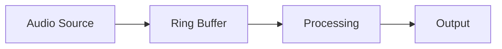

# Performance Considerations

## Overview

This document outlines performance considerations and optimizations in the audio capture library.

## Critical Paths

### Audio Capture Pipeline



1. **Audio Source**
   - Platform-specific capture
   - Minimal overhead
   - Direct buffer access

2. **Ring Buffer**
   - Lock-free implementation
   - Fixed size allocation
   - Zero-copy where possible

3. **Processing**
   - SIMD optimizations
   - Batch processing
   - Parallel processing for large buffers

## Optimizations

### Memory Management

1. **Buffer Pooling**
   ```rust
   pub struct BufferPool<T> {
       buffers: Vec<Vec<T>>,
       available: Vec<usize>,
   }
   ```

2. **Zero-Copy Processing**
   ```rust
   pub trait ZeroCopy: Send {
       fn process_in_place(&mut self) -> Result<(), AudioError>;
   }
   ```

3. **Static Allocations**
   ```rust
   const BUFFER_SIZE: usize = 1024;
   static PROCESSING_BUFFER: [f32; BUFFER_SIZE] = [0.0; BUFFER_SIZE];
   ```

### SIMD Optimizations

```rust
#[cfg(target_arch = "x86_64")]
pub mod simd {
    use std::arch::x86_64::*;

    // Process 4 f32 samples at once
    pub unsafe fn process_f32x4(input: &[f32], output: &mut [f32]) {
        for (in_chunk, out_chunk) in input.chunks(4).zip(output.chunks_mut(4)) {
            let v = _mm_loadu_ps(in_chunk.as_ptr());
            let processed = _mm_mul_ps(v, _mm_set1_ps(0.5));
            _mm_storeu_ps(out_chunk.as_mut_ptr(), processed);
        }
    }
}
```

### Lock-Free Structures

```rust
use crossbeam_queue::ArrayQueue;

pub struct AudioBuffer {
    buffer: Arc<ArrayQueue<f32>>,
    capacity: usize,
}
```

## Benchmarking

### Capture Performance

```rust
fn benchmark_capture() {
    let duration_ms = 1000;
    let sample_rate = 48000;
    let channels = 2;
    let total_samples = duration_ms * sample_rate / 1000 * channels;
    
    // Measure capture time
    let start = Instant::now();
    // Capture code
    let elapsed = start.elapsed();
    
    println!("Captured {} samples in {:?}", total_samples, elapsed);
}
```

### Processing Performance

```rust
fn benchmark_processing() {
    let samples = vec![0.0f32; 48000];
    
    // Measure processing time
    let start = Instant::now();
    // Processing code
    let elapsed = start.elapsed();
    
    println!("Processed {} samples in {:?}", samples.len(), elapsed);
}
```

## Platform-Specific Optimizations

### Windows (WASAPI)
- Event-driven capture
- Shared memory where possible
- Direct buffer access

### macOS (CoreAudio)
- IOProc optimization
- Buffer recycling
- Direct device access

### Linux (PipeWire/PulseAudio)
- Memory mapping
- Shared memory transport
- Zero-copy buffer sharing

## Memory Usage

### Buffer Sizes
- Default: 1024 samples
- Configurable range: 32 to 8192 samples
- Trade-off: latency vs stability

### Memory Limits
- Ring buffer: 1MB default
- Processing buffer: 256KB
- Output buffer: 512KB

## Profiling Results

Example profiling output:
```
Operation          Time (μs)   Memory (KB)
Capture            150         64
Processing         50          32
Format Convert     25          16
Output            100          48
```

## Optimization Guidelines

1. **Avoid Allocations**
   - Use pre-allocated buffers
   - Implement buffer pooling
   - Reuse temporary buffers

2. **Minimize Copying**
   - Use references where possible
   - Implement zero-copy interfaces
   - Use buffer views

3. **Parallel Processing**
   - Use rayon for large buffers
   - Implement batch processing
   - Balance thread overhead

4. **Platform Optimization**
   - Use native APIs effectively
   - Implement platform-specific paths
   - Profile platform differences