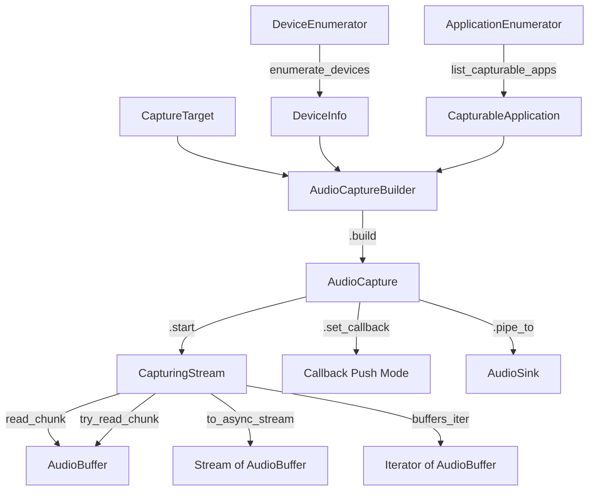
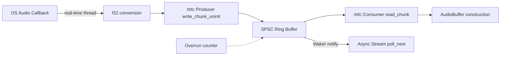

# Canonical Public API Design — `rsac` (Rust Cross-Platform Audio Capture)

> **Status:** Design Document — Subtask B1  
> **Priority Order:** Correctness → UX → Breadth  
> **Guiding Principle:** Streaming-first, pull-model with ring-buffer bridge from OS callbacks

---

## Table of Contents

1. [Design Overview](#1-design-overview)
2. [Error Handling](#2-error-handling)
3. [CaptureTarget — Unified Target Model](#3-capturetarget--unified-target-model)
4. [AudioFormat and StreamConfig](#4-audioformat-and-streamconfig)
5. [AudioCaptureBuilder](#5-audiocapturebuilder)
6. [AudioCapture — Lifecycle Manager](#6-audiocapture--lifecycle-manager)
7. [CapturingStream — The Core Streaming Trait](#7-capturingstream--the-core-streaming-trait)
8. [AudioBuffer — Data Container](#8-audiobuffer--data-container)
9. [DeviceEnumerator Trait](#9-deviceenumerator-trait)
10. [ApplicationEnumerator Trait](#10-applicationenumerator-trait)
11. [Streaming Consumption Modes](#11-streaming-consumption-modes)
12. [AudioSink Trait — Downstream Consumers](#12-audiosink-trait--downstream-consumers)
13. [Public Exports and Prelude](#13-public-exports-and-prelude)
14. [Platform Mapping Notes](#14-platform-mapping-notes)
15. [Ring Buffer Bridge Architecture](#15-ring-buffer-bridge-architecture)
16. [Design Rationale](#16-design-rationale)
17. [Migration from Current API](#17-migration-from-current-api)

---

## 1. Design Overview



The canonical API follows a **builder → session → stream** pipeline:

1. **Configure** via `AudioCaptureBuilder` with a `CaptureTarget`
2. **Build** to get an `AudioCapture` session — validates config, resolves platform resources
3. **Start** to activate the OS audio pipeline
4. **Consume** audio via pull, async, iterator, callback, or sink adapters
5. **Stop/Drop** to release all resources

### Thread Safety Contract

All public types are `Send + Sync`. The library never requires the user to interact on a specific thread.

---

## 2. Error Handling

### AudioError

```rust
/// The canonical error type for all audio operations.
#[derive(Debug, Clone, thiserror::Error)]
pub enum AudioError {
    // === Configuration Errors (fail at build time) ===
    
    #[error("invalid configuration: {0}")]
    InvalidConfig(String),
    
    #[error("unsupported sample rate: {rate} Hz")]
    UnsupportedSampleRate { rate: u32 },
    
    #[error("unsupported audio format: {0}")]
    UnsupportedFormat(String),

    // === Device/Target Errors (fail at build or start time) ===
    
    #[error("device not found: {0}")]
    DeviceNotFound(String),
    
    #[error("application not found: {0}")]
    ApplicationNotFound(String),
    
    #[error("device busy: {0}")]
    DeviceBusy(String),

    // === Runtime Errors (fail during streaming) ===
    
    #[error("stream not started")]
    StreamNotStarted,
    
    #[error("stream already running")]
    StreamAlreadyRunning,
    
    #[error("stream closed")]
    StreamClosed,
    
    #[error("buffer overrun: consumer too slow")]
    BufferOverrun,
    
    #[error("timeout waiting for audio data")]
    Timeout,

    // === Platform Errors ===
    
    #[error("platform not supported: {0}")]
    PlatformNotSupported(String),
    
    #[error("backend error: {0}")]
    Backend(String),
    
    #[error("permission denied: {0}")]
    PermissionDenied(String),
    
    // === Generic ===
    
    #[error("I/O error: {0}")]
    Io(String),
}

/// Result alias used throughout the library.
pub type AudioResult<T> = Result<T, AudioError>;
```

### Design Rationale

- **`thiserror`-derived**: automatic `Display`, `Error` impls without boilerplate.
- **Category-separated variants**: users can match on config vs runtime vs platform errors.
- **String payloads** instead of boxes: `Clone` is required for `AudioError` to be usable across thread boundaries without `Arc`. Platform backends wrap their native errors into the `Backend` variant.
- **Removed redundancy**: the current codebase has overlapping variants like `DeviceNotFound` / `DeviceNotFoundError`, `Timeout` / `TimeoutError`. The new design deduplicates.

---

## 3. CaptureTarget — Unified Target Model

```rust
/// Specifies what audio to capture.
///
/// This is the single entry point for all capture targeting decisions.
/// The builder resolves a `CaptureTarget` to the correct platform mechanism.
#[derive(Debug, Clone, PartialEq, Eq, Hash)]
pub enum CaptureTarget {
    /// Capture the default system audio output (loopback).
    ///
    /// - **Windows:** WASAPI loopback on the default render endpoint
    /// - **Linux:** PipeWire monitor of the default sink
    /// - **macOS:** CoreAudio aggregate device with process tap (all processes)
    SystemDefault,

    /// Capture from a specific audio device by its platform-specific ID.
    ///
    /// The `id` is an opaque string obtained from `DeviceEnumerator`.
    ///
    /// - **Windows:** WASAPI endpoint ID string
    /// - **Linux:** PipeWire node ID (as string, e.g., "42")
    /// - **macOS:** CoreAudio AudioDeviceID (as string)
    Device { id: String },

    /// Capture audio from a specific application by its process ID.
    ///
    /// - **Windows:** WASAPI Process Loopback Capture (Win10 21H1+)
    /// - **Linux:** PipeWire monitor stream targeting the application's node
    /// - **macOS:** CoreAudio Process Tap with CATapDescription targeting the PID
    Application { pid: u32 },

    /// Capture audio from a specific application by its executable name.
    ///
    /// The library resolves the name to a PID at build time. If multiple processes
    /// match, the first active audio producer is selected.
    ///
    /// - **Windows:** Resolves via WASAPI audio session enumeration
    /// - **Linux:** Resolves via PipeWire node properties (application.name)
    /// - **macOS:** Resolves via NSRunningApplication / process list
    ApplicationByName { name: String },

    /// Capture audio from a process and all its child processes.
    ///
    /// - **Windows:** WASAPI Process Loopback with `PROCESS_LOOPBACK_MODE_INCLUDE_TARGET_PROCESS_TREE`
    /// - **Linux:** PipeWire monitors for root PID + children discovered via /proc
    /// - **macOS:** CoreAudio Process Tap with multiple PIDs in CATapDescription
    ProcessTree { root_pid: u32 },
}

impl Default for CaptureTarget {
    fn default() -> Self {
        CaptureTarget::SystemDefault
    }
}
```

### Platform Mapping Table

| CaptureTarget | Windows (WASAPI) | Linux (PipeWire) | macOS (CoreAudio) |
|---|---|---|---|
| `SystemDefault` | Loopback on default render endpoint | Monitor of default sink | Process Tap with all-process aggregate device |
| `Device { id }` | Endpoint by ID | PipeWire node by serial/ID | AudioDevice by AudioDeviceID |
| `Application { pid }` | Process Loopback Capture | Monitor stream on app node | Process Tap targeting PID via CATapDescription |
| `ApplicationByName` | Resolve via audio session enumeration → Process Loopback | Resolve via `application.name` property → monitor | NSRunningApplication lookup → Process Tap |
| `ProcessTree { root_pid }` | Process Loopback with tree mode | Multiple monitors (root + children via /proc) | Process Tap with multiple PIDs |

---

## 4. AudioFormat and StreamConfig

### SampleFormat (simplified)

```rust
/// Specifies the format of audio samples in an AudioBuffer.
///
/// The canonical API normalizes all audio to f32 internally.
/// This enum describes what the user *requests* or what the OS *provides*.
#[derive(Debug, Clone, Copy, PartialEq, Eq, Hash, Default)]
pub enum SampleFormat {
    /// Signed 16-bit integer, native endian
    I16,
    /// Signed 24-bit integer (packed in 32 bits), native endian
    I24,
    /// Signed 32-bit integer, native endian
    I32,
    /// 32-bit float, native endian — the canonical internal format
    #[default]
    F32,
}
```

### AudioFormat

```rust
/// Describes the format of an audio stream.
#[derive(Debug, Clone, PartialEq, Eq, Hash)]
pub struct AudioFormat {
    /// Samples per second (e.g., 44100, 48000)
    pub sample_rate: u32,
    /// Number of channels (1 = mono, 2 = stereo)
    pub channels: u16,
    /// Sample format
    pub sample_format: SampleFormat,
}

impl Default for AudioFormat {
    fn default() -> Self {
        AudioFormat {
            sample_rate: 48000,
            channels: 2,
            sample_format: SampleFormat::F32,
        }
    }
}
```

### StreamConfig

```rust
/// Configuration for how the audio stream operates.
#[derive(Debug, Clone, PartialEq, Eq)]
pub struct StreamConfig {
    /// Desired audio format. If `None`, the device's native format is used.
    pub format: Option<AudioFormat>,

    /// Preferred buffer size in frames. If `None`, the backend chooses.
    /// Smaller = lower latency, higher CPU. Typical: 256–4096 frames.
    pub buffer_size_frames: Option<u32>,

    /// Size of the internal ring buffer (in frames) bridging OS callbacks
    /// to the consumer. Default: 16384. Must be > buffer_size_frames.
    pub ring_buffer_frames: Option<u32>,
}

impl Default for StreamConfig {
    fn default() -> Self {
        StreamConfig {
            format: None,  // Use device native format
            buffer_size_frames: None,  // Backend default
            ring_buffer_frames: None,  // Library default (16384)
        }
    }
}
```

### Design Rationale — Simplified SampleFormat

The current codebase has 18 `SampleFormat` variants encoding endianness. This is unnecessary complexity because:

1. Audio buffers in the canonical API are always `Vec<f32>` (native endian).
2. Endianness is a serialization concern (file writing), not an API concern.
3. Users should specify the *logical* format; the backend handles conversion.

The `bits_per_sample` field is **removed** — it is fully determined by `SampleFormat`.

---

## 5. AudioCaptureBuilder

```rust
/// Builder for constructing an AudioCapture session.
///
/// Follows the builder pattern. All fields have sensible defaults.
/// At minimum, only a `CaptureTarget` is needed — everything else
/// has defaults that work for most use cases.
///
/// # Examples
///
/// ```rust
/// use rsac::prelude::*;
///
/// // Minimal: capture system audio with platform defaults
/// let capture = AudioCaptureBuilder::new()
///     .build()?;
///
/// // Capture a specific application by PID
/// let capture = AudioCaptureBuilder::new()
///     .target(CaptureTarget::Application { pid: 12345 })
///     .build()?;
///
/// // Fully configured capture
/// let capture = AudioCaptureBuilder::new()
///     .target(CaptureTarget::ApplicationByName {
///         name: "firefox".into(),
///     })
///     .sample_rate(48000)
///     .channels(2)
///     .sample_format(SampleFormat::F32)
///     .buffer_size(1024)
///     .build()?;
/// ```
#[derive(Debug, Clone)]
pub struct AudioCaptureBuilder {
    target: CaptureTarget,
    sample_rate: Option<u32>,
    channels: Option<u16>,
    sample_format: Option<SampleFormat>,
    buffer_size_frames: Option<u32>,
    ring_buffer_frames: Option<u32>,
}

impl Default for AudioCaptureBuilder {
    fn default() -> Self {
        Self::new()
    }
}

impl AudioCaptureBuilder {
    /// Creates a new builder targeting SystemDefault.
    pub fn new() -> Self {
        AudioCaptureBuilder {
            target: CaptureTarget::SystemDefault,
            sample_rate: None,
            channels: None,
            sample_format: None,
            buffer_size_frames: None,
            ring_buffer_frames: None,
        }
    }

    /// Sets what audio to capture.
    pub fn target(mut self, target: CaptureTarget) -> Self {
        self.target = target;
        self
    }

    /// Sets the desired sample rate in Hz.
    ///
    /// Common values: 44100, 48000, 96000.
    /// If not set, the device's native sample rate is used.
    pub fn sample_rate(mut self, rate: u32) -> Self {
        self.sample_rate = Some(rate);
        self
    }

    /// Sets the desired number of channels.
    ///
    /// If not set, the device's native channel count is used.
    pub fn channels(mut self, channels: u16) -> Self {
        self.channels = Some(channels);
        self
    }

    /// Sets the desired sample format.
    ///
    /// If not set, defaults to `SampleFormat::F32`.
    pub fn sample_format(mut self, format: SampleFormat) -> Self {
        self.sample_format = Some(format);
        self
    }

    /// Sets the preferred buffer size in frames for OS-level callbacks.
    ///
    /// Smaller buffers = lower latency, higher CPU. The backend may choose
    /// a different size if the requested size is not supported.
    pub fn buffer_size(mut self, frames: u32) -> Self {
        self.buffer_size_frames = Some(frames);
        self
    }

    /// Sets the ring buffer capacity (in frames) for the internal SPSC buffer.
    ///
    /// This controls how much audio data can be buffered between the OS callback
    /// thread and the consumer. Default: 16384 frames (~341ms at 48kHz).
    /// Increase if the consumer is bursty.
    pub fn ring_buffer_size(mut self, frames: u32) -> Self {
        self.ring_buffer_frames = Some(frames);
        self
    }

    /// Validates configuration and creates an AudioCapture session.
    ///
    /// ## Validation performed at build time:
    /// - `sample_rate` must be in {8000, 11025, 16000, 22050, 32000, 44100, 48000, 88200, 96000, 176400, 192000} if set
    /// - `channels` must be 1..=32 if set
    /// - `buffer_size_frames` must be 16..=65536 if set
    /// - `ring_buffer_frames` must be > `buffer_size_frames` if both are set
    /// - `CaptureTarget::Application { pid }` — PID existence is checked
    /// - `CaptureTarget::ApplicationByName { name }` — resolution to PID is attempted
    /// - `CaptureTarget::Device { id }` — device existence is validated
    ///
    /// ## Validation deferred to start time:
    /// - Device format support (the device might negotiate a different format)
    /// - OS permission checks (macOS Process Tap permissions)
    /// - Hardware availability (device may become unavailable between build and start)
    ///
    /// # Errors
    ///
    /// Returns `AudioError::InvalidConfig` for parameter validation failures.
    /// Returns `AudioError::DeviceNotFound` or `AudioError::ApplicationNotFound`
    /// if the target cannot be resolved.
    pub fn build(self) -> AudioResult<AudioCapture> {
        // ... validation and platform resource resolution ...
    }
}
```

### Key Design Decisions

1. **`CaptureTarget` replaces `DeviceSelector` + `target_application_pid` + `target_application_session_identifier`** — one unified concept instead of three partially-overlapping fields.
2. **All fields except `target` are optional** — the builder defaults to `SystemDefault` capture with native device settings. This eliminates the current API's requirement to specify `sample_rate`, `channels`, `sample_format`, and `bits_per_sample` before you can build.
3. **`bits_per_sample` is removed** — `SampleFormat` already encodes this information.
4. **Session identifier removed** — Windows session IDs are not user-facing; PID is sufficient.

---

## 6. AudioCapture — Lifecycle Manager

```rust
/// An active audio capture session.
///
/// Created by `AudioCaptureBuilder::build()`. Controls the lifecycle of
/// audio capture and provides access to the audio data stream.
///
/// # Lifecycle
///
/// ```text
/// Builder → build() → AudioCapture (Created)
///                        │
///                        ├─ start() → AudioCapture (Running)
///                        │              │
///                        │              ├─ stream() → &dyn CapturingStream
///                        │              ├─ read_chunk() → AudioBuffer
///                        │              ├─ async_stream() → Stream<AudioBuffer>
///                        │              ├─ buffers_iter() → Iterator<AudioBuffer>
///                        │              │
///                        │              └─ stop() → AudioCapture (Stopped)
///                        │                           │
///                        │                           └─ start() → (can restart)
///                        │
///                        └─ drop → (automatic cleanup)
/// ```
///
/// # Thread Safety
///
/// `AudioCapture` is `Send + Sync`. All methods take `&self` where possible,
/// using interior mutability for state management.
///
/// # Examples
///
/// ```rust
/// use rsac::prelude::*;
///
/// let capture = AudioCaptureBuilder::new()
///     .target(CaptureTarget::SystemDefault)
///     .build()?;
///
/// capture.start()?;
///
/// // Pull mode
/// while let Some(buffer) = capture.read_chunk(Duration::from_millis(100))? {
///     process_audio(&buffer);
/// }
///
/// capture.stop()?;
/// ```
pub struct AudioCapture {
    // -- Internal fields (not public) --
    config: ResolvedConfig,
    target: CaptureTarget,
    state: Arc<AtomicState>,        // Created | Running | Stopped | Closed
    stream: Mutex<Option<Box<dyn CapturingStream>>>,
    // Platform-specific device handle (type-erased)
    device_handle: Box<dyn Any + Send + Sync>,
}

// Marker: AudioCapture is Send + Sync
unsafe impl Send for AudioCapture {}
unsafe impl Sync for AudioCapture {}

/// The resolved and validated configuration, available after build().
#[derive(Debug, Clone)]
pub struct ResolvedConfig {
    /// The capture target that was requested.
    pub target: CaptureTarget,
    /// The actual audio format that will be used (may differ from requested).
    pub format: AudioFormat,
    /// The actual buffer size in frames.
    pub buffer_size_frames: u32,
    /// The ring buffer size in frames.
    pub ring_buffer_frames: u32,
}

impl AudioCapture {
    /// Returns the resolved configuration for this capture session.
    pub fn config(&self) -> &ResolvedConfig { ... }

    /// Returns the capture target.
    pub fn target(&self) -> &CaptureTarget { ... }

    /// Returns `true` if the capture stream is currently running.
    pub fn is_running(&self) -> bool { ... }

    /// Starts the audio capture.
    ///
    /// Creates the platform-specific stream and begins filling the ring buffer.
    /// After this call, audio data is available via `read_chunk()`,
    /// `async_stream()`, `buffers_iter()`, or a registered callback.
    ///
    /// Can be called after `stop()` to restart capture.
    ///
    /// # Errors
    ///
    /// - `AudioError::StreamAlreadyRunning` if already started
    /// - `AudioError::Backend(...)` if the OS stream cannot be created
    /// - `AudioError::PermissionDenied(...)` on macOS if Process Tap is denied
    pub fn start(&self) -> AudioResult<()> { ... }

    /// Stops audio capture.
    ///
    /// The OS audio pipeline is torn down and the ring buffer is drained.
    /// The session can be restarted with `start()`.
    ///
    /// No-op if already stopped.
    pub fn stop(&self) -> AudioResult<()> { ... }

    /// Reads the next chunk of audio data, blocking up to `timeout`.
    ///
    /// Convenience method that delegates to the internal `CapturingStream`.
    ///
    /// # Returns
    ///
    /// - `Ok(Some(buffer))` — audio data available
    /// - `Ok(None)` — timeout elapsed, no data
    /// - `Err(AudioError::StreamNotStarted)` — `start()` not called
    /// - `Err(AudioError::StreamClosed)` — stream was closed/dropped
    pub fn read_chunk(&self, timeout: Duration) -> AudioResult<Option<AudioBuffer>> { ... }

    /// Attempts to read audio data without blocking.
    ///
    /// # Returns
    ///
    /// - `Ok(Some(buffer))` — data was available
    /// - `Ok(None)` — no data currently available (try again later)
    /// - `Err(...)` — stream error
    pub fn try_read_chunk(&self) -> AudioResult<Option<AudioBuffer>> { ... }

    /// Returns an async stream of audio buffers.
    ///
    /// The stream yields `AudioResult<AudioBuffer>` items. It completes
    /// when `stop()` is called or the capture session is dropped.
    ///
    /// Requires the stream to be started.
    ///
    /// # Example
    ///
    /// ```rust
    /// use futures_util::StreamExt;
    ///
    /// let capture = AudioCaptureBuilder::new().build()?;
    /// capture.start()?;
    ///
    /// let mut stream = capture.async_stream()?;
    /// while let Some(result) = stream.next().await {
    ///     let buffer = result?;
    ///     println!("Got {} frames", buffer.num_frames());
    /// }
    /// ```
    pub fn async_stream(&self) -> AudioResult<AudioStream> { ... }

    /// Returns a blocking iterator over audio buffers.
    ///
    /// Each call to `next()` blocks until data is available.
    /// The iterator terminates when `stop()` is called.
    ///
    /// # Example
    ///
    /// ```rust
    /// let capture = AudioCaptureBuilder::new().build()?;
    /// capture.start()?;
    ///
    /// for result in capture.buffers_iter() {
    ///     let buffer = result?;
    ///     println!("Got {} frames", buffer.num_frames());
    /// }
    /// ```
    pub fn buffers_iter(&self) -> AudioBufferIterator { ... }

    /// Registers a callback invoked on each audio buffer.
    ///
    /// The callback runs on a dedicated thread, not the OS audio callback thread.
    /// Only one callback can be active at a time; setting a new one replaces the old.
    ///
    /// The callback must be registered *before* calling `start()`.
    ///
    /// # Example
    ///
    /// ```rust
    /// let capture = AudioCaptureBuilder::new().build()?;
    ///
    /// capture.set_callback(|buffer: &AudioBuffer| {
    ///     let rms = compute_rms(buffer.samples());
    ///     println!("RMS level: {:.4}", rms);
    /// })?;
    ///
    /// capture.start()?;
    /// ```
    pub fn set_callback<F>(&self, callback: F) -> AudioResult<()>
    where
        F: FnMut(&AudioBuffer) + Send + 'static,
    { ... }

    /// Removes the currently registered callback, if any.
    pub fn clear_callback(&self) -> AudioResult<()> { ... }

    /// Pipes all captured audio to the given sink.
    ///
    /// The sink runs on a dedicated thread. Audio is read from the ring buffer
    /// and forwarded to the sink's `write()` method.
    ///
    /// Must be configured *before* calling `start()`.
    ///
    /// # Example
    ///
    /// ```rust
    /// use rsac::sink::WavFileSink;
    ///
    /// let capture = AudioCaptureBuilder::new().build()?;
    /// let sink = WavFileSink::new("output.wav")?;
    /// capture.pipe_to(sink)?;
    /// capture.start()?;
    /// // ... audio is written to output.wav ...
    /// capture.stop()?; // finalizes the WAV file
    /// ```
    pub fn pipe_to<S: AudioSink + 'static>(&self, sink: S) -> AudioResult<()> { ... }
}

impl Drop for AudioCapture {
    fn drop(&mut self) {
        // Stop stream if running, close OS resources.
        // Errors are logged, not propagated (cannot panic in Drop).
    }
}
```

### Key Design Decisions

1. **`&self` methods** — `start()`, `stop()`, `read_chunk()` all take `&self` using interior mutability. This makes `AudioCapture` shareable across threads without external `Mutex`.
2. **No mutual exclusivity enforcement** — the current API has complex `is_internally_processing` / `is_externally_streaming` flags. In the new design, the ring buffer is the single source of truth. Multiple consumers (callback + read_chunk) can coexist by each getting their own view, or the library can document that only one consumption mode should be used at a time.
3. **Restartable** — `stop()` + `start()` is allowed. The stream is re-created on each `start()`.
4. **`AudioCapture` is not generic** — unlike the current `AudioCapture` which stores `Box<dyn AudioDevice<DeviceId = String>>`, the new design uses `Box<dyn Any + Send + Sync>` for the platform handle, keeping the public type concrete and simple.

---

## 7. CapturingStream — The Core Streaming Trait

```rust
/// The core trait for reading captured audio data.
///
/// `CapturingStream` is the bridge between OS audio callbacks and the user.
/// It is implemented by platform-specific backends and exposed via `AudioCapture`.
///
/// All implementations must be `Send + Sync`.
///
/// # Consumption Model
///
/// The stream operates on a **pull model**: the consumer calls `read_chunk()` or
/// `try_read_chunk()` to retrieve audio data. Internally, the OS pushes audio
/// into a lock-free SPSC ring buffer; these methods read from the consumer side.
pub trait CapturingStream: Send + Sync {
    /// Starts the audio stream. OS audio callbacks begin filling the ring buffer.
    fn start(&self) -> AudioResult<()>;

    /// Stops the audio stream. OS audio callbacks are halted.
    /// The ring buffer retains any unread data.
    fn stop(&self) -> AudioResult<()>;

    /// Closes the stream and releases all OS resources.
    ///
    /// After `close()`, the stream cannot be restarted. Any subsequent
    /// method calls return `AudioError::StreamClosed`.
    fn close(&mut self) -> AudioResult<()>;

    /// Returns `true` if the stream is currently capturing audio.
    fn is_running(&self) -> bool;

    /// Reads the next chunk of audio data, blocking up to `timeout`.
    ///
    /// # Arguments
    /// * `timeout` — Maximum time to wait for data. Use `Duration::ZERO` for
    ///   non-blocking behavior (equivalent to `try_read_chunk()`).
    ///
    /// # Returns
    /// * `Ok(Some(buffer))` — Audio data is available.
    /// * `Ok(None)` — Timeout elapsed with no data available.
    /// * `Err(AudioError::StreamNotStarted)` — Stream not started.
    /// * `Err(AudioError::StreamClosed)` — Stream was closed.
    /// * `Err(AudioError::BufferOverrun)` — Data was lost due to slow consumption.
    fn read_chunk(&self, timeout: Duration) -> AudioResult<Option<AudioBuffer>>;

    /// Attempts to read audio data without blocking.
    ///
    /// Equivalent to `read_chunk(Duration::ZERO)`.
    ///
    /// # Returns
    /// * `Ok(Some(buffer))` — Data was available.
    /// * `Ok(None)` — No data currently available.
    fn try_read_chunk(&self) -> AudioResult<Option<AudioBuffer>> {
        self.read_chunk(Duration::ZERO)
    }

    /// Returns an async `Stream` that yields audio buffers.
    ///
    /// The returned stream is woken via a `Waker` registered with the ring buffer.
    /// When the OS callback writes data and the consumer side has a pending waker,
    /// the waker is notified, causing the async runtime to poll for the next item.
    ///
    /// The stream yields `Err(...)` on errors and terminates when the
    /// capturing stream is stopped or closed.
    fn to_async_stream(&self) -> AudioResult<
        Pin<Box<dyn Stream<Item = AudioResult<AudioBuffer>> + Send + '_>>
    >;

    /// Returns the actual audio format being produced by the stream.
    ///
    /// This may differ from the requested format if the backend negotiated
    /// a different format with the OS.
    fn format(&self) -> &AudioFormat;

    /// Returns estimated latency in frames, if available.
    fn latency_frames(&self) -> Option<u64>;
}
```

### Changes from Current CapturingStream

| Current | New | Rationale |
|---|---|---|
| `read_chunk(&mut self, timeout_ms: Option<u32>)` | `read_chunk(&self, timeout: Duration)` | `&self` for thread safety; `Duration` is idiomatic Rust |
| `to_async_stream(&mut self)` returns `+ Sync + 'a` | `to_async_stream(&self)` returns `+ Send + '_` | `Sync` on async streams is unusual; `Send` suffices for cross-task usage |
| No `try_read_chunk` | Added `try_read_chunk(&self)` | Explicit non-blocking path with default impl |
| No `format()` method | Added `format(&self) -> &AudioFormat` | Consumers need to know the actual format |
| `start(&mut self)` | `start(&self)` | Interior mutability — allows shared access |

---

## 8. AudioBuffer — Data Container

```rust
/// A chunk of captured audio data with metadata.
///
/// Audio samples are always stored as interleaved `f32` values.
/// platform backends convert from native formats (i16, i24, i32) to f32.
///
/// # Memory Model
///
/// `AudioBuffer` owns its sample data (`Vec<f32>`). When reading from the
/// ring buffer, samples are copied into a new `Vec`. This ensures the buffer
/// is safe to send across threads and hold indefinitely.
///
/// For zero-copy access within a processing callback, use `AudioBufferRef`.
#[derive(Debug, Clone)]
pub struct AudioBuffer {
    /// Interleaved f32 audio samples.
    samples: Vec<f32>,
    /// Audio format describing this buffer's data.
    format: AudioFormat,
    /// Timestamp: offset from stream start, in frames.
    /// Monotonically increasing.
    frame_offset: u64,
    /// Wall-clock timestamp when this buffer was captured by the OS.
    /// `None` if the platform does not provide timestamps.
    timestamp: Option<Duration>,
    /// Sequence number for detecting gaps/overruns.
    sequence: u64,
}

impl AudioBuffer {
    // === Construction ===

    /// Creates a new AudioBuffer.
    pub fn new(
        samples: Vec<f32>,
        format: AudioFormat,
        frame_offset: u64,
        timestamp: Option<Duration>,
        sequence: u64,
    ) -> Self { ... }

    // === Sample Access ===

    /// Returns the raw interleaved sample data as a slice.
    pub fn samples(&self) -> &[f32] { &self.samples }

    /// Returns the raw interleaved sample data as a mutable slice.
    pub fn samples_mut(&mut self) -> &mut [f32] { &mut self.samples }

    /// Consumes the buffer and returns the owned sample data.
    pub fn into_samples(self) -> Vec<f32> { self.samples }

    // === Metadata ===

    /// Returns the audio format of this buffer.
    pub fn format(&self) -> &AudioFormat { &self.format }

    /// Returns the number of channels.
    pub fn channels(&self) -> u16 { self.format.channels }

    /// Returns the sample rate in Hz.
    pub fn sample_rate(&self) -> u32 { self.format.sample_rate }

    /// Returns the number of audio frames in this buffer.
    /// One frame = one sample per channel.
    pub fn num_frames(&self) -> usize {
        if self.format.channels == 0 { 0 }
        else { self.samples.len() / self.format.channels as usize }
    }

    /// Returns the number of individual samples (frames × channels).
    pub fn num_samples(&self) -> usize { self.samples.len() }

    /// Returns the duration of audio in this buffer.
    pub fn duration(&self) -> Duration {
        Duration::from_secs_f64(
            self.num_frames() as f64 / self.format.sample_rate as f64
        )
    }

    /// Returns the frame offset from stream start.
    pub fn frame_offset(&self) -> u64 { self.frame_offset }

    /// Returns the capture timestamp, if available.
    pub fn timestamp(&self) -> Option<Duration> { self.timestamp }

    /// Returns the sequence number. Gaps in sequence numbers
    /// indicate dropped buffers (overruns).
    pub fn sequence(&self) -> u64 { self.sequence }

    // === Channel Access ===

    /// Returns samples for a specific channel (0-indexed).
    ///
    /// Returns an iterator that yields every Nth sample where N = channels.
    pub fn channel(&self, channel: u16) -> impl Iterator<Item = f32> + '_ {
        let ch = channel as usize;
        let num_ch = self.format.channels as usize;
        self.samples.iter()
            .skip(ch)
            .step_by(num_ch)
            .copied()
    }

    /// Returns `true` if all samples are zero (silence).
    pub fn is_silent(&self) -> bool {
        self.samples.iter().all(|&s| s == 0.0)
    }
}

// AudioBuffer is trivially Send + Sync (Vec<f32> is Send + Sync)
```

### AudioBufferRef — Zero-Copy Access (Future Extension)

```rust
/// A borrowed view of audio data, avoiding allocation.
///
/// Used in performance-critical paths like OS callbacks or processing chains.
/// Cannot be sent across threads or stored beyond the callback scope.
pub struct AudioBufferRef<'a> {
    samples: &'a [f32],
    format: &'a AudioFormat,
    frame_offset: u64,
    timestamp: Option<Duration>,
    sequence: u64,
}

impl<'a> AudioBufferRef<'a> {
    /// Copies the data into an owned AudioBuffer.
    pub fn to_owned(&self) -> AudioBuffer { ... }

    // Same accessor methods as AudioBuffer (samples, format, etc.)
}
```

### Changes from Current AudioBuffer

| Current | New | Rationale |
|---|---|---|
| Public `data: Vec<f32>` field | Private `samples` with `samples()` accessor | Encapsulation; prevents accidental replacement |
| Separate `channels`, `sample_rate`, `format` fields | Single `format: AudioFormat` + derived accessors | Avoids duplication; format is the canonical source |
| `timestamp: Duration` (always present) | `timestamp: Option<Duration>` | Not all platforms provide timestamps |
| No `frame_offset` | Added `frame_offset: u64` | Critical for gap detection and timing |
| No `sequence` | Added `sequence: u64` | Enables overrun detection |
| `unsafe impl Send/Sync` | Not needed (`Vec<f32>` is auto Send+Sync) | Current unsafe impls are unnecessary |

---

## 9. DeviceEnumerator Trait

```rust
/// Information about an audio device.
#[derive(Debug, Clone)]
pub struct DeviceInfo {
    /// Unique platform-specific device ID.
    /// Use this value in `CaptureTarget::Device { id }`.
    pub id: String,

    /// Human-readable device name.
    pub name: String,

    /// Whether this is an input, output, or loopback device.
    pub kind: DeviceKind,

    /// Whether this device is the system default for its kind.
    pub is_default: bool,

    /// Native audio format, if known.
    pub default_format: Option<AudioFormat>,

    /// All supported formats, if enumerable.
    pub supported_formats: Vec<AudioFormat>,

    /// Whether the device is currently active/connected.
    pub is_active: bool,
}

/// Device direction/role.
#[derive(Debug, Clone, Copy, PartialEq, Eq, Hash)]
pub enum DeviceKind {
    /// Input device (microphone, line-in)
    Input,
    /// Output device (speakers, headphones)
    Output,
    /// Loopback/monitor (captures output audio)
    Loopback,
}

/// Trait for enumerating audio devices on the system.
///
/// Platform backends implement this trait. The user obtains an implementation
/// via `enumerate_devices()` (free function) or `DeviceEnumerator::new()`.
pub trait DeviceEnumerator: Send + Sync {
    /// Lists all available audio devices.
    fn enumerate_devices(&self) -> AudioResult<Vec<DeviceInfo>>;

    /// Returns the default input device, if any.
    fn default_input(&self) -> AudioResult<Option<DeviceInfo>>;

    /// Returns the default output device, if any.
    fn default_output(&self) -> AudioResult<Option<DeviceInfo>>;

    /// Finds a device by its ID.
    fn device_by_id(&self, id: &str) -> AudioResult<Option<DeviceInfo>>;

    /// Finds devices matching a name pattern (case-insensitive substring).
    fn devices_by_name(&self, pattern: &str) -> AudioResult<Vec<DeviceInfo>>;
}

/// Creates a platform-specific device enumerator.
///
/// # Example
///
/// ```rust
/// use rsac::enumerate_devices;
///
/// let enumerator = enumerate_devices()?;
/// for device in enumerator.enumerate_devices()? {
///     println!("{}: {} ({:?})", device.id, device.name, device.kind);
/// }
/// ```
pub fn enumerate_devices() -> AudioResult<Box<dyn DeviceEnumerator>> { ... }
```

### Changes from Current DeviceEnumerator

| Current | New | Rationale |
|---|---|---|
| Associated type `Device: AudioDevice` | Returns `DeviceInfo` (plain struct) | No more associated types = object-safe, no generic propagation |
| `AudioDevice` trait with many methods | Flat `DeviceInfo` struct | Simpler; devices are just data, not active objects |
| `get_device_by_id` takes `&<Self::Device as AudioDevice>::DeviceId` | `device_by_id(&self, id: &str)` | IDs are always strings in practice; removes the associated type |
| No name search | Added `devices_by_name()` | Common use case |

---

## 10. ApplicationEnumerator Trait

```rust
/// Information about a capturable application.
#[derive(Debug, Clone)]
pub struct CapturableApplication {
    /// The process ID. Use with `CaptureTarget::Application { pid }`.
    pub pid: u32,

    /// Application/process name.
    pub name: String,

    /// Whether the application is currently producing audio.
    pub is_producing_audio: bool,

    /// Platform-specific metadata.
    pub platform: PlatformAppInfo,
}

/// Platform-specific application metadata.
#[derive(Debug, Clone)]
pub enum PlatformAppInfo {
    /// No extra info available.
    Generic,

    /// Windows-specific info.
    Windows {
        /// Executable path.
        exe_path: Option<String>,
        /// Audio session identifier.
        session_id: Option<String>,
    },

    /// Linux-specific info (PipeWire).
    Linux {
        /// PipeWire node ID.
        node_id: Option<u32>,
        /// PipeWire media class (e.g., "Stream/Output/Audio").
        media_class: Option<String>,
        /// Application name reported by PipeWire.
        pipewire_app_name: Option<String>,
    },

    /// macOS-specific info.
    MacOS {
        /// Bundle identifier (e.g., "com.apple.Safari").
        bundle_id: Option<String>,
    },
}

/// Trait for discovering applications that can be captured.
pub trait ApplicationEnumerator: Send + Sync {
    /// Lists all applications currently producing audio.
    fn list_capturable(&self) -> AudioResult<Vec<CapturableApplication>>;

    /// Lists ALL running applications, whether or not they are producing audio.
    /// The `is_producing_audio` field indicates current audio status.
    fn list_all(&self) -> AudioResult<Vec<CapturableApplication>>;

    /// Finds a capturable application by PID.
    fn find_by_pid(&self, pid: u32) -> AudioResult<Option<CapturableApplication>>;

    /// Finds capturable applications by name (case-insensitive substring match).
    fn find_by_name(&self, pattern: &str) -> AudioResult<Vec<CapturableApplication>>;
}

/// Creates a platform-specific application enumerator.
///
/// # Example
///
/// ```rust
/// use rsac::enumerate_applications;
///
/// let enumerator = enumerate_applications()?;
/// for app in enumerator.list_capturable()? {
///     println!("PID {}: {} (producing audio: {})",
///         app.pid, app.name, app.is_producing_audio);
/// }
/// ```
pub fn enumerate_applications() -> AudioResult<Box<dyn ApplicationEnumerator>> { ... }
```

### Changes from Current Application Discovery

| Current | New | Rationale |
|---|---|---|
| `ApplicationCapture` trait (push-model `Fn(&[f32])`) | Removed — `AudioCapture` subsumes this role | Unified API; no separate capture trait for apps |
| `ApplicationCaptureFactory` | `enumerate_applications()` + `CaptureTarget::Application` | Factory is split: discovery vs capture |
| `ApplicationInfo` with `PlatformSpecificInfo` enum | `CapturableApplication` with `PlatformAppInfo` | Renamed for clarity; same concept |
| `AudioSourceDiscovery` class with hardcoded app lists | `ApplicationEnumerator` trait backed by real platform APIs | The current discovery module uses hardcoded app lists and mock data |

---

## 11. Streaming Consumption Modes

All modes operate on the same underlying ring buffer. They are not mutually exclusive in the new design — but using multiple consumers concurrently means they compete for the same data. The recommended usage is one primary consumer.

### 11.1 Pull/Sync — Blocking Read

```rust
// Read one chunk at a time with a timeout
let capture = AudioCaptureBuilder::new().build()?;
capture.start()?;

loop {
    match capture.read_chunk(Duration::from_millis(100))? {
        Some(buffer) => process(&buffer),
        None => {
            // Timeout — no data yet. Check if we should stop.
            if should_stop() { break; }
        }
    }
}

capture.stop()?;
```

### 11.2 Non-Blocking — Try Read

```rust
// Poll for data without blocking (useful in game loops, GUI event loops)
loop {
    if let Some(buffer) = capture.try_read_chunk()? {
        process(&buffer);
    }
    
    // Do other work...
    do_game_loop_tick();
}
```

### 11.3 Async — futures::Stream

```rust
use futures_util::StreamExt;

let capture = AudioCaptureBuilder::new().build()?;
capture.start()?;

let mut stream = capture.async_stream()?;
while let Some(result) = stream.next().await {
    let buffer = result?;
    process_async(&buffer).await;
}
```

### 11.4 Iterator — Sync Iteration

```rust
let capture = AudioCaptureBuilder::new().build()?;
capture.start()?;

// Blocking iterator — blocks on each next() until data arrives
for result in capture.buffers_iter() {
    let buffer = result?;
    process(&buffer);
}
```

### 11.5 Callback — Push Mode

```rust
let capture = AudioCaptureBuilder::new().build()?;

capture.set_callback(|buffer: &AudioBuffer| {
    // Called on a dedicated reader thread, NOT the OS audio thread.
    // Safe to do moderate work here (no allocation-heavy or blocking I/O).
    let rms = compute_rms(buffer.samples());
    log::info!("RMS: {:.4}", rms);
})?;

capture.start()?;

// Audio is processed in the background.
// Block until user wants to stop.
wait_for_ctrl_c();
capture.stop()?;
```

### 11.6 Sink Adapters — Piped Output

```rust
use rsac::sink::{WavFileSink, ChannelSink};

// Write to WAV file
let capture = AudioCaptureBuilder::new().build()?;
capture.pipe_to(WavFileSink::new("output.wav")?)?;
capture.start()?;
std::thread::sleep(Duration::from_secs(10));
capture.stop()?; // Finalizes WAV header

// Send buffers over a channel
let (tx, rx) = std::sync::mpsc::channel();
capture.pipe_to(ChannelSink::new(tx))?;
capture.start()?;

// Receive on another thread
while let Ok(buffer) = rx.recv() {
    process(&buffer);
}
```

### AudioStream Type (Async)

```rust
/// An asynchronous stream of audio buffers.
///
/// Created by `AudioCapture::async_stream()`.
/// Implements `futures_core::Stream<Item = AudioResult<AudioBuffer>>`.
pub struct AudioStream {
    // Internal: reads from ring buffer, woken by OS callback via Waker
    inner: Pin<Box<dyn Stream<Item = AudioResult<AudioBuffer>> + Send>>,
}

impl Stream for AudioStream {
    type Item = AudioResult<AudioBuffer>;

    fn poll_next(
        self: Pin<&mut Self>,
        cx: &mut Context<'_>,
    ) -> Poll<Option<Self::Item>> {
        self.get_mut().inner.as_mut().poll_next(cx)
    }
}
```

### AudioBufferIterator Type (Sync)

```rust
/// A blocking iterator over audio buffers.
///
/// Created by `AudioCapture::buffers_iter()`.
/// Each call to `next()` blocks until data is available or the stream ends.
pub struct AudioBufferIterator {
    // Internal: reference to the capturing stream
    capture: Arc<AudioCaptureInner>,
}

impl Iterator for AudioBufferIterator {
    type Item = AudioResult<AudioBuffer>;

    fn next(&mut self) -> Option<Self::Item> {
        if !self.capture.is_running() {
            return None;
        }
        match self.capture.read_chunk(Duration::from_secs(1)) {
            Ok(Some(buffer)) => Some(Ok(buffer)),
            Ok(None) => {
                // Timeout — check if still running
                if self.capture.is_running() {
                    self.next() // Retry
                } else {
                    None
                }
            }
            Err(AudioError::StreamClosed) => None,
            Err(e) => Some(Err(e)),
        }
    }
}
```

---

## 12. AudioSink Trait — Downstream Consumers

```rust
/// A destination for captured audio data.
///
/// Sinks are the counterpart to the capture stream. They receive
/// `AudioBuffer` values and write them to a destination (file, network,
/// channel, analysis pipeline, etc.).
pub trait AudioSink: Send + 'static {
    /// Writes a buffer of audio data to the sink.
    ///
    /// Called on a dedicated reader thread.
    fn write(&mut self, buffer: &AudioBuffer) -> AudioResult<()>;

    /// Flushes any buffered data. Called when the stream stops.
    fn flush(&mut self) -> AudioResult<()> {
        Ok(()) // Default no-op
    }

    /// Closes the sink, releasing resources. Called when the capture session drops.
    fn close(&mut self) -> AudioResult<()> {
        self.flush()
    }
}

// === Built-in Sinks ===

/// Writes audio to a WAV file.
pub struct WavFileSink { ... }

impl WavFileSink {
    pub fn new(path: impl AsRef<Path>) -> AudioResult<Self> { ... }
}

impl AudioSink for WavFileSink {
    fn write(&mut self, buffer: &AudioBuffer) -> AudioResult<()> { ... }
    fn flush(&mut self) -> AudioResult<()> { ... }
    fn close(&mut self) -> AudioResult<()> { ... }
}

/// Sends audio buffers over a channel.
pub struct ChannelSink {
    tx: std::sync::mpsc::Sender<AudioBuffer>,
}

impl ChannelSink {
    pub fn new(tx: std::sync::mpsc::Sender<AudioBuffer>) -> Self { ... }
}

impl AudioSink for ChannelSink {
    fn write(&mut self, buffer: &AudioBuffer) -> AudioResult<()> {
        self.tx.send(buffer.clone())
            .map_err(|_| AudioError::StreamClosed)?;
        Ok(())
    }
}

/// Sends audio buffers over a tokio channel.
pub struct TokioChannelSink {
    tx: tokio::sync::mpsc::Sender<AudioBuffer>,
}

impl AudioSink for TokioChannelSink {
    fn write(&mut self, buffer: &AudioBuffer) -> AudioResult<()> {
        self.tx.blocking_send(buffer.clone())
            .map_err(|_| AudioError::StreamClosed)?;
        Ok(())
    }
}

/// Discards all audio data. Useful for benchmarking.
pub struct NullSink;

impl AudioSink for NullSink {
    fn write(&mut self, _buffer: &AudioBuffer) -> AudioResult<()> { Ok(()) }
}
```

---

## 13. Public Exports and Prelude

### `lib.rs` — Top-Level Exports

```rust
//! # rsac — Rust Cross-Platform Audio Capture
//!
//! A library for capturing system audio and application-specific audio
//! on Windows (WASAPI), Linux (PipeWire), and macOS (CoreAudio Process Tap).
//!
//! ## Quick Start
//!
//! ```rust
//! use rsac::prelude::*;
//!
//! let capture = AudioCaptureBuilder::new()
//!     .target(CaptureTarget::SystemDefault)
//!     .build()?;
//!
//! capture.start()?;
//!
//! for result in capture.buffers_iter().take(100) {
//!     let buffer = result?;
//!     println!("Captured {} frames", buffer.num_frames());
//! }
//!
//! capture.stop()?;
//! ```

// ===== Core modules =====
mod core;
mod api;
mod audio;   // Platform backends (private)

// ===== Public re-exports =====

// Builder and session
pub use api::{AudioCaptureBuilder, AudioCapture, ResolvedConfig};

// Types
pub use core::target::CaptureTarget;
pub use core::config::{AudioFormat, SampleFormat, StreamConfig};
pub use core::buffer::{AudioBuffer, AudioBufferRef};
pub use core::error::{AudioError, AudioResult};

// Traits
pub use core::stream::CapturingStream;
pub use core::enumerator::{
    DeviceEnumerator, DeviceInfo, DeviceKind,
    ApplicationEnumerator, CapturableApplication, PlatformAppInfo,
};
pub use core::sink::AudioSink;

// Streaming types
pub use api::stream::{AudioStream, AudioBufferIterator};

// Factory functions
pub use api::enumerate_devices;
pub use api::enumerate_applications;

// Sink implementations
pub mod sink {
    pub use crate::core::sink::{
        WavFileSink, ChannelSink, TokioChannelSink, NullSink,
    };
}

/// The prelude — import everything you typically need.
///
/// ```rust
/// use rsac::prelude::*;
/// ```
pub mod prelude {
    pub use crate::{
        AudioCaptureBuilder, AudioCapture,
        CaptureTarget, AudioFormat, SampleFormat,
        AudioBuffer, AudioError, AudioResult,
        CapturingStream, DeviceEnumerator, ApplicationEnumerator,
        AudioSink,
        enumerate_devices, enumerate_applications,
    };
    
    // Re-export Stream trait for async usage
    pub use futures_core::Stream;
    
    // Re-export Duration for timeout parameters
    pub use std::time::Duration;
}
```

### What Gets *Removed* from lib.rs

The following current exports are deprecated/removed in the canonical API:

- `get_audio_backend`, `AudioCaptureBackend`, `AudioCaptureStream` — old API dead code
- `AudioApplication` — replaced by `CapturableApplication`
- `AudioStream` trait — replaced by `CapturingStream` (the old `AudioStream` with `open/start/pause/resume/stop/close` is over-engineered for capture)
- `DeviceSelector` — replaced by `CaptureTarget`
- `SampleType` — replaced by `SampleFormat`
- `StreamDataCallback` — replaced by `AudioCapture::set_callback()`
- `AudioProcessor` / `ProcessError` — replaced by `AudioSink` trait (processing is the user's concern, not the library's)
- `AudioFileFormat` — internalized into `WavFileSink`
- Platform-specific type re-exports (`WasapiBackend`, `PipeWireBackend`, `CoreAudioBackend`, `WindowsDeviceEnumerator`, etc.) — backends are private; only traits are public

---

## 14. Platform Mapping Notes

### Windows (WASAPI)

| Concept | WASAPI Mechanism |
|---|---|
| System Default | `IAudioClient` in loopback mode on default render endpoint |
| Device by ID | `IMMDeviceEnumerator::GetDevice(id)` |
| Application PID | `ActivateAudioInterfaceAsync` with `AUDIOCLIENT_ACTIVATION_PARAMS` + `PROCESS_LOOPBACK_MODE_INCLUDE_TARGET_PROCESS_TREE` |
| Process Tree | Same as above with tree flag |
| Ring buffer bridge | WASAPI `IAudioCaptureClient::GetBuffer` → `rtrb::Producer::write_chunk()` |
| Device enumeration | `IMMDeviceEnumerator::EnumAudioEndpoints` |
| App enumeration | `IAudioSessionManager2::GetSessionEnumerator` → iterate sessions |

### Linux (PipeWire)

| Concept | PipeWire Mechanism |
|---|---|
| System Default | Monitor stream on the default sink |
| Device by ID | PipeWire node by serial/object.id |
| Application PID | Find node with matching `application.process.id` → create monitor stream |
| Application by Name | Find node with matching `application.name` → create monitor stream |
| Process Tree | Monitor multiple nodes (root PID + children via /proc) |
| Ring buffer bridge | PipeWire callback → spa_buffer → convert to f32 → `rtrb::Producer::write_chunk()` |
| Device enumeration | Registry listener for nodes with `media.class = Audio/Sink` or `Audio/Source` |
| App enumeration | Registry listener for nodes with `media.class = Stream/Output/Audio` |
| **Key issue** | PipeWire objects are `Rc` (not `Send`). All PipeWire interaction must happen on the PipeWire thread. The `CapturingStream` impl must communicate with the PipeWire thread via channels. |

### macOS (CoreAudio)

| Concept | CoreAudio Mechanism |
|---|---|
| System Default | `AudioHardwareCreateProcessTap` with all-process tap → aggregate device |
| Device by ID | `AudioObjectGetPropertyData` with `kAudioHardwarePropertyDevices` → find by UID |
| Application PID | `CATapDescription` with target PID → `AudioHardwareCreateProcessTap` → aggregate device → `AudioUnit` |
| Application by Name | Resolve name to PID via `NSWorkspace.runningApplications` → same as above |
| Process Tree | `CATapDescription` with multiple PIDs |
| Ring buffer bridge | `AudioUnit` render callback → `rtrb::Producer::write_chunk()` |
| Device enumeration | `AudioObjectGetPropertyData` on `kAudioObjectSystemObject` |
| App enumeration | `NSWorkspace.runningApplications` + check for active audio sessions |
| **Key requirement** | macOS 14.4+ for Process Tap. `NSAudioCaptureUsageDescription` in Info.plist. |

---

## 15. Ring Buffer Bridge Architecture

All platforms use the same bridge pattern:



```rust
/// Internal bridge between OS audio callback and consumer.
///
/// One instance per CapturingStream. Not exposed publicly.
struct RingBufferBridge {
    /// Lock-free SPSC ring buffer.
    producer: rtrb::Producer<f32>,
    consumer: rtrb::Consumer<f32>,
    
    /// Waker for the async stream consumer.
    /// Set by `poll_next()`, triggered by the OS callback after writing.
    waker: Arc<AtomicWaker>,
    
    /// Format of the audio in the ring buffer.
    format: AudioFormat,
    
    /// Monotonic frame counter (written by producer).
    frame_count: Arc<AtomicU64>,
    
    /// Sequence counter (incremented per chunk written).
    sequence: Arc<AtomicU64>,
    
    /// Overrun counter — incremented when producer overwrites unconsumed data.
    overruns: Arc<AtomicU64>,
}
```

### Why `rtrb`?

- **Lock-free SPSC queue** — exactly the right primitive for one-producer (OS callback), one-consumer (user) scenarios.
- **No allocation on the hot path** — critical for real-time audio.
- **`read_chunk()` / `write_chunk_uninit()`** — efficient batch operations matching how audio APIs deliver data in frames.
- **Already exists in the Rust ecosystem** — well-tested, no-std compatible.

---

## 16. Design Rationale

### R1: Why CaptureTarget instead of DeviceSelector + PID fields?

The current API has `device_selector`, `target_application_pid`, and `target_application_session_identifier` as separate concerns with complex interaction rules (if PID is set, device must be output, device is force-overridden, etc.). `CaptureTarget` unifies these into a single discriminated union where each variant is self-contained.

### R2: Why make all builder fields optional?

The current builder requires `sample_rate`, `channels`, `sample_format`, and `bits_per_sample`. This forces users to know implementation details before they can capture anything. Most users want "just capture system audio" — the new API allows:

```rust
AudioCaptureBuilder::new().build()?;
```

The library queries the device for its native format and uses that.

### R3: Why `&self` methods on AudioCapture?

The current API uses `&mut self` for `start()`, `stop()`, and `read_buffer()`. This forces the user to have exclusive ownership, preventing sharing across threads without wrapping in `Arc<Mutex<...>>`. By using `&self` with internal `Mutex` / `AtomicBool`, the library manages synchronization internally, letting users `Arc<AudioCapture>` freely.

### R4: Why owned `Vec<f32>` in AudioBuffer?

Two alternatives were considered:

1. **Borrowed `&[f32]`** — zero-copy from the ring buffer, but the borrow pins the ring buffer, blocking the OS callback from writing. Not viable for streaming.
2. **Pool/recycled buffers** — returns a handle that, when dropped, returns the buffer to a pool. Complex, and premature optimization. Can be added later behind the same API by having `AudioBuffer::into_samples()` return to a pool.

Owned `Vec<f32>` is simple, correct, and `Send`. The copy from ring buffer to `Vec` is fast (memcpy of contiguous f32s).

### R5: Why remove `AudioProcessor` trait?

The current `AudioProcessor` trait in the library is essentially a callback:

```rust
trait AudioProcessor: Send + 'static {
    fn process(&mut self, buffer: &AudioBuffer) -> Result<(), ProcessError>;
}
```

This is just `FnMut(&AudioBuffer) -> Result<()>`. The library should not own a processing pipeline concept — that is the user's domain. The `set_callback()` and `AudioSink` trait provide the same capability without a library-owned abstraction. Users who need chains can compose closures or use their own trait.

### R6: Why remove endianness from SampleFormat?

Audio in the library is always in native endian f32. Endianness matters only for:
1. File I/O (WAV = little-endian) — handled by `WavFileSink`
2. Network protocols — user's concern
3. FFI with OS APIs — handled internally by backends

Exposing `S16LE` / `S16BE` / `F32LE` / `F32BE` as a public API concept adds 14 variants of complexity for zero user benefit.

---

## 17. Migration from Current API

### Builder

```rust
// BEFORE (current API)
AudioCaptureBuilder::new()
    .device(DeviceSelector::DefaultInput)
    .sample_rate(48000)
    .channels(2)
    .sample_format(SampleFormat::F32LE)
    .bits_per_sample(32)
    .target_application_pid(1234)
    .build()?;

// AFTER (new API)
AudioCaptureBuilder::new()
    .target(CaptureTarget::Application { pid: 1234 })
    .sample_rate(48000)
    .channels(2)
    .build()?;
```

### Reading Audio

```rust
// BEFORE
let mut capture = builder.build()?;
capture.start()?;
match capture.read_buffer(Some(100)) {
    Ok(Some(buffer)) => { /* ... */ }
    Ok(None) => { /* timeout */ }
    Err(e) => { /* error */ }
}
capture.stop()?;

// AFTER
let capture = builder.build()?;
capture.start()?;
match capture.read_chunk(Duration::from_millis(100))? {
    Some(buffer) => { /* ... */ }
    None => { /* timeout */ }
}
capture.stop()?;
```

### Application Capture

```rust
// BEFORE (standalone API)
let mut app_capture = ApplicationCaptureFactory::create_for_process_id(1234)?;
app_capture.start_capture(|samples: &[f32]| {
    // Push-model callback
    process(samples);
})?;

// AFTER (unified API)
let capture = AudioCaptureBuilder::new()
    .target(CaptureTarget::Application { pid: 1234 })
    .build()?;
capture.set_callback(|buffer: &AudioBuffer| {
    process(buffer.samples());
})?;
capture.start()?;
```

### Device Enumeration

```rust
// BEFORE
let enumerator = get_device_enumerator()?;
let devices = enumerator.enumerate_devices()?;
for device in devices {
    let name = device.get_name();
    let id = format!("{:?}", device.get_id());
}

// AFTER
let enumerator = enumerate_devices()?;
for device in enumerator.enumerate_devices()? {
    println!("{}: {}", device.id, device.name);
}
```

---

*End of API Design Document*
