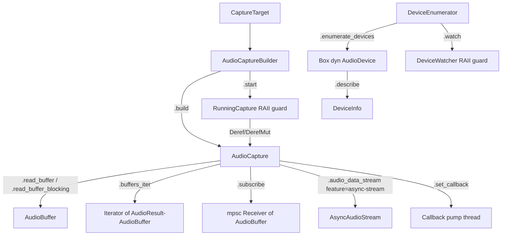

# Canonical Public API Design — `rsac` (Rust Cross-Platform Audio Capture)

> **Status:** Living design doc — reconciled with shipped code (2026-05-30).
> **Source of truth:** the rustdoc and the modules under [`src/`](../../src/).
> Every signature below is grounded against the current code (file references
> in prose use symbol names so they survive refactors). Where a previously
> documented surface does **not** exist in code, it is called out explicitly as
> **Not implemented** rather than presented as shipped.
>
> **Priority order:** Correctness → UX → Breadth.
> **Guiding principle:** streaming-first, pull-model with a lock-free ring-buffer
> bridge from the OS callback to the consumer. rsac is **capture-only** — see
> [`VISION.md`](../../VISION.md) for the explicit non-goals (no DSP, mixing,
> resampling, encoding, playback, VAD, or AEC).

---

## Table of Contents

1. [Design Overview](#1-design-overview)
2. [Error Handling](#2-error-handling)
3. [CaptureTarget — Unified Target Model](#3-capturetarget--unified-target-model)
4. [AudioFormat, SampleFormat, and StreamConfig](#4-audioformat-sampleformat-and-streamconfig)
5. [AudioCaptureBuilder](#5-audiocapturebuilder)
6. [AudioCapture and RunningCapture](#6-audiocapture-and-runningcapture)
7. [CapturingStream — The Core Streaming Trait](#7-capturingstream--the-core-streaming-trait)
8. [AudioBuffer — Data Container and Metering](#8-audiobuffer--data-container-and-metering)
9. [Device Enumeration, DeviceInfo, and Device Watching](#9-device-enumeration-deviceinfo-and-device-watching)
10. [Source Introspection and Diagnostics](#10-source-introspection-and-diagnostics)
11. [Streaming Consumption Modes](#11-streaming-consumption-modes)
12. [The `capture!` Macro](#12-the-capture-macro)
13. [AudioSink — Downstream Consumers](#13-audiosink--downstream-consumers)
14. [Public Exports and Prelude](#14-public-exports-and-prelude)
15. [Thread-Safety Contract](#15-thread-safety-contract)
16. [Not Yet Implemented / Tracked](#16-not-yet-implemented--tracked)

---

## 1. Design Overview

The public API follows a **builder → handle → stream** pipeline:



1. **Configure** with [`AudioCaptureBuilder`](../../src/api.rs) (`with_target` /
   `target_str` / `sample_rate` / `channels` / `sample_format` / `buffer_size`),
   or the [`capture!`](../../src/lib.rs) macro for a one-line declarative builder.
2. **Build** to an [`AudioCapture`](../../src/api.rs) handle via `build()`
   (validates config, resolves the device, negotiates the format), or call
   `start()` on the builder to build-and-start in one step, returning a
   [`RunningCapture`](../../src/api.rs) RAII guard.
3. **Start** with `AudioCapture::start()` to create the OS stream.
4. **Consume** audio via pull (`read_buffer` / `read_buffer_blocking`), a
   blocking iterator (`buffers_iter`), a channel (`subscribe`), an async stream
   (`audio_data_stream`, behind the `async-stream` feature), or a callback
   (`set_callback`).
5. **Stop/Drop** — `stop()` tears the OS stream down; `Drop` on `AudioCapture`
   (and on the `RunningCapture` guard) best-effort stops it.

---

## 2. Error Handling

The canonical error type is [`AudioError`](../../src/core/error.rs), and every
fallible operation returns `AudioResult<T>` (alias for `Result<T, AudioError>`).

### Shipped shape (grounded against `core/error.rs`)

- `AudioError` is a **manually implemented** `Display` / `std::error::Error`
  enum — there is **no** `thiserror` derive and it is **not** `Clone`.
- It has **22 variants** organized into **7** [`ErrorKind`] categories:
  `Configuration`, `Device`, `Stream`, `Backend`, `Application`, `Platform`,
  `Internal`.
- Recoverability has **three** in-use states on the `Recoverability` enum —
  `Recoverable`, `TransientRetry`, `Fatal`. (A `UserError` value is named in the
  `core::error` module doc; the public `Recoverability` enum itself defines the
  three above.)
- Every variant has an exhaustive (`_`-free) `recoverability()`, `kind()`,
  `user_message()`, and `Display` arm, so adding a variant is a compile error
  until it is classified.
- Convenience predicates `is_fatal()` / `is_recoverable()` give consumers a
  clean retry-vs-surface decision. The end-of-stream terminal signal is
  `AudioError::StreamEnded` (Fatal, `ErrorKind::Stream`) — see
  [ADR-0003](../designs/0003-terminal-stream-error.md).

Representative variants (carry structured fields, not bare strings):

```rust
pub enum AudioError {
    // Configuration
    InvalidParameter { param: String, reason: String },
    UnsupportedFormat { format: String, context: Option<BackendContext> },
    ConfigurationError { message: String },
    // Device
    DeviceNotFound { device_id: String },
    DeviceNotAvailable { device_id: String, reason: String },
    DeviceEnumerationError { reason: String, context: Option<BackendContext> },
    // Stream (StreamCreationFailed / StreamStartFailed / StreamStopFailed /
    //         StreamReadError / StreamEnded / BufferOverrun / BufferUnderrun …)
    StreamEnded { reason: String },
    // Platform / Backend / Application / Internal …
    PlatformNotSupported { feature: String, platform: String },
    InternalError { message: String, source: Option<…> },
    // … 22 variants total
}
```

> **Known limitation (tracked, critique API-ERG-01):** `AudioError` is **not**
> `#[non_exhaustive]`, unlike the recently-added public types
> ([`StreamStats`], [`BackpressureReport`], [`DeviceInfo`], [`DeviceEvent`]).
> Downstream exhaustive matches are therefore a SemVer hazard; external code
> should already match with a trailing `_ =>` arm and lean on
> `kind()`/`recoverability()`/`is_fatal()` for classification.

---

## 3. CaptureTarget — Unified Target Model

[`CaptureTarget`](../../src/core/config.rs) is the single concept that selects
*what* audio to capture. It uses **tuple/newtype** variants (not the
struct-variant forms shown in older drafts of this doc):

```rust
#[derive(Debug, Clone, Default, PartialEq, Eq, Hash)]
pub enum CaptureTarget {
    #[default]
    SystemDefault,
    Device(DeviceId),                 // DeviceId(pub String)
    Application(ApplicationId),       // ApplicationId(pub String)
    ApplicationByName(String),
    ProcessTree(ProcessId),           // ProcessId(pub u32)
}
```

> `CaptureTarget` is intentionally **not** `#[non_exhaustive]` today although the
> variant set is expected to grow (critique OBS-API-ERG); treat the
> `#[non_exhaustive]` decision as open.

### Convenience constructors (`core/introspection.rs`)

```rust
CaptureTarget::app("Firefox")        // == ApplicationByName("Firefox")
CaptureTarget::pid(1234)             // == ProcessTree(ProcessId(1234))
CaptureTarget::device("hw:0,0")      // == Device(DeviceId("hw:0,0"))
```

### String round-trip — `FromStr` / `TryFrom<&str>` / `Display`

`CaptureTarget` implements `FromStr`, `TryFrom<&str>`, and `Display`, and the
two are exact inverses: `t.to_string().parse::<CaptureTarget>() == Ok(t)` for
every variant (property-tested for empty ids, `u32::MAX`, and embedded colons).

Grammar (scheme prefix matched **case-insensitively**; body preserved verbatim):

| String form                         | Parses to                                   |
|-------------------------------------|---------------------------------------------|
| `system` / `default`                | `SystemDefault`                             |
| `device:<id>`                       | `Device(DeviceId(<id>))` — split on the **first** colon, so `device:hw:0,0` keeps `hw:0,0` |
| `app:<id>`                          | `Application(ApplicationId(<id>))`          |
| `name:<name>`                       | `ApplicationByName(<name>)`                 |
| `tree:<pid>` / `pid:<pid>`          | `ProcessTree(ProcessId(<pid>))` (`<pid>` a `u32`) |

An unknown scheme or a non-numeric / out-of-range pid returns
`AudioError::InvalidParameter { param: "capture_target", .. }` and never panics.

### Platform mapping

| CaptureTarget        | Windows (WASAPI)                         | Linux (PipeWire)                  | macOS (CoreAudio Process Tap, 14.4+) |
|----------------------|------------------------------------------|-----------------------------------|--------------------------------------|
| `SystemDefault`      | Loopback on the default render endpoint  | Monitor of the default sink       | Process tap over all processes       |
| `Device(id)`         | Endpoint by ID                           | Node by serial/object id          | `AudioDeviceID` by UID               |
| `Application(id)`    | Process Loopback Capture                 | Monitor stream on the app's node  | `CATapDescription` targeting the PID |
| `ApplicationByName`  | Resolve name → session → Process Loopback | Resolve `application.name` → monitor | Resolve name → PID → process tap   |
| `ProcessTree(pid)`   | Process Loopback (tree mode)             | Root PID + children via `/proc`   | `CATapDescription` with the PID set  |

---

## 4. AudioFormat, SampleFormat, and StreamConfig

### SampleFormat — 4 variants (`core/config.rs`)

```rust
#[derive(Debug, Clone, Copy, PartialEq, Eq, Hash)]
pub enum SampleFormat { I16, I24, I32, F32 }  // Default = F32
// SampleFormat::bits_per_sample() → 16 | 24 | 32 | 32
```

All audio is normalized to interleaved `f32` internally; `SampleFormat`
describes the wire/storage format for configuration and capability negotiation.

### AudioFormat

```rust
#[derive(Debug, Clone, PartialEq, Eq, Hash)]
pub struct AudioFormat {
    pub sample_rate: u32,    // default 48000
    pub channels: u16,       // default 2
    pub sample_format: SampleFormat, // default F32
}
```

### StreamConfig — the **actual** field set (`core/config.rs`)

```rust
#[derive(Debug, Clone, PartialEq, Eq)]
pub struct StreamConfig {
    pub sample_rate: u32,             // default 48000
    pub channels: u16,                // default 2
    pub sample_format: SampleFormat,  // default F32
    pub buffer_size: Option<usize>,   // desired buffer size; None → backend default
    pub capture_target: CaptureTarget,// propagated from the builder on build()
}
// StreamConfig::to_audio_format() → AudioFormat
```

> **Corrections vs. older drafts of this doc:**
> - There is **no** `format: Option<AudioFormat>` field — `sample_rate`,
>   `channels`, and `sample_format` are flat fields.
> - There is **no** `ring_buffer_frames` field and **no** `buffer_size_frames`
>   field; the builder exposes a `buffer_size_frames(Option<u32>)` *setter* that
>   writes into `buffer_size`, but the struct field is `buffer_size`.
> - There is **no** `latency_mode` field. A `LatencyMode` enum exists in
>   `core/config.rs` but it is **not** wired into `StreamConfig` or the builder —
>   see [§16](#16-not-yet-implemented--tracked).

#### Supported sample rates

`build()`/`preflight()` accept exactly **6** rates:
`22050, 32000, 44100, 48000, 88200, 96000`. This whitelist is the same array as
the public `PlatformCapabilities::SUPPORTED_SAMPLE_RATES` (single source of
truth), so a caller can pre-validate against the public const and get exactly
what `build()` enforces. Device negotiation may still land on a different rate
the hardware advertises; the whitelist is the config-time contract only.

---

## 5. AudioCaptureBuilder

[`AudioCaptureBuilder`](../../src/api.rs) configures a capture session. It holds
a `CaptureTarget` plus a `StreamConfig`; all fields default
(`SystemDefault`, 48 kHz / 2ch / F32, no buffer-size preference).

### Setters and accessors

```rust
impl AudioCaptureBuilder {
    pub fn new() -> Self;                                   // == default()
    pub fn with_target(self, target: CaptureTarget) -> Self;
    pub fn with_config(self, config: StreamConfig) -> Self;
    pub fn sample_rate(self, rate: u32) -> Self;
    pub fn channels(self, channels: u16) -> Self;
    pub fn sample_format(self, format: SampleFormat) -> Self;
    pub fn buffer_size(self, size: Option<usize>) -> Self;
    pub fn buffer_size_frames(self, size: Option<u32>) -> Self; // compat alias → buffer_size

    // Read-only views (useful for inspecting a capture!-assembled builder)
    pub fn target(&self) -> &CaptureTarget;
    pub fn config(&self) -> &StreamConfig;

    // String-driven targeting
    pub fn target_str(self, s: &str) -> AudioResult<Self>;  // fallible; builder unchanged on error
    pub fn try_target_str(self, s: &str) -> Self;           // infallible; keeps prior target on error

    pub fn preflight(&self) -> AudioResult<()>;             // device-independent validation
    pub fn build(self) -> AudioResult<AudioCapture>;        // validate + resolve device + negotiate
    pub fn start(self) -> AudioResult<RunningCapture>;      // build + start + RAII guard
}
```

### `target_str` / `try_target_str`

`target_str(s)` parses `s` via `CaptureTarget::from_str` (the canonical grammar
in [§3](#3-capturetarget--unified-target-model)). On a parse failure it returns
`AudioError::InvalidParameter { param: "capture_target", .. }` and, because the
method consumes `self` and only returns the builder on success, the caller's
previously configured target is unchanged. `try_target_str(s)` is the infallible
best-effort variant: a malformed string is ignored and the prior target kept.

```rust
let capture = AudioCaptureBuilder::new()
    .target_str("app:1234")?      // CLI flag / config value straight into the builder
    .sample_rate(48000)
    .build()?;
```

### `preflight`

`preflight()` runs the **cheap, device-independent** validations that `build()`
performs first, without enumerating any device — so a caller can fail fast on a
misconfigured builder. `build()` calls it first, so the two cannot drift. It
returns:

- `AudioError::PlatformNotSupported` when the target needs application or
  process-tree capture the platform reports it does not support.
- `AudioError::InvalidParameter { param: "sample_rate", .. }` when the rate is
  not one of the 6 supported rates.
- `AudioError::ConfigurationError` when `channels == 0` or `channels > 32`.

```rust
let builder = AudioCaptureBuilder::new().sample_rate(48000).channels(2);
builder.preflight()?; // validates without touching any device
```

### `build` and format negotiation

`build()` resolves the device for the target and, on **non-Linux** platforms,
negotiates the format: if the device advertises formats and the exact requested
one is absent, it picks the closest supported format (preferring F32 at the
requested sample rate, then F32 at the requested channel count, then any F32,
then the device's first format) rather than hard-failing. It errors with
`UnsupportedFormat` only when the device advertises no formats at all. On Linux
(PipeWire) negotiation happens at stream-open time, so `build()` does not
negotiate there.

### `start` — build-and-start ergonomics

`AudioCaptureBuilder::start()` collapses `let mut c = builder.build()?;
c.start()?;` into one fallible call returning a [`RunningCapture`](#6-audiocapture-and-runningcapture)
RAII guard. On a `start()` failure the partially-built `AudioCapture` is dropped,
and its `Drop` best-effort stops any stream it created — so a failed `start()`
never leaks a half-running stream.

---

## 6. AudioCapture and RunningCapture

### AudioCapture — the lifecycle handle

[`AudioCapture`](../../src/api.rs) is created by `build()`. It owns the resolved
config, the selected device, the active stream (`Arc<dyn CapturingStream>`), a
pending callback, an optional callback-pump handle, and a monotonic
`start_instant`.

```rust
impl AudioCapture {
    // Lifecycle (take &mut self)
    pub fn start(&mut self) -> AudioResult<()>;
    pub fn stop(&mut self) -> AudioResult<()>;

    // State / config (take &self)
    pub fn is_running(&self) -> bool;
    pub fn config(&self) -> &AudioCaptureConfig;
    pub fn uptime(&self) -> Option<Duration>;
    pub fn format(&self) -> Option<AudioFormat>; // negotiated delivery format, or None pre-start

    // Reads (take &mut self)
    pub fn read_buffer(&mut self) -> AudioResult<Option<AudioBuffer>>;     // non-blocking
    pub fn read_buffer_blocking(&mut self) -> AudioResult<AudioBuffer>;    // blocking
    pub fn buffers_iter(&mut self) -> AudioBufferIterator<'_>;             // blocking iterator

    // Channel / async / callback (subscribe & async take &self; set/clear take &mut self)
    pub fn subscribe(&self) -> AudioResult<mpsc::Receiver<AudioBuffer>>;
    #[cfg(feature = "async-stream")]
    pub fn audio_data_stream(&self) -> AudioResult<AsyncAudioStream<'_>>;
    pub fn set_callback<F>(&mut self, callback: F) -> AudioResult<()>
        where F: FnMut(&AudioBuffer) + Send + 'static;
    pub fn clear_callback(&mut self) -> AudioResult<()>;

    // Diagnostics (take &self)
    pub fn overrun_count(&self) -> u64;
    pub fn is_under_backpressure(&self) -> bool;
    pub fn stream_stats(&self) -> StreamStats;
    pub fn backpressure_report(&self) -> BackpressureReport;
}
```

#### `&mut self` vs `&self` — the honest nuance

The module doc states `AudioCapture` is `Send + Sync` and shareable behind an
`Arc`. In practice the **read** methods (`read_buffer`, `read_buffer_blocking`,
`buffers_iter`) and the lifecycle/callback methods (`start`, `stop`,
`set_callback`, `clear_callback`) take **`&mut self`**, while `subscribe`,
`is_under_backpressure`, `stream_stats`, `backpressure_report`, `format`,
`uptime`, `overrun_count`, and `config` take **`&self`**. The underlying
`CapturingStream::try_read_chunk` is already `&self`, so a future change could
move the read path to `&self`; until then, sharing one `AudioCapture` across
threads for reads requires external synchronization (e.g. `Arc<Mutex<…>>`).

> **Known limitation (tracked, critique DF-03):** there is **no** compile-time
> `Send + Sync` assertion for `AudioCapture` in `api.rs` (unlike
> [`AudioBuffer`](../../src/core/buffer.rs), which has
> `_assert_send_sync::<AudioBuffer>()`). The guarantee is asserted only in the
> module doc, so downstreams have guessed wrong (e.g. assuming `!Sync`). Adding
> the assertion is tracked.

#### Lifecycle semantics (grounded)

- `start()` creates the OS stream on first call and records `start_instant`. A
  second `start()` on an already-**running** stream is a no-op (`Ok`); a
  `start()` on a stream that has **stopped** returns `StreamStartFailed` — a
  stopped stream cannot be restarted, build a new `AudioCapture`.
- `stop()` shuts the callback pump down (signal + join), stops the stream,
  drops the `Arc`, and clears `start_instant`. It is idempotent.
- `Drop` tears down the callback pump and best-effort stops a running stream.
- `set_callback()` must be called **before** `start()` (it errors with
  `ConfigurationError` while running); `start()` then moves the closure into a
  dedicated **callback pump thread** (never the OS audio thread) — see
  [ADR-0002](../designs/0002-callback-delivery.md). The pump owns the closure, so
  no lock is held during invocation and the closure may re-enter `AudioCapture`.
- `format()` returns the negotiated *delivery* format the backend publishes, or
  `None` before `start()`. (Note: today no production backend calls
  `set_negotiated_format`, so this reflects the requested format in practice —
  critique PERF-07.)
- `uptime()` is anchored on first real stream creation and cleared by
  `stop()`/`Drop`; it is monotonic (`Instant`-backed).

### RunningCapture — RAII guard

[`RunningCapture`](../../src/api.rs) is returned by `AudioCaptureBuilder::start()`.

- It implements `Deref<Target = AudioCapture>` **and** `DerefMut`, so the full
  `AudioCapture` surface (including the `&mut self` reads) is reachable directly
  on the guard — no wrapper boilerplate, new `AudioCapture` methods are reachable
  automatically.
- `Drop` calls `AudioCapture::stop()` exactly once; `stop()` is idempotent, so an
  explicit `stop()` followed by drop does not double-stop or error.
- `into_inner()` takes ownership of the wrapped `AudioCapture` **without**
  triggering the guard's stop (the caller becomes responsible for the lifecycle;
  the `AudioCapture`'s own `Drop` still best-effort stops it).

```rust
let mut capture = AudioCaptureBuilder::new()
    .with_target(CaptureTarget::SystemDefault)
    .start()?; // builds, starts, and wraps in a RAII guard
if let Some(buffer) = capture.read_buffer()? {  // through DerefMut
    let _frames = buffer.num_frames();
}
// Dropping `capture` stops the stream automatically.
```

---

## 7. CapturingStream — The Core Streaming Trait

[`CapturingStream`](../../src/core/interface.rs) is the platform-agnostic
contract every backend implements (consumers rarely call it directly; the
`AudioCapture` facade wires it up). All implementations are `Send + Sync`.

```rust
pub trait CapturingStream: Send + Sync {
    fn read_chunk(&self) -> AudioResult<AudioBuffer>;             // blocking
    fn try_read_chunk(&self) -> AudioResult<Option<AudioBuffer>>; // non-blocking
    fn stop(&self) -> AudioResult<()>;
    fn format(&self) -> AudioFormat;
    fn is_running(&self) -> bool;

    // Diagnostics (default-0 / default-false provided methods)
    fn overrun_count(&self) -> u64 { 0 }
    fn buffers_captured(&self) -> u64 { 0 }
    fn buffers_pushed(&self) -> u64 { 0 }
    fn buffers_dropped(&self) -> u64 { 0 }   // alias of overrun_count
    fn is_producing(&self) -> bool { self.is_running() }
    fn is_under_backpressure(&self) -> bool { false }

    // Deprecated; cleanup happens in Drop
    #[deprecated] fn close(self: Box<Self>) -> AudioResult<()> { Ok(()) }

    #[cfg(feature = "async-stream")]
    fn register_waker(&self, waker: &std::task::Waker) -> bool { false }
    #[cfg(feature = "async-stream")]
    fn is_stream_producing(&self) -> bool { true }
}
```

> **Corrections vs. older drafts:** the real `read_chunk(&self)` takes **no**
> `Duration` argument and the blocking/non-blocking split is `read_chunk` vs.
> `try_read_chunk` (both `&self`). There is no `latency_frames()` and no
> `to_async_stream()` on the trait; async streaming lives on
> `AudioCapture::audio_data_stream()` (behind `async-stream`).

### End-of-stream contract (ADR-0003)

`read_chunk()` returns `AudioError::StreamEnded` (Fatal, `ErrorKind::Stream`)
once the stream is terminal — that, not `StreamReadError`, is the clean
end-of-stream signal. Ring-buffer overflow does **not** surface as an error: the
producer drops buffers and bumps `overrun_count()`; poll that (or
`is_under_backpressure()`) to detect loss. The `BufferOverrun`/`BufferUnderrun`
variants exist in the taxonomy but are not constructed by the production read
path.

---

## 8. AudioBuffer — Data Container and Metering

[`AudioBuffer`](../../src/core/buffer.rs) owns interleaved `f32` samples plus
`AudioFormat` metadata and an optional timestamp. It is `Clone`, and a
compile-time assertion enforces `Send + Sync`.

### Construction and access

```rust
AudioBuffer::new(data: Vec<f32>, channels: u16, sample_rate: u32) -> Self; // F32
AudioBuffer::with_format(data, format) -> Self;
AudioBuffer::with_timestamp(data, format, ts) -> Self;
AudioBuffer::empty(channels, sample_rate) -> Self;
AudioBuffer::from_interleaved(samples, channels, sample_rate) -> Self;     // alias of new

buf.data() -> &[f32];          buf.into_data() -> Vec<f32>;
buf.as_slice() -> &[f32];      buf.as_mut_slice() -> &mut [f32];   buf.interleaved() -> &[f32];
buf.format() -> &AudioFormat;  buf.channels() -> u16;   buf.sample_rate() -> u32;
buf.timestamp() -> Option<Duration>;
buf.len() / is_empty() / samples_per_channel() / num_frames() / duration();
buf.channel_data(ch: u16) -> Option<Vec<f32>>; // allocating de-interleave
```

> **Known limitation (tracked, critique DF-01):** `timestamp()` is always `None`
> in production — every backend uses the non-timestamping push path. Treat
> `timestamp()` as reserved until a backend wires a producer-side stamp.

### Level metering (RT-safe, allocation-free)

These are **read-only observability metrics** over the existing samples (VU
meters, clip detection, silence gating) — **not** DSP. Each is `#[inline]`,
allocation-free, and lock-free (safe on the audio callback thread). Non-finite
samples (`NaN`/`±inf`) are skipped so one poisoned sample cannot corrupt a meter.

```rust
buf.rms() -> f32;        buf.peak() -> f32;        // 0.0 for empty/silence; never NaN
buf.rms_dbfs() -> f32;   buf.peak_dbfs() -> f32;   // NEG_INFINITY at silence; 0.0 dBFS at full scale
buf.channel_rms(ch: u16) -> Option<f32>;           // strided, no allocation; None if ch out of range
buf.channel_peak(ch: u16) -> Option<f32>;          // Some(0.0) for an empty-but-existing channel
```

---

## 9. Device Enumeration, DeviceInfo, and Device Watching

### DeviceEnumerator + AudioDevice (`core/interface.rs`)

```rust
pub trait DeviceEnumerator: Send + Sync {
    fn enumerate_devices(&self) -> AudioResult<Vec<Box<dyn AudioDevice>>>;
    fn default_device(&self) -> AudioResult<Box<dyn AudioDevice>>;
    fn watch(&self, on_event: DeviceEventHandler) -> AudioResult<DeviceWatcher>; // provided; default PlatformNotSupported
}

pub trait AudioDevice: Send + Sync {
    fn id(&self) -> DeviceId;
    fn name(&self) -> String;
    fn is_default(&self) -> bool;
    fn supported_formats(&self) -> Vec<AudioFormat>;
    fn kind(&self) -> AudioResult<DeviceKind>;   // provided; default PlatformNotSupported
    fn describe(&self) -> DeviceInfo;            // provided; composed from the accessors
    fn create_stream(&self, config: &StreamConfig) -> AudioResult<Box<dyn CapturingStream>>;
}
```

Obtain an enumerator via the [`get_device_enumerator()`](../../src/audio/mod.rs)
facade. The concrete facade method to fetch the default is `get_default_device()`
(the trait method is `default_device()` — a known naming divergence, critique
API-ERG).

### DeviceInfo — owned metadata snapshot

```rust
#[derive(Debug, Clone, PartialEq, Eq)]
#[non_exhaustive]
pub struct DeviceInfo {
    pub id: DeviceId,
    pub name: String,
    pub kind: DeviceKind,            // Input | Output
    pub is_default: bool,
    pub default_format: Option<AudioFormat>, // first supported_formats() entry, or None
}
```

`AudioDevice::describe()` builds a `DeviceInfo` from the existing accessors; it
is infallible, falling back to `DeviceKind::Input` when `kind()` errors (the
capture-oriented default), so callers that need to distinguish "known input"
from "indeterminate" should call `kind()` directly. On Linux/PipeWire
`supported_formats()` is intentionally empty (negotiation at stream-open), so
`default_format` is `None` there by design.

### Device watching — DeviceEvent + DeviceWatcher

`DeviceEnumerator::watch(handler)` subscribes to device hot-plug / default-change
notifications, returning a [`DeviceWatcher`](../../src/core/interface.rs) RAII
guard.

```rust
#[non_exhaustive]
pub enum DeviceEvent {
    DeviceAdded   { id: DeviceId, name: String, kind: DeviceKind },
    DeviceRemoved { id: DeviceId },
    DefaultChanged{ id: DeviceId, kind: DeviceKind },
    StateChanged  { id: DeviceId, available: bool },
}
pub type DeviceEventHandler = Box<dyn FnMut(DeviceEvent) + Send + 'static>;
```

- The handler runs on the backend's **OS notification thread** (the WASAPI
  `IMMNotificationClient` callback, the CoreAudio property-listener thread, or
  the PipeWire loop thread) — **never** the real-time audio callback thread — so
  the handler may allocate and lock.
- Dropping the `DeviceWatcher` unregisters the OS listener and joins the notify
  thread; the handler will not run after `drop` returns. `Drop` is best-effort
  and never panics.
- `watch()` is a **provided** trait method defaulting to `PlatformNotSupported`;
  backends whose `PlatformCapabilities::supports_device_change_notifications` is
  `true` override it.

> **Per-platform divergence (documented, tracked, critique ADR-R1):** Windows and
> macOS hand events off via a bounded `sync_channel(64)` + dedicated helper
> thread (drop-on-full backpressure), so the user handler never runs on the OS
> notify thread. **Linux** invokes the handler **directly on the PipeWire loop
> thread** (no channel, no helper thread, no bounded backpressure) because
> PipeWire's `!Send` `Rc` loop objects make same-thread invocation natural. The
> trait contract above ("OS notification thread, never the RT audio thread")
> holds on all three, but the threading model, channel bound, and event-loss
> policy differ. A device-watch threading ADR captures this decision.

---

## 10. Source Introspection and Diagnostics

### Source discovery (`core/introspection.rs`)

```rust
pub fn list_audio_sources() -> AudioResult<Vec<AudioSource>>;        // system default + devices + apps
pub fn list_audio_applications() -> AudioResult<Vec<AudioSource>>;   // best-effort; empty if unsupported
pub fn check_audio_capture_permission() -> PermissionStatus;        // Granted/NotDetermined/Denied/NotRequired

pub struct AudioSource { pub id: String, pub name: String, pub kind: AudioSourceKind }
pub enum AudioSourceKind {
    SystemDefault,
    Device { device_id: String, is_default: bool, kind: Option<DeviceKind> },
    Application { pid: u32, app_name: String, bundle_id: Option<String> },
}
// AudioSource::to_capture_target() — an Application source maps to
// CaptureTarget::Application (that session only), NOT ProcessTree.
```

> **Known limitation (tracked, critique DAG-001/002):** `list_audio_sources` /
> `list_audio_applications` live in `core` but reach **up** into `crate::audio::*`
> backend functions, violating the documented `core` → `audio` layering DAG. This
> is a code fix tracked separately; the public re-export paths
> (`rsac::list_audio_sources`) are stable regardless of where the impl lands.

### StreamStats / BackpressureReport

`AudioCapture::stream_stats()` returns a cheap point-in-time snapshot; counters
are `Relaxed` loads on the non-RT query path (no allocation on / contention with
the audio callback). Both types are `#[non_exhaustive]` — construct via
`Default` + field assignment and match with `..`.

```rust
#[non_exhaustive]
pub struct StreamStats {
    pub overruns: u64,           // alias of buffers_dropped
    pub buffers_captured: u64,   // delivered to the consumer
    pub buffers_dropped: u64,    // lost to ring-buffer overflow
    pub buffers_pushed: u64,     // enqueued by the producer
    pub uptime: Duration,        // ZERO when not started
    pub is_running: bool,
    pub format_description: String, // e.g. "2ch 48000Hz F32"; lazily built, never per-buffer
}
// StreamStats::dropped_ratio() = dropped / (captured + dropped), zero-guarded.

#[non_exhaustive]
pub struct BackpressureReport {
    pub window: Duration,        // ZERO today (lifetime totals; windowed atomics tracked)
    pub pushed: u64,
    pub dropped: u64,
    pub drop_rate: f64,          // dropped / (pushed + dropped), zero-guarded
    pub is_under_backpressure: bool, // legacy consecutive-drop bool, carried unchanged
}
```

`backpressure_report()` surfaces sustained **partial** loss (a steady drop_rate)
that the legacy consecutive-drop `is_under_backpressure` bool misses. The
`window` is `Duration::ZERO` today because the implementation derives the report
from lifetime `buffers_pushed`/`buffers_dropped` counters; when the bridge
exposes per-window atomics the method swaps source and reports a real window
without changing the public shape (tracked, `rsac-cfe4`).

---

## 11. Streaming Consumption Modes

All modes read from the same ring buffer; mixing them means they compete for the
same data. Recommended: one primary consumer.

### 11.1 Non-blocking pull

```rust
let mut capture = AudioCaptureBuilder::new().build()?;
capture.start()?;
loop {
    match capture.read_buffer()? {           // &mut self, non-blocking
        Some(buffer) => process(&buffer),
        None => {                            // no data yet
            std::thread::sleep(std::time::Duration::from_millis(1));
            if should_stop() { break; }
        }
    }
}
capture.stop()?;
```

`read_buffer()` errors if the stream is not initialized or not running; it does
not signal clean end-of-stream itself. Handle `Ok(None)` with a short sleep and
break on a fatal error (`e.is_fatal()`); retry on recoverable errors.

### 11.2 Blocking pull

```rust
let buffer = capture.read_buffer_blocking()?; // &mut self; blocks until data
```

### 11.3 Blocking iterator

```rust
for result in capture.buffers_iter() {       // &mut self
    let buffer = result?;                     // yields AudioResult<AudioBuffer>
    process(&buffer);
}
// Ends (None) on StreamEnded after draining the buffered tail; surfaces other errors.
```

### 11.4 Channel subscription

```rust
let rx: mpsc::Receiver<AudioBuffer> = capture.subscribe()?; // &self
while let Ok(buffer) = rx.recv() { process(&buffer); }
```

`subscribe()` spawns a background `rsac-subscribe` thread that reads from the
stream and sends over an `mpsc` channel; it exits when the stream stops/errors or
the `Receiver` is dropped. It polls with a ~1 ms sleep on an empty ring (so the
first buffer after an idle period can be delayed up to ~1 ms) and delivers
`AudioBuffer` (the terminating error is not delivered — critique API-ERG; for
latency-critical or error-aware consumers prefer the blocking read or the async
stream). The reader thread is detached and is **not** reclaimed by `stop()`/`Drop`
(critique CT) — holding a `Receiver` keeps reading until the stream stops.

### 11.5 Async stream (feature `async-stream`)

```rust
use futures_util::StreamExt;
let mut stream = capture.audio_data_stream()?;  // AsyncAudioStream<'_>; waker-driven
while let Some(result) = stream.next().await {
    let buffer = result?;
    process_async(&buffer).await;
}
```

Without the `async-stream` feature, `audio_data_stream()` returns
`PlatformNotSupported`.

### 11.6 Callback (push)

```rust
let mut capture = AudioCaptureBuilder::new().build()?;
capture.set_callback(|buffer: &AudioBuffer| {     // before start(); &mut self
    let level = buffer.rms_dbfs();                // use the RT-safe metering API
    log::info!("RMS: {level:.1} dBFS");
})?;
capture.start()?;                                 // moves the closure into a pump thread
// … later …
capture.stop()?;
```

The callback runs on a dedicated **callback pump thread** (not the OS audio
thread). A fatal read (`StreamEnded`) stops the pump; transient/recoverable read
errors are logged and retried. See [ADR-0002](../designs/0002-callback-delivery.md).

---

## 12. The `capture!` Macro

[`capture!`](../../src/lib.rs) builds an `AudioCaptureBuilder` in one expression
with named, order-independent fields. It **always evaluates to an
`AudioCaptureBuilder`** (never a `Result`), so the caller chooses the terminal
step — `.build()` for the handle or `.start()` for a `RunningCapture`. It is
`#[macro_export]`ed (reachable as `rsac::capture!` and via the prelude) and only
calls public builder methods, so it works unchanged in downstream crates.

### Grammar

Target forms (shorthand or explicit key):

| Form                         | Equivalent                                              |
|------------------------------|---------------------------------------------------------|
| `capture!(system)`           | `with_target(CaptureTarget::SystemDefault)`             |
| `capture!(device: id)`       | `Device(DeviceId(id.to_string()))` (any `Display`)      |
| `capture!(app: pid)`         | `Application(ApplicationId(pid.to_string()))`           |
| `capture!(name: n)`          | `ApplicationByName(n.to_string())`                      |
| `capture!(tree: pid)`        | `ProcessTree` via `CaptureTarget::pid(pid)` (a `u32`)   |
| `capture!(target: t)`        | `with_target(t)` (a `CaptureTarget` expr)               |
| `capture!(target_str: s)`    | `try_target_str(s)` (infallible; keeps default on error)|

Config keys: `sample_rate:` (alias `rate:`), `channels:`, `sample_format:`,
`buffer_size:`. Every field is optional; omitting one keeps the default
(system-default target, 48 kHz, 2ch, F32). Fields may appear in any order,
comma-separated.

```rust
use rsac::capture;
let builder = capture!(system, rate: 48000, channels: 2);
let app     = capture!(app: 1234);
let dev     = capture!(sample_format: SampleFormat::I16, device: "hw:0,0");

// Straight to a running capture (prelude in scope):
let mut running = capture!(system, rate: 44100).start()?;
```

---

## 13. AudioSink — Downstream Consumers

[`AudioSink`](../../src/sink/traits.rs) is the trait for consuming captured
buffers. It and the bundled sinks **exist** and are exported, but the user wires
them manually — see the [§16](#16-not-yet-implemented--tracked) note on
`pipe_to()`.

```rust
pub trait AudioSink: Send {                       // Send (not Send + 'static)
    fn write(&mut self, buffer: &AudioBuffer) -> AudioResult<()>;
    fn flush(&mut self) -> AudioResult<()> { Ok(()) }
    fn close(&mut self) -> AudioResult<()> { self.flush() }
}
```

Bundled sinks (real signatures — note these differ from older drafts):

```rust
// Discards audio (benchmarking / smoke tests).
NullSink::new() -> NullSink;

// Sends buffers over an mpsc channel; new() returns BOTH the sink and the receiver.
let (sink, rx): (ChannelSink, mpsc::Receiver<AudioBuffer>) = ChannelSink::new();

// Writes a WAV file (feature `sink-wav`); needs the format up front.
let sink = WavFileSink::new("output.wav", &format)?; // AudioResult<WavFileSink>
```

There is **no** `TokioChannelSink`. Wiring a sink is the consumer's job today:

```rust
// Manual drain into a sink (the library does not own a sink pump).
let mut sink = WavFileSink::new("out.wav", &capture.format().unwrap_or_default())?;
capture.start()?;
while let Some(buffer) = capture.read_buffer()? {
    sink.write(&buffer)?;
}
sink.flush()?;
capture.stop()?;
```

---

## 14. Public Exports and Prelude

### Crate root (`lib.rs` re-exports)

- Builder/handle: `AudioCaptureBuilder`, `AudioCapture`, `RunningCapture`.
- Macro: `capture!` (at the crate root via `#[macro_export]`).
- Config: `CaptureTarget`, `AudioFormat`, `SampleFormat`, `StreamConfig`,
  `AudioCaptureConfig`, `DeviceId`, `ApplicationId`, `ProcessId`.
- Data: `AudioBuffer`.
- Errors: `AudioError`, `AudioResult`, `ErrorKind`, `Recoverability`,
  `UserFacingError`, `BackendContext`.
- Traits/types: `AudioDevice`, `CapturingStream`, `DeviceEnumerator`,
  `DeviceEvent`, `DeviceEventHandler`, `DeviceInfo`, `DeviceKind`,
  `DeviceWatcher`.
- Capabilities: `PlatformCapabilities`.
- Introspection: `list_audio_sources`, `list_audio_applications`,
  `check_audio_capture_permission`, `AudioSource`, `AudioSourceKind`,
  `PermissionStatus`, `StreamStats`, `BackpressureReport`.
- Enumeration facade: `get_device_enumerator`.
- Bridge: `StreamState`, `AtomicStreamState`; `AsyncAudioStream` (feature
  `async-stream`).
- Sinks: `AudioSink`, `ChannelSink`, `NullSink`; `WavFileSink` (feature
  `sink-wav`).
- `install_default_tracing` (feature `tracing`).

### `rsac::prelude`

The [prelude](../../src/prelude.rs) is purely additive (every name is also at the
crate root) and re-exports the everyday capture surface:

```rust
use rsac::prelude::*;
```

It brings in: `AudioCapture`, `AudioCaptureBuilder`, `RunningCapture`, `capture!`;
`AudioFormat`, `CaptureTarget`, `SampleFormat`; `AudioBuffer`; `AudioError`,
`AudioResult`, `ErrorKind`, `Recoverability`, `UserFacingError`;
`PlatformCapabilities`, `AudioDevice`, `DeviceInfo`, `DeviceKind`; `AudioSource`,
`AudioSourceKind`, `BackpressureReport`, `StreamStats`; `AudioSink`,
`ChannelSink`, `NullSink`; `WavFileSink` (feature `sink-wav`); `AsyncAudioStream`
(feature `async-stream`). It does **not** re-export `DeviceEvent`/`DeviceWatcher`
or `StreamConfig` — name those from the crate root when needed.

---

## 15. Thread-Safety Contract

- `AudioBuffer` is `Send + Sync` (compile-time-asserted; only `Vec<f32>`,
  `AudioFormat`, `Option<Duration>` fields).
- `CapturingStream`, `AudioDevice`, `DeviceEnumerator` all require `Send + Sync`.
- `AudioCapture` is documented as `Send + Sync` (state behind `Arc<Mutex<…>>`,
  data plane lock-free), but see the [§6](#6-audiocapture-and-runningcapture)
  caveats: there is no compile-time assertion (tracked), and the read methods
  take `&mut self`, so cross-thread *read* sharing needs external sync.
- The OS audio callback thread never runs user code: callbacks are pumped on a
  dedicated thread (ADR-0002), and device-watch events are delivered on the OS
  notification thread (with a per-platform divergence — see
  [§9](#9-device-enumeration-deviceinfo-and-device-watching)).

---

## 16. Not Yet Implemented / Tracked

These surfaces were described in earlier drafts of this design but are **not**
present in the shipped code. They are listed here so the doc neither hides the
gap nor presents them as available.

- **`AudioCapture::pipe_to()` / library-driven sink wiring — NOT IMPLEMENTED.**
  There is no `pipe_to` (or `RunningCapture::drain_to`) method on `AudioCapture`.
  The `AudioSink` trait and `NullSink`/`ChannelSink`/`WavFileSink` exist and are
  exported, but the consumer must drive them by hand (read in a loop and call
  `sink.write()`), as shown in [§13](#13-audiosink--downstream-consumers). The
  crate's own `examples/record_to_file.rs` writes WAV directly rather than
  through `WavFileSink`. (Critique API-ERG-03.)
- **`LatencyMode` as a config field — NOT WIRED.** The `LatencyMode` enum exists
  in `core/config.rs` (and is re-exported), but it is never set, read, or
  threaded into `StreamConfig` or the builder. The `core/config.rs` module doc
  still mentions "latency mode" although `StreamConfig` has no such field.
  (Critique VS-2.)
- **`AudioFileFormat` — VESTIGIAL.** `core/config.rs` defines
  `enum AudioFileFormat { Wav }` with a doc mentioning "recording", but it is
  never constructed or consumed. Encoding/format selection is a downstream-sink
  concern and an explicit non-goal; this surface should be removed or
  `#[deprecated]`. (Critique VS-1.)
- **`buffer_size` honored only on Windows.** `StreamConfig::buffer_size` is
  threaded into the WASAPI ring-capacity calculation but ignored by the macOS and
  Linux backends (they use a fixed capacity today). It is also consumed as a ring
  **slot** count, not a frame count. (Critique DF-04.)
- **`format()` reports the requested, not delivered, format in practice.** No
  production backend calls `set_negotiated_format`, so `AudioCapture::format()`
  falls back to the requested config. (Critique PERF-07.)
- **`AudioBuffer::timestamp()` always `None`** in production (see
  [§8](#8-audiobuffer--data-container-and-metering)). (Critique DF-01.)
- **No `AudioCapture` compile-time `Send + Sync` assertion** (see
  [§6](#6-audiocapture-and-runningcapture)). (Critique DF-03.)

The following types from older drafts **do not exist** at all and were removed
from this document: `ResolvedConfig`, `AudioBufferRef`, an `ApplicationEnumerator`
trait, `TokioChannelSink`, `read_chunk(Duration)`, and `to_async_stream()`.

---

*End of API Design Document.*
