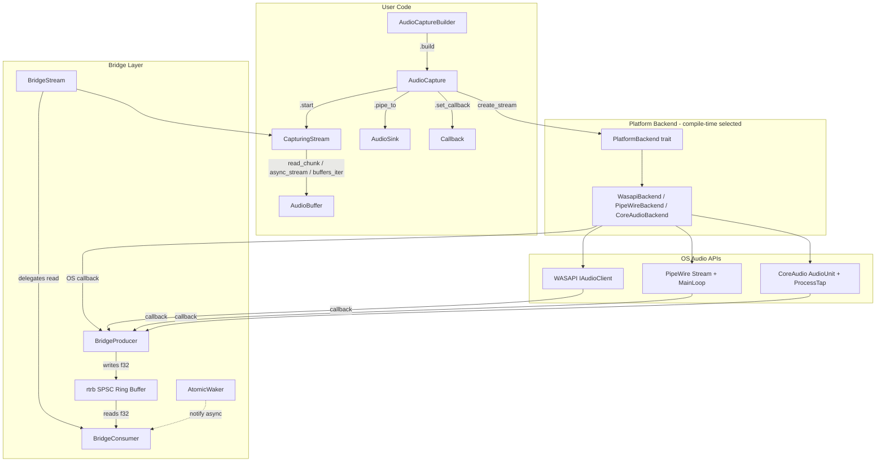
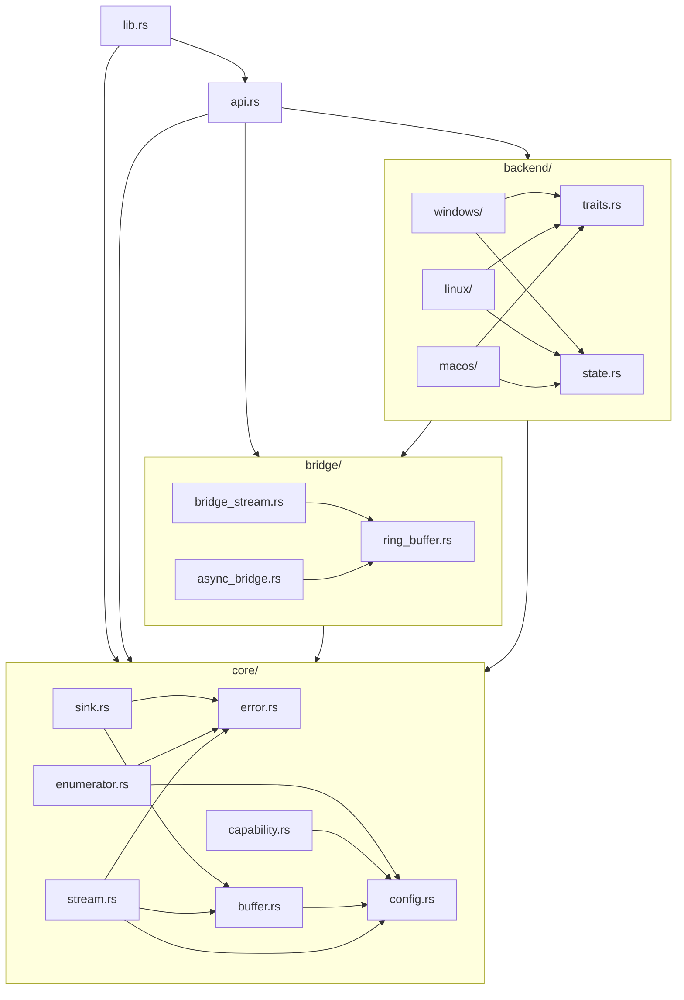

# Architecture Overview — `rsac` (Rust Cross-Platform Audio Capture)

> **Status:** Master Architecture Document — Subtask B4
> **Depends on:**
> - [API_DESIGN.md](API_DESIGN.md) (B1) — Public API surface
> - [ERROR_CAPABILITY_DESIGN.md](ERROR_CAPABILITY_DESIGN.md) (B2) — Error taxonomy & capability model
> - [BACKEND_CONTRACT.md](BACKEND_CONTRACT.md) (B3) — Internal backend contract & module architecture

---

## Table of Contents

1. [Architecture at a Glance](#1-architecture-at-a-glance)
2. [Component Summary](#2-component-summary)
3. [Removal & Deprecation Targets](#3-removal--deprecation-targets)
4. [New Types & Traits to Create](#4-new-types--traits-to-create)
5. [Module Dependency Graph](#5-module-dependency-graph)
6. [Cargo Feature Flag Strategy](#6-cargo-feature-flag-strategy)
7. [New Dependencies](#7-new-dependencies)
8. [Implementation Priority & Phasing](#8-implementation-priority--phasing)
9. [Cross-Cutting Concerns](#9-cross-cutting-concerns)

---

## 1. Architecture at a Glance

### One-Sentence Summary

> **rsac** is a streaming-first, pull-model audio capture library where platform-specific OS callbacks push `f32` samples into a lock-free SPSC ring buffer, and the user consumes them through a unified `CapturingStream` trait — with the ring buffer bridge as the single shared pattern across all platforms.

### Design Principles

| Principle | Description |
|---|---|
| **Streaming-first** | Audio is a continuous stream, not request/response. The API is built around continuous consumption. |
| **Pull model** | The user decides *when* to read audio. The library never forces callbacks on user threads. |
| **Ring buffer bridge** | Every platform uses the same `rtrb` SPSC ring buffer to decouple the OS real-time callback from the user's consumer thread. |
| **Platform abstraction** | One public API (`CapturingStream`) with compile-time `#[cfg]` dispatch to platform backends. Users never see platform-specific types. |
| **Builder → Session → Stream** | Three-phase lifecycle: configure, validate, then stream. Errors surface as early as possible. |
| **`Send + Sync` everywhere** | All public types are `Send + Sync`. The library manages its own synchronization. |

### High-Level System Diagram



### Data Flow Summary

```
User configures AudioCaptureBuilder
  → .build() validates config, resolves target, creates platform backend
  → .start() creates OS audio stream + ring buffer bridge
  → OS callback fires on real-time thread
    → converts native format to f32
    → writes to rtrb::Producer (lock-free, no allocation)
    → wakes AtomicWaker (for async consumers)
  → User calls read_chunk() / async_stream() / buffers_iter()
    → reads from rtrb::Consumer
    → wraps in AudioBuffer with metadata (frame_offset, sequence, timestamp)
  → .stop() halts OS callbacks, allows draining remaining buffered data
  → Drop releases all OS resources
```

---

## 2. Component Summary

### Public API Components

| Component | Role | Detailed Design |
|---|---|---|
| **`AudioCaptureBuilder`** | Builder pattern entry point. Configures target, format, buffer sizes. `.build()` validates and creates an `AudioCapture`. | [API_DESIGN.md §5](API_DESIGN.md#5-audiocapturebuilder) |
| **`AudioCapture`** | Lifecycle manager. Owns the platform backend and stream. Provides `start()`, `stop()`, `read_chunk()`, `async_stream()`, `buffers_iter()`, `set_callback()`, `pipe_to()`. All methods take `&self`. | [API_DESIGN.md §6](API_DESIGN.md#6-audiocapture--lifecycle-manager) |
| **`CapturingStream`** trait | Core streaming trait. `Send + Sync`. Defines `start()`, `stop()`, `close()`, `read_chunk()`, `try_read_chunk()`, `to_async_stream()`, `format()`, `latency_frames()`. | [API_DESIGN.md §7](API_DESIGN.md#7-capturingstream--the-core-streaming-trait) |
| **`AudioBuffer`** | Owned chunk of captured audio. `Vec<f32>` samples + `AudioFormat` + `frame_offset` + `sequence` + optional `timestamp`. `Clone`, `Send`, `Sync`. | [API_DESIGN.md §8](API_DESIGN.md#8-audiobuffer--data-container) |
| **`AudioFormat` / `SampleFormat`** | Format descriptors. `SampleFormat` simplified to 4 variants: `I16`, `I24`, `I32`, `F32`. No endianness. | [API_DESIGN.md §4](API_DESIGN.md#4-audioformat-and-streamconfig) |
| **`CaptureTarget`** | Unified target enum: `SystemDefault`, `Device`, `Application`, `ApplicationByName`, `ProcessTree`. Replaces the old `DeviceSelector` + PID fields. | [API_DESIGN.md §3](API_DESIGN.md#3-capturetarget--unified-target-model) |
| **`AudioSink`** trait | Downstream consumer interface. `write()`, `flush()`, `close()`. Built-in sinks: `WavFileSink`, `ChannelSink`, `TokioChannelSink`, `NullSink`. | [API_DESIGN.md §12](API_DESIGN.md#12-audiosink-trait--downstream-consumers) |

### Error & Capability Components

| Component | Role | Detailed Design |
|---|---|---|
| **`AudioError`** | 21-variant flat enum. Categorized by kind (Config, Device, Application, Stream, Platform, Generic). `Clone`, `thiserror`-derived. | [ERROR_CAPABILITY_DESIGN.md §2](ERROR_CAPABILITY_DESIGN.md#2-error-taxonomy--categorized-hierarchy) |
| **`ErrorKind`** | Category-level matching enum. Obtained via `AudioError::kind()`. | [ERROR_CAPABILITY_DESIGN.md §4](ERROR_CAPABILITY_DESIGN.md#4-errorkind--category-level-matching) |
| **`Recoverability`** | Three-state classification: `Recoverable`, `Fatal`, `UserError`. Via `AudioError::recoverability()`. | [ERROR_CAPABILITY_DESIGN.md §5](ERROR_CAPABILITY_DESIGN.md#5-recoverability-classification) |
| **`BackendContext`** | Structured OS error wrapper with `operation`, `message`, `os_error_code`. Replaces `BackendError(String)`. | [ERROR_CAPABILITY_DESIGN.md §3](ERROR_CAPABILITY_DESIGN.md#3-backendcontext--structured-os-error-wrapping) |
| **`PlatformCapabilities`** | Static capability query: what targets, formats, rates, channels the platform supports. Per-platform constants. | [ERROR_CAPABILITY_DESIGN.md §8](ERROR_CAPABILITY_DESIGN.md#8-platform-capabilities-model) |
| **`PlatformRequirement`** | Requirement check with remediation message. `check_platform_requirements()` returns unmet requirements. | [ERROR_CAPABILITY_DESIGN.md §11](ERROR_CAPABILITY_DESIGN.md#11-platform-constraint-model) |

### Internal Architecture Components

| Component | Role | Detailed Design |
|---|---|---|
| **`PlatformBackend`** trait | Internal contract for platform backends. Associated type `Stream: PlatformStream`. `create_stream()`, `capabilities()`, `enumerate_devices()`, `enumerate_applications()`. | [BACKEND_CONTRACT.md §2.1](BACKEND_CONTRACT.md#21-platformbackend-trait) |
| **`PlatformStream`** trait | Internal stream contract. `start()`, `stop()`, `close()`, `is_running()`, `format()`, `latency_frames()`. `Send + Sync`. | [BACKEND_CONTRACT.md §2.2](BACKEND_CONTRACT.md#22-platformstream-trait) |
| **`RingBufferBridge`** | Shared infrastructure: `create_bridge()` → `(BridgeProducer, BridgeConsumer)`. Lock-free SPSC via `rtrb`. `AtomicWaker` for async. Atomic counters for frame tracking and overrun detection. | [BACKEND_CONTRACT.md §3](BACKEND_CONTRACT.md#3-ring-buffer-bridge-pattern) |
| **`BridgeStream<S>`** | Universal adapter: implements `CapturingStream` by composing `BridgeConsumer` + `PlatformStream`. One implementation for all platforms. | [BACKEND_CONTRACT.md §7.4](BACKEND_CONTRACT.md#74-bridgestream--the-universal-adapter) |
| **`PipeWireThread`** | Dedicated thread for Linux PipeWire. All `Rc` objects live on this thread. Communication via `mpsc` command channel + `oneshot` responses. Solves the `!Send` problem. | [BACKEND_CONTRACT.md §4.2](BACKEND_CONTRACT.md#42-pipewire-send-problem--solution) |
| **`AtomicStreamState`** | Lock-free stream lifecycle state machine: `Created → Running → Stopped → Closed`. CAS-based transitions. | [BACKEND_CONTRACT.md §5.2](BACKEND_CONTRACT.md#52-stream-state-machine) |

### Enumerator Components

| Component | Role | Detailed Design |
|---|---|---|
| **`DeviceEnumerator`** trait | `enumerate_devices()`, `default_input()`, `default_output()`, `device_by_id()`, `devices_by_name()`. Returns `DeviceInfo` structs. | [API_DESIGN.md §9](API_DESIGN.md#9-deviceenumerator-trait) |
| **`ApplicationEnumerator`** trait | `list_capturable()`, `list_all()`, `find_by_pid()`, `find_by_name()`. Returns `CapturableApplication` structs with `PlatformAppInfo`. | [API_DESIGN.md §10](API_DESIGN.md#10-applicationenumerator-trait) |

---

## 3. Removal & Deprecation Targets

Every item below is dead code, redundant, or superseded by the new architecture. All must be removed during migration.

### Traits to Remove

| Trait | Location | Replacement |
|---|---|---|
| `AudioCaptureBackend` | `src/core/interface.rs` | `PlatformBackend` (internal, `pub(crate)`) |
| `AudioCaptureStream` | `src/core/interface.rs` | `CapturingStream` (new public trait) |
| `ApplicationCapture` | `src/audio/application_capture.rs` | `AudioCapture` + `CaptureTarget::Application` (unified API) |
| `AudioProcessor` | `src/core/processing.rs` | `AudioSink` trait / user closures via `set_callback()` |
| `AudioStream` | `src/core/interface.rs` | `CapturingStream` (simplified lifecycle) |
| `AudioDevice` trait | `src/core/interface.rs` | `DeviceInfo` struct (plain data, no methods) |

### Types & Enums to Remove

| Type | Location | Replacement |
|---|---|---|
| `ProcessError` (enum) | `src/core/error.rs:185` | Deleted entirely; `AudioProcessor` trait removed |
| `ProcessError` (enum) | `src/core/processing.rs:5` | Deleted entirely; `AudioProcessor` trait removed |
| `SampleType` (enum) | `src/core/config.rs` | `SampleFormat` (4 variants, no endianness) |
| `DeviceSelector` | `src/core/config.rs` | `CaptureTarget` (unified target model) |
| `StreamDataCallback` | `src/core/interface.rs` | `AudioCapture::set_callback()` |
| `AudioFileFormat` | Various | Internalized into `WavFileSink` |
| `AudioApplication` | Various | `CapturableApplication` |

### Functions to Remove

| Function | Location | Replacement |
|---|---|---|
| `get_audio_backend()` | `src/audio/mod.rs` | `create_platform_backend()` (internal factory, `pub(crate)`) |
| `ApplicationCaptureFactory::create_for_process*` | `src/audio/application_capture.rs` | `AudioCaptureBuilder::new().target(CaptureTarget::Application { pid })` |

### Duplicate Error Variants to Consolidate

| Old Variant | Old Variant (duplicate) | New Single Variant |
|---|---|---|
| `DeviceNotFound` | `DeviceNotFoundError(String)` | `DeviceNotFound(String)` |
| `Timeout(String)` | `TimeoutError` | `Timeout` |
| `InvalidParameter(String)` | `ConfigurationError(String)` | `InvalidConfig { message }` |
| `BackendError(String)` | `StreamOpenFailed(String)`, `StreamStartFailed(String)`, `StreamStopFailed(String)`, etc. | `Backend(BackendContext)` |

### Ghost Error Variants Used but Never Defined

These variants are referenced in macOS backend code but never existed in the error enum:

| Ghost Variant | Resolution |
|---|---|
| `BackendSpecificError(String)` | → `Backend(BackendContext)` |
| `SystemError(String)` | → `Backend(BackendContext)` |
| `FormatNotSupported(String)` | → `UnsupportedFormat(String)` |
| `PermissionDenied` (unit) | → `PermissionDenied(String)` |
| `DeviceDisconnected(String)` | → `DeviceDisconnected(String)` (now exists) |
| `MutexLockError(String)` | → `Backend(BackendContext)` |
| `NotImplemented(String)` | → `CapabilityNotSupported(String)` |

### Modules & Files to Remove or Gut

| Path | Action |
|---|---|
| `src/core/processing.rs` | Delete entirely (1146 chars, `AudioProcessor` + `ProcessError`) |
| `src/audio/application_capture.rs` | Delete entirely (standalone push-model API superseded by unified `AudioCapture`) |
| `src/audio/discovery.rs` — fake app data | Remove hardcoded app lists and mock discovery data; replace with real platform enumeration |
| `src/core/interface.rs` — old traits | Remove `AudioCaptureBackend`, `AudioCaptureStream`, `AudioStream`, `AudioDevice` traits |
| Platform-specific re-exports from `lib.rs` | Remove `WasapiBackend`, `PipeWireBackend`, `CoreAudioBackend`, `WindowsDeviceEnumerator`, etc. from public exports |

### Complete Count

| Category | Count |
|---|---|
| Traits to remove | 6 |
| Types/enums to remove | 7 |
| Functions to remove | 2+ |
| Error variants to consolidate | 28 → 21 |
| Ghost variants to resolve | 7 |
| Files to delete/gut | 3+ |

---

## 4. New Types & Traits to Create

### `core/` Module — Public Types

| File | Type | Kind | Purpose |
|---|---|---|---|
| `core/error.rs` | `AudioError` | enum (21 variants) | Canonical error type with categorization |
| `core/error.rs` | `ErrorKind` | enum | Category-level matching |
| `core/error.rs` | `Recoverability` | enum | Recoverable / Fatal / UserError classification |
| `core/error.rs` | `BackendContext` | struct | Structured OS error wrapping (operation + message + code) |
| `core/error.rs` | `AudioResult<T>` | type alias | `Result<T, AudioError>` |
| `core/error.rs` | `BackendResultExt<T>` | trait | `pub(crate)` extension for `.backend_ctx()` on platform result types |
| `core/config.rs` | `CaptureTarget` | enum | Unified capture target (5 variants) |
| `core/config.rs` | `SampleFormat` | enum | Simplified sample format (4 variants, no endianness) |
| `core/config.rs` | `AudioFormat` | struct | Sample rate + channels + format |
| `core/config.rs` | `StreamConfig` | struct | Optional format + buffer size + ring buffer size |
| `core/config.rs` | `ResolvedConfig` | struct | Validated, resolved configuration after `.build()` |
| `core/buffer.rs` | `AudioBuffer` | struct | Owned audio chunk with metadata (f32 samples, format, frame_offset, sequence, timestamp) |
| `core/buffer.rs` | `AudioBufferRef<'a>` | struct | Borrowed zero-copy view (future extension) |
| `core/stream.rs` | `CapturingStream` | trait | Public streaming trait: `start`, `stop`, `close`, `read_chunk`, `try_read_chunk`, `to_async_stream`, `format`, `latency_frames` |
| `core/capability.rs` | `PlatformCapabilities` | struct | Static platform capability query |
| `core/capability.rs` | `PlatformRequirement` | struct | Unmet requirement with remediation message |
| `core/enumerator.rs` | `DeviceEnumerator` | trait | Device discovery |
| `core/enumerator.rs` | `DeviceInfo` | struct | Device metadata (id, name, kind, default_format, ...) |
| `core/enumerator.rs` | `DeviceKind` | enum | Input / Output / Loopback |
| `core/enumerator.rs` | `ApplicationEnumerator` | trait | Application discovery |
| `core/enumerator.rs` | `CapturableApplication` | struct | App metadata (pid, name, is_producing_audio, ...) |
| `core/enumerator.rs` | `PlatformAppInfo` | enum | Platform-specific app metadata |
| `core/sink.rs` | `AudioSink` | trait | Downstream consumer interface |
| `core/sink.rs` | `WavFileSink` | struct | WAV file writer sink |
| `core/sink.rs` | `ChannelSink` | struct | `mpsc::Sender<AudioBuffer>` sink |
| `core/sink.rs` | `TokioChannelSink` | struct | `tokio::sync::mpsc::Sender` sink |
| `core/sink.rs` | `NullSink` | struct | Discard sink (benchmarking) |

### `bridge/` Module — Internal Types (`pub(crate)`)

| File | Type | Kind | Purpose |
|---|---|---|---|
| `bridge/ring_buffer.rs` | `BridgeShared` | struct | Shared atomics between producer and consumer |
| `bridge/ring_buffer.rs` | `BridgeProducer` | struct | OS callback side of ring buffer. `Send`, `!Sync`. |
| `bridge/ring_buffer.rs` | `BridgeConsumer` | struct | User side of ring buffer. `Send + Sync` (via `Mutex`). |
| `bridge/ring_buffer.rs` | `create_bridge()` | fn | Factory: `(BridgeProducer, BridgeConsumer)` |
| `bridge/ring_buffer.rs` | `calculate_ring_buffer_capacity()` | fn | Capacity calculation with headroom |
| `bridge/bridge_stream.rs` | `BridgeStream<S>` | struct | Universal `CapturingStream` adapter over any `PlatformStream` |
| `bridge/async_bridge.rs` | `AsyncBridgeStream` | struct | `futures::Stream` adapter backed by `BridgeConsumer` + `AtomicWaker` |

### `backend/` Module — Internal Types (`pub(crate)`)

| File | Type | Kind | Purpose |
|---|---|---|---|
| `backend/traits.rs` | `PlatformBackend` | trait | Internal backend contract (not object-safe, associated type `Stream`) |
| `backend/traits.rs` | `PlatformStream` | trait | Internal stream contract (`Send + Sync`) |
| `backend/state.rs` | `StreamState` | enum | `Created`, `Running`, `Stopped`, `Closed` |
| `backend/state.rs` | `AtomicStreamState` | struct | Lock-free state machine via `AtomicU8` + CAS |

### Platform-Specific Internal Types

| Platform | File | Type | Purpose |
|---|---|---|---|
| Windows | `backend/windows/backend.rs` | `WasapiBackendImpl` | `impl PlatformBackend` |
| Windows | `backend/windows/stream.rs` | `WasapiStream` | `impl PlatformStream` (wraps capture thread) |
| Windows | `backend/windows/com.rs` | `ComGuard` | COM MTA init/cleanup RAII guard |
| Linux | `backend/linux/backend.rs` | `PipeWireBackendImpl` | `impl PlatformBackend` |
| Linux | `backend/linux/stream.rs` | `PipeWireStream` | `impl PlatformStream` (wraps `PipeWireThread`) |
| Linux | `backend/linux/thread.rs` | `PipeWireThread` | Dedicated PipeWire thread with command channel |
| Linux | `backend/linux/thread.rs` | `PipeWireCommand` | Command enum: `CreateStream`, `Start`, `Stop`, `QueryFormat`, `Shutdown` |
| Linux | `backend/linux/thread.rs` | `PipeWireStreamInfo` | Response struct from stream creation |
| macOS | `backend/macos/backend.rs` | `CoreAudioBackendImpl` | `impl PlatformBackend` |
| macOS | `backend/macos/stream.rs` | `CoreAudioStream` | `impl PlatformStream` (wraps `AudioUnit` + ProcessTap) |

### API-Level Types

| File | Type | Kind | Purpose |
|---|---|---|---|
| `api.rs` | `AudioCaptureBuilder` | struct | Builder pattern for audio capture configuration |
| `api.rs` | `AudioCapture` | struct | Active capture session (lifecycle manager) |
| `api.rs` / `api/stream.rs` | `AudioStream` | struct | Async stream wrapper (`impl Stream<Item = AudioResult<AudioBuffer>>`) |
| `api.rs` / `api/stream.rs` | `AudioBufferIterator` | struct | Blocking iterator wrapper |

### Factory Functions

| Function | Module | Visibility | Purpose |
|---|---|---|---|
| `platform_capabilities()` | `core/capability.rs` | `pub` | Returns `PlatformCapabilities` for current platform |
| `check_platform_requirements()` | `core/capability.rs` | `pub` | Checks OS version, services, etc. |
| `enumerate_devices()` | `api.rs` | `pub` | Creates platform-specific `Box<dyn DeviceEnumerator>` |
| `enumerate_applications()` | `api.rs` | `pub` | Creates platform-specific `Box<dyn ApplicationEnumerator>` |
| `create_platform_backend()` | `backend/mod.rs` | `pub(crate)` | `#[cfg]`-dispatched backend factory |

### Total New Type Count

| Category | Count |
|---|---|
| Public types/traits/enums | ~27 |
| Bridge internal types | ~7 |
| Backend internal types/traits | ~4 |
| Platform-specific types | ~10 per platform (~30 total) |
| API-level types | ~4 |
| Factory functions | ~5 |

---

## 5. Module Dependency Graph

### Layered Architecture

```
┌─────────────────────────────────────────────────────────────┐
│                      lib.rs (re-exports)                    │
│                           api.rs                            │
│    AudioCaptureBuilder  AudioCapture  factory functions      │
├─────────────────────────────────────────────────────────────┤
│                       backend/                               │
│    PlatformBackend  PlatformStream  #[cfg] dispatch          │
│    ┌──────────┐  ┌──────────┐  ┌───────────┐               │
│    │ windows/ │  │  linux/  │  │  macos/   │               │
│    │  WASAPI  │  │ PipeWire │  │ CoreAudio │               │
│    └──────────┘  └──────────┘  └───────────┘               │
├─────────────────────────────────────────────────────────────┤
│                       bridge/                                │
│    RingBufferBridge  BridgeStream  AsyncBridgeStream         │
├─────────────────────────────────────────────────────────────┤
│                        core/                                 │
│    error  buffer  config  stream  capability  enumerator     │
│    sink                                                      │
├─────────────────────────────────────────────────────────────┤
│                   External Crates                            │
│    rtrb  atomic-waker  thiserror  futures-core  log          │
└─────────────────────────────────────────────────────────────┘
```

### Dependency Rules

1. **`core/`** depends on nothing internal (only external crates like `thiserror`)
2. **`bridge/`** depends on `core/` only
3. **`backend/`** depends on `core/` and `bridge/`
4. **`api.rs`** depends on `core/`, `bridge/`, and `backend/`
5. **`lib.rs`** re-exports from `api.rs` and `core/`

**No circular dependencies.** The dependency DAG is strictly:

```
core → bridge → backend → api → lib
```

### Mermaid Dependency Graph



### Within `core/` — Internal Dependencies

```
config.rs           — no internal deps (leaf)
error.rs            — no internal deps (leaf)
buffer.rs           — depends on config.rs
stream.rs           — depends on error.rs, buffer.rs, config.rs
capability.rs       — depends on config.rs
enumerator.rs       — depends on error.rs, config.rs
sink.rs             — depends on error.rs, buffer.rs
```

---

## 6. Cargo Feature Flag Strategy

### Default Features

```toml
[features]
default = []
```

No default features beyond the base library. The base library provides:
- Sync pull-mode streaming (`read_chunk`, `try_read_chunk`, `buffers_iter`)
- Callback mode (`set_callback`)
- Device and application enumeration
- Platform detection and capability checking

### Optional Features

| Feature | Description | Dependencies Added | Affected Code |
|---|---|---|---|
| `async` | Enables `async_stream()` and `AudioStream` type. Pulls in `futures-core`. | `futures-core` | `CapturingStream::to_async_stream()`, `AudioCapture::async_stream()`, `bridge/async_bridge.rs` |
| `sink-wav` | Enables `WavFileSink` for writing captured audio to WAV files. | `hound` (WAV I/O) | `core/sink.rs` — `WavFileSink` struct |
| `sink-channel` | Enables `ChannelSink` and `TokioChannelSink`. | None / `tokio` (optional) | `core/sink.rs` — `ChannelSink`, `TokioChannelSink` structs |

### Cargo.toml Feature Configuration

```toml
[features]
default = []
async = ["dep:futures-core", "dep:atomic-waker"]
sink-wav = ["dep:hound"]
sink-channel = []
sink-channel-tokio = ["sink-channel", "dep:tokio"]

[dependencies]
# Always required
thiserror = "2"
log = "0.4"
rtrb = "0.3"

# Optional — async support
futures-core = { version = "0.3", optional = true }
atomic-waker = { version = "1", optional = true }

# Optional — WAV file sink
hound = { version = "3.5", optional = true }

# Optional — Tokio channel sink
tokio = { version = "1", features = ["sync"], optional = true }

# Platform-specific (always present, conditionally compiled)
[target.'cfg(target_os = "windows")'.dependencies]
windows = { version = ">=0.52", features = ["..."] }

[target.'cfg(target_os = "linux")'.dependencies]
pipewire = "0.8"

[target.'cfg(target_os = "macos")'.dependencies]
core-audio-types = "0.1"
coreaudio-sys = "0.2"
```

### Platform Selection

Platform backends are selected by `#[cfg(target_os = "...")]` — no feature flags needed. Only one platform compiles per target. Cross-compilation is handled by the build system, not feature flags.

### How Features Affect Compilation

| Without `async` | With `async` |
|---|---|
| `CapturingStream::to_async_stream()` → returns `AudioError::CapabilityNotSupported` | `to_async_stream()` → returns working `Pin<Box<dyn Stream>>` |
| `AudioCapture::async_stream()` → compile error or feature-gated | `async_stream()` → returns `AudioStream` |
| No `futures-core` dependency | `futures-core` 0.3 pulled in |
| `bridge/async_bridge.rs` not compiled | `AsyncBridgeStream` available |

**Note:** `atomic-waker` is listed under `async` because it's only needed for async consumer notification. The sync pull-mode uses `thread::park_timeout` and does not need a waker. However, if the implementation determines `atomic-waker` is lightweight enough, it could be made unconditional.

---

## 7. New Dependencies

### Dependencies to Add

| Crate | Version | Purpose | License | Feature-Gated? |
|---|---|---|---|---|
| `rtrb` | 0.3 | Lock-free SPSC ring buffer for the bridge pattern | MIT/Apache-2.0 | No (always) |
| `atomic-waker` | 1.x | Cross-thread async waker notification | MIT/Apache-2.0 | Yes (`async`) |
| `futures-core` | 0.3 | `Stream` trait for async consumers | MIT/Apache-2.0 | Yes (`async`) |
| `hound` | 3.5 | WAV file reading/writing for `WavFileSink` | Apache-2.0 | Yes (`sink-wav`) |

### Existing Dependencies — Keep

| Crate | Purpose |
|---|---|
| `thiserror` | Error derive macros |
| `log` | Logging facade |
| `pipewire` (Linux) | PipeWire client API |
| `windows` (Windows) | Windows API bindings |
| CoreAudio system frameworks (macOS) | CoreAudio bindings |

### Dependencies to Potentially Remove

| Crate | Current Usage | Removal Rationale |
|---|---|---|
| `serde` / `serde_json` | Not critical for audio capture | Remove unless needed for config serialization |
| `tokio` (if currently a hard dep) | Should be optional, not required | Move behind `sink-channel-tokio` feature |
| Any unused platform crates | Audit `Cargo.toml` | Remove if they correspond to deleted code |

---

## 8. Implementation Priority & Phasing

### Phase 1: Core Types + Error Model + Ring Buffer Bridge

**Goal:** Establish the foundational type system that all other work builds on.

- Create `core/error.rs` — `AudioError` (21 variants), `ErrorKind`, `Recoverability`, `BackendContext`, `AudioResult<T>`
- Create `core/config.rs` — `CaptureTarget`, `SampleFormat`, `AudioFormat`, `StreamConfig`, `ResolvedConfig`
- Create `core/buffer.rs` — `AudioBuffer` with metadata
- Create `core/stream.rs` — `CapturingStream` trait
- Create `core/capability.rs` — `PlatformCapabilities`, `PlatformRequirement`
- Create `core/enumerator.rs` — `DeviceEnumerator`, `ApplicationEnumerator`, `DeviceInfo`, `CapturableApplication`, `PlatformAppInfo`
- Create `core/sink.rs` — `AudioSink` trait, `NullSink`
- Create `bridge/ring_buffer.rs` — `BridgeShared`, `BridgeProducer`, `BridgeConsumer`, `create_bridge()`
- Create `bridge/bridge_stream.rs` — `BridgeStream<S>` implementing `CapturingStream`
- Create `backend/traits.rs` — `PlatformBackend`, `PlatformStream` traits
- Create `backend/state.rs` — `StreamState`, `AtomicStreamState`
- Add `rtrb` dependency to `Cargo.toml`
- Unit tests for ring buffer, error types, buffer construction

### Phase 2: macOS Backend (Validate Architecture)

**Goal:** Implement the first full backend against the most complete existing code. Validates the architecture end-to-end.

- Create `backend/macos/backend.rs` — `CoreAudioBackendImpl`
- Create `backend/macos/stream.rs` — `CoreAudioStream`
- Refactor `backend/macos/tap.rs` — Process Tap creation using new types
- Create `backend/macos/discovery.rs` — Real device/app enumeration
- Create `backend/macos/convert.rs` — ASBD ↔ f32 conversion
- Integrate `BridgeProducer` into AudioUnit render callback
- Wire up `AudioCaptureBuilder::build()` + `AudioCapture::start()` on macOS
- Integration tests: system capture, app capture by PID

### Phase 3: Windows Backend (Bridge the Stub Gap)

**Goal:** Port the substantial existing WASAPI code to the new architecture.

- Create `backend/windows/backend.rs` — `WasapiBackendImpl`
- Create `backend/windows/stream.rs` — `WasapiStream` with capture thread
- Create `backend/windows/loopback.rs` — System/device loopback
- Create `backend/windows/process.rs` — Process Loopback Capture
- Create `backend/windows/com.rs` — `ComGuard`
- Create `backend/windows/discovery.rs` — Device/app enumeration
- Create `backend/windows/convert.rs` — WAVEFORMATEX ↔ f32
- Integrate `BridgeProducer` into WASAPI event-driven capture loop
- Integration tests: system capture, process loopback

### Phase 4: Linux Backend (PipeWire Thread Solution)

**Goal:** Solve the PipeWire `!Send` problem with the dedicated-thread architecture.

- Create `backend/linux/thread.rs` — `PipeWireThread`, `PipeWireCommand`, command/response channels
- Create `backend/linux/backend.rs` — `PipeWireBackendImpl`
- Create `backend/linux/stream.rs` — `PipeWireStream`
- Create `backend/linux/monitor.rs` — Monitor stream creation
- Create `backend/linux/discovery.rs` — Device/app enumeration via PipeWire registry
- Create `backend/linux/convert.rs` — spa_buffer → f32
- Integration tests: system capture, app capture, PipeWire thread lifecycle

### Phase 5: Sink Adapters + Async Support

**Goal:** Complete the consumption modes.

- Create `core/sink.rs` — `WavFileSink`, `ChannelSink`, `TokioChannelSink` (feature-gated)
- Create `bridge/async_bridge.rs` — `AsyncBridgeStream` (feature-gated behind `async`)
- Implement `AudioCapture::set_callback()` — spawns reader thread
- Implement `AudioCapture::pipe_to()` — spawns reader thread with sink
- Implement `AudioCapture::buffers_iter()` — `AudioBufferIterator`
- Implement `AudioCapture::async_stream()` — `AudioStream` wrapper
- Add `futures-core`, `atomic-waker`, `hound` optional dependencies
- Tests for all consumption modes

### Phase 6: Dead Code Removal + Migration

**Goal:** Clean up the old API and complete the transition.

- Delete `src/core/processing.rs`
- Delete `src/audio/application_capture.rs`
- Remove fake discovery data from `src/audio/discovery.rs`
- Remove old traits from `src/core/interface.rs` (`AudioCaptureBackend`, `AudioCaptureStream`, `AudioStream`, `AudioDevice`)
- Remove old error variants and `ProcessError` types
- Remove `get_audio_backend()`, `DeviceSelector`, `SampleType`, `StreamDataCallback`
- Update `lib.rs` public exports to new types only
- Create `prelude` module
- Update all examples to new API
- Update README and documentation
- Remove unused dependencies from `Cargo.toml`

---

## 9. Cross-Cutting Concerns

### Thread Safety Model

| Concern | Strategy |
|---|---|
| Public API thread safety | All public types are `Send + Sync`. Methods take `&self`. Interior mutability via `Mutex` and atomics. |
| OS callback isolation | Ring buffer bridge decouples OS real-time thread from user thread. No locks on the hot path. |
| PipeWire `!Send` types | Dedicated thread owns all `Rc` objects. Communication via `mpsc` channels. |
| Windows COM | Per-thread COM initialization via `ComGuard` RAII. MTA mode. |
| State machine | `AtomicStreamState` with CAS transitions. No `Mutex` for state checks. |
| Ring buffer consumer `Sync` | `Mutex<Consumer<f32>>` provides `Sync`. In practice uncontended (single consumer). |

### Logging Strategy

| Level | Usage |
|---|---|
| `error!` | Fatal errors during shutdown (Drop), OS API failures that break the capture session |
| `warn!` | Buffer overruns, recoverable failures, shutdown errors that are swallowed |
| `info!` | Stream start/stop events, device/app resolution results, format negotiation |
| `debug!` | Ring buffer statistics, detailed OS API call sequence, PipeWire command dispatch |
| `trace!` | Per-callback metrics: samples written, buffer fill level, waker notifications |

Use the `log` crate facade. Users choose their logger implementation. No logging in the ring buffer hot path at `info!` or below.

### Testing Strategy

#### Unit Tests

| Module | What to Test |
|---|---|
| `core/error.rs` | `kind()` and `recoverability()` for every variant; `Display` formatting; `From` conversions |
| `core/buffer.rs` | Construction, accessors, `channel()` iterator, `is_silent()`, `duration()` |
| `core/config.rs` | `CaptureTarget` equality, `AudioFormat` defaults, validation ranges |
| `bridge/ring_buffer.rs` | Producer/consumer cycle, overrun detection, frame counting, sequence tracking, capacity calculation |
| `bridge/bridge_stream.rs` | State transitions, read delegation, error propagation |
| `backend/state.rs` | CAS transitions, invalid transition errors |

#### Integration Tests

| Test | Scope |
|---|---|
| Builder → build → start → read → stop → drop | Full lifecycle on each platform |
| System capture produces non-silent audio | Requires audio output (CI may need virtual audio) |
| Application capture by PID | Requires a running audio-producing app |
| Device enumeration returns ≥1 device | Platform-specific, may need virtual audio |
| Overrun detection under load | Slow consumer with fast producer |
| Restart (stop → start) | Validates stream re-creation |

#### Platform-Specific Tests

| Platform | Special Considerations |
|---|---|
| Windows | COM initialization, WASAPI event handle lifecycle, process loopback permissions |
| Linux | PipeWire daemon must be running, PipeWire thread spawn/shutdown, monitor stream connection |
| macOS | ProcessTap permissions, aggregate device creation/destruction, macOS version checks |

Tests should be gated with `#[cfg(target_os = "...")]` and optionally with `#[ignore]` for tests requiring audio hardware.

### Documentation Requirements

| Document | Content |
|---|---|
| `lib.rs` doc comments | Crate-level overview, quick start example, feature flag docs |
| Public type/trait docs | Every public item must have `///` doc comments with examples |
| `README.md` | Update with new API examples, feature flag table, platform requirements |
| `docs/architecture/` | The four architecture documents (this one + 3 detailed designs) |
| `CHANGELOG.md` | Major API breaking changes documented |
| Examples in `examples/` | Update all examples to use new API: basic capture, app capture, async capture, WAV recording |

---

*End of Architecture Overview*
