# Backend Contract & Internal Architecture Design — `rsac`

> **Status:** Design Document — Subtask B3
> **Depends on:** [API_DESIGN.md](API_DESIGN.md) (B1), [ERROR_CAPABILITY_DESIGN.md](ERROR_CAPABILITY_DESIGN.md) (B2)
> **Priority Order:** Correctness → UX → Breadth

---

## Table of Contents

1. [Design Overview](#1-design-overview)
2. [Internal Backend Trait Contract](#2-internal-backend-trait-contract)
3. [Ring Buffer Bridge Pattern](#3-ring-buffer-bridge-pattern)
4. [Thread Safety Architecture](#4-thread-safety-architecture)
5. [Stream Creation & Dispatch](#5-stream-creation--dispatch)
6. [Module Structure Design](#6-module-structure-design)
7. [Internal Factory Pattern](#7-internal-factory-pattern)
8. [Shutdown & Cleanup Contract](#8-shutdown--cleanup-contract)
9. [Data Flow Diagrams](#9-data-flow-diagrams)
10. [Design Rationale](#10-design-rationale)

---

## 1. Design Overview

This document defines the **internal** architecture of `rsac` — the contracts, patterns, and data flow between platform backends and the public API defined in [API_DESIGN.md](API_DESIGN.md). Everything in this document is `pub(crate)` or private; the user never sees these types directly.

### Architectural Layers

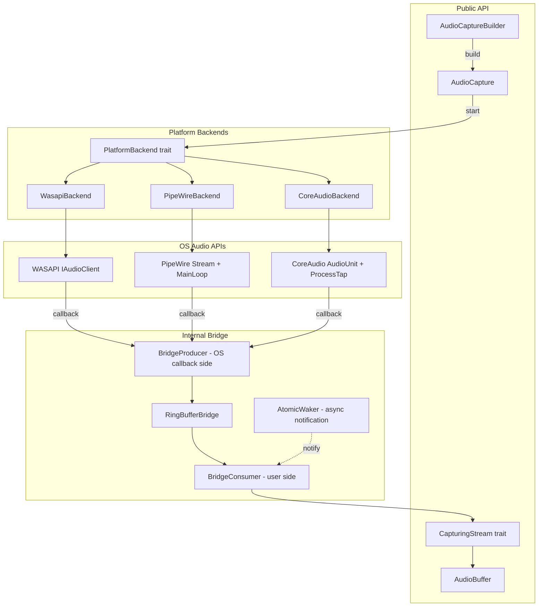

### Key Design Principle: Enum Dispatch over Trait Objects

The internal backend uses **compile-time `#[cfg]` dispatch** with a `PlatformStream` enum, not `Box<dyn PlatformBackend>`. This eliminates virtual dispatch overhead on the hot path and avoids object-safety constraints on internal traits while retaining the ability to use `Box<dyn CapturingStream>` at the public API boundary.

---

## 2. Internal Backend Trait Contract

### 2.1 `PlatformBackend` Trait

```rust
/// Internal contract that each platform audio backend must implement.
///
/// This trait is NOT object-safe by design — it uses associated types
/// and is dispatched via compile-time #[cfg]. Each platform has exactly
/// one implementation.
///
/// Lifetime: one PlatformBackend per AudioCapture session.
pub(crate) trait PlatformBackend {
    /// The platform-specific stream type.
    type Stream: PlatformStream;

    /// Creates a capture stream for the given resolved configuration.
    ///
    /// This is the core factory method. It:
    /// 1. Creates the RingBufferBridge
    /// 2. Sets up the OS audio pipeline (device, format negotiation)
    /// 3. Configures callbacks to write into the bridge producer
    /// 4. Returns a PlatformStream wrapping the bridge consumer
    ///
    /// The stream is created in a STOPPED state — `start()` must be
    /// called separately.
    fn create_stream(
        &self,
        config: &ResolvedConfig,
    ) -> AudioResult<Self::Stream>;

    /// Queries platform capabilities (static — no device interaction).
    fn capabilities(&self) -> &PlatformCapabilities;

    /// Enumerates audio devices.
    fn enumerate_devices(&self) -> AudioResult<Vec<DeviceInfo>>;

    /// Enumerates capturable applications.
    fn enumerate_applications(&self) -> AudioResult<Vec<CapturableApplication>>;

    /// Checks platform requirements (services running, OS version, etc).
    fn check_requirements(&self) -> std::result::Result<(), Vec<PlatformRequirement>>;
}
```

### 2.2 `PlatformStream` Trait

```rust
/// Internal stream contract produced by platform backends.
///
/// Each platform implements this trait on its concrete stream type.
/// The PlatformStream bridges to the public CapturingStream trait
/// via the BridgeStream adapter (Section 3).
///
/// Implementors own the OS-side resources and the bridge producer.
/// The bridge consumer is held by the BridgeStream wrapper.
pub(crate) trait PlatformStream: Send + Sync {
    /// Starts the OS audio pipeline. Callbacks begin writing to the ring buffer.
    fn start(&self) -> AudioResult<()>;

    /// Stops the OS audio pipeline. Callbacks cease.
    /// Unread data remains in the ring buffer.
    fn stop(&self) -> AudioResult<()>;

    /// Releases all OS resources. After this, start() cannot be called.
    fn close(&mut self) -> AudioResult<()>;

    /// Whether the OS audio pipeline is active.
    fn is_running(&self) -> bool;

    /// The negotiated audio format.
    fn format(&self) -> &AudioFormat;

    /// Estimated latency in frames, if the platform provides it.
    fn latency_frames(&self) -> Option<u64>;
}
```

### 2.3 Why Not Object-Safe?

| Approach | Pros | Cons |
|---|---|---|
| **`#[cfg]` dispatch + associated types** (chosen) | Zero-cost dispatch, full type info, no allocation | N platform impls compiled exclusively |
| **`Box<dyn PlatformBackend>`** | Runtime flexibility | Object-safety constraints, vtable overhead, fighting with associated types |
| **Enum dispatch** | Exhaustive matching, no vtable | Manual per-variant delegation boilerplate |

We use `#[cfg]` because only one platform compiles at a time. The `PlatformBackend` trait with associated types documents the contract while the `#[cfg]` blocks implement it. At the public boundary, we use `Box<dyn CapturingStream>` which IS object-safe.

---

## 3. Ring Buffer Bridge Pattern

### 3.1 Overview

The ring buffer bridge is the **single shared pattern** for all platforms. It decouples the OS real-time audio callback thread from the user's consumer thread using an `rtrb` SPSC lock-free ring buffer.

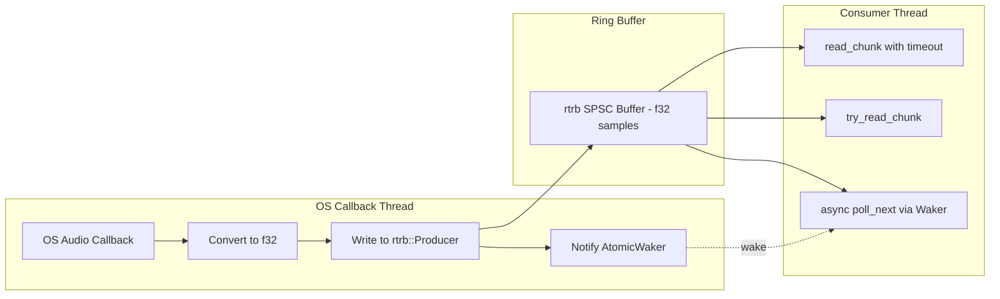

### 3.2 `RingBufferBridge` — Shared Infrastructure

```rust
use rtrb::{Consumer, Producer, RingBuffer};
use atomic_waker::AtomicWaker;
use std::sync::atomic::{AtomicBool, AtomicU64, Ordering};
use std::sync::Arc;

/// Shared state between the producer (OS callback) and consumer (user).
///
/// This struct holds atomic counters and the waker. Both the
/// BridgeProducer and BridgeConsumer hold an Arc to this.
pub(crate) struct BridgeShared {
    /// Waker for the async consumer. Set by poll_next, triggered by producer.
    pub waker: AtomicWaker,

    /// Monotonically increasing frame counter. Written by producer after
    /// each write. Consumer reads to compute frame_offset.
    pub frames_written: AtomicU64,

    /// Monotonically increasing sequence counter. Incremented by producer
    /// for each chunk written. Consumer compares to detect gaps.
    pub sequence: AtomicU64,

    /// Number of frames that were dropped because the ring buffer was full.
    /// Incremented by producer when write fails.
    pub frames_dropped: AtomicU64,

    /// Signal that the producer has stopped (no more data will arrive).
    pub producer_finished: AtomicBool,

    /// Signal to request the producer to stop.
    pub stop_requested: AtomicBool,

    /// The audio format of data in the ring buffer.
    /// Set once during creation, immutable thereafter.
    pub format: AudioFormat,
}

/// The producer side of the ring buffer bridge.
///
/// Held by the OS callback or the platform-specific capture thread.
/// Must be Send (crosses thread boundary to the callback thread).
/// Does NOT need to be Sync (only one producer).
pub(crate) struct BridgeProducer {
    /// The rtrb producer half.
    producer: Producer<f32>,
    /// Shared state with the consumer.
    shared: Arc<BridgeShared>,
}

/// The consumer side of the ring buffer bridge.
///
/// Held by the BridgeStream which implements CapturingStream.
/// Must be Send + Sync (CapturingStream requires it).
/// Sync is achieved by wrapping consumer reads in a Mutex.
pub(crate) struct BridgeConsumer {
    /// The rtrb consumer half, behind a Mutex for Sync.
    consumer: std::sync::Mutex<Consumer<f32>>,
    /// Shared state with the producer.
    shared: Arc<BridgeShared>,
    /// Frame counter on the consumer side for building AudioBuffer metadata.
    frames_read: AtomicU64,
    /// Sequence counter on the consumer side for detecting overruns.
    last_sequence: AtomicU64,
}

/// Creates a new ring buffer bridge pair.
///
/// # Arguments
/// * `capacity_frames` — Ring buffer capacity in frames (not samples).
///   Actual sample capacity = capacity_frames * channels.
/// * `format` — The audio format of data that will flow through the bridge.
///
/// # Returns
/// A (producer, consumer) pair. The producer goes to the OS callback;
/// the consumer wraps into a BridgeStream.
pub(crate) fn create_bridge(
    capacity_frames: u32,
    format: AudioFormat,
) -> (BridgeProducer, BridgeConsumer) {
    let capacity_samples = capacity_frames as usize * format.channels as usize;
    let (producer, consumer) = RingBuffer::new(capacity_samples);

    let shared = Arc::new(BridgeShared {
        waker: AtomicWaker::new(),
        frames_written: AtomicU64::new(0),
        sequence: AtomicU64::new(0),
        frames_dropped: AtomicU64::new(0),
        producer_finished: AtomicBool::new(false),
        stop_requested: AtomicBool::new(false),
        format,
    });

    let bridge_producer = BridgeProducer {
        producer,
        shared: Arc::clone(&shared),
    };

    let bridge_consumer = BridgeConsumer {
        consumer: std::sync::Mutex::new(consumer),
        shared,
        frames_read: AtomicU64::new(0),
        last_sequence: AtomicU64::new(0),
    };

    (bridge_producer, bridge_consumer)
}
```

### 3.3 Producer Side — OS Callback

```rust
impl BridgeProducer {
    /// Writes interleaved f32 samples into the ring buffer.
    ///
    /// Called from the OS audio callback thread. This function is
    /// designed for the real-time audio path:
    /// - No allocation
    /// - No locks (rtrb is lock-free)
    /// - No syscalls (wake is an atomic store + optional futex)
    ///
    /// # Arguments
    /// * `samples` — Interleaved f32 audio samples (frames * channels).
    ///
    /// # Returns
    /// Number of samples actually written. If less than `samples.len()`,
    /// an overrun occurred (consumer is too slow). Overrun frames are
    /// counted in `shared.frames_dropped`.
    pub fn write(&mut self, samples: &[f32]) -> usize {
        let channels = self.shared.format.channels as usize;
        debug_assert!(
            samples.len() % channels == 0,
            "sample count must be a multiple of channel count"
        );

        let available = self.producer.slots();
        let to_write = samples.len().min(available);

        if to_write < samples.len() {
            // Overrun: consumer is too slow
            let dropped_samples = samples.len() - to_write;
            let dropped_frames = dropped_samples / channels;
            self.shared
                .frames_dropped
                .fetch_add(dropped_frames as u64, Ordering::Relaxed);
        }

        if to_write > 0 {
            // Write using write_chunk_uninit for efficiency
            if let Ok(mut chunk) = self.producer.write_chunk_uninit(to_write) {
                let (s1, s2) = chunk.as_mut_slices();
                let first_len = s1.len();

                // Copy to first slice
                for (dst, src) in s1.iter_mut().zip(&samples[..first_len]) {
                    dst.write(*src);
                }
                // Copy to second slice (ring buffer wrap-around)
                for (dst, src) in s2.iter_mut().zip(&samples[first_len..to_write]) {
                    dst.write(*src);
                }

                // SAFETY: we just initialized all slots we're committing
                unsafe { chunk.commit_all(); }
            }

            let written_frames = to_write / channels;
            self.shared
                .frames_written
                .fetch_add(written_frames as u64, Ordering::Release);
            self.shared
                .sequence
                .fetch_add(1, Ordering::Release);
        }

        // Wake the async consumer (if any)
        self.shared.waker.wake();

        to_write
    }

    /// Signals that the producer will not write any more data.
    /// The consumer will drain remaining data and then report StreamClosed.
    pub fn finish(&self) {
        self.shared.producer_finished.store(true, Ordering::Release);
        self.shared.waker.wake();
    }

    /// Checks if the consumer has requested a stop.
    pub fn is_stop_requested(&self) -> bool {
        self.shared.stop_requested.load(Ordering::Acquire)
    }
}
```

### 3.4 Consumer Side — User Reads

```rust
impl BridgeConsumer {
    /// Reads available audio data, blocking up to `timeout`.
    ///
    /// Returns an AudioBuffer with metadata (frame_offset, sequence, timestamp).
    /// Returns Ok(None) if timeout elapsed with no data.
    /// Returns Err(StreamClosed) if the producer has finished and buffer is drained.
    /// Returns Err(BufferOverrun) as a warning if frames were dropped since last read.
    pub fn read_chunk(
        &self,
        timeout: std::time::Duration,
    ) -> AudioResult<Option<AudioBuffer>> {
        let deadline = std::time::Instant::now() + timeout;
        let channels = self.shared.format.channels as usize;

        loop {
            // Try to read available data
            if let Some(buffer) = self.try_read_inner(channels)? {
                return Ok(Some(buffer));
            }

            // Check if producer is done
            if self.shared.producer_finished.load(Ordering::Acquire) {
                // Try one last drain
                if let Some(buffer) = self.try_read_inner(channels)? {
                    return Ok(Some(buffer));
                }
                return Err(AudioError::StreamClosed);
            }

            // Wait with timeout
            let remaining = deadline.saturating_duration_since(std::time::Instant::now());
            if remaining.is_zero() {
                return Ok(None);
            }

            // Park the thread briefly and retry
            std::thread::park_timeout(remaining.min(
                std::time::Duration::from_millis(10)
            ));
        }
    }

    /// Non-blocking read attempt.
    pub fn try_read_chunk(&self) -> AudioResult<Option<AudioBuffer>> {
        let channels = self.shared.format.channels as usize;
        self.try_read_inner(channels)
    }

    /// Internal read that locks the consumer and reads whatever is available.
    fn try_read_inner(
        &self,
        channels: usize,
    ) -> AudioResult<Option<AudioBuffer>> {
        let mut consumer = self.consumer
            .lock()
            .map_err(|_| AudioError::Backend(
                BackendContext::new("BridgeConsumer::try_read_inner")
                    .with_message("consumer mutex poisoned")
            ))?;

        let available = consumer.slots();
        if available == 0 {
            // Check for overrun notification
            let dropped = self.shared.frames_dropped.swap(0, Ordering::Relaxed);
            if dropped > 0 {
                return Err(AudioError::BufferOverrun);
            }
            return Ok(None);
        }

        // Round down to complete frames
        let samples_to_read = (available / channels) * channels;
        if samples_to_read == 0 {
            return Ok(None);
        }

        // Read from ring buffer
        let chunk = consumer
            .read_chunk(samples_to_read)
            .map_err(|_| AudioError::Backend(
                BackendContext::new("BridgeConsumer::try_read_inner")
                    .with_message("rtrb read_chunk failed")
            ))?;

        let mut samples = Vec::with_capacity(samples_to_read);
        let (s1, s2) = chunk.as_slices();
        samples.extend_from_slice(s1);
        samples.extend_from_slice(s2);
        chunk.commit_all();

        let frames = samples_to_read / channels;
        let frame_offset = self.frames_read
            .fetch_add(frames as u64, Ordering::Relaxed);
        let current_seq = self.shared.sequence.load(Ordering::Acquire);
        let last_seq = self.last_sequence
            .swap(current_seq, Ordering::Relaxed);

        Ok(Some(AudioBuffer::new(
            samples,
            self.shared.format.clone(),
            frame_offset,
            None, // Timestamp: platform-specific, added by wrapper if available
            current_seq,
        )))
    }
}
```

### 3.5 Buffer Sizing

| Parameter | Default | Rationale |
|---|---|---|
| Ring buffer capacity | 16384 frames | ~341ms at 48kHz stereo. Large enough for bursty consumers |
| Minimum ring buffer | 4× `buffer_size_frames` | Ensures at least 4 callback periods of headroom |
| OS callback buffer | 512 frames (platform decides) | ~10.7ms at 48kHz. Balance of latency vs CPU |

```rust
/// Calculates the ring buffer capacity in frames.
pub(crate) fn calculate_ring_buffer_capacity(
    requested: Option<u32>,
    callback_buffer: u32,
    _format: &AudioFormat,
) -> u32 {
    const DEFAULT_RING_FRAMES: u32 = 16384;
    const MIN_HEADROOM_FACTOR: u32 = 4;

    let base = requested.unwrap_or(DEFAULT_RING_FRAMES);
    let minimum = callback_buffer * MIN_HEADROOM_FACTOR;

    base.max(minimum).next_power_of_two()
}
```

### 3.6 Overrun Handling

When the ring buffer is full (consumer too slow):

1. **Producer side**: counts dropped frames in `frames_dropped` atomic. Does NOT block. Does NOT overwrite old data (the oldest data is preserved).
2. **Consumer side**: on next `read_chunk()`, if `frames_dropped > 0`, returns `Err(AudioError::BufferOverrun)`. The consumer should clear/acknowledge and retry. Subsequent reads return fresh data.
3. **Sequence numbers**: the consumer can also detect gaps by checking `AudioBuffer::sequence()` — non-consecutive numbers indicate lost chunks.

### 3.7 Underrun Handling

When the consumer reads but no data is available:

1. **`read_chunk(timeout)`**: parks the thread and retries in 10ms intervals until timeout.
2. **`try_read_chunk()`**: returns `Ok(None)` immediately.
3. **Async `poll_next`**: registers a `Waker` via `AtomicWaker`. The producer calls `waker.wake()` after each write, causing the async runtime to re-poll.

### 3.8 Format Conversion

Sample format conversion happens **in the OS callback**, before writing to the ring buffer. The ring buffer always contains interleaved `f32` samples.

```
OS provides i16 → callback converts to f32 → writes f32 to ring buffer
OS provides f32 → callback writes directly → no conversion needed
OS provides i24 → callback converts to f32 → writes f32 to ring buffer
```

This design means:
- The consumer always receives `Vec<f32>` — simple and predictable.
- Conversion happens on the real-time thread, which is acceptable because int→float conversion is trivial (no allocation, no branching).
- The ring buffer size is always in terms of `f32` elements, simplifying capacity math.

---

## 4. Thread Safety Architecture

### 4.1 General Requirements

| Type | Send | Sync | Mechanism |
|---|---|---|---|
| `AudioCapture` | Yes | Yes | Interior mutability via `Mutex` / `AtomicState` |
| `CapturingStream` (public trait) | Yes | Yes | Required by trait bounds |
| `BridgeProducer` | Yes | No | Only one producer; crosses to callback thread |
| `BridgeConsumer` | Yes | Yes | `Consumer<f32>` behind `Mutex` |
| `BridgeShared` | Yes | Yes | All fields are atomic or `AtomicWaker` |

### 4.2 PipeWire `!Send` Problem & Solution

#### The Problem

PipeWire's Rust crate types (`MainLoop`, `Context`, `Core`, `Registry`, `Stream`) use `Rc` internally, making them `!Send` and `!Sync`. They cannot be moved between threads or shared.

The current code in [`pipewire.rs`](../../src/audio/linux/pipewire.rs) creates all PipeWire objects on the calling thread and runs `main_loop.loop_().iterate()` in a polling loop. This works for single-threaded usage but **cannot implement `CapturingStream: Send + Sync`**.

#### The Solution: Dedicated PipeWire Thread with Message Passing

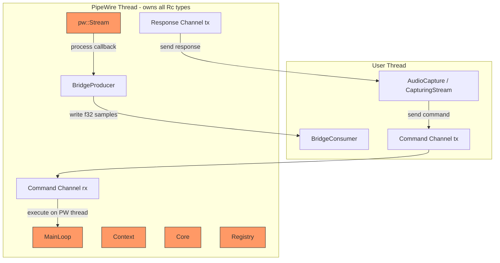

#### Implementation Design

```rust
/// Commands sent from the user thread to the PipeWire thread.
#[derive(Debug)]
pub(crate) enum PipeWireCommand {
    /// Create and connect a capture stream for the given target.
    CreateStream {
        config: ResolvedConfig,
        producer: BridgeProducer,
        response: oneshot::Sender<AudioResult<PipeWireStreamInfo>>,
    },
    /// Start the capture stream (callbacks begin).
    Start {
        response: oneshot::Sender<AudioResult<()>>,
    },
    /// Stop the capture stream (callbacks cease).
    Stop {
        response: oneshot::Sender<AudioResult<()>>,
    },
    /// Query the negotiated audio format.
    QueryFormat {
        response: oneshot::Sender<AudioResult<AudioFormat>>,
    },
    /// Shutdown: stop stream, release resources, exit thread.
    Shutdown,
}

/// Information returned after stream creation.
#[derive(Debug)]
pub(crate) struct PipeWireStreamInfo {
    /// The negotiated audio format.
    pub format: AudioFormat,
    /// Estimated latency in frames.
    pub latency_frames: Option<u64>,
}

/// Manages the dedicated PipeWire thread.
///
/// This struct is Send + Sync because it only holds the command channel sender
/// and thread join handle — all PipeWire Rc objects live on the dedicated thread.
pub(crate) struct PipeWireThread {
    /// Channel to send commands to the PipeWire thread.
    command_tx: std::sync::mpsc::Sender<PipeWireCommand>,
    /// Handle of the dedicated thread (for join on shutdown).
    thread_handle: Option<std::thread::JoinHandle<()>>,
}

// SAFETY: PipeWireThread contains only Send types
// (mpsc::Sender is Send, JoinHandle is Send).
// The Rc types live exclusively on the PipeWire thread.
unsafe impl Sync for PipeWireThread {}

impl PipeWireThread {
    /// Spawns the dedicated PipeWire thread.
    pub fn spawn() -> AudioResult<Self> {
        let (command_tx, command_rx) = std::sync::mpsc::channel();

        let thread_handle = std::thread::Builder::new()
            .name("rsac-pipewire".into())
            .spawn(move || {
                Self::thread_main(command_rx);
            })
            .map_err(|e| AudioError::Backend(
                BackendContext::new("PipeWireThread::spawn")
                    .with_message(format!("failed to spawn PipeWire thread: {}", e))
            ))?;

        Ok(Self {
            command_tx,
            thread_handle: Some(thread_handle),
        })
    }

    /// The PipeWire thread's main function.
    ///
    /// All PipeWire Rc objects are created and live here.
    /// Commands are received via mpsc channel and executed inline.
    fn thread_main(command_rx: std::sync::mpsc::Receiver<PipeWireCommand>) {
        // Initialize PipeWire
        // pipewire::init() must be called before any PipeWire API use.

        let main_loop = match MainLoop::new(None) {
            Ok(ml) => ml,
            Err(e) => {
                log::error!("Failed to create PipeWire MainLoop: {}", e);
                return;
            }
        };
        let context = match Context::new(&main_loop) {
            Ok(ctx) => ctx,
            Err(e) => {
                log::error!("Failed to create PipeWire Context: {}", e);
                return;
            }
        };
        let core = match context.connect(None) {
            Ok(c) => c,
            Err(e) => {
                log::error!("Failed to connect PipeWire Core: {}", e);
                return;
            }
        };

        let mut stream: Option<Rc<pipewire::stream::Stream>> = None;
        let mut listener: Option<pipewire::stream::StreamListener<StreamData>> = None;

        // Main loop: process PipeWire events and check for commands
        'outer: loop {
            // Process incoming commands (non-blocking)
            while let Ok(cmd) = command_rx.try_recv() {
                match cmd {
                    PipeWireCommand::CreateStream { config, producer, response } => {
                        let result = Self::handle_create_stream(
                            &core, &config, producer,
                            &mut stream, &mut listener,
                        );
                        let _ = response.send(result);
                    }
                    PipeWireCommand::Start { response } => {
                        // Stream connect is done during create; "start" is
                        // ensuring the main loop runs.
                        let _ = response.send(Ok(()));
                    }
                    PipeWireCommand::Stop { response } => {
                        if let Some(s) = stream.take() {
                            s.disconnect().ok();
                        }
                        listener = None;
                        let _ = response.send(Ok(()));
                    }
                    PipeWireCommand::QueryFormat { response } => {
                        // Read from stream data or stored format
                        let _ = response.send(Err(AudioError::StreamNotStarted));
                    }
                    PipeWireCommand::Shutdown => {
                        if let Some(s) = stream.take() {
                            s.disconnect().ok();
                        }
                        listener = None;
                        break 'outer;
                    }
                }
            }

            // Run one iteration of the PipeWire main loop (100ms timeout)
            // This processes callbacks, format negotiations, etc.
            let result = main_loop.loop_().iterate(
                std::time::Duration::from_millis(100)
            );
            if result < 0 {
                log::warn!("PipeWire main loop iteration failed: {}", result);
                break;
            }
        }

        // Cleanup happens via Drop when locals go out of scope
    }

    fn handle_create_stream(
        core: &Core,
        config: &ResolvedConfig,
        producer: BridgeProducer,
        stream_slot: &mut Option<Rc<pipewire::stream::Stream>>,
        listener_slot: &mut Option<pipewire::stream::StreamListener<StreamData>>,
    ) -> AudioResult<PipeWireStreamInfo> {
        // Create stream with properties based on CaptureTarget
        // Set up listener with process callback that writes to producer
        // Connect stream
        // Return negotiated format info
        todo!("Implementation follows existing pipewire.rs patterns")
    }

    /// Sends a command and waits for the response.
    fn send_command<T>(
        &self,
        build_cmd: impl FnOnce(oneshot::Sender<AudioResult<T>>) -> PipeWireCommand,
    ) -> AudioResult<T> {
        let (response_tx, response_rx) = oneshot::channel();
        self.command_tx
            .send(build_cmd(response_tx))
            .map_err(|_| AudioError::StreamClosed)?;
        response_rx
            .recv()
            .map_err(|_| AudioError::StreamClosed)?
    }
}

impl Drop for PipeWireThread {
    fn drop(&mut self) {
        // Send shutdown command
        let _ = self.command_tx.send(PipeWireCommand::Shutdown);
        // Wait for thread to exit (with timeout)
        if let Some(handle) = self.thread_handle.take() {
            let _ = handle.join();
        }
    }
}
```

#### Key Design Decisions for PipeWire

1. **All `Rc` objects live on the dedicated thread** — never shared or moved.
2. **Communication via `mpsc` channel** — commands go in, responses come back via oneshot.
3. **`BridgeProducer` is `Send`** and moves to the PipeWire thread. It writes from the process callback (which runs on the PipeWire loop iteration).
4. **`BridgeConsumer` stays on the user side** — wrapped in `BridgeStream` which implements `CapturingStream: Send + Sync`.
5. **The ring buffer (`rtrb`) is the only data path crossing threads** — it is lock-free and both Producer/Consumer are `Send`.

### 4.3 Windows COM Threading

```rust
/// COM initialization wrapper for Windows.
///
/// Initializes COM as MTA (Multi-Threaded Apartment) on creation,
/// calls CoUninitialize on drop. Each thread that uses COM must
/// have its own initialization.
pub(crate) struct ComGuard {
    _marker: std::marker::PhantomData<*mut ()>, // !Send — per-thread
}

impl ComGuard {
    /// Initialize COM for the current thread.
    pub fn new_mta() -> AudioResult<Self> {
        // SAFETY: CoInitializeEx is the standard COM initialization.
        let hr = unsafe { CoInitializeEx(None, COINIT_MULTITHREADED) };
        if hr.is_err() && hr != RPC_E_CHANGED_MODE {
            return Err(wasapi_error("CoInitializeEx", hr.into()));
        }
        Ok(Self { _marker: std::marker::PhantomData })
    }
}

impl Drop for ComGuard {
    fn drop(&mut self) {
        unsafe { CoUninitialize(); }
    }
}
```

**Windows capture thread model:**

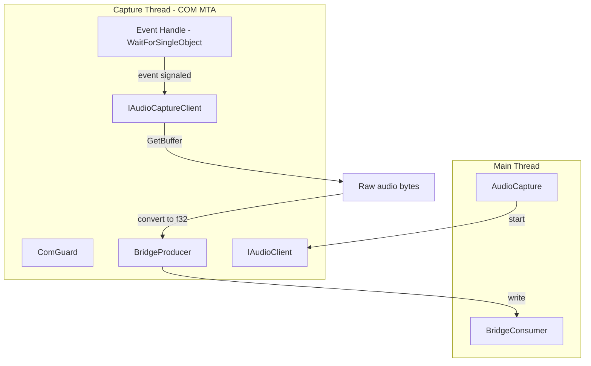

The Windows capture loop runs on a dedicated thread with:
1. MTA COM initialization at thread start.
2. An event handle (`CreateEventW`) for WASAPI event-driven capture.
3. `WaitForSingleObject` blocks until a buffer is ready.
4. `IAudioCaptureClient::GetBuffer` retrieves raw audio.
5. Conversion to f32 + write to `BridgeProducer`.
6. COM resources cleaned up on thread exit (`ComGuard::drop` calls `CoUninitialize`).

### 4.4 macOS CoreAudio Threading

macOS CoreAudio uses an `AudioUnit` render callback that fires on a CoreAudio-managed real-time thread. The callback receives raw audio and writes to the `BridgeProducer`.

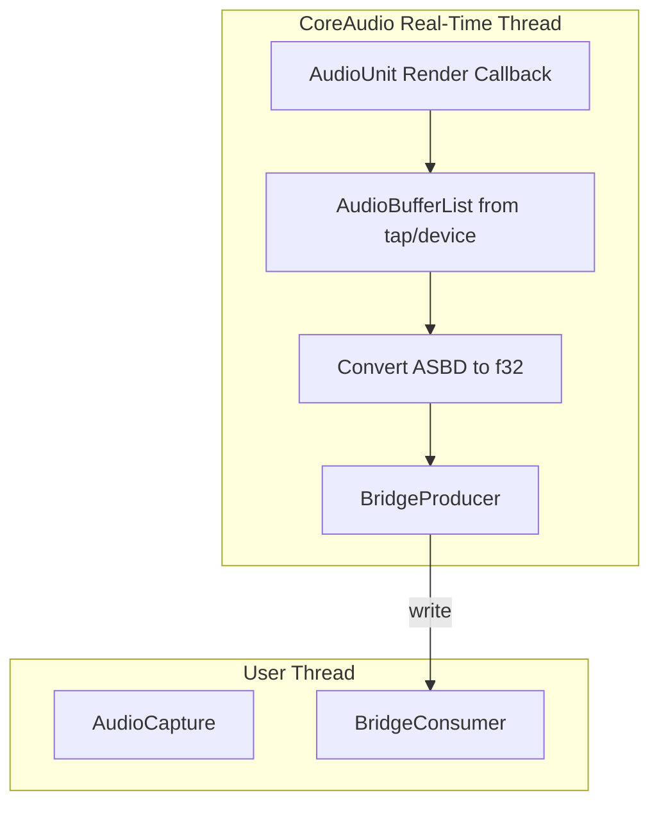

Key considerations:
- The render callback is invoked by CoreAudio — we do NOT create a dedicated thread.
- The `BridgeProducer` is moved into the callback closure.
- The callback must be `'static + Send` — `BridgeProducer` satisfies both.
- `AudioUnit` start/stop is called from the user thread.
- Process Tap lifecycle (create/destroy aggregate device) is on the user thread.

---

## 5. Stream Creation & Dispatch

### 5.1 `CaptureTarget` → Platform Path Mapping

```rust
/// How each CaptureTarget variant maps to platform-specific creation logic.
impl WasapiBackendImpl {
    fn create_stream(&self, config: &ResolvedConfig) -> AudioResult<WasapiStream> {
        match &config.target {
            CaptureTarget::SystemDefault => {
                // Get default render endpoint → IAudioClient in loopback mode
                self.create_loopback_stream(None, config)
            }
            CaptureTarget::Device { id } => {
                // IMMDeviceEnumerator::GetDevice(id) → IAudioClient in loopback mode
                self.create_loopback_stream(Some(id), config)
            }
            CaptureTarget::Application { pid } => {
                // ActivateAudioInterfaceAsync with PROCESS_LOOPBACK params
                self.create_process_loopback_stream(*pid, false, config)
            }
            CaptureTarget::ApplicationByName { name } => {
                // Resolve name → PID via session enumeration, then same as Application
                let pid = self.resolve_application_pid(name)?;
                self.create_process_loopback_stream(pid, false, config)
            }
            CaptureTarget::ProcessTree { root_pid } => {
                // Same as Application but with INCLUDE_TARGET_PROCESS_TREE flag
                self.create_process_loopback_stream(*root_pid, true, config)
            }
        }
    }
}
```

Similar dispatch exists for each platform. Platform-specific details:

| Target | Windows | Linux | macOS |
|---|---|---|---|
| SystemDefault | Loopback on default render endpoint | Monitor of default sink node | Process Tap all-process aggregate |
| Device | Loopback on specific endpoint | Monitor of specific PW node | AudioUnit on specific device |
| Application | Process Loopback Capture | Monitor stream on app node | Process Tap with single PID |
| ApplicationByName | Resolve via session enum → Process Loopback | Resolve via `application.name` → monitor | NSRunningApplication → Process Tap |
| ProcessTree | Process Loopback with tree flag | Multiple monitors (root + /proc children) | Process Tap with PID list |

### 5.2 Stream State Machine

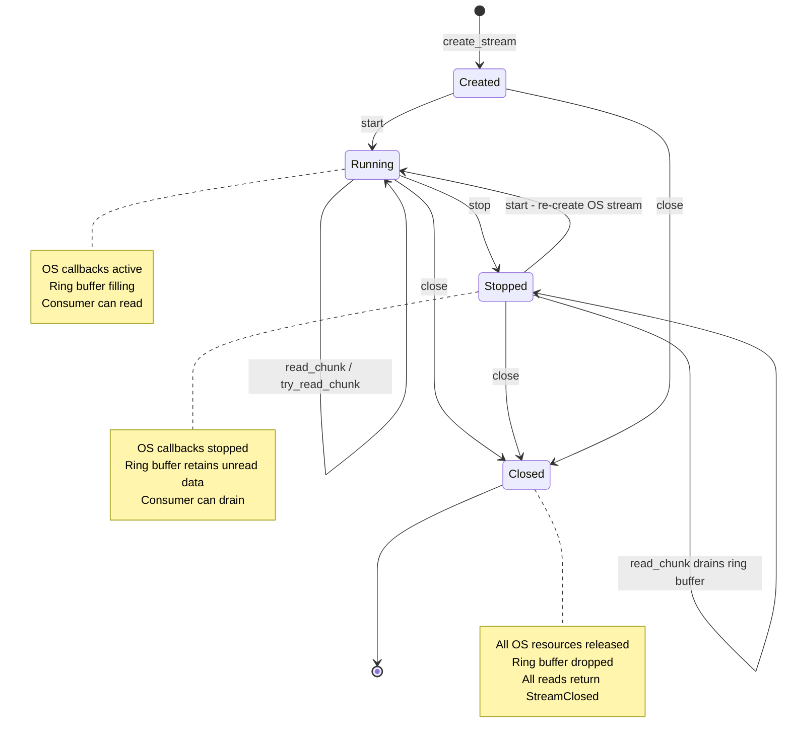

State transitions are tracked via `AtomicU8`:

```rust
/// Stream lifecycle states.
#[repr(u8)]
#[derive(Debug, Clone, Copy, PartialEq, Eq)]
pub(crate) enum StreamState {
    Created = 0,
    Running = 1,
    Stopped = 2,
    Closed  = 3,
}

/// Atomic stream state for lock-free state checking.
pub(crate) struct AtomicStreamState(AtomicU8);

impl AtomicStreamState {
    pub fn new(state: StreamState) -> Self {
        Self(AtomicU8::new(state as u8))
    }

    pub fn get(&self) -> StreamState {
        match self.0.load(Ordering::Acquire) {
            0 => StreamState::Created,
            1 => StreamState::Running,
            2 => StreamState::Stopped,
            3 => StreamState::Closed,
            _ => unreachable!(),
        }
    }

    /// Attempts to transition from `expected` to `new`.
    /// Returns Ok(()) if successful, Err with appropriate AudioError if not.
    pub fn transition(
        &self,
        expected: StreamState,
        new: StreamState,
    ) -> AudioResult<()> {
        self.0
            .compare_exchange(
                expected as u8,
                new as u8,
                Ordering::AcqRel,
                Ordering::Acquire,
            )
            .map(|_| ())
            .map_err(|actual| match actual {
                0 => AudioError::StreamNotStarted,
                1 => AudioError::StreamAlreadyRunning,
                3 => AudioError::StreamClosed,
                _ => AudioError::Backend(
                    BackendContext::new("StreamState::transition")
                        .with_message(format!(
                            "unexpected state {actual} during {expected:?} → {new:?}"
                        )),
                ),
            })
    }
}
```

---

## 6. Module Structure Design

### 6.1 Target Layout

```
src/
├── lib.rs                  — Public re-exports & prelude
├── api.rs                  — AudioCaptureBuilder, AudioCapture, factory fns
│
├── core/
│   ├── mod.rs              — Core module root
│   ├── error.rs            — AudioError, ErrorKind, BackendContext, AudioResult
│   ├── buffer.rs           — AudioBuffer, AudioBufferRef
│   ├── config.rs           — CaptureTarget, AudioFormat, SampleFormat, StreamConfig
│   ├── stream.rs           — CapturingStream trait (public)
│   ├── capability.rs       — PlatformCapabilities, PlatformRequirement
│   ├── enumerator.rs       — DeviceEnumerator, ApplicationEnumerator, DeviceInfo, etc.
│   └── sink.rs             — AudioSink trait + WavFileSink, ChannelSink, NullSink
│
├── bridge/
│   ├── mod.rs              — Bridge module root, re-exports
│   ├── ring_buffer.rs      — RingBufferBridge: create_bridge, BridgeProducer, BridgeConsumer
│   ├── bridge_stream.rs    — BridgeStream: impl CapturingStream backed by BridgeConsumer
│   └── async_bridge.rs     — AsyncBridgeStream: impl futures::Stream backed by BridgeConsumer
│
├── backend/
│   ├── mod.rs              — Platform backend dispatch (#[cfg] selection)
│   ├── traits.rs           — PlatformBackend, PlatformStream traits (internal)
│   ├── state.rs            — StreamState, AtomicStreamState
│   │
│   ├── windows/
│   │   ├── mod.rs          — Windows backend module root
│   │   ├── backend.rs      — WasapiBackendImpl: impl PlatformBackend
│   │   ├── stream.rs       — WasapiStream: impl PlatformStream (wraps capture thread)
│   │   ├── loopback.rs     — System/device loopback capture via IAudioClient
│   │   ├── process.rs      — Process loopback capture (ActivateAudioInterfaceAsync)
│   │   ├── discovery.rs    — Device + application enumeration via WASAPI
│   │   ├── com.rs          — ComGuard, COM initialization helpers
│   │   └── convert.rs      — WAVEFORMATEX ↔ AudioFormat, sample conversion
│   │
│   ├── linux/
│   │   ├── mod.rs          — Linux backend module root
│   │   ├── backend.rs      — PipeWireBackendImpl: impl PlatformBackend
│   │   ├── stream.rs       — PipeWireStream: impl PlatformStream (wraps PipeWireThread)
│   │   ├── thread.rs       — PipeWireThread: dedicated thread + command channel
│   │   ├── monitor.rs      — Monitor stream creation targeting nodes
│   │   ├── discovery.rs    — Device + application enumeration via PW registry / CLI
│   │   └── convert.rs      — spa_buffer → f32 conversion
│   │
│   └── macos/
│       ├── mod.rs          — macOS backend module root
│       ├── backend.rs      — CoreAudioBackendImpl: impl PlatformBackend
│       ├── stream.rs       — CoreAudioStream: impl PlatformStream (wraps AudioUnit)
│       ├── tap.rs          — Process Tap creation: CATapDescription, aggregate device
│       ├── discovery.rs    — Device + application enumeration via CoreAudio / NSWorkspace
│       └── convert.rs      — ASBD → f32 conversion
│
└── utils/
    ├── mod.rs
    └── process.rs          — process_exists(), get_child_pids() helpers
```

### 6.2 Module Responsibilities

| Module | Contains | Depends On | Exports |
|---|---|---|---|
| `core/error.rs` | `AudioError`, `ErrorKind`, `BackendContext`, `Recoverability`, `AudioResult` | `thiserror` | `pub` — re-exported from `lib.rs` |
| `core/buffer.rs` | `AudioBuffer`, `AudioBufferRef` | `core/config.rs` | `pub` |
| `core/config.rs` | `CaptureTarget`, `AudioFormat`, `SampleFormat`, `StreamConfig`, `ResolvedConfig` | — | `pub` |
| `core/stream.rs` | `CapturingStream` trait | `core/error.rs`, `core/buffer.rs`, `core/config.rs` | `pub` |
| `core/capability.rs` | `PlatformCapabilities`, `PlatformRequirement`, per-platform constants | `core/config.rs` | `pub` |
| `core/enumerator.rs` | `DeviceEnumerator`, `ApplicationEnumerator`, `DeviceInfo`, `CapturableApplication` | `core/error.rs`, `core/config.rs` | `pub` |
| `core/sink.rs` | `AudioSink` trait, `WavFileSink`, `ChannelSink`, `NullSink` | `core/error.rs`, `core/buffer.rs` | `pub` |
| `bridge/ring_buffer.rs` | `BridgeProducer`, `BridgeConsumer`, `BridgeShared`, `create_bridge()` | `rtrb`, `atomic-waker`, `core/config.rs`, `core/error.rs`, `core/buffer.rs` | `pub(crate)` |
| `bridge/bridge_stream.rs` | `BridgeStream` — implements `CapturingStream` by delegating to `BridgeConsumer` + `PlatformStream` | `bridge/ring_buffer.rs`, `core/stream.rs`, `backend/traits.rs` | `pub(crate)` |
| `bridge/async_bridge.rs` | `AsyncBridgeStream` — implements `futures::Stream` backed by `BridgeConsumer` + `AtomicWaker` | `bridge/ring_buffer.rs`, `core/error.rs`, `core/buffer.rs` | `pub(crate)` |
| `backend/traits.rs` | `PlatformBackend`, `PlatformStream` traits | `core/*` | `pub(crate)` |
| `backend/state.rs` | `StreamState`, `AtomicStreamState` | `core/error.rs` | `pub(crate)` |
| `backend/windows/*` | WASAPI implementation | `core/*`, `bridge/*`, `backend/traits.rs` | `pub(crate)` within `backend` |
| `backend/linux/*` | PipeWire implementation | `core/*`, `bridge/*`, `backend/traits.rs` | `pub(crate)` within `backend` |
| `backend/macos/*` | CoreAudio implementation | `core/*`, `bridge/*`, `backend/traits.rs` | `pub(crate)` within `backend` |
| `api.rs` | `AudioCaptureBuilder`, `AudioCapture`, `AudioStream`, `AudioBufferIterator`, factory fns | `core/*`, `bridge/*`, `backend/mod.rs` | `pub` |

### 6.3 Module Dependency Graph

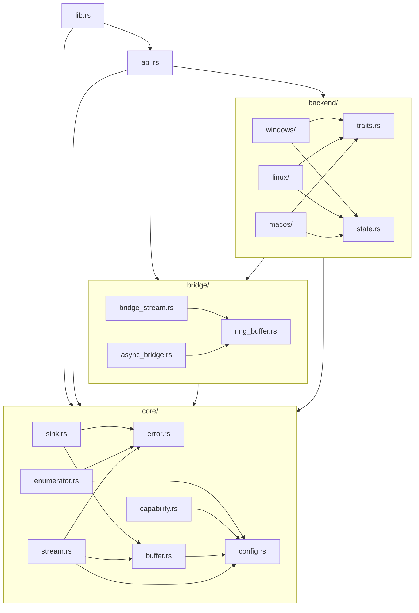

### 6.4 Platform-Specific vs Shared

| Component | Shared | Platform-Specific |
|---|---|---|
| Ring buffer bridge | ✅ `bridge/*` | — |
| Stream state machine | ✅ `backend/state.rs` | — |
| `CapturingStream` impl (`BridgeStream`) | ✅ `bridge/bridge_stream.rs` | — |
| Async stream adapter | ✅ `bridge/async_bridge.rs` | — |
| f32 conversion logic | — | Each platform converts from native format |
| OS audio API calls | — | Completely platform-specific |
| Device/app enumeration | Interface shared (`core/enumerator.rs`) | Implementation per platform |
| Process utilities | ✅ `utils/process.rs` | Platform-specific fallbacks |

---

## 7. Internal Factory Pattern

### 7.1 `AudioCaptureBuilder::build()` Flow

```rust
impl AudioCaptureBuilder {
    pub fn build(self) -> AudioResult<AudioCapture> {
        // 1. Get platform capabilities (compile-time selected)
        let caps = platform_capabilities();

        // 2. Check platform requirements
        if let Err(unmet) = check_platform_requirements() {
            return Err(AudioError::PlatformRequirementNotMet(
                unmet.iter().map(|r| r.to_string()).collect::<Vec<_>>().join("; ")
            ));
        }

        // 3. Validate config against capabilities
        self.validate_config(&caps)?;

        // 4. Resolve target (PID/name/device)
        let resolved_target = self.resolve_target()?;

        // 5. Build ResolvedConfig
        let resolved_config = self.build_resolved_config(&caps, &resolved_target)?;

        // 6. Create platform backend (compile-time #[cfg])
        let backend = create_platform_backend()?;

        // 7. Return AudioCapture in Created state
        Ok(AudioCapture {
            config: resolved_config,
            state: Arc::new(AtomicStreamState::new(StreamState::Created)),
            backend: std::sync::Mutex::new(Some(backend)),
            stream: std::sync::Mutex::new(None),
        })
    }
}
```

### 7.2 `AudioCapture::start()` Flow

```rust
impl AudioCapture {
    pub fn start(&self) -> AudioResult<()> {
        // 1. State transition: Created/Stopped → Running
        let current = self.state.get();
        match current {
            StreamState::Running => return Err(AudioError::StreamAlreadyRunning),
            StreamState::Closed => return Err(AudioError::StreamClosed),
            StreamState::Created | StreamState::Stopped => {}
        }

        // 2. Get backend (take from mutex temporarily)
        let mut backend_guard = self.backend.lock().unwrap();
        let backend = backend_guard.as_ref()
            .ok_or(AudioError::StreamClosed)?;

        // 3. Create platform stream via backend
        //    This creates the RingBufferBridge internally
        let platform_stream = backend.create_stream(&self.config)?;

        // 4. Wrap in BridgeStream (implements CapturingStream)
        //    BridgeStream holds the BridgeConsumer + platform stream reference
        let bridge_stream = BridgeStream::new(platform_stream);

        // 5. Start the OS audio pipeline
        bridge_stream.start()?;

        // 6. Store the stream
        let mut stream_guard = self.stream.lock().unwrap();
        *stream_guard = Some(Box::new(bridge_stream));

        // 7. Update state
        self.state.transition(current, StreamState::Running)?;

        Ok(())
    }
}
```

### 7.3 Platform Backend Selection

```rust
/// Creates the platform-specific backend.
///
/// This is compile-time dispatched — only one branch exists per target.
#[cfg(target_os = "windows")]
pub(crate) fn create_platform_backend() -> AudioResult<WasapiBackendImpl> {
    WasapiBackendImpl::new()
}

#[cfg(target_os = "linux")]
pub(crate) fn create_platform_backend() -> AudioResult<PipeWireBackendImpl> {
    PipeWireBackendImpl::new()
}

#[cfg(target_os = "macos")]
pub(crate) fn create_platform_backend() -> AudioResult<CoreAudioBackendImpl> {
    CoreAudioBackendImpl::new()
}
```

### 7.4 `BridgeStream` — The Universal Adapter

```rust
/// Wraps a platform-specific stream and a BridgeConsumer into a
/// CapturingStream implementation.
///
/// This is the ONLY type that implements CapturingStream in production.
/// All platform backends produce their PlatformStream, which gets wrapped
/// in a BridgeStream. The BridgeStream handles:
/// - State management (via AtomicStreamState)
/// - Reading from the ring buffer (via BridgeConsumer)
/// - Async stream creation (via AsyncBridgeStream)
/// - Delegating start/stop/close to the PlatformStream
pub(crate) struct BridgeStream<S: PlatformStream> {
    /// The platform-specific stream (owns OS resources + BridgeProducer).
    platform: std::sync::Mutex<S>,
    /// The consumer side of the ring buffer.
    consumer: BridgeConsumer,
    /// Lifecycle state.
    state: AtomicStreamState,
}

impl<S: PlatformStream> CapturingStream for BridgeStream<S> {
    fn start(&self) -> AudioResult<()> {
        self.state.transition(StreamState::Created, StreamState::Running)
            .or_else(|_| self.state.transition(StreamState::Stopped, StreamState::Running))?;
        let platform = self.platform.lock().unwrap();
        platform.start()
    }

    fn stop(&self) -> AudioResult<()> {
        self.state.transition(StreamState::Running, StreamState::Stopped)?;
        let platform = self.platform.lock().unwrap();
        platform.stop()
    }

    fn close(&mut self) -> AudioResult<()> {
        let prev = self.state.get();
        if prev == StreamState::Closed {
            return Ok(());
        }
        // Force transition to Closed from any state
        self.state.0.store(StreamState::Closed as u8, Ordering::Release);
        let mut platform = self.platform.lock().unwrap();
        platform.close()
    }

    fn is_running(&self) -> bool {
        self.state.get() == StreamState::Running
    }

    fn read_chunk(
        &self,
        timeout: std::time::Duration,
    ) -> AudioResult<Option<AudioBuffer>> {
        match self.state.get() {
            StreamState::Created => return Err(AudioError::StreamNotStarted),
            StreamState::Closed => return Err(AudioError::StreamClosed),
            StreamState::Running | StreamState::Stopped => {}
        }
        self.consumer.read_chunk(timeout)
    }

    fn try_read_chunk(&self) -> AudioResult<Option<AudioBuffer>> {
        match self.state.get() {
            StreamState::Created => return Err(AudioError::StreamNotStarted),
            StreamState::Closed => return Err(AudioError::StreamClosed),
            StreamState::Running | StreamState::Stopped => {}
        }
        self.consumer.try_read_chunk()
    }

    fn to_async_stream(&self) -> AudioResult<
        Pin<Box<dyn Stream<Item = AudioResult<AudioBuffer>> + Send + '_>>
    > {
        match self.state.get() {
            StreamState::Created => return Err(AudioError::StreamNotStarted),
            StreamState::Closed => return Err(AudioError::StreamClosed),
            _ => {}
        }
        Ok(Box::pin(AsyncBridgeStream::new(&self.consumer)))
    }

    fn format(&self) -> &AudioFormat {
        &self.consumer.shared.format
    }

    fn latency_frames(&self) -> Option<u64> {
        let platform = self.platform.lock().unwrap();
        platform.latency_frames()
    }
}

// BridgeStream is Send + Sync because:
// - S: PlatformStream is Send + Sync (required by trait bound)
// - Mutex<S> is Send + Sync
// - BridgeConsumer is Send + Sync (Consumer behind Mutex, shared is Arc<Atomics>)
// - AtomicStreamState is Send + Sync (AtomicU8)
```

---

## 8. Shutdown & Cleanup Contract

### 8.1 Graceful Shutdown Sequence

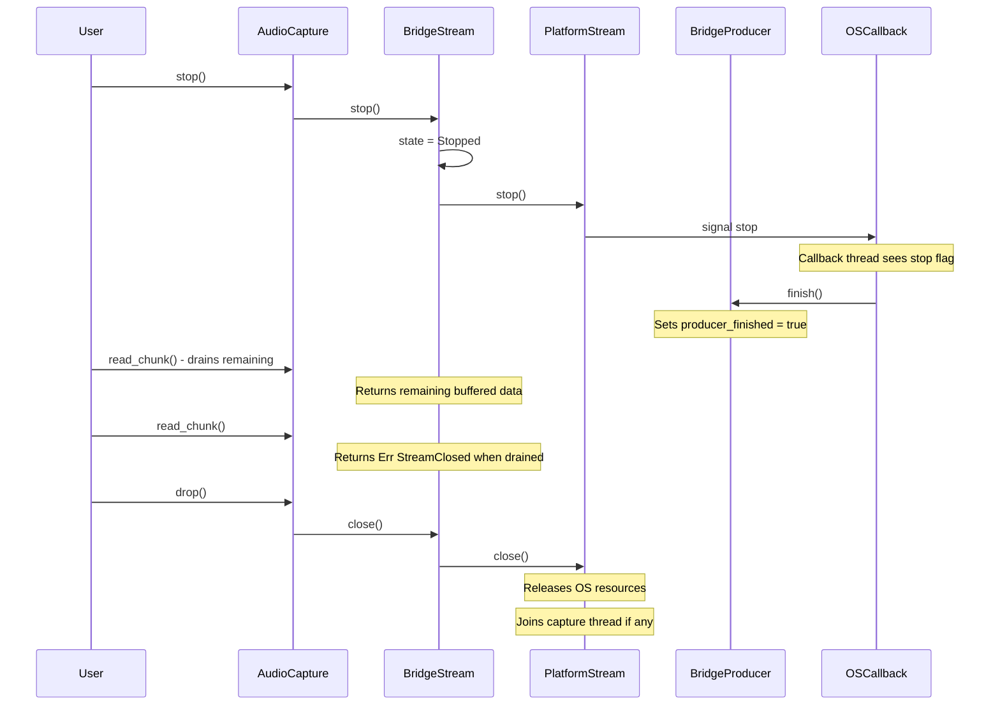

### 8.2 `stop()` Contract

1. **Signal the OS to stop audio callbacks** — platform-specific.
2. **Wait for the callback to confirm stop** — with 2-second timeout.
3. **Mark the bridge producer as finished** — `producer_finished = true`.
4. **Do NOT drain the ring buffer** — the consumer can read remaining data after `stop()`.
5. **State transitions** — Running → Stopped. Stopped allows re-`start()`.

### 8.3 `close()` Contract

1. **Stop if still running** — calls `stop()` internally.
2. **Release all OS resources**:
   - **Windows**: release `IAudioClient`, `IAudioCaptureClient`, close event handles, `CoUninitialize` on capture thread.
   - **Linux**: disconnect PipeWire stream, send `Shutdown` to `PipeWireThread`, join thread.
   - **macOS**: stop `AudioUnit`, dispose `AudioUnit`, destroy aggregate device, release Process Tap.
3. **Drop the ring buffer** — producer and consumer are dropped.
4. **State transitions** — any state → Closed. Subsequent calls are no-ops.

### 8.4 `Drop` Implementation

```rust
impl Drop for AudioCapture {
    fn drop(&mut self) {
        // Attempt graceful shutdown
        if let Some(mut stream) = self.stream.lock().ok().and_then(|mut g| g.take()) {
            // Try to stop first
            if self.state.get() == StreamState::Running {
                if let Err(e) = stream.stop() {
                    log::warn!("Error stopping stream during drop: {}", e);
                }
            }
            // Then close
            if let Err(e) = stream.close() {
                log::warn!("Error closing stream during drop: {}", e);
            }
        }
        // Errors are logged, never panicked
    }
}
```

### 8.5 Platform-Specific Cleanup Details

#### Windows Cleanup

```rust
impl Drop for WasapiStream {
    fn drop(&mut self) {
        // 1. Signal capture thread to stop
        self.stop_flag.store(true, Ordering::Release);

        // 2. Set event to unblock WaitForSingleObject
        if let Some(event) = &self.event_handle {
            unsafe { SetEvent(*event); }
        }

        // 3. Join capture thread (with 2s timeout)
        if let Some(handle) = self.capture_thread.take() {
            let _ = handle.join(); // Thread cleans up COM via ComGuard drop
        }

        // 4. Release WASAPI objects (Drop impls on COM pointers)
        // IAudioClient, IAudioCaptureClient, IMMDevice are released automatically

        // 5. Close event handle
        if let Some(event) = self.event_handle.take() {
            unsafe { CloseHandle(event); }
        }
    }
}
```

#### Linux Cleanup

```rust
impl Drop for PipeWireStream {
    fn drop(&mut self) {
        // PipeWireThread::drop sends Shutdown command and joins thread.
        // All Rc objects (MainLoop, Context, Core, Stream) are dropped
        // on the PipeWire thread when thread_main() returns.
        // No special cleanup needed here — PipeWireThread handles it.
    }
}
```

#### macOS Cleanup

```rust
impl Drop for CoreAudioStream {
    fn drop(&mut self) {
        // 1. Stop and dispose AudioUnit
        if self.is_started.load(Ordering::Acquire) {
            unsafe {
                AudioOutputUnitStop(self.audio_unit);
            }
        }
        unsafe {
            AudioComponentInstanceDispose(self.audio_unit);
        }

        // 2. Destroy Process Tap if created
        if let Some(tap_id) = self.tap_id {
            unsafe {
                AudioHardwareDestroyProcessTap(tap_id);
            }
        }

        // 3. Destroy aggregate device if created
        if let Some(aggregate_id) = self.aggregate_device_id {
            unsafe {
                AudioHardwareDestroyAggregateDevice(aggregate_id);
            }
        }
    }
}
```

### 8.6 Error During Shutdown

| Scenario | Handling |
|---|---|
| OS stop call fails | Log error, continue cleanup. Do not propagate from Drop. |
| Thread join times out | Log error, detach thread. Do not block indefinitely. |
| COM cleanup fails | Log error. Leak is preferable to crash. |
| PipeWire thread panics | `JoinHandle::join()` returns `Err` — log and continue. |
| Resource already released | No-op. Close/stop are idempotent. |

**Principle:** Shutdown errors are logged at `warn!` level but never propagate as panics. Resource leaks are tolerated over crashes. The `close()` method returns `AudioResult<()>` for callers who want to handle errors explicitly, but `Drop` silently swallows them.

---

## 9. Data Flow Diagrams

### 9.1 Complete Data Flow — System Capture

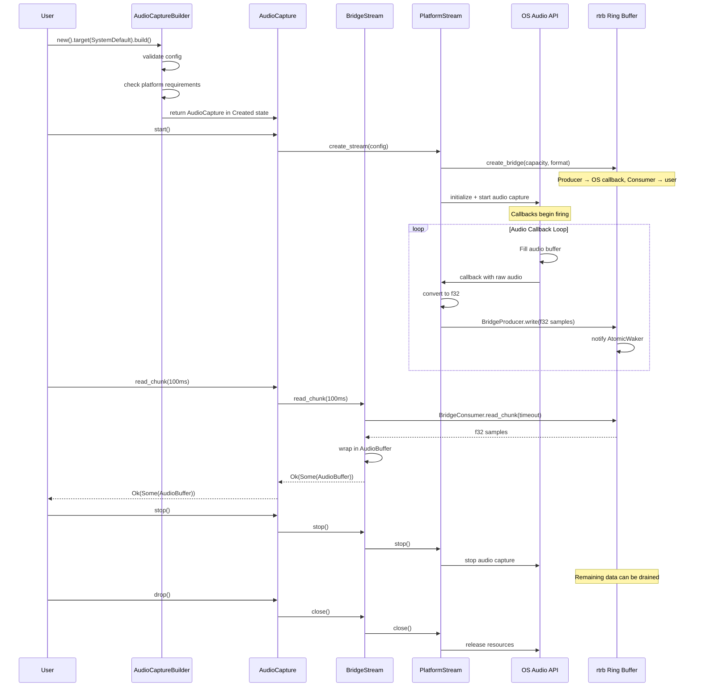

### 9.2 Async Stream Data Flow

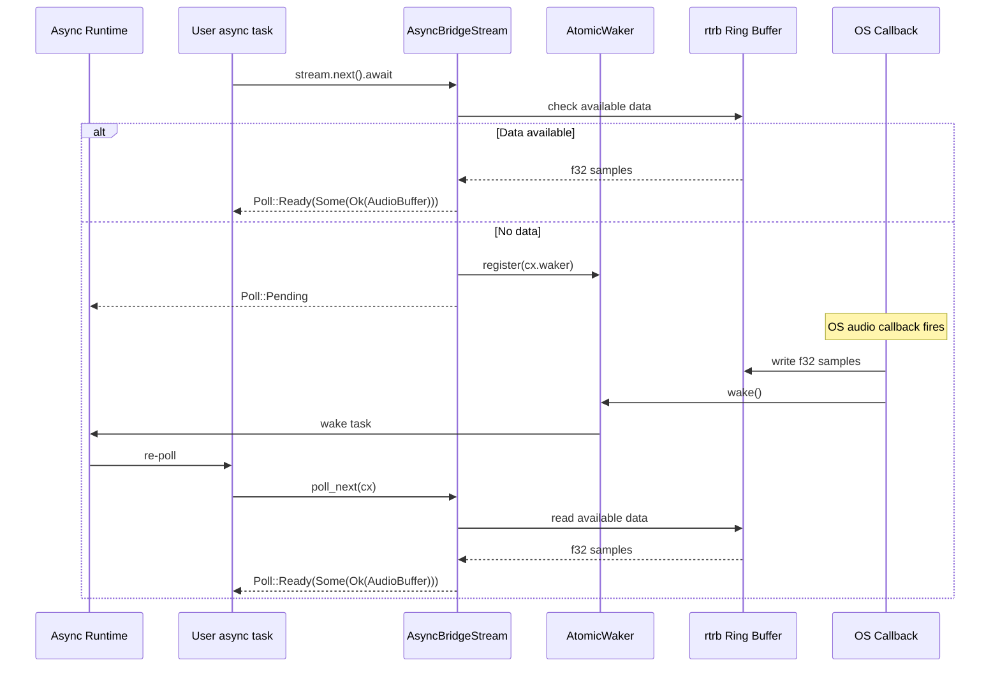

### 9.3 PipeWire Thread Communication

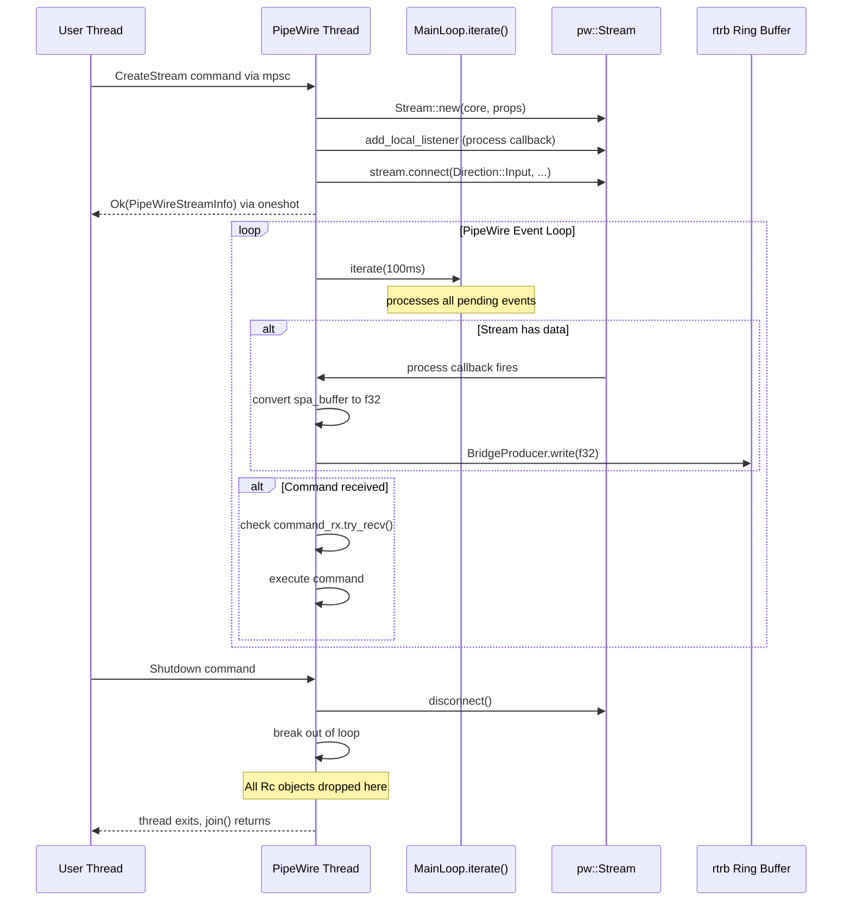

---

## 10. Design Rationale

### R1: Single `BridgeStream` vs Per-Platform `CapturingStream` Impls

**Decision:** One `BridgeStream<S: PlatformStream>` implements `CapturingStream` for all platforms.

**Why:** The current codebase has `WindowsAudioStream`, `MacosAudioStream`, and would need `LinuxAudioStream` — each independently implementing `CapturingStream` with duplicated ring buffer / polling / async logic. By factoring the bridge into a shared type, we eliminate ~500 lines of duplicated code per platform and guarantee uniform behavior.

### R2: `rtrb` Over Other Ring Buffers

**Decision:** Use `rtrb` (real-time ring buffer) as the SPSC queue.

| Alternative | Why Not |
|---|---|
| `ringbuf` crate | No `write_chunk_uninit` for zero-init batch writes |
| `crossbeam::channel` | Not a ring buffer; allocates per message |
| Custom ring buffer | More bugs, no community testing |
| `VecDeque` + `Mutex` | Mutex contention on the real-time thread — unacceptable |

`rtrb` is purpose-built for real-time audio: lock-free, no-alloc on hot path, efficient batch operations.

### R3: Dedicated PipeWire Thread vs `unsafe impl Send`

**Decision:** Dedicated thread with message passing.

**Why `unsafe impl Send` was rejected:**
- PipeWire's `Rc` types are `!Send` for a reason — they reference-count shared state that is not thread-safe.
- Wrapping them in `unsafe impl Send` would be unsound if any PipeWire API is accidentally called from another thread.
- The dedicated-thread approach is a well-established pattern (GTK, PipeWire, COM STA all use it).

**Trade-off:** Slightly more complexity and one extra thread per capture session on Linux. The latency impact is negligible because the data path uses the lock-free ring buffer, not the command channel.

### R4: Compile-Time `#[cfg]` vs Runtime Enum Dispatch

**Decision:** Compile-time `#[cfg]` for platform selection. The `PlatformBackend` trait is documented for the contract but only one implementation compiles per target.

**Why:**
- Cross-platform audio capture inherently requires different OS libraries. You cannot use WASAPI on Linux.
- Runtime dispatch adds a vtable indirection on every call — wasteful when the backend is fixed at compile time.
- The public API uses `Box<dyn CapturingStream>` which provides the necessary abstraction for users.

### R5: `BridgeConsumer` with `Mutex<Consumer<f32>>` vs Separate Reader Thread

**Decision:** `Mutex<Consumer<f32>>` for the consumer side.

**Why not a separate reader thread:**
- An extra thread per stream is wasteful for pull-mode consumers who call `read_chunk()` on their own thread.
- The `Mutex` is only contended if multiple threads call `read_chunk()` simultaneously — which is a documented anti-pattern (one consumer per stream).
- For the callback/sink modes, `AudioCapture` spawns a reader thread internally that holds the mutex exclusively.

The `Mutex` serves only to provide `Sync` (required by `CapturingStream: Sync`). In practice it is uncontended.

### R6: `AtomicStreamState` vs `Mutex<StreamState>`

**Decision:** Atomic `u8` with compare-exchange for state transitions.

**Why:**
- State checks (`is_running()`) are called frequently, often from the hot read path.
- `Mutex` would add unnecessary contention.
- CAS operations provide correctness guarantees for state transitions (e.g., only one thread can transition Created→Running).

### R7: New Dependencies

| Crate | Purpose | License |
|---|---|---|
| `rtrb` | Lock-free SPSC ring buffer | MIT/Apache-2.0 |
| `atomic-waker` | Cross-thread waker for async notification | MIT/Apache-2.0 |

Both crates are lightweight, well-maintained, and commonly used in the Rust audio ecosystem.

---

*End of Backend Contract & Internal Architecture Design*
