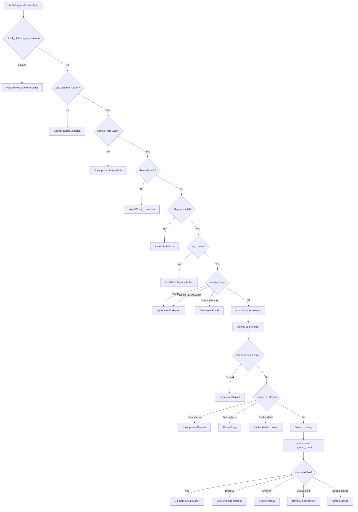

# Error Taxonomy & Capability Model Design — `rsac`

> **Status:** Design Document — Subtask B2
> **Depends on:** [API_DESIGN.md](API_DESIGN.md) (Subtask B1)
> **Priority Order:** Correctness → UX → Breadth

---

## Table of Contents

1. [Problem Statement](#1-problem-statement)
2. [Error Taxonomy — Categorized Hierarchy](#2-error-taxonomy--categorized-hierarchy)
3. [BackendContext — Structured OS Error Wrapping](#3-backendcontext--structured-os-error-wrapping)
4. [ErrorKind — Category-Level Matching](#4-errorkind--category-level-matching)
5. [Recoverability Classification](#5-recoverability-classification)
6. [Error Conversion Strategy](#6-error-conversion-strategy)
7. [Result Type Alias](#7-result-type-alias)
8. [Platform Capabilities Model](#8-platform-capabilities-model)
9. [Capability Querying](#9-capability-querying)
10. [Build-Time Validation](#10-build-time-validation)
11. [Platform Constraint Model](#11-platform-constraint-model)
12. [Feature Degradation Policy](#12-feature-degradation-policy)
13. [Error Variant Table](#13-error-variant-table)
14. [Platform Capability Matrix](#14-platform-capability-matrix)
15. [Validation Flow](#15-validation-flow)
16. [Migration Guide](#16-migration-guide)
17. [Design Rationale](#17-design-rationale)

---

## 1. Problem Statement

### Current Error Issues

The existing [`src/core/error.rs`](../../src/core/error.rs:8) has **28 variants** with these problems:

| Problem | Examples |
|---------|---------|
| **Duplicate variants** | `DeviceNotFound` + `DeviceNotFoundError`, `Timeout` + `TimeoutError` |
| **Conflicting types** | `ProcessError` in [`error.rs:185`](../../src/core/error.rs:185) vs [`processing.rs:5`](../../src/core/processing.rs:5) |
| **No categorization** | Flat enum — user cannot match config errors vs stream errors vs backend errors |
| **No recoverability signal** | No way to know if retry might succeed |
| **No source chaining** | `Error::source()` always returns `None` — HRESULT/OSStatus/errno are lost |
| **Ghost variants** | macOS backend uses `BackendSpecificError`, `SystemError`, `FormatNotSupported`, `PermissionDenied`, `DeviceDisconnected`, `MutexLockError`, `NotImplemented` — none exist in the enum |
| **String-only context** | `BackendError(String)` loses the OS error code |

### Design Goals

1. **Reduce** from 28 to ~17 well-defined variants with zero redundancy
2. **Categorize** errors so users can match at variant or category level
3. **Classify** each variant as recoverable or fatal
4. **Chain** OS-native error context without losing `Clone`
5. **Align** error variants 1:1 with the API types from [API_DESIGN.md](API_DESIGN.md)
6. **Remove** `ProcessError`, `AudioProcessor`, and ghost variants

---

## 2. Error Taxonomy — Categorized Hierarchy

### Decision: Flat Enum with `kind()` Method

We use a **flat `AudioError` enum** rather than nested enums. See [Rationale R1](#r1-flat-enum-vs-nested-enums) for the full analysis.

```rust
use std::fmt;

/// The canonical error type for all audio operations in rsac.
///
/// Variants are organized by category (config, device, application,
/// stream, platform, generic) but the enum itself is flat for ergonomic
/// matching. Use [`AudioError::kind()`] for category-level matching.
///
/// # Recoverability
///
/// Call [`AudioError::is_recoverable()`] to determine if retrying the
/// operation might succeed. Recoverable errors are transient conditions
/// (timeouts, temporary device busy) while fatal errors require
/// re-creation of the capture session.
#[derive(Debug, Clone, thiserror::Error)]
pub enum AudioError {
    // ========================================================
    // Configuration Errors — fail at build time
    // ========================================================

    /// A configuration parameter is invalid.
    ///
    /// Returned by `AudioCaptureBuilder::build()` when parameter
    /// validation fails. The message describes which parameter
    /// is invalid and what values are acceptable.
    #[error("invalid configuration: {message}")]
    InvalidConfig {
        /// Human-readable description of the invalid configuration.
        message: String,
    },

    /// The requested sample rate is not supported.
    ///
    /// Includes the requested rate and the set of valid rates so
    /// the user can correct their request without guessing.
    #[error("unsupported sample rate: {rate} Hz")]
    UnsupportedSampleRate {
        /// The sample rate that was requested.
        rate: u32,
    },

    /// The requested sample format is not supported by the device.
    #[error("unsupported sample format: {0}")]
    UnsupportedFormat(String),

    /// The requested buffer size is outside the valid range.
    #[error("invalid buffer size: {requested} frames (valid: {min}..={max})")]
    InvalidBufferSize {
        /// The buffer size that was requested.
        requested: u32,
        /// Minimum valid buffer size.
        min: u32,
        /// Maximum valid buffer size.
        max: u32,
    },

    // ========================================================
    // Device Errors — fail at build or start time
    // ========================================================

    /// The specified audio device could not be found.
    ///
    /// This includes both device-by-ID lookups and default device
    /// resolution. The message identifies which device was sought.
    #[error("device not found: {0}")]
    DeviceNotFound(String),

    /// The device is currently in exclusive use by another application.
    ///
    /// This is **recoverable** — the device may become available later.
    #[error("device busy: {0}")]
    DeviceBusy(String),

    /// The device was disconnected during an active capture session.
    ///
    /// This is **fatal** for the current session — the stream must
    /// be stopped and a new session created with a different device.
    #[error("device disconnected: {0}")]
    DeviceDisconnected(String),

    /// Device enumeration failed.
    ///
    /// Returned by `DeviceEnumerator` methods when the system
    /// cannot provide device information.
    #[error("device enumeration failed: {0}")]
    DeviceEnumerationFailed(String),

    // ========================================================
    // Application/Target Errors — fail at build or start time
    // ========================================================

    /// The target application could not be found.
    ///
    /// The PID does not exist, or no application matches the
    /// given name. For name lookups, consider listing available
    /// applications with `ApplicationEnumerator`.
    #[error("application not found: {0}")]
    ApplicationNotFound(String),

    /// The target application has no active audio session.
    ///
    /// The process exists but is not currently producing audio.
    /// This is **recoverable** — the application may start
    /// producing audio later.
    #[error("no audio session for application: {0}")]
    NoAudioSession(String),

    // ========================================================
    // Stream/Runtime Errors — fail during streaming
    // ========================================================

    /// The stream has not been started.
    ///
    /// Returned when `read_chunk()` or `try_read_chunk()` is
    /// called before `AudioCapture::start()`.
    #[error("stream not started")]
    StreamNotStarted,

    /// The stream is already running.
    ///
    /// Returned when `start()` is called on an already-started session.
    #[error("stream already running")]
    StreamAlreadyRunning,

    /// The stream has been closed and cannot be used.
    ///
    /// Returned after `stop()` + `drop`, or when reading from a
    /// stream whose producer side has terminated.
    #[error("stream closed")]
    StreamClosed,

    /// The consumer is too slow and audio data was lost.
    ///
    /// The ring buffer wrapped around before the consumer read
    /// the data. This is **recoverable** — subsequent reads will
    /// return fresh data. Check `AudioBuffer::sequence()` for gaps.
    #[error("buffer overrun: consumer too slow")]
    BufferOverrun,

    /// The operation timed out waiting for audio data.
    ///
    /// No data arrived within the specified timeout duration.
    /// This is **recoverable** — retry with a longer timeout
    /// or check that the audio source is active.
    #[error("timeout waiting for audio data")]
    Timeout,

    // ========================================================
    // Platform/Backend Errors
    // ========================================================

    /// The requested feature is not supported on this platform.
    ///
    /// Examples: application capture on an older Windows version,
    /// process tree capture on a platform that does not support it.
    /// Use `platform_capabilities()` to check before attempting.
    #[error("platform not supported: {0}")]
    PlatformNotSupported(String),

    /// A specific capability is not available.
    ///
    /// More granular than `PlatformNotSupported` — the platform
    /// is supported but the specific feature is not. Includes
    /// actionable guidance on what is missing.
    #[error("capability not supported: {0}")]
    CapabilityNotSupported(String),

    /// An error from the underlying audio backend (WASAPI, PipeWire, CoreAudio).
    ///
    /// Wraps a `BackendContext` with structured information about the
    /// OS-level failure, including the operation name, error message,
    /// and optional platform-specific error code.
    #[error("{0}")]
    Backend(BackendContext),

    /// The operation requires a permission that has not been granted.
    ///
    /// - **macOS:** Screen Recording / Audio Capture permission
    /// - **Linux:** PipeWire access policy
    /// - **Windows:** Audio endpoint access
    #[error("permission denied: {0}")]
    PermissionDenied(String),

    /// A platform requirement is not met.
    ///
    /// The OS version is too old, a required system service
    /// is not running, or a required framework is not available.
    /// The message includes actionable remediation steps.
    #[error("platform requirement not met: {0}")]
    PlatformRequirementNotMet(String),

    // ========================================================
    // Generic Errors
    // ========================================================

    /// An I/O error occurred (file, network, pipe).
    ///
    /// Typically from `AudioSink` implementations. Wraps the
    /// underlying error message.
    #[error("I/O error: {0}")]
    Io(String),
}
```

### What Was Removed

| Old Variant | Disposition | Replacement |
|---|---|---|
| `DeviceNotFoundError(String)` | Duplicate | `DeviceNotFound(String)` |
| `TimeoutError` | Duplicate | `Timeout` |
| `InvalidParameter(String)` | Merged | `InvalidConfig` |
| `InvalidStreamState(String)` | Merged | `StreamNotStarted` / `StreamAlreadyRunning` / `StreamClosed` |
| `ConfigurationError(String)` | Merged | `InvalidConfig` |
| `BufferError(String)` | Replaced | `BufferOverrun` (specific) |
| `BackendError(String)` | Upgraded | `Backend(BackendContext)` (structured) |
| `StreamOpenFailed(String)` | Merged | `Backend(...)` with operation context |
| `StreamStartFailed(String)` | Merged | `Backend(...)` with operation context |
| `StreamStopFailed(String)` | Merged | `Backend(...)` with operation context |
| `StreamPauseFailed(String)` | Removed | Pause not in new API |
| `StreamResumeFailed(String)` | Removed | Resume not in new API |
| `StreamCloseFailed(String)` | Merged | `Backend(...)` with operation context |
| `CallbackError(String)` | Removed | Callbacks are user-controlled; panics are caught |
| `NotInitialized(String)` | Merged | `Backend(...)` for internal init; `StreamNotStarted` for user |
| `AlreadyInitialized(String)` | Merged | `StreamAlreadyRunning` |
| `OperationAborted(String)` | Removed | Use `StreamClosed` |
| `IOError(String)` | Renamed | `Io(String)` |
| `Unknown(String)` | Removed | All errors must be categorized — use `Backend(...)` |
| `UnsupportedPlatform(String)` | Renamed | `PlatformNotSupported(String)` |
| `DeviceEnumerationError(String)` | Renamed | `DeviceEnumerationFailed(String)` |
| `InvalidOperation(String)` | Split | `StreamNotStarted` / `StreamAlreadyRunning` / `CapabilityNotSupported` |
| `StreamError(String)` | Removed | Use specific stream variants |
| `CaptureError(String)` | Removed | Use specific stream/backend variants |
| `RecordingError(String)` | Removed | Use `Backend(...)` or `Io(...)` |
| `ProcessError` (in error.rs) | Removed entirely | Not part of public API |
| `ProcessError` (in processing.rs) | Removed entirely | `AudioProcessor` trait removed |

---

## 3. BackendContext — Structured OS Error Wrapping

The current `BackendError(String)` loses OS error codes and operation context. The new `BackendContext` provides structured information while maintaining `Clone`.

```rust
/// Structured context for backend/OS-level errors.
///
/// Captures the operation that failed, a human-readable message,
/// and the platform-specific error code. This replaces the old
/// `BackendError(String)` with structured, debuggable context.
///
/// # Examples
///
/// ```rust
/// // From a Windows HRESULT
/// let ctx = BackendContext::new("IAudioClient::Start")
///     .with_message("Failed to start WASAPI audio client")
///     .with_os_error(0x88890004_u32 as i64); // AUDCLNT_E_DEVICE_IN_USE
///
/// // From a macOS OSStatus
/// let ctx = BackendContext::new("AudioUnitRender")
///     .with_message("Render callback failed")
///     .with_os_error(-10863); // kAudioUnitErr_CannotDoInCurrentContext
///
/// // From a Linux errno
/// let ctx = BackendContext::new("pw_stream_connect")
///     .with_message("PipeWire stream connection failed")
///     .with_os_error(13); // EACCES
/// ```
#[derive(Debug, Clone)]
pub struct BackendContext {
    /// The OS API operation that failed (e.g., "IAudioClient::Start",
    /// "AudioUnitRender", "pw_stream_connect").
    pub operation: String,

    /// Human-readable error description.
    pub message: String,

    /// Platform-specific error code, if available.
    ///
    /// - **Windows:** HRESULT (cast to i64)
    /// - **macOS:** OSStatus (i32, sign-extended to i64)
    /// - **Linux:** errno or PipeWire error code
    ///
    /// `None` if no numeric error code is available.
    pub os_error_code: Option<i64>,
}

impl BackendContext {
    /// Creates a new context for the given operation.
    pub fn new(operation: impl Into<String>) -> Self {
        BackendContext {
            operation: operation.into(),
            message: String::new(),
            os_error_code: None,
        }
    }

    /// Sets the human-readable error message.
    pub fn with_message(mut self, message: impl Into<String>) -> Self {
        self.message = message.into();
        self
    }

    /// Sets the platform-specific error code.
    pub fn with_os_error(mut self, code: i64) -> Self {
        self.os_error_code = Some(code);
        self
    }
}

impl fmt::Display for BackendContext {
    fn fmt(&self, f: &mut fmt::Formatter<'_>) -> fmt::Result {
        write!(f, "backend error in {}", self.operation)?;
        if !self.message.is_empty() {
            write!(f, ": {}", self.message)?;
        }
        if let Some(code) = self.os_error_code {
            write!(f, " (os error code: {:#x})", code)?;
        }
        Ok(())
    }
}
```

### Backend Convenience Constructors

Each platform backend provides helper functions to create `AudioError::Backend(...)`:

```rust
// -- Windows (src/audio/windows/error_helpers.rs) --

/// Wraps a Windows HRESULT into an AudioError::Backend.
pub(crate) fn wasapi_error(
    operation: &str,
    hr: windows::core::Error,
) -> AudioError {
    AudioError::Backend(
        BackendContext::new(operation)
            .with_message(hr.message().to_string_lossy())
            .with_os_error(hr.code().0 as i64),
    )
}

// -- macOS (src/audio/macos/error_helpers.rs) --

/// Wraps a CoreAudio OSStatus into an AudioError::Backend.
pub(crate) fn coreaudio_error(
    operation: &str,
    os_status: i32,
) -> AudioError {
    AudioError::Backend(
        BackendContext::new(operation)
            .with_message(format!("CoreAudio OSStatus: {}", os_status))
            .with_os_error(os_status as i64),
    )
}

// -- Linux (src/audio/linux/error_helpers.rs) --

/// Wraps a PipeWire/spa error into an AudioError::Backend.
pub(crate) fn pipewire_error(
    operation: &str,
    errno: i32,
) -> AudioError {
    AudioError::Backend(
        BackendContext::new(operation)
            .with_message(format!("PipeWire errno: {}", errno))
            .with_os_error(errno as i64),
    )
}
```

---

## 4. ErrorKind — Category-Level Matching

For users who need to match error categories rather than specific variants:

```rust
/// Error categories for broad matching.
///
/// Obtain via [`AudioError::kind()`]. Useful when you want to
/// handle "any device error" or "any config error" uniformly.
///
/// # Example
///
/// ```rust
/// match error.kind() {
///     ErrorKind::Config => eprintln!("Fix your configuration: {error}"),
///     ErrorKind::Device => eprintln!("Device issue: {error}"),
///     ErrorKind::Stream => retry_or_abort(error),
///     ErrorKind::Platform => eprintln!("Platform limitation: {error}"),
///     _ => eprintln!("Error: {error}"),
/// }
/// ```
#[derive(Debug, Clone, Copy, PartialEq, Eq, Hash)]
pub enum ErrorKind {
    /// Configuration validation errors (invalid params, unsupported formats).
    Config,
    /// Device-related errors (not found, busy, disconnected).
    Device,
    /// Application/target resolution errors.
    Application,
    /// Stream lifecycle and runtime errors.
    Stream,
    /// Platform backend and capability errors.
    Platform,
    /// I/O and other generic errors.
    Generic,
}

impl AudioError {
    /// Returns the category of this error.
    pub fn kind(&self) -> ErrorKind {
        match self {
            AudioError::InvalidConfig { .. }
            | AudioError::UnsupportedSampleRate { .. }
            | AudioError::UnsupportedFormat(_)
            | AudioError::InvalidBufferSize { .. } => ErrorKind::Config,

            AudioError::DeviceNotFound(_)
            | AudioError::DeviceBusy(_)
            | AudioError::DeviceDisconnected(_)
            | AudioError::DeviceEnumerationFailed(_) => ErrorKind::Device,

            AudioError::ApplicationNotFound(_)
            | AudioError::NoAudioSession(_) => ErrorKind::Application,

            AudioError::StreamNotStarted
            | AudioError::StreamAlreadyRunning
            | AudioError::StreamClosed
            | AudioError::BufferOverrun
            | AudioError::Timeout => ErrorKind::Stream,

            AudioError::PlatformNotSupported(_)
            | AudioError::CapabilityNotSupported(_)
            | AudioError::Backend(_)
            | AudioError::PermissionDenied(_)
            | AudioError::PlatformRequirementNotMet(_) => ErrorKind::Platform,

            AudioError::Io(_) => ErrorKind::Generic,
        }
    }
}
```

---

## 5. Recoverability Classification

```rust
/// Whether an error is recoverable (retry might succeed) or fatal
/// (the capture session must be recreated).
#[derive(Debug, Clone, Copy, PartialEq, Eq)]
pub enum Recoverability {
    /// Transient error — retrying the same operation may succeed.
    /// Examples: timeout, buffer overrun, device temporarily busy.
    Recoverable,

    /// Fatal error — the capture session is in an unusable state.
    /// The user must stop, drop, and recreate from the builder.
    /// Examples: device disconnected, unsupported platform feature.
    Fatal,

    /// The error indicates a programming mistake, not a runtime condition.
    /// Fix the code, not the runtime environment.
    /// Examples: invalid config, stream not started.
    UserError,
}

impl AudioError {
    /// Returns whether this error is recoverable, fatal, or a user error.
    ///
    /// # Example
    ///
    /// ```rust
    /// match capture.read_chunk(Duration::from_millis(100)) {
    ///     Err(e) if e.is_recoverable() => {
    ///         log::warn!("Transient error, retrying: {e}");
    ///         continue;
    ///     }
    ///     Err(e) => {
    ///         log::error!("Fatal error, must recreate session: {e}");
    ///         break;
    ///     }
    ///     Ok(buf) => process(buf),
    /// }
    /// ```
    pub fn recoverability(&self) -> Recoverability {
        match self {
            // === Recoverable (transient) ===
            AudioError::DeviceBusy(_) => Recoverability::Recoverable,
            AudioError::NoAudioSession(_) => Recoverability::Recoverable,
            AudioError::BufferOverrun => Recoverability::Recoverable,
            AudioError::Timeout => Recoverability::Recoverable,

            // === Fatal (session is broken) ===
            AudioError::DeviceDisconnected(_) => Recoverability::Fatal,
            AudioError::StreamClosed => Recoverability::Fatal,
            AudioError::PlatformNotSupported(_) => Recoverability::Fatal,
            AudioError::CapabilityNotSupported(_) => Recoverability::Fatal,
            AudioError::PermissionDenied(_) => Recoverability::Fatal,
            AudioError::PlatformRequirementNotMet(_) => Recoverability::Fatal,
            AudioError::Backend(_) => Recoverability::Fatal,

            // === User errors (fix the code) ===
            AudioError::InvalidConfig { .. } => Recoverability::UserError,
            AudioError::UnsupportedSampleRate { .. } => Recoverability::UserError,
            AudioError::UnsupportedFormat(_) => Recoverability::UserError,
            AudioError::InvalidBufferSize { .. } => Recoverability::UserError,
            AudioError::DeviceNotFound(_) => Recoverability::UserError,
            AudioError::ApplicationNotFound(_) => Recoverability::UserError,
            AudioError::DeviceEnumerationFailed(_) => Recoverability::Fatal,
            AudioError::StreamNotStarted => Recoverability::UserError,
            AudioError::StreamAlreadyRunning => Recoverability::UserError,

            // === Generic ===
            AudioError::Io(_) => Recoverability::Fatal,
        }
    }

    /// Returns `true` if retrying the same operation might succeed.
    ///
    /// Shorthand for `self.recoverability() == Recoverability::Recoverable`.
    pub fn is_recoverable(&self) -> bool {
        self.recoverability() == Recoverability::Recoverable
    }

    /// Returns `true` if this error indicates a programming mistake.
    ///
    /// User errors should be fixed in the calling code, not handled
    /// at runtime with retry logic.
    pub fn is_user_error(&self) -> bool {
        self.recoverability() == Recoverability::UserError
    }
}
```

---

## 6. Error Conversion Strategy

### From `std::io::Error`

```rust
impl From<std::io::Error> for AudioError {
    fn from(err: std::io::Error) -> Self {
        AudioError::Io(err.to_string())
    }
}
```

### From Platform Types (internal only)

These conversions are `pub(crate)` — they exist in backend modules and are not part of the public API.

```rust
// Windows: From windows::core::Error
// Located in src/audio/windows/mod.rs
impl From<windows::core::Error> for AudioError {
    fn from(err: windows::core::Error) -> Self {
        AudioError::Backend(
            BackendContext::new("WASAPI")
                .with_message(err.message().to_string_lossy())
                .with_os_error(err.code().0 as i64),
        )
    }
}

// macOS: From coreaudio::Error (if using coreaudio-rs crate)
// Located in src/audio/macos/mod.rs
impl From<coreaudio::Error> for AudioError {
    fn from(err: coreaudio::Error) -> Self {
        match err {
            coreaudio::Error::AudioUnit(au_err) => AudioError::Backend(
                BackendContext::new("AudioUnit")
                    .with_message(format!("{:?}", au_err))
                    .with_os_error(au_err as i64),
            ),
            coreaudio::Error::Unspecified => AudioError::Backend(
                BackendContext::new("CoreAudio")
                    .with_message("Unspecified CoreAudio error".into()),
            ),
        }
    }
}
```

### Pattern: Backend Functions Use `?` with Helpers

Instead of verbose inline `.map_err(...)` chains, each backend defines
a context extension trait:

```rust
/// Extension trait for adding backend context to Results.
///
/// Used internally by platform backends to convert OS errors
/// to AudioError::Backend with structured context.
pub(crate) trait BackendResultExt<T> {
    /// Wraps the error with backend context.
    fn backend_ctx(self, operation: &str) -> Result<T, AudioError>;

    /// Wraps the error with backend context and an OS error code.
    fn backend_ctx_code(
        self,
        operation: &str,
        code: i64,
    ) -> Result<T, AudioError>;
}

// Example implementation for windows::core::Result
impl<T> BackendResultExt<T> for windows::core::Result<T> {
    fn backend_ctx(self, operation: &str) -> Result<T, AudioError> {
        self.map_err(|e| wasapi_error(operation, e))
    }

    fn backend_ctx_code(
        self,
        operation: &str,
        code: i64,
    ) -> Result<T, AudioError> {
        self.map_err(|e| {
            AudioError::Backend(
                BackendContext::new(operation)
                    .with_message(e.message().to_string_lossy())
                    .with_os_error(code),
            )
        })
    }
}
```

**Before (current code):**
```rust
let collection = unsafe {
    enumerator.EnumAudioEndpoints(eAll, DEVICE_STATE_ACTIVE)
}.map_err(|hr| {
    AudioError::BackendError(format!(
        "Failed to enumerate audio endpoints (HRESULT: {:?})", hr
    ))
})?;
```

**After (new pattern):**
```rust
let collection = unsafe {
    enumerator.EnumAudioEndpoints(eAll, DEVICE_STATE_ACTIVE)
}.backend_ctx("IMMDeviceEnumerator::EnumAudioEndpoints")?;
```

---

## 7. Result Type Alias

```rust
/// Result alias used throughout the rsac library.
///
/// All public functions return `AudioResult<T>`. This is
/// re-exported in the prelude.
pub type AudioResult<T> = Result<T, AudioError>;
```

The old `pub type Result<T> = std::result::Result<T, AudioError>` in [`error.rs:200`](../../src/core/error.rs:200) is renamed to `AudioResult<T>` to avoid shadowing `std::result::Result` in user code.

---

## 8. Platform Capabilities Model

### PlatformCapabilities Struct

```rust
/// Reports what the current platform and audio backend support.
///
/// Obtained via [`platform_capabilities()`]. This is a static query —
/// it reflects the platform's inherent capabilities, not the state
/// of any particular device or session.
///
/// # Example
///
/// ```rust
/// use rsac::prelude::*;
///
/// let caps = platform_capabilities();
/// println!("Backend: {}", caps.backend_name);
/// println!("System capture: {}", caps.system_capture);
/// println!("App capture by PID: {}", caps.application_capture_by_pid);
///
/// if !caps.process_tree_capture {
///     println!("Process tree capture is not available on this platform");
/// }
/// ```
#[derive(Debug, Clone)]
pub struct PlatformCapabilities {
    /// Name of the audio backend (e.g., "WASAPI", "PipeWire", "CoreAudio").
    pub backend_name: &'static str,

    // === Capture Target Support ===

    /// Whether system-wide audio capture (loopback) is supported.
    pub system_capture: bool,

    /// Whether application capture by PID is supported.
    pub application_capture_by_pid: bool,

    /// Whether application capture by name is supported.
    pub application_capture_by_name: bool,

    /// Whether process tree capture is supported.
    pub process_tree_capture: bool,

    // === Format Support ===

    /// Sample formats the backend can produce.
    /// The library always delivers f32, but this indicates what
    /// the backend natively supports before conversion.
    pub supported_sample_formats: &'static [SampleFormat],

    /// Minimum supported sample rate in Hz.
    pub min_sample_rate: u32,

    /// Maximum supported sample rate in Hz.
    pub max_sample_rate: u32,

    /// Maximum number of channels supported.
    pub max_channels: u16,

    // === Mode Support ===

    /// Whether the backend supports loopback capture
    /// (capturing output audio).
    pub loopback_capture: bool,

    /// Whether the backend supports exclusive mode
    /// (bypassing the OS mixer for direct hardware access).
    pub exclusive_mode: bool,

    // === Platform Requirements ===

    /// Minimum OS version required for this backend.
    /// `None` if there is no specific version requirement beyond
    /// the OS being the correct platform.
    pub minimum_os_version: Option<&'static str>,

    /// Required system services that must be running.
    pub required_services: &'static [&'static str],
}

impl PlatformCapabilities {
    /// Returns `true` if the given capture target type is supported.
    pub fn supports_target(&self, target: &CaptureTarget) -> bool {
        match target {
            CaptureTarget::SystemDefault => self.system_capture,
            CaptureTarget::Device { .. } => true, // All backends support device capture
            CaptureTarget::Application { .. } => self.application_capture_by_pid,
            CaptureTarget::ApplicationByName { .. } => self.application_capture_by_name,
            CaptureTarget::ProcessTree { .. } => self.process_tree_capture,
        }
    }

    /// Returns `true` if the given sample rate is within the
    /// supported range.
    pub fn supports_sample_rate(&self, rate: u32) -> bool {
        rate >= self.min_sample_rate && rate <= self.max_sample_rate
    }

    /// Returns `true` if the given sample format is natively supported.
    pub fn supports_format(&self, format: SampleFormat) -> bool {
        self.supported_sample_formats.contains(&format)
    }

    /// Returns `true` if the given channel count is supported.
    pub fn supports_channels(&self, channels: u16) -> bool {
        channels >= 1 && channels <= self.max_channels
    }
}
```

### Per-Platform Capability Constants

```rust
/// Windows WASAPI capabilities.
#[cfg(target_os = "windows")]
pub(crate) const WASAPI_CAPABILITIES: PlatformCapabilities = PlatformCapabilities {
    backend_name: "WASAPI",
    system_capture: true,
    application_capture_by_pid: true,
    application_capture_by_name: true,
    process_tree_capture: true,
    supported_sample_formats: &[
        SampleFormat::I16,
        SampleFormat::I24,
        SampleFormat::I32,
        SampleFormat::F32,
    ],
    min_sample_rate: 8000,
    max_sample_rate: 384000,
    max_channels: 8,
    loopback_capture: true,
    exclusive_mode: true,
    minimum_os_version: Some("Windows 10 21H1+ for app capture"),
    required_services: &["Windows Audio (Audiosrv)"],
};

/// Linux PipeWire capabilities.
#[cfg(target_os = "linux")]
pub(crate) const PIPEWIRE_CAPABILITIES: PlatformCapabilities = PlatformCapabilities {
    backend_name: "PipeWire",
    system_capture: true,
    application_capture_by_pid: true,
    application_capture_by_name: true,
    process_tree_capture: true,
    supported_sample_formats: &[
        SampleFormat::I16,
        SampleFormat::I24,
        SampleFormat::I32,
        SampleFormat::F32,
    ],
    min_sample_rate: 8000,
    max_sample_rate: 384000,
    max_channels: 32,
    loopback_capture: true,
    exclusive_mode: false,
    minimum_os_version: None,
    required_services: &["pipewire", "wireplumber"],
};

/// macOS CoreAudio capabilities.
#[cfg(target_os = "macos")]
pub(crate) const COREAUDIO_CAPABILITIES: PlatformCapabilities = PlatformCapabilities {
    backend_name: "CoreAudio",
    system_capture: true,
    application_capture_by_pid: true,
    application_capture_by_name: true,
    process_tree_capture: true,
    supported_sample_formats: &[
        SampleFormat::I16,
        SampleFormat::I24,
        SampleFormat::I32,
        SampleFormat::F32,
    ],
    min_sample_rate: 8000,
    max_sample_rate: 192000,
    max_channels: 32,
    loopback_capture: true,
    exclusive_mode: false,
    minimum_os_version: Some("macOS 14.2+ for Process Tap API"),
    required_services: &["coreaudiod"],
};
```

---

## 9. Capability Querying

### Static Platform Query

```rust
/// Returns the capabilities of the current platform's audio backend.
///
/// This is a compile-time and lightweight runtime query — it does not
/// interact with the OS audio subsystem. Use it to check what features
/// are available before creating a capture session.
///
/// # Example
///
/// ```rust
/// let caps = rsac::platform_capabilities();
/// if !caps.application_capture_by_pid {
///     eprintln!("Application capture by PID is not supported");
/// }
/// ```
pub fn platform_capabilities() -> PlatformCapabilities {
    #[cfg(target_os = "windows")]
    { WASAPI_CAPABILITIES }

    #[cfg(target_os = "linux")]
    { PIPEWIRE_CAPABILITIES }

    #[cfg(target_os = "macos")]
    { COREAUDIO_CAPABILITIES }

    #[cfg(not(any(
        target_os = "windows",
        target_os = "linux",
        target_os = "macos",
    )))]
    {
        compile_error!("rsac does not support this platform")
    }
}
```

### Per-Device Capabilities via DeviceInfo

The [`DeviceInfo`](API_DESIGN.md) struct (from B1) already carries per-device capability information:

```rust
pub struct DeviceInfo {
    pub id: String,
    pub name: String,
    pub kind: DeviceKind,
    pub is_default: bool,
    pub default_format: Option<AudioFormat>,
    pub supported_formats: Vec<AudioFormat>,  // <-- per-device format support
    pub is_active: bool,
}
```

Users can check `device.supported_formats` to see what a specific device supports before configuring the builder.

---

## 10. Build-Time Validation

The `AudioCaptureBuilder::build()` method performs validation in this order:

```rust
impl AudioCaptureBuilder {
    pub fn build(self) -> AudioResult<AudioCapture> {
        let caps = platform_capabilities();

        // 1. Check platform requirements
        check_platform_requirements()?;

        // 2. Validate capture target is supported
        if !caps.supports_target(&self.target) {
            return Err(AudioError::CapabilityNotSupported(
                format!(
                    "{:?} is not supported on {} ({})",
                    self.target, caps.backend_name,
                    match &self.target {
                        CaptureTarget::Application { .. } =>
                            "application capture by PID not available",
                        CaptureTarget::ProcessTree { .. } =>
                            "process tree capture not available",
                        _ => "this capture target is not available",
                    }
                ),
            ));
        }

        // 3. Validate sample rate (if specified)
        if let Some(rate) = self.sample_rate {
            if !caps.supports_sample_rate(rate) {
                return Err(AudioError::UnsupportedSampleRate { rate });
            }
        }

        // 4. Validate channel count (if specified)
        if let Some(channels) = self.channels {
            if !caps.supports_channels(channels) {
                return Err(AudioError::InvalidConfig {
                    message: format!(
                        "channel count {} exceeds platform maximum of {}",
                        channels, caps.max_channels
                    ),
                });
            }
        }

        // 5. Validate buffer size (if specified)
        if let Some(buf_size) = self.buffer_size_frames {
            if buf_size < 16 || buf_size > 65536 {
                return Err(AudioError::InvalidBufferSize {
                    requested: buf_size,
                    min: 16,
                    max: 65536,
                });
            }
        }

        // 6. Validate ring buffer vs buffer size
        if let (Some(ring), Some(buf)) =
            (self.ring_buffer_frames, self.buffer_size_frames)
        {
            if ring <= buf {
                return Err(AudioError::InvalidConfig {
                    message: format!(
                        "ring_buffer_frames ({}) must be greater than \
                         buffer_size_frames ({})",
                        ring, buf
                    ),
                });
            }
        }

        // 7. Resolve target (PID exists? Name resolves? Device exists?)
        let resolved_target = self.resolve_target()?;

        // 8. Create platform backend and return AudioCapture
        // ...
    }

    fn resolve_target(&self) -> AudioResult<ResolvedTarget> {
        match &self.target {
            CaptureTarget::Application { pid } => {
                // Check PID exists
                if !process_exists(*pid) {
                    return Err(AudioError::ApplicationNotFound(
                        format!("no process with PID {}", pid),
                    ));
                }
                Ok(ResolvedTarget::Application { pid: *pid })
            }
            CaptureTarget::ApplicationByName { name } => {
                // Resolve name to PID
                let enumerator = enumerate_applications()?;
                let apps = enumerator.find_by_name(name)?;
                match apps.first() {
                    Some(app) => Ok(ResolvedTarget::Application { pid: app.pid }),
                    None => Err(AudioError::ApplicationNotFound(
                        format!(
                            "no application matching '{}' found; \
                             use enumerate_applications() to list available apps",
                            name
                        ),
                    )),
                }
            }
            CaptureTarget::Device { id } => {
                let enumerator = enumerate_devices()?;
                match enumerator.device_by_id(id)? {
                    Some(_) => Ok(ResolvedTarget::Device { id: id.clone() }),
                    None => Err(AudioError::DeviceNotFound(
                        format!(
                            "no device with ID '{}'; use enumerate_devices() \
                             to list available devices",
                            id
                        ),
                    )),
                }
            }
            CaptureTarget::ProcessTree { root_pid } => {
                if !process_exists(*root_pid) {
                    return Err(AudioError::ApplicationNotFound(
                        format!("no process with PID {} for tree capture", root_pid),
                    ));
                }
                Ok(ResolvedTarget::ProcessTree { root_pid: *root_pid })
            }
            CaptureTarget::SystemDefault => {
                Ok(ResolvedTarget::SystemDefault)
            }
        }
    }
}
```

### Validation Summary

| Check | When | Error |
|---|---|---|
| Platform requirements met | `build()` step 1 | `PlatformRequirementNotMet` |
| Capture target supported | `build()` step 2 | `CapabilityNotSupported` |
| Sample rate in range | `build()` step 3 | `UnsupportedSampleRate` |
| Channel count valid | `build()` step 4 | `InvalidConfig` |
| Buffer size in range | `build()` step 5 | `InvalidBufferSize` |
| Ring buffer > buffer | `build()` step 6 | `InvalidConfig` |
| Target resolves (PID/name/device) | `build()` step 7 | `ApplicationNotFound` / `DeviceNotFound` |
| Device format support | `start()` | `UnsupportedFormat` |
| OS permissions | `start()` | `PermissionDenied` |
| Hardware available at capture time | `start()` | `DeviceDisconnected` / `Backend(...)` |

---

## 11. Platform Constraint Model

### Platform Requirements Check

```rust
/// A platform requirement that is not currently met.
#[derive(Debug, Clone)]
pub struct PlatformRequirement {
    /// What is required (e.g., "PipeWire daemon", "macOS 14.2+").
    pub requirement: String,
    /// Human-readable remediation steps.
    pub remediation: String,
}

impl fmt::Display for PlatformRequirement {
    fn fmt(&self, f: &mut fmt::Formatter<'_>) -> fmt::Result {
        write!(f, "{}: {}", self.requirement, self.remediation)
    }
}

/// Checks whether the current system meets all requirements
/// for audio capture.
///
/// Returns `Ok(())` if all requirements are met, or `Err` with
/// a list of unmet requirements. Each requirement includes
/// a human-readable remediation message.
///
/// Called automatically by `AudioCaptureBuilder::build()`.
/// Can be called manually for diagnostics.
///
/// # Example
///
/// ```rust
/// match rsac::check_platform_requirements() {
///     Ok(()) => println!("All requirements met"),
///     Err(unmet) => {
///         for req in &unmet {
///             eprintln!("Missing: {}", req);
///         }
///     }
/// }
/// ```
pub fn check_platform_requirements()
    -> std::result::Result<(), Vec<PlatformRequirement>>
{
    let mut unmet = Vec::new();

    #[cfg(target_os = "linux")]
    {
        // Check PipeWire daemon is running
        if !is_pipewire_running() {
            unmet.push(PlatformRequirement {
                requirement: "PipeWire daemon".into(),
                remediation: "Start PipeWire with: systemctl --user start \
                              pipewire pipewire-pulse wireplumber".into(),
            });
        }
    }

    #[cfg(target_os = "macos")]
    {
        // Check macOS version for Process Tap
        if !is_macos_version_sufficient() {
            unmet.push(PlatformRequirement {
                requirement: "macOS 14.2+".into(),
                remediation: "Update macOS to version 14.2 (Sonoma) or later \
                              for Process Tap API support.".into(),
            });
        }
    }

    #[cfg(target_os = "windows")]
    {
        // Check Windows Audio service
        if !is_audio_service_running() {
            unmet.push(PlatformRequirement {
                requirement: "Windows Audio service".into(),
                remediation: "Start the Windows Audio service: \
                              net start Audiosrv".into(),
            });
        }
    }

    if unmet.is_empty() {
        Ok(())
    } else {
        Err(unmet)
    }
}
```

### Integration with Error Types

When `check_platform_requirements()` returns unmet requirements, the builder converts them to `AudioError`:

```rust
// Inside AudioCaptureBuilder::build()
if let Err(unmet) = check_platform_requirements() {
    let messages: Vec<String> = unmet
        .iter()
        .map(|r| format!("{}", r))
        .collect();
    return Err(AudioError::PlatformRequirementNotMet(
        messages.join("; "),
    ));
}
```

### OS Version Requirements

| Platform | Minimum Version | Feature Gated |
|---|---|---|
| Windows | 10 (any) | System loopback capture |
| Windows | 10 21H1 (build 19043) | Application/process capture |
| macOS | 14.2 (Sonoma) | Process Tap API |
| macOS | 11.0 (Big Sur) | System audio aggregate devices |
| Linux | Any with PipeWire 0.3.x+ | All features |

---

## 12. Feature Degradation Policy

### Decision: Explicit Errors Over Silent Conversion

When the platform has partial capability, the library returns **clear errors at build time** rather than silently degrading. See [Rationale R3](#r3-explicit-errors-over-silent-degradation).

| Scenario | Behavior |
|---|---|
| Platform supports system capture but not app capture | `CapabilityNotSupported` at `build()` |
| Device supports F32 but user requests I16 | Library delivers f32 (its canonical format). `SampleFormat` in `AudioFormat` reflects what the buffer actually contains. No silent conversion. |
| macOS < 14.2 with Process Tap request | `PlatformRequirementNotMet` at `build()` |
| PipeWire not running on Linux | `PlatformRequirementNotMet` at `build()` |
| Device disconnects mid-stream | `DeviceDisconnected` from `read_chunk()` |

### Format Negotiation Model

The library always delivers `Vec<f32>` buffers. The `AudioFormat` in the `AudioBuffer` describes the actual format. The builder's `sample_format()` method controls what the **OS stream** is configured to produce — the library converts to f32 internally.

```
User requests I16 → Backend configures I16 stream → Library converts to f32 → User gets f32 buffer
User requests F32 → Backend configures F32 stream → No conversion needed → User gets f32 buffer
User requests nothing → Backend uses native format → Library converts to f32 → User gets f32 buffer
```

If the device cannot produce ANY supported format, `UnsupportedFormat` is returned at `start()`.

---

## 13. Error Variant Table

| # | Variant | Kind | Recoverability | When | Description |
|---|---------|------|----------------|------|-------------|
| 1 | `InvalidConfig` | Config | UserError | `build()` | Generic config validation failure |
| 2 | `UnsupportedSampleRate` | Config | UserError | `build()` | Rate not in valid set |
| 3 | `UnsupportedFormat` | Config | UserError | `build()` / `start()` | Format not supported by device |
| 4 | `InvalidBufferSize` | Config | UserError | `build()` | Buffer size outside 16..65536 |
| 5 | `DeviceNotFound` | Device | UserError | `build()` | Device ID does not exist |
| 6 | `DeviceBusy` | Device | Recoverable | `start()` | Device in exclusive use |
| 7 | `DeviceDisconnected` | Device | Fatal | `read_chunk()` | Device removed mid-stream |
| 8 | `DeviceEnumerationFailed` | Device | Fatal | `enumerate_devices()` | Cannot list devices |
| 9 | `ApplicationNotFound` | Application | UserError | `build()` | PID does not exist or name unresolvable |
| 10 | `NoAudioSession` | Application | Recoverable | `build()` / `start()` | Process exists but no audio |
| 11 | `StreamNotStarted` | Stream | UserError | `read_chunk()` | Forgot to call `start()` |
| 12 | `StreamAlreadyRunning` | Stream | UserError | `start()` | Already started |
| 13 | `StreamClosed` | Stream | Fatal | `read_chunk()` | Stream terminated |
| 14 | `BufferOverrun` | Stream | Recoverable | `read_chunk()` | Consumer too slow |
| 15 | `Timeout` | Stream | Recoverable | `read_chunk()` | No data within timeout |
| 16 | `PlatformNotSupported` | Platform | Fatal | `build()` | Feature not on this OS |
| 17 | `CapabilityNotSupported` | Platform | Fatal | `build()` | Specific feature missing |
| 18 | `Backend` | Platform | Fatal | Any | OS API call failed |
| 19 | `PermissionDenied` | Platform | Fatal | `start()` | OS permission missing |
| 20 | `PlatformRequirementNotMet` | Platform | Fatal | `build()` | OS version or service missing |
| 21 | `Io` | Generic | Fatal | Sink operations | I/O failure |

**Total: 21 well-defined variants** (down from 28 + duplicates + ghost variants)

---

## 14. Platform Capability Matrix

| Capability | Windows WASAPI | Linux PipeWire | macOS CoreAudio |
|---|---|---|---|
| System capture | Yes | Yes | Yes |
| App capture by PID | Yes (21H1+) | Yes | Yes (14.2+) |
| App capture by name | Yes | Yes | Yes (14.2+) |
| Process tree capture | Yes (21H1+) | Yes | Yes (14.2+) |
| F32 format | Yes | Yes | Yes |
| I16 format | Yes | Yes | Yes |
| I24 format | Yes | Yes | Yes |
| I32 format | Yes | Yes | Yes |
| Min sample rate | 8000 Hz | 8000 Hz | 8000 Hz |
| Max sample rate | 384000 Hz | 384000 Hz | 192000 Hz |
| Max channels | 8 | 32 | 32 |
| Loopback capture | Yes | Yes | Yes |
| Exclusive mode | Yes | No | No |
| Required services | Audiosrv | pipewire, wireplumber | coreaudiod |
| Min OS version | Windows 10 | Any | macOS 14.2 |

---

## 15. Validation Flow



---

## 16. Migration Guide

### Mapping Old Variants to New

```rust
// ============================================================
// BEFORE: Old AudioError usage (28 variants)
// ============================================================

// Duplicate device errors
AudioError::DeviceNotFound
AudioError::DeviceNotFoundError(msg)
// AFTER: Both become
AudioError::DeviceNotFound(msg)

// Duplicate timeout errors
AudioError::Timeout(msg)
AudioError::TimeoutError
// AFTER: Both become
AudioError::Timeout

// Vague stream errors
AudioError::StreamOpenFailed(msg)
AudioError::StreamStartFailed(msg)
AudioError::StreamStopFailed(msg)
AudioError::StreamPauseFailed(msg)
AudioError::StreamResumeFailed(msg)
AudioError::StreamCloseFailed(msg)
AudioError::StreamError(msg)
// AFTER: All become
AudioError::Backend(BackendContext::new("stream_op").with_message(msg))
// Or specific variants:
AudioError::StreamNotStarted   // for state errors
AudioError::StreamClosed       // for closed stream

// Vague backend error
AudioError::BackendError(msg)
// AFTER:
AudioError::Backend(BackendContext::new("operation").with_message(msg))

// Vague config errors
AudioError::InvalidParameter(msg)
AudioError::ConfigurationError(msg)
// AFTER:
AudioError::InvalidConfig { message: msg }

// Ghost variants (macOS backend used but never existed)
AudioError::BackendSpecificError(msg)   // → AudioError::Backend(ctx)
AudioError::SystemError(msg)            // → AudioError::Backend(ctx)
AudioError::FormatNotSupported(msg)     // → AudioError::UnsupportedFormat(msg)
AudioError::PermissionDenied            // → AudioError::PermissionDenied(msg)
AudioError::DeviceDisconnected(msg)     // → AudioError::DeviceDisconnected(msg)
AudioError::MutexLockError(msg)         // → AudioError::Backend(ctx)
AudioError::NotImplemented(msg)         // → AudioError::CapabilityNotSupported(msg)

// Removed entirely (no replacement needed)
AudioError::CallbackError(msg)         // Callbacks are user-controlled
AudioError::AlreadyInitialized(msg)    // Use StreamAlreadyRunning
AudioError::OperationAborted(msg)      // Use StreamClosed
AudioError::Unknown(msg)               // All errors must be categorized
AudioError::RecordingError(msg)        // Use Backend(...) or Io(...)
AudioError::CaptureError(msg)          // Use specific variants
```

### Migrating ProcessError

```rust
// BEFORE: Two conflicting ProcessError types
// src/core/error.rs:
pub enum ProcessError {
    Internal(String),
    Configuration(String),
    DataUnavailable,
    Failed,
}

// src/core/processing.rs:
pub enum ProcessError {
    InternalError(String),
    InvalidBuffer,
    UnsupportedFormat,
    InvalidConfiguration(String),
}

// AFTER: Both are deleted.
// The AudioProcessor trait is removed (see API_DESIGN.md R5).
// Any processing errors become AudioError variants:
//   ProcessError::Internal(msg)          → AudioError::Backend(ctx)
//   ProcessError::Configuration(msg)     → AudioError::InvalidConfig { message }
//   ProcessError::UnsupportedFormat      → AudioError::UnsupportedFormat(msg)
//   ProcessError::DataUnavailable        → AudioError::Timeout
//   ProcessError::Failed                 → AudioError::Backend(ctx)
```

### Migrating Match Statements

```rust
// BEFORE
match result {
    Err(AudioError::DeviceNotFound) => { /* ... */ }
    Err(AudioError::DeviceNotFoundError(msg)) => { /* ... */ }
    Err(AudioError::BackendError(msg)) => { /* ... */ }
    Err(AudioError::Timeout(msg)) => { /* ... */ }
    Err(AudioError::TimeoutError) => { /* ... */ }
    Err(e) => { eprintln!("Error: {}", e); }
    Ok(data) => { /* ... */ }
}

// AFTER
match result {
    Err(AudioError::DeviceNotFound(msg)) => {
        eprintln!("Device not found: {msg}");
    }
    Err(AudioError::Backend(ctx)) => {
        eprintln!(
            "Backend error in {}: {} (code: {:?})",
            ctx.operation, ctx.message, ctx.os_error_code
        );
    }
    Err(AudioError::Timeout) => {
        // Retry...
    }
    Err(e) if e.is_recoverable() => {
        log::warn!("Transient error, retrying: {e}");
    }
    Err(e) => {
        log::error!("Fatal: {e}");
        break;
    }
    Ok(data) => { /* ... */ }
}

// AFTER (category-level matching)
match result {
    Err(ref e) if e.kind() == ErrorKind::Config => {
        eprintln!("Fix configuration: {e}");
    }
    Err(ref e) if e.kind() == ErrorKind::Device => {
        eprintln!("Device issue: {e}");
    }
    Err(e) => {
        eprintln!("Error: {e}");
    }
    Ok(data) => { /* ... */ }
}
```

---

## 17. Design Rationale

### R1: Flat Enum vs Nested Enums

**Decision:** Flat enum with `kind()` method.

**Alternatives considered:**

| Approach | Pros | Cons |
|---|---|---|
| **Flat enum** (chosen) | Simple matching, `thiserror` works cleanly, less nesting, B1 consistency | Category matching requires `kind()` helper |
| **Nested enums** (`AudioError::Device(DeviceError::NotFound)`) | Natural category grouping, exhaustive sub-matching | Verbose construction, `thiserror` doesn't nest well, two levels of matching |
| **Trait object** (`Box<dyn AudioError>`) | Extensible | Loses pattern matching, no `Clone`, complex |

The flat approach wins because:
1. Most users match specific variants, not categories
2. `thiserror` derives work seamlessly on flat enums
3. The `kind()` method provides category matching when needed
4. The B1 API design already established this pattern

### R2: Clone Requirement and Source Chaining

**Decision:** `AudioError` is `Clone` with string-based context. No `Box<dyn Error>` source.

**Why `Clone` is required:**
- `AudioError` must be sendable across thread boundaries
- Users may need to store errors, retry, or report them in multiple places
- Ring buffer error propagation requires cloneable errors (the producer side needs to store the error, and multiple consumers may read it)

**Why no `Box<dyn Error>` source:**
- `Box<dyn Error>` is not `Clone`
- `Arc<dyn Error>` adds heap allocation and indirection for every error
- In practice, the `BackendContext` struct with `os_error_code: Option<i64>` provides the same debugging value as `source()` chaining, without the complexity
- The `Display` impl on `BackendContext` renders all relevant information

### R3: Explicit Errors Over Silent Degradation

**Decision:** The library never silently degrades capabilities. If a feature is not available, `build()` returns an error with a clear, actionable message.

**Rationale:**
- Priority order is **Correctness → UX → Breadth**
- Silent degradation violates correctness (user thinks they're capturing app audio but they're getting system audio)
- Explicit errors at build time are better UX than mysterious behavior at runtime
- The `PlatformCapabilities` struct lets users check capabilities proactively

**Exception:** Format conversion (native → f32) is always performed silently because the canonical buffer format is `Vec<f32>`. This is not degradation — it's the library's contract.

### R4: ErrorKind as Method vs Associated Data

**Decision:** `kind()` is a method, not a field stored in each variant.

This avoids storing redundant data and ensures the kind is always consistent with the variant. The match in `kind()` is compiled to a jump table and is negligible in cost.

### R5: Recoverability as Three-State vs Boolean

**Decision:** Three states (`Recoverable`, `Fatal`, `UserError`) instead of boolean.

`UserError` is distinct from `Fatal` because:
- A fatal error means the runtime environment changed (device disconnected)
- A user error means the code is wrong (forgot to call `start()`)
- Different handling: fatal errors need graceful shutdown; user errors need code fixes
- Logging levels differ: fatal = `error!`, user = `warn!` (or even `panic!` in debug)

---

*End of Error Taxonomy & Capability Model Design*
